# Mini-SGLang 学习指南

> 本文档基于 mini-sglang 源码深度分析，帮助理解 LLM 推理系统的核心设计与实现。

---

## 目录

- [1. 项目概述](#1-项目概述)
- [2. 系统架构](#2-系统架构)
- [3. 核心数据结构](#3-核心数据结构)
- [4. 请求处理全流程](#4-请求处理全流程)
- [5. 调度系统](#5-调度系统)
- [6. 推理引擎](#6-推理引擎)
- [7. 模型与层实现](#7-模型与层实现)
- [8. 注意力机制](#8-注意力机制)
- [9. KV Cache 管理](#9-kv-cache-管理)
- [10. MoE 支持](#10-moe-支持)
- [11. 分布式通信](#11-分布式通信)
- [12. 性能优化技术](#12-性能优化技术)
- [13. 扩展性设计](#13-扩展性设计)

---

## 1. 项目概述

### 1.1 什么是 Mini-SGLang

**Mini-SGLang** 是一个轻量级、高性能的 LLM（大语言模型）推理框架，代码量约 **5000 行 Python**，是对 SGLang 的精简教学实现。

### 1.2 核心特性

| 特性                 | 说明                                         |
|--------------------|--------------------------------------------|
| OpenAI 兼容 API      | 提供 `/v1/chat/completions` 接口               |
| Tensor Parallelism | 支持多 GPU 张量并行                               |
| Chunked Prefill    | 分块预填充，提升吞吐量                                |
| Radix Cache        | 基数树前缀缓存，复用 KV Cache                        |
| Overlap Scheduling | 重叠调度，隐藏延迟                                  |
| CUDA Graph         | CUDA Graph 加速 Decode 阶段                    |
| 多注意力后端             | FlashAttention / FlashInfer / TensorRT-LLM |
| MoE 支持             | 支持混合专家模型                                   |

### 1.3 支持的模型

```
LlamaForCausalLM
Qwen2ForCausalLM
Qwen3ForCausalLM
Qwen3MoeForCausalLM    ← MoE 模型
MistralForCausalLM
```

---

## 2. 系统架构

### 2.1 整体架构图

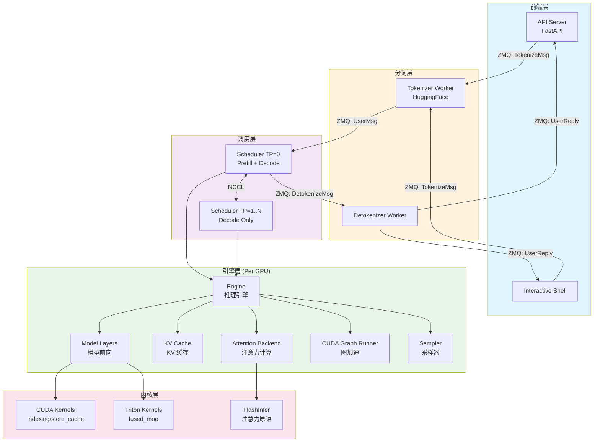
```mermaid
graph TB
    subgraph Frontend["前端层"]
        API["API Server<br/>FastAPI"]
        CLI["Interactive Shell"]
    end

    subgraph TokenizerLayer["分词层"]
        TK["Tokenizer Worker<br/>HuggingFace"]
        DTK["Detokenizer Worker"]
    end

    subgraph SchedulerLayer["调度层"]
        S0["Scheduler TP=0<br/>Prefill + Decode"]
        SN["Scheduler TP=1..N<br/>Decode Only"]
    end

    subgraph EngineLayer["引擎层 (Per GPU)"]
        ENG["Engine<br/>推理引擎"]
        MODEL["Model Layers<br/>模型前向"]
        KVC["KV Cache<br/>KV 缓存"]
        ATTN["Attention Backend<br/>注意力计算"]
        CG["CUDA Graph Runner<br/>图加速"]
        SMP["Sampler<br/>采样器"]
    end

    subgraph Kernel["内核层"]
        CU["CUDA Kernels<br/>indexing/store_cache"]
        TR["Triton Kernels<br/>fused_moe"]
        FI["FlashInfer<br/>注意力原语"]
    end

    API -->|" ZMQ: TokenizeMsg "| TK
    CLI -->|" ZMQ: TokenizeMsg "| TK
    TK -->|" ZMQ: UserMsg "| S0
    S0 <-->|" NCCL "| SN
    S0 --> ENG
    SN --> ENG
    ENG --> MODEL
    ENG --> KVC
    ENG --> ATTN
    ENG --> CG
    ENG --> SMP
    ATTN --> FI
    MODEL --> CU
    MODEL --> TR
    S0 -->|" ZMQ: DetokenizeMsg "| DTK
    DTK -->|" ZMQ: UserReply "| API
    DTK -->|" ZMQ: UserReply "| CLI
    style Frontend fill: #e1f5fe
    style TokenizerLayer fill: #fff3e0
    style SchedulerLayer fill: #f3e5f5
    style EngineLayer fill: #e8f5e9
    style Kernel fill: #fce4ec
```

### 2.2 多进程架构

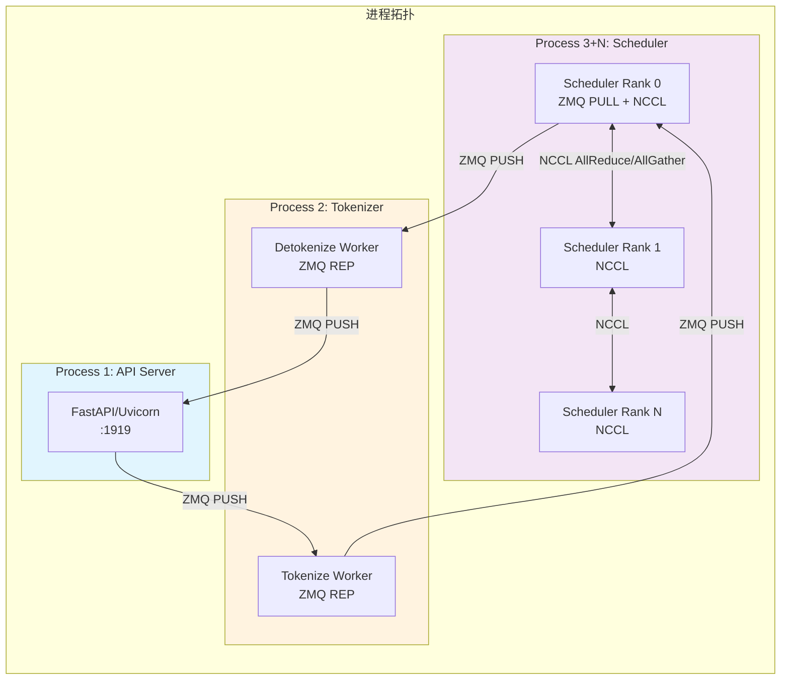
```mermaid
graph LR
    subgraph Processes["进程拓扑"]
        subgraph P1["Process 1: API Server"]
            FASTAPI["FastAPI/Uvicorn<br/>:1919"]
        end

        subgraph P2["Process 2: Tokenizer"]
            TOK["Tokenize Worker<br/>ZMQ REP"]
            DETOK["Detokenize Worker<br/>ZMQ REP"]
        end

        subgraph P3["Process 3+N: Scheduler"]
            SCH0["Scheduler Rank 0<br/>ZMQ PULL + NCCL"]
            SCH1["Scheduler Rank 1<br/>NCCL"]
            SCHN["Scheduler Rank N<br/>NCCL"]
        end
    end

    FASTAPI -->|" ZMQ PUSH "| TOK
    TOK -->|" ZMQ PUSH "| SCH0
    SCH0 <-->|" NCCL AllReduce/AllGather "| SCH1
    SCH1 <-->|" NCCL "| SCHN
    SCH0 -->|" ZMQ PUSH "| DETOK
    DETOK -->|" ZMQ PUSH "| FASTAPI
    style P1 fill: #e1f5fe
    style P2 fill: #fff3e0
    style P3 fill: #f3e5f5
```

### 2.3 进程间通信协议

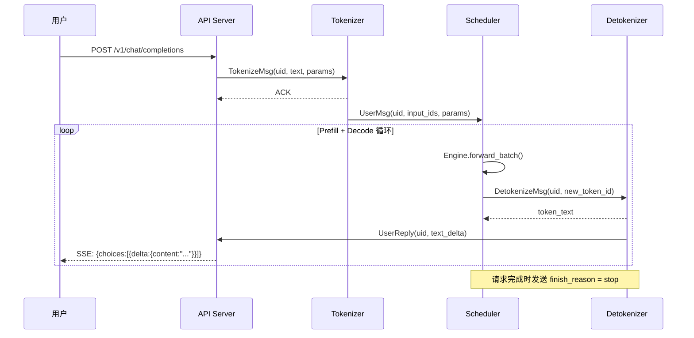
```mermaid
sequenceDiagram
    participant User as 用户
    participant API as API Server
    participant TK as Tokenizer
    participant Sched as Scheduler
    participant DTK as Detokenizer
    User ->> API: POST /v1/chat/completions
    API ->> TK: TokenizeMsg(uid, text, params)
    TK -->> API: ACK
    TK ->> Sched: UserMsg(uid, input_ids, params)

    loop Prefill + Decode 循环
        Sched ->> Sched: Engine.forward_batch()
        Sched ->> DTK: DetokenizeMsg(uid, new_token_id)
        DTK -->> Sched: token_text
        DTK ->> API: UserReply(uid, text_delta)
        API -->> User: SSE: {choices:[{delta:{content:"..."}}]}
    end

    Note over Sched, DTK: 请求完成时发送 finish_reason = stop
```

---

## 3. 核心数据结构

### 3.1 数据结构关系图

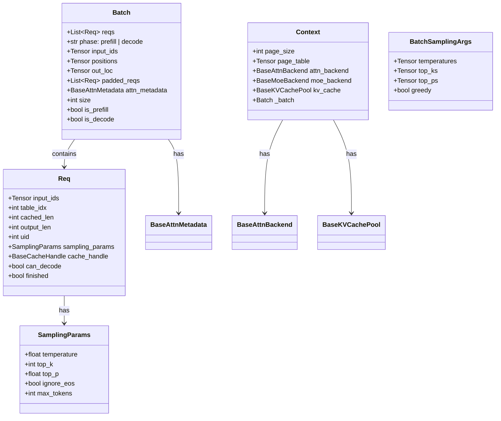
```mermaid
classDiagram
    class SamplingParams {
        +float temperature
        +int top_k
        +float top_p
        +bool ignore_eos
        +int max_tokens
    }

    class Req {
        +Tensor input_ids
        +int table_idx
        +int cached_len
        +int output_len
        +int uid
        +SamplingParams sampling_params
        +BaseCacheHandle cache_handle
        +bool can_decode
        +bool finished
    }

    class Batch {
        +List~Req~ reqs
        +str phase: prefill | decode
        +Tensor input_ids
        +Tensor positions
        +Tensor out_loc
        +List~Req~ padded_reqs
        +BaseAttnMetadata attn_metadata
        +int size
        +bool is_prefill
        +bool is_decode
    }

    class Context {
        +int page_size
        +Tensor page_table
        +BaseAttnBackend attn_backend
        +BaseMoeBackend moe_backend
        +BaseKVCachePool kv_cache
        +Batch _batch
    }

    class BatchSamplingArgs {
        +Tensor temperatures
        +Tensor top_ks
        +Tensor top_ps
        +bool greedy
    }

    Req --> SamplingParams: has
    Batch --> Req: contains
    Context --> BaseAttnBackend: has
    Context --> BaseKVCachePool: has
    Batch --> BaseAttnMetadata: has
```

### 3.2 核心字段说明

#### `Req` - 请求状态机

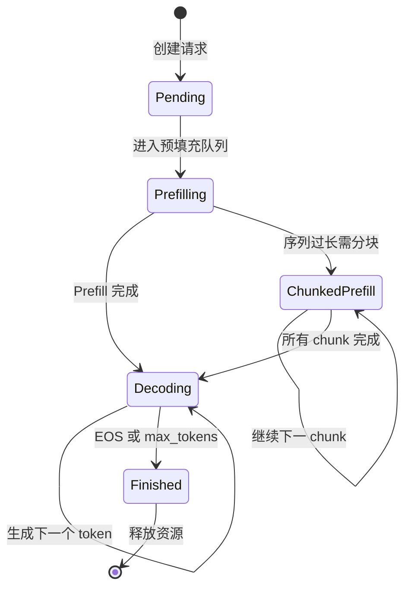
```mermaid
stateDiagram-v2
    [*] --> Pending: 创建请求
    Pending --> Prefilling: 进入预填充队列
    Prefilling --> Decoding: Prefill 完成
    Prefilling --> ChunkedPrefill: 序列过长需分块
    ChunkedPrefill --> ChunkedPrefill: 继续下一 chunk
    ChunkedPrefill --> Decoding: 所有 chunk 完成
    Decoding --> Decoding: 生成下一个 token
    Decoding --> Finished: EOS 或 max_tokens
    Finished --> [*]: 释放资源
```

| 字段           | 类型             | 说明                                  |
|--------------|----------------|-------------------------------------|
| `input_ids`  | `torch.Tensor` | 输入 token 序列（CPU 上）                  |
| `table_idx`  | `int`          | 在全局 token 表中的索引                     |
| `cached_len` | `int`          | 已缓存的 prefix 长度（Radix Cache 命中时 > 0） |
| `output_len` | `int`          | 期望输出的 token 数量                      |
| `uid`        | `int`          | 全局唯一请求 ID                           |
| `can_decode` | `bool`         | 是否可以进入 decode 阶段                    |
| `finished`   | `bool`         | 是否已完成生成                             |

#### `Batch` - 批次容器

| 字段              | 说明                                        |
|-----------------|-------------------------------------------|
| `phase`         | `"prefill"` 或 `"decode"`                  |
| `input_ids`     | 填充到相同长度的输入 `(bs, max_len)`                |
| `positions`     | 每个 token 的位置 ID                           |
| `out_loc`       | 每个 token 在 KV Cache 中的写入位置                |
| `padded_reqs`   | 包含填充的完整请求列表                               |
| `attn_metadata` | 注意力后端所需的元数据（如 `qo_indptr`、`page_table` 等） |

---

## 4. 请求处理全流程

### 4.1 端到端流程

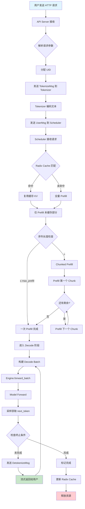
```mermaid
flowchart TD
    A[用户发送 HTTP 请求] --> B[API Server 接收]
    B --> C{解析请求参数}
    C --> D[分配 UID]
    D --> E[发送 TokenizeMsg 到 Tokenizer]
    E --> F[Tokenizer 编码文本]
    F --> G[发送 UserMsg 到 Scheduler]
    G --> H[Scheduler 接收请求]
    H --> I{Radix Cache 匹配}
    I -->|命中| J[复用缓存 KV]
    I -->|未命中| K[全量 Prefill]
    J --> L[仅 Prefill 未缓存部分]
    K --> L
    L --> M{序列长度检查}
    M -->|≤ max_prefill| N[一次 Prefill 完成]
    M -->|>| O[Chunked Prefill]
    O --> P[Prefill 第一个 Chunk]
    P --> Q{还有剩余?}
    Q -->|是| R[Prefill 下一个 Chunk]
    R --> Q
    Q -->|否| N
    N --> S[进入 Decode 阶段]
    S --> T[构建 Decode Batch]
    T --> U[Engine.forward_batch]
    U --> V[Model Forward]
    V --> W[采样获取 next_token]
    W --> X{检查终止条件}
    X -->|未完成| Y[发送 DetokenizeMsg]
    Y --> Z[流式返回给用户]
    Z --> T
    X -->|完成| AA[标记完成]
    AA --> AB[更新 Radix Cache]
    AB --> AC[释放资源]
    style A fill: #e1f5fe
    style Z fill: #c8e6c9
    style AC fill: #ffcdd2
```

### 4.2 Prefill vs Decode 对比

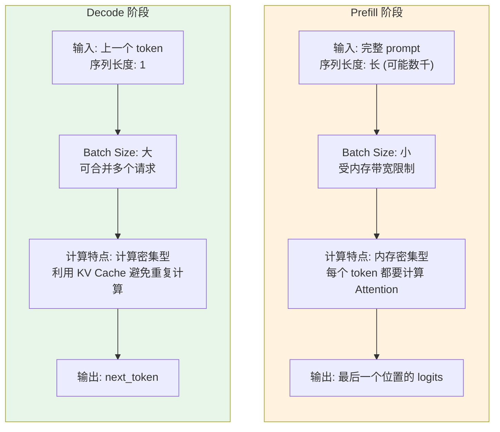
```mermaid
graph TB
    subgraph Prefill["Prefill 阶段"]
        direction TB
        P1["输入: 完整 prompt<br/>序列长度: 长 (可能数千)"]
        P2["Batch Size: 小<br/>受内存带宽限制"]
        P3["计算特点: 内存密集型<br/>每个 token 都要计算 Attention"]
        P4["输出: 最后一个位置的 logits"]
    end

    subgraph Decode["Decode 阶段"]
        direction TB
        D1["输入: 上一个 token<br/>序列长度: 1"]
        D2["Batch Size: 大<br/>可合并多个请求"]
        D3["计算特点: 计算密集型<br/>利用 KV Cache 避免重复计算"]
        D4["输出: next_token"]
    end

    P1 --> P2 --> P3 --> P4
    D1 --> D2 --> D3 --> D4
    style Prefill fill: #fff3e0
    style Decode fill: #e8f5e9
```

| 维度         | Prefill         | Decode           |
|------------|-----------------|------------------|
| 输入长度       | 可变（长）           | 固定 (=1)          |
| Batch Size | 小               | 大                |
| 瓶颈         | 内存带宽            | 计算               |
| KV Cache   | 写入新 KV          | 读取已有 KV + 追加 1 个 |
| 优化手段       | Chunked Prefill | CUDA Graph       |

---

## 5. 调度系统

### 5.1 调度器组件

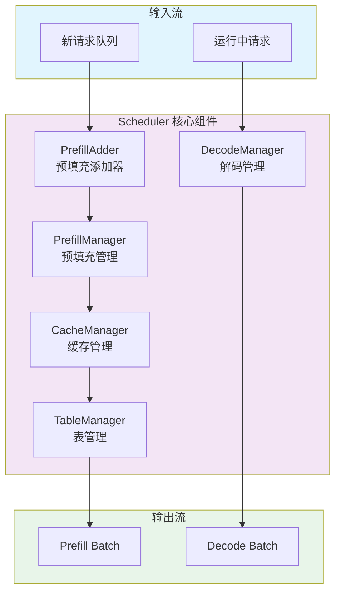
```mermaid
graph TB
    subgraph Scheduler["Scheduler 核心组件"]
        PM["PrefillManager<br/>预填充管理"]
        DM["DecodeManager<br/>解码管理"]
        CM["CacheManager<br/>缓存管理"]
        TM["TableManager<br/>表管理"]
        PA["PrefillAdder<br/>预填充添加器"]
    end

    subgraph Input["输入流"]
        REQ["新请求队列"]
        RUN["运行中请求"]
    end

    subgraph Output["输出流"]
        PREFILL_BS["Prefill Batch"]
        DECODE_BS["Decode Batch"]
    end

    REQ --> PA
    PA --> PM
    PM --> CM
    CM --> TM
    TM --> PREFILL_BS
    RUN --> DM
    DM --> DECODE_BS
    style Scheduler fill: #f3e5f5
    style Input fill: #e1f5fe
    style Output fill: #e8f5e9
```

### 5.2 Overlap Scheduling 工作原理

```mermaid
sequenceDiagram
    participant Loop as 主循环
    participant GPU as GPU 计算
    participant CPU as CPU 调度

    rect rgb(224, 247, 250)
        Note right of Loop: Normal Mode 串行执行
        Loop ->> CPU: 1. 调度准备 batch
        CPU -->> Loop: batch 就绪
        Loop ->> GPU: 2. 执行 forward
        GPU -->> Loop: 结果返回
        Loop ->> CPU: 3. 后处理采样和更新状态
        CPU -->> Loop: 完成
    end

    rect rgb(252, 228, 236)
        Note right of Loop: Overlap Mode 并行执行
        par GPU 计算与 CPU 调度并行
            Loop ->> GPU: N. 执行 forward 上一轮 batch
            GPU -->> Loop: 结果返回
        and
            Loop ->> CPU: N加1. 调度准备下一轮 batch
            CPU -->> Loop: 下一轮 batch 就绪
        end
        Loop ->> CPU: 后处理结果并准备好的下一轮 batch
    end
```

**关键思想**：在 GPU 执行当前 batch 的 forward 时，CPU 同时准备下一个 batch，隐藏调度开销。

### 5.3 Chunked Prefill 流程

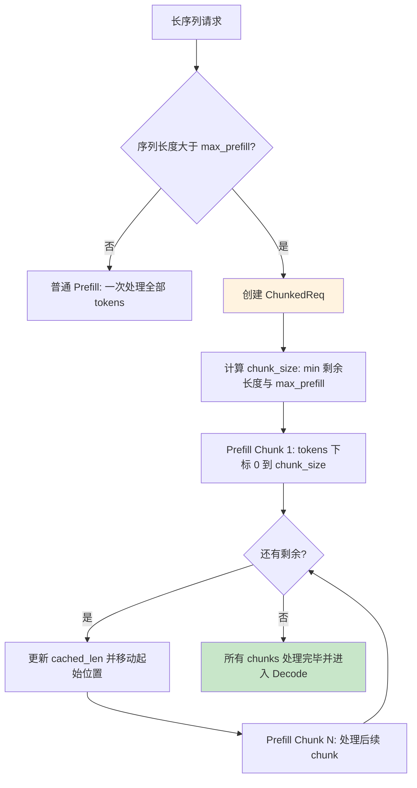
```mermaid
flowchart TD
    A[长序列请求] --> B{"序列长度大于 max_prefill?"}
    B -->|否| C[普通 Prefill: 一次处理全部 tokens]
    B -->|是| D[创建 ChunkedReq]
    D --> E[计算 chunk_size: min 剩余长度与 max_prefill]
    E --> F[Prefill Chunk 1: tokens 下标 0 到 chunk_size]
    F --> G{还有剩余?}
    G -->|是| H[更新 cached_len 并移动起始位置]
    H --> I[Prefill Chunk N: 处理后续 chunk]
    I --> G
    G -->|否| J[所有 chunks 处理完毕并进入 Decode]

    style D fill: #fff3e0
    style J fill: #c8e6c9
```

### 5.4 Radix Cache 前缀匹配

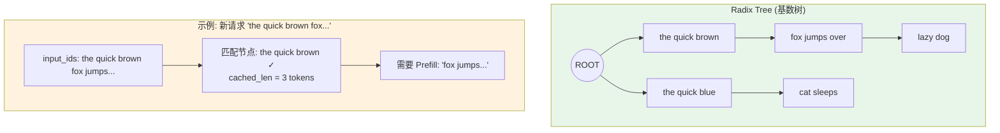
```mermaid
graph TD
    subgraph Tree["Radix Tree (基数树)"]
        ROOT(("ROOT"))
        N1["the quick brown"]
        N2["fox jumps over"]
        N3["the quick blue"]
        N4["lazy dog"]
        N5["cat sleeps"]
        ROOT --> N1
        ROOT --> N3
        N1 --> N2
        N2 --> N4
        N3 --> N5
    end

    subgraph Example["示例: 新请求 'the quick brown fox...'"]
        REQ["input_ids: the quick brown fox jumps..."]
        MATCH["匹配节点: the quick brown ✓<br/>cached_len = 3 tokens"]
        NEW["需要 Prefill: 'fox jumps...'"]
    end

    REQ --> MATCH
    MATCH --> NEW
    style Tree fill: #e8f5e9
    style Example fill: #fff3e0
```

**Radix Cache 核心操作**：

| 操作                         | 说明          | 复杂度            |
|----------------------------|-------------|----------------|
| `match_prefix(input_ids)`  | 在树中查找最长公共前缀 | O(depth)       |
| `insert_prefix(input_ids)` | 插入新的前缀节点    | O(depth)       |
| `evict(size)`              | LRU 驱逐，释放空间 | O(evict_count) |

---

## 6. 推理引擎

### 6.1 Engine 核心循环

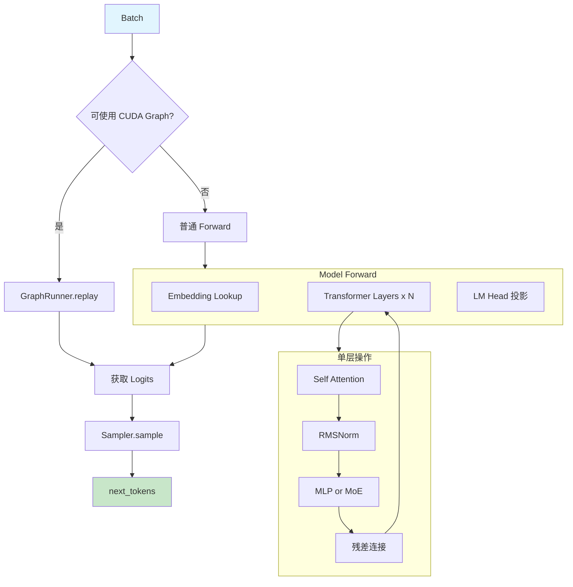
```mermaid
flowchart TD
    BATCH[Batch] --> CHECK{"可使用 CUDA Graph?"}
    CHECK -->|是| CG[GraphRunner.replay]
    CHECK -->|否| NORMAL[普通 Forward]

    subgraph Forward["Model Forward"]
        EMB[Embedding Lookup]
        LAYERS[Transformer Layers x N]
        HEAD[LM Head 投影]
    end

    subgraph LayerOps["单层操作"]
        ATTN[Self Attention]
        NORM[RMSNorm]
        MLP[MLP or MoE]
        RES[残差连接]
    end

    NORMAL --> Forward
    CG --> LOGITS[获取 Logits]
    Forward --> LOGITS
    LOGITS --> SAMPLE[Sampler.sample]
    SAMPLE --> NEXT[next_tokens]

    LAYERS --> LayerOps
    ATTN --> NORM
    NORM --> MLP
    MLP --> RES
    RES --> LAYERS

    style BATCH fill: #e1f5fe
    style NEXT fill: #c8e6c9
```

### 6.2 GraphRunner - CUDA Graph 管理

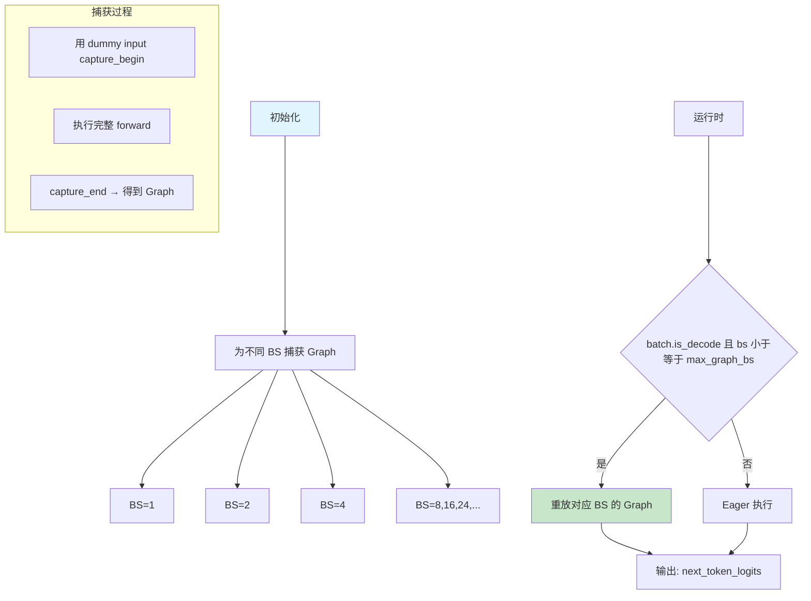
```mermaid
graph TB
    INIT["初始化"] --> CAPTURE["为不同 BS 捕获 Graph"]
    CAPTURE --> BS1["BS=1"]
    CAPTURE --> BS2["BS=2"]
    CAPTURE --> BS4["BS=4"]
    CAPTURE --> BSN["BS=8,16,24,..."]
    RUNTIME["运行时"] --> CHECK{"batch.is_decode 且 bs 小于等于 max_graph_bs"}
    CHECK -->|是| REPLAY["重放对应 BS 的 Graph"]
    CHECK -->|否| EAGER["Eager 执行"]

    subgraph CaptureDetail["捕获过程"]
        C1["用 dummy input capture_begin"]
        C2["执行完整 forward"]
        C3["capture_end → 得到 Graph"]
    end

    REPLAY --> OUT["输出: next_token_logits"]
    EAGER --> OUT
    style INIT fill: #e1f5fe
    style REPLAY fill: #c8e6c9
```

**CUDA Graph Batch Size 策略**：

```python
cuda_graph_bs = [1, 2, 4] + list(range(8, max_bs, 8))
# 即: 1, 2, 4, 8, 16, 24, 32, ...
```

小 batch size 更密集地捕获（因为 decode 时常见），大 batch size 每 8 一个。

### 6.3 Sampler - 采样策略

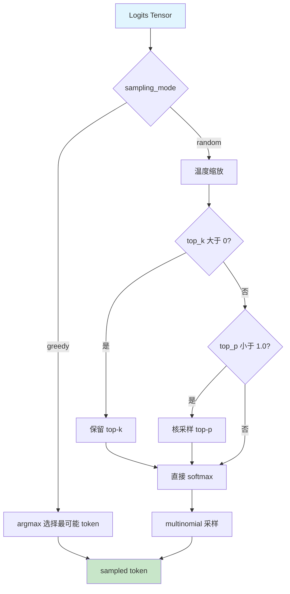
```mermaid
flowchart TD
    LOGITS[Logits Tensor] --> MODE{"sampling_mode"}
    MODE -->|"greedy"| ARGMAX[argmax 选择最可能 token]
    MODE -->|"random"| TEMP[温度缩放]
    TEMP --> TOPK{top_k 大于 0?}
    TOPK -->|是| FILTER_K[保留 top-k]
    TOPK -->|否| TOPP{top_p 小于 1.0?}
    TOPP -->|是| FILTER_P[核采样 top-p]
    TOPP -->|否| SOFTMAX[直接 softmax]
    FILTER_K --> SOFTMAX
    FILTER_P --> SOFTMAX
    SOFTMAX --> MULTINOMIAL[multinomial 采样]
    MULTINOMIAL --> TOKEN[sampled token]
    ARGMAX --> TOKEN

    style LOGITS fill: #e1f5fe
    style TOKEN fill: #c8e6c9
```

---

## 7. 模型与层实现

### 7.1 模型层次结构

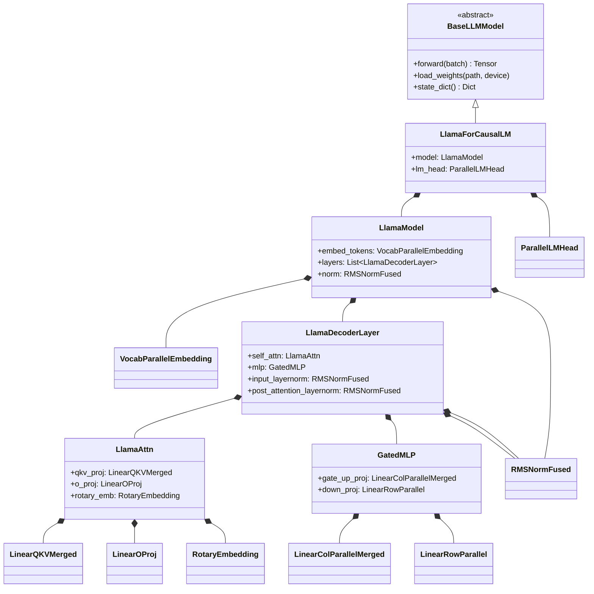
```mermaid
classDiagram
    class BaseLLMModel {
        <<abstract>>
        +forward(batch) Tensor
        +load_weights(path, device)
        +state_dict() Dict
    }

    class LlamaForCausalLM {
        +model: LlamaModel
        +lm_head: ParallelLMHead
    }

    class LlamaModel {
        +embed_tokens: VocabParallelEmbedding
        +layers: List~LlamaDecoderLayer~
        +norm: RMSNormFused
    }

    class LlamaDecoderLayer {
        +self_attn: LlamaAttn
        +mlp: GatedMLP
        +input_layernorm: RMSNormFused
        +post_attention_layernorm: RMSNormFused
    }

    class LlamaAttn {
        +qkv_proj: LinearQKVMerged
        +o_proj: LinearOProj
        +rotary_emb: RotaryEmbedding
    }

    class GatedMLP {
        +gate_up_proj: LinearColParallelMerged
        +down_proj: LinearRowParallel
    }

    BaseLLMModel <|-- LlamaForCausalLM
    LlamaForCausalLM *-- LlamaModel
    LlamaForCausalLM *-- ParallelLMHead
    LlamaModel *-- VocabParallelEmbedding
    LlamaModel *-- LlamaDecoderLayer
    LlamaModel *-- RMSNormFused
    LlamaDecoderLayer *-- LlamaAttn
    LlamaDecoderLayer *-- GatedMLP
    LlamaDecoderLayer *-- RMSNormFused
    LlamaDecoderLayer *-- RMSNormFused
    LlamaAttn *-- LinearQKVMerged
    LlamaAttn *-- LinearOProj
    LlamaAttn *-- RotaryEmbedding
    GatedMLP *-- LinearColParallelMerged
    GatedMLP *-- LinearRowParallel
```

### 7.2 层类型与张量并行策略

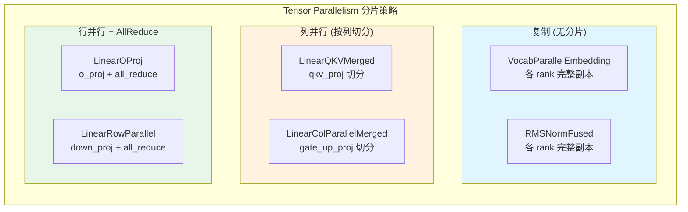
```mermaid
graph LR
    subgraph TP["Tensor Parallelism 分片策略"]
        direction TB
        subgraph Replicated["复制 (无分片)"]
            R1["VocabParallelEmbedding<br/>各 rank 完整副本"]
            R2["RMSNormFused<br/>各 rank 完整副本"]
        end

        subgraph ColParallel["列并行 (按列切分)"]
            C1["LinearQKVMerged<br/>qkv_proj 切分"]
            C2["LinearColParallelMerged<br/>gate_up_proj 切分"]
        end

        subgraph RowParallel["行并行 + AllReduce"]
            O1["LinearOProj<br/>o_proj + all_reduce"]
            O2["LinearRowParallel<br/>down_proj + all_reduce"]
        end
    end

    style Replicated fill: #e1f5fe
    style ColParallel fill: #fff3e0
    style RowParallel fill: #e8f5e9
```

### 7.3 权重加载与融合

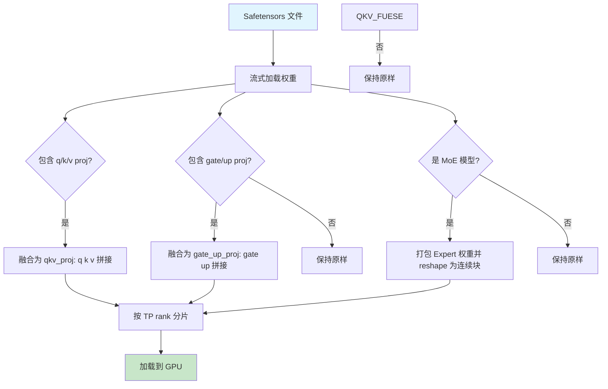
```mermaid
flowchart TD
    SAFE["Safetensors 文件"] --> LOAD["流式加载权重"]
    LOAD --> QKV_FUSE{"包含 q/k/v proj?"}
    QKV_FUSE -->|是| MERGE_QKV["融合为 qkv_proj: q k v 拼接"]
    QKV_FUESE -->|否| SKIP1[保持原样]
    LOAD --> FFN_FUSE{"包含 gate/up proj?"}
    FFN_FUSE -->|是| MERGE_FFN["融合为 gate_up_proj: gate up 拼接"]
    FFN_FUSE -->|否| SKIP2[保持原样]
    LOAD --> MOE_PACK{"是 MoE 模型?"}
    MOE_PACK -->|是| PACK_EXP["打包 Expert 权重并 reshape 为连续块"]
    MOE_PACK -->|否| SKIP3[保持原样]
    MERGE_QKV --> TP_SHARD["按 TP rank 分片"]
    MERGE_FFN --> TP_SHARD
    PACK_EXP --> TP_SHARD
    TP_SHARD --> DEVICE["加载到 GPU"]
    style SAFE fill: #e1f5fe
    style DEVICE fill: #c8e6c9
```

**权重融合规则**：

- **QKV 融合**: `q_proj + k_proj + v_proj → qkv_proj` （减少 kernel launch）
- **FFN 融合**: `gate_proj + up_proj → gate_up_proj` （同上）
- **MoE 打包**: 将分散的 expert 权重 reshape 为连续内存布局

---

## 8. 注意力机制

### 8.1 注意力后端体系


```mermaid
classDiagram
    class BaseAttnBackend {
        <<abstract>>
        +forward(q, k, v, layer_id, batch) Tensor
        +prepare_metadata(batch) AttnMetadata
    }

    class FlashInferBackend {
        -kvcache: MHAKVCache
        -workspace_buffer: Tensor
        +forward() Tensor
        +prepare_metadata() FlashInferMetaData
    }

    class FlashAttentionBackend {
        +forward() Tensor
        +prepare_metadata() FAMetaData
    }

    class TRTLLMBackend {
        +forward() Tensor
        +prepare_metadata() TRTLLMMetaData
    }

    class HybridBackend {
        -prefill_backend: BaseAttnBackend
        -decode_backend: BaseAttnBackend
        +forward() Tensor
    }

    BaseAttnBackend <|-- FlashInferBackend
    BaseAttnBackend <|-- FlashAttentionBackend
    BaseAttnBackend <|-- TRTLLMBackend
    BaseAttnBackend <|-- HybridBackend
    HybridBackend o-- BaseAttnBackend
```

### 8.2 FlashInfer 后端工作流

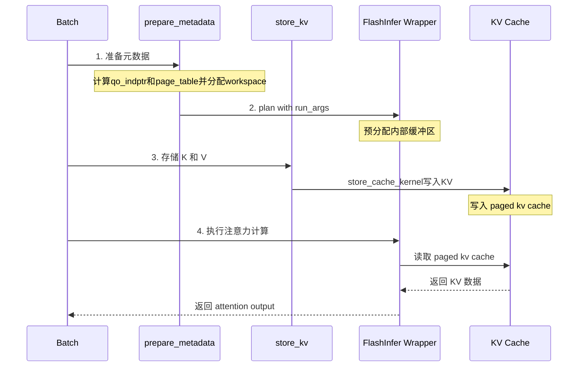
```mermaid
sequenceDiagram
    participant Batch as Batch
    participant Meta as prepare_metadata
    participant Store as store_kv
    participant Wrapper as FlashInfer Wrapper
    participant Cache as KV Cache
    Batch ->> Meta: 1. 准备元数据
    Note over Meta: 计算qo_indptr和page_table并分配workspace
    Meta ->> Wrapper: 2. plan with run_args
    Note over Wrapper: 预分配内部缓冲区
    Batch ->> Store: 3. 存储 K 和 V
    Store ->> Cache: store_cache_kernel写入KV
    Note over Cache: 写入 paged kv cache
    Batch ->> Wrapper: 4. 执行注意力计算
    Wrapper ->> Cache: 读取 paged kv cache
    Cache -->> Wrapper: 返回 KV 数据
    Wrapper -->> Batch: 返回 attention output
```

### 8.3 Paged Attention 数据布局

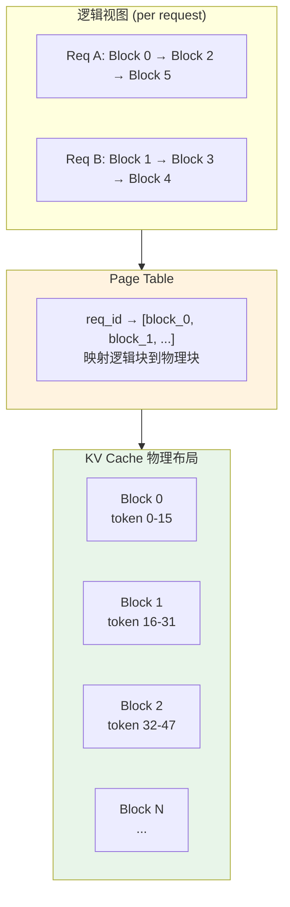
```mermaid
graph TB
    subgraph KV["KV Cache 物理布局"]
        direction LR
        BLOCK1["Block 0<br/>token 0-15"]
        BLOCK2["Block 1<br/>token 16-31"]
        BLOCK3["Block 2<br/>token 32-47"]
        BLOCKN["Block N<br/>..."]
    end

    subgraph Logical["逻辑视图 (per request)"]
        REQ1["Req A: Block 0 → Block 2 → Block 5"]
        REQ2["Req B: Block 1 → Block 3 → Block 4"]
    end

    subgraph PT["Page Table"]
        PT_TABLE["req_id → [block_0, block_1, ...]<br/>映射逻辑块到物理块"]
    end

    Logical --> PT
    PT --> KV
    style KV fill: #e8f5e9
    style PT fill: #fff3e0
```

**KV Cache 张量形状**：

```
kv_cache: (2, num_layers, num_pages, page_size, num_kv_heads, head_dim)
         │   │          │         │         │            │
         │   │          │         │         │            └── head_dim (128/64)
         │   │          │         │            └── KV head 数量
         │   │          │         └── page_size (默认 16)
         │   │          └── 总页数 (由显存决定)
         │   └── Transformer 层数
         └── K/V (2 个)
```

---

## 9. KV Cache 管理

### 9.1 KV Cache 层次

```mermaid
classDiagram
    class BaseKVCachePool {
        <<abstract>>
        +allocate(num_pages) CacheHandle
        +free(handle)
        +store_kv(k, v, out_loc, layer_id)
    }

    class MHAKVCache {
        -_kv_buffer: Tensor  #(2, L, P, S, H, D)
        +allocate(num_pages) PagedCacheHandle
        +store_kv(k, v, out_loc, layer_id)
        +get_kv_cache(layer_id) Tensor
    }

    class BasePrefixCache {
        <<abstract>>
        +match_prefix(input_ids) MatchResult
        +insert_prefix(input_ids, indices) InsertResult
        +evict(size)
    }

    class RadixPrefixCache {
        -tree: RadixTree
        -lru_order: Dict
        +match_prefix() MatchResult
        +insert_prefix() InsertResult
        +evict() int
    }

    class NaivePrefixCache {
        +match_prefix() None  # 不支持
        +insert_prefix() None  # 不支持
        +evict() 0  # 不支持
    }

    BaseKVCachePool <|-- MHAKVCache
    BasePrefixCache <|-- RadixPrefixCache
    BasePrefixCache <|-- NaivePrefixCache
```

### 9.2 Radix Cache 生命周期

```mermaid
stateDiagram-v2
    [*] --> Idle: 系统启动
    Idle --> Matching: 新请求到达
    Matching --> Hit: 前缀匹配成功
    Matching --> Miss: 无匹配前缀
    Hit --> ReturnHandle: 返回缓存句柄
    ReturnHandle --> UpdateLRU: 更新 LRU 顺序
    UpdateLRU --> PrefillRemaining: Prefill 未缓存部分
    Miss --> AllocateNew: 分配新 Cache 页
    AllocateNew --> FullPrefill: 全量 Prefill
    FullPrefill --> PrefillRemaining
    PrefillRemaining --> Decoding: 进入 Decode 阶段
    Decoding --> Finished: 生成完成
    Finished --> InsertToTree: 插入前缀到 Radix Tree
    InsertToTree --> UnlockHandle: 解锁缓存句柄
    UnlockHandle --> EvictIfNeeded: 显存不足时驱逐
    EvictIfNeeded --> Idle: 资源已释放
```

### 9.3 内存管理流程

```mermaid
flowchart TD
    REQ[新请求] --> ALLOC[分配 KV Cache 页]
    ALLOC --> CHECK{"有足够空闲页?"}
    CHECK -->|是| ASSIGN[分配空闲页]
    CHECK -->|否| EVICT[Radix Cache 驱逐]
    EVICT --> FREE[释放被驱逐的页]
    FREE --> ASSIGN
    ASSIGN --> PREFILL[Prefill 写入 KV]
    PREFILL --> DECODE[Decode 追加 KV]
    DECODE --> DONE{请求完成?}
    DONE -->|是| CACHE["插入 Radix Cache<br/>或释放页面"]
    DONE -->|否| DECODE
    style ALLOC fill: #e1f5fe
    style CACHE fill: #c8e6c9
    style EVICT fill: #ffcdd2
```

---

## 10. MoE 支持

### 10.1 MoE 层结构

```mermaid
graph TB
    subgraph MoELayer["MoE 层"]
        INPUT[hidden_states]
        ROUTER[Router: 线性投影到 softmax 到 topk]

        subgraph Experts["Expert 处理"]
            W1["W1 gate_proj: 第一层线性"]
            ACT["SiLU 激活"]
            W2["W2 up or down_proj: 第二层线性"]
        end

        OUTPUT[加权求和后输出]
    end

    INPUT --> ROUTER
    ROUTER --> EXPERTS
    EXPERTS --> OUTPUT

    style MoELayer fill: #f3e5f5
```

### 10.2 Fused MoE Kernel 流程

```mermaid
flowchart TD
    INPUT["hidden_states: seq_len x hidden_dim"]
    ROUTER_LOGITS["router_logits: seq_len x num_experts"]

    INPUT --> TOPK[fused_topk]
    ROUTER_LOGITS --> TOPK

    TOPK --> ALIGN1[moe_align_block_size 对齐 token 到 block]
    ALIGN1 --> STAGE1["fused_moe_kernel_triton Stage 1: W1 乘 x"]
    STAGE1 --> SILU[silu_and_mul: SiLU 激活]
    SILU --> ALIGN2[moe_align_block_size 重新对齐]
    ALIGN2 --> STAGE2["fused_moe_kernel_triton Stage 2: W2 乘 act"]
    STAGE2 --> REDUCE[moe_sum_reduce_triton: 加权求和归约]
    REDUCE --> OUTPUT["output: seq_len x hidden_dim"]

    style INPUT fill: #e1f5fe
    style OUTPUT fill: #c8e6c9
```

**MoE 关键优化**：

1. **Token 对齐** (`moe_align_block_size`)：将同一 expert 的 token 连续排列，提高内存访问效率
2. **Fused Kernel**：将矩阵乘法和激活函数融合，减少 kernel launch 开销
3. **并行 Expert 计算**：不同 expert 可以在 GPU 上并行执行

---

## 11. 分布式通信

### 11.1 通信抽象层

```mermaid
classDiagram
    class DistributedComm {
        <<interface>>
        +all_reduce(tensor) tensor
        +all_gather(tensor, dim) tensor
        +broadcast(tensor, src) tensor
        +rank() int
        +world_size() int
    }

    class TorchDistributedImpl {
        -process_group: ProcessGroup
        +all_reduce() dist.all_reduce
        +all_gather() dist.all_gather
    }

    class PyNCCLDistributedImpl {
        -comm: NCCLCommunicator
        -buffer_pool: BufferPool
        +all_reduce() comm.all_reduce
        +all_gather() comm.all_gather
    }

    DistributedComm <|.. TorchDistributedImpl
    DistributedComm <|.. PyNCCLDistributedImpl
```

### 11.2 TP 通信模式

```mermaid
graph TB
    subgraph Rank0["GPU Rank 0"]
        Q0["Q₀, K₀, V₀<br/>(列并行的一部分)"]
        ATTN0["Attention 计算"]
        O0["O₀ (部分结果)"]
        AR0["AllReduce(SUM)"]
        OUT0["完整 O"]
    end

    subgraph Rank1["GPU Rank 1"]
        Q1["Q₁, K₁, V₁<br/>(列并行的一部分)"]
        ATTN1["Attention 计算"]
        O1["O₁ (部分结果)"]
        AR1["AllReduce(SUM)"]
        OUT1["完整 O"]
    end

    Q0 --> ATTN0
    Q1 --> ATTN1
    ATTN0 --> O0
    ATTN1 --> O1
    O0 <-->|" NCCL AllReduce "| O1
    O0 --> AR0
    O1 --> AR1
    AR0 --> OUT0
    AR1 --> OUT1
    style Rank0 fill: #e1f5fe
    style Rank1 fill: #fff3e0
```

**TP 各阶段通信量**：

| 操作              | 通信模式                | 数据量                         |
|-----------------|---------------------|-----------------------------|
| QKV 列并行         | 无通信                 | 0                           |
| Attention       | 各 rank 独立计算         | 0                           |
| O 投影输出          | **AllReduce (SUM)** | `bs × seq_len × hidden_dim` |
| MLP Gate-Up 列并行 | 无通信                 | 0                           |
| MLP Down 行并行    | **AllReduce (SUM)** | `bs × seq_len × hidden_dim` |

---

## 12. 性能优化技术

### 12.1 优化技术总览

```mermaid
quadrantChart
    title 性能优化技术分类
    x-axis "低实现复杂度" --> "高实现复杂度"
    y-axis "低收益" --> "高收益"
    "CUDA Graph": [0.75, 0.95]
    "Overlap Scheduling": [0.6, 0.85]
    "PagedAttention": [0.65, 0.9]
    "Radix Cache": [0.55, 0.8]
    "Chunked Prefill": [0.5, 0.75]
    "Tensor Parallelism": [0.8, 0.85]
    "Kernel Fusion": [0.45, 0.7]
    "MoE Token Align": [0.4, 0.6]
```

### 12.2 各优化技术的效果与原理

| 优化技术                   | 解决的问题                  | 原理                                | 收益                 |
|------------------------|------------------------|-----------------------------------|--------------------|
| **CUDA Graph**         | GPU kernel launch 开销   | 预先捕获整个 forward 过程， replay 时只需一次调用 | Decode 吞吐提升 10-30% |
| **Overlap Scheduling** | CPU 调度等待 GPU           | GPU 计算与 CPU 调度流水线化                | 延迟降低 1-3ms/batch   |
| **PagedAttention**     | KV Cache 内存碎片          | 类似虚拟内存的页式管理                       | 显存利用率提升 20-50%     |
| **Radix Cache**        | 重复 prompt 重复计算         | 基数树存储公共前缀的 KV                     | 相似请求加速显著           |
| **Chunked Prefill**    | 长 prompt 导致首 token 延迟高 | 分块处理，与 decode 交错                  | TTFT 降低，吞吐提升       |
| **Kernel Fusion**      | 多次 kernel launch 开销    | 将多个操作合并为一个 kernel                 | 减少 GPU 同步点         |

### 12.3 CUDA Graph 捕获范围

```mermaid
graph TB
    subgraph Captured["CUDA Graph 捕获范围内"]
        EMB[Embedding]
        LAYER1[Layer 1: Attn + MLP]
        LAYER2[Layer 2: Attn + MLP]
        LAYERN["... 更多层 ..."]
        LAST_LAYER[Layer N: Attn + MLP]
        HEAD[LM Head]
    end

    subgraph NotCaptured["不在捕获范围内"]
        KV_STORE["KV Cache 写入 (动态地址)"]
        SAMPLING["采样 (依赖动态 logits)"]
        META_PREP["元数据准备 (每批变化)"]
    end

    Captured --> LOGITS[Logits 输出]
    LOGITS --> NotCaptured

    style Captured fill: #c8e6c9
    style NotCaptured fill: #ffcdd2
```

> **注意**：KV Cache 写入使用动态索引（`out_loc`），无法被 CUDA Graph 捕获，因此在 graph replay 后单独执行。

---

## 13. 扩展性设计

### 13.1 注册器模式

Mini-SGLang 使用注册器模式实现插件化扩展：

```mermaid
graph TB
    REG_ATTN["Registry: SUPPORTED_ATTENTION_BACKENDS"]
    REG_CACHE["Registry: SUPPORTED_CACHE_MANAGER"]
    REG_MOE["Registry: SUPPORTED_MOE_BACKENDS"]
    REG_MODEL["Registry: _MODEL_REGISTRY"]
    FA["@register('fa')<br/>FlashAttentionBackend"]
    FI["@register('fi')<br/>FlashInferBackend"]
    TRT["@register('trtllm')<br/>TRTLLMBackend"]
    RADIX["@register('radix')<br/>RadixCacheManager"]
    NAIVE["@register('naive')<br/>NaiveCacheManager"]
    LLAMA["@register('LlamaForCausalLM')<br/>Llama 模型"]
    QWEN3["@register('Qwen3ForCausalLM')<br/>Qwen3 模型"]
    REG_ATTN --> FA
    REG_ATTN --> FI
    REG_ATTN --> TRT
    REG_CACHE --> RADIX
    REG_CACHE --> NAIVE
    REG_MODEL --> LLAMA
    REG_MODEL --> QWEN3
    style REG_ATTN fill: #e1f5fe
    style REG_CACHE fill: #fff3e0
    style REG_MODEL fill: #e8f5e9
```

**如何添加新的注意力后端**：

```python
# 1. 继承 BaseAttnBackend
class MyAttnBackend(BaseAttnBackend):
    def forward(self, q, k, v, layer_id, batch):
        # 自定义实现
        pass


# 2. 注册
@SUPPORTED_ATTENTION_BACKENDS.register("my_backend")
def create_my_backend(config):
    return MyAttnBackend(config)


# 3. 使用
# python -m minisgl --model ... --attn my_backend
```

### 13.2 抽象基类体系

```mermaid
classDiagram
    class BaseOP {
        <<abstract>>
        +forward(*args, **kwargs) Any
        +state_dict(prefix) Dict
        +load_state_dict(state_dict) void
    }

    class BaseLLMModel {
        <<abstract>>
        +forward(batch) Tensor
        +load_weights(path, device) void
    }

    class BaseAttnBackend {
        <<abstract>>
        +forward(q, k, v, layer_id, batch) Tensor
        +prepare_metadata(batch) BaseAttnMetadata
    }

    class BaseKVCachePool {
        <<abstract>>
        +allocate(num_pages) BaseCacheHandle
        +free(handle) void
        +store_kv(k, v, out_loc, layer_id) void
    }

    class BasePrefixCache {
        <<abstract>>
        +match_prefix(input_ids) MatchResult
        +insert_prefix(input_ids, indices) InsertResult
        +evict(size) int
    }

    class BaseMoeBackend {
        <<abstract>>
        +forward(hidden_states, w1, w2, topk_weights, topk_ids, ...) Tensor
    }

    class BaseCacheHandle {
        <<abstract>>
        +lock()
        +unlock()
    }

    class DistributedComm {
        <<interface>>
        +all_reduce(tensor) tensor
        +all_gather(tensor, dim) tensor
        +rank() int
        +world_size() int
    }
```

### 13.3 项目目录与模块职责

| 目录             | 职责             | 核心文件                                         |
|----------------|----------------|----------------------------------------------|
| `core/`        | 核心数据结构         | `core.py` - Req, Batch, Context 等            |
| `engine/`      | 推理引擎           | `engine.py` - Engine, GraphRunner, Sampler   |
| `scheduler/`   | 请求调度           | `scheduler.py` - 主调度循环                       |
| `models/`      | 模型定义           | `llama/`, `qwen2/`, `qwen3/`, `mistral/`     |
| `layers/`      | 神经网络层          | `linear.py`, `norm.py`, `rope.py`            |
| `attention/`   | 注意力后端          | `flashinfer.py`, `flashattn.py`, `hybrid.py` |
| `kvcache/`     | KV 缓存管理        | `mha_kv_cache.py`, `radix_cache.py`          |
| `moe/`         | MoE 实现         | `moe_layer.py`, `kernel.py`                  |
| `distributed/` | 分布式通信          | `py_torch_distributed.py`, `pynccl.py`       |
| `server/`      | API 服务         | `launch.py` - 服务启动                           |
| `message/`     | 消息协议           | `defs.py` - 消息类型定义                           |
| `tokenizer/`   | 分词服务           | `worker.py` - Tokenizer/Detokenizer worker   |
| `kernel/`      | CUDA/Triton 内核 | `csrc/`, `triton/` - 自定义 kernel              |

---

## 附录：快速启动指南

### 安装依赖

```bash
cd mini-sglang
pip install -e .
```

### 启动 API 服务

```bash
# 单卡启动
python -m minisgl --model Qwen/Qwen3-0.6B --port 1919

# 多卡张量并行
python -m minisgl --model Qwen/Qwen3-4B --tp 4 --port 1919

# 指定注意力后端
python -m minisgl --model Qwen/Qwen3-0.6B --attn fa,fi

# 使用 Radix Cache
python -m minisgl --model Qwen/Qwen3-0.6B --cache radix
```

### 发送请求

```bash
curl http://localhost:1919/v1/chat/completions \
  -H "Content-Type: application/json" \
  -d '{
    "model": "default",
    "messages": [{"role": "user", "content": "你好！"}],
    "max_tokens": 100,
    "stream": true
  }'
```

### 交互式 Shell

```bash
python -m minisgl --model Qwen/Qwen3-0.6B --shell
```

---


