# Mini-SGLang 学习指南

> 本文档基于 mini-sglang 源码深度分析，帮助理解 LLM 推理系统的核心设计与实现。

---

## 目录

- [1. 项目概述](#1-项目概述)
- [2. 系统架构](#2-系统架构)
- [3. 核心数据结构](#3-核心数据结构)
- [4. 请求处理全流程](#4-请求处理全流程)
- [5. 调度系统](#5-调度系统)
- [6. 推理引擎](#6-推理引擎)
- [7. 模型与层实现](#7-模型与层实现)
- [8. 注意力机制](#8-注意力机制)
- [9. KV Cache 管理](#9-kv-cache-管理)
- [10. MoE 支持](#10-moe-支持)
- [11. 分布式通信](#11-分布式通信)
- [12. 性能优化技术](#12-性能优化技术)
- [13. 扩展性设计](#13-扩展性设计)

---

## 1. 项目概述

### 1.1 什么是 Mini-SGLang

**Mini-SGLang** 是一个轻量级、高性能的 LLM（大语言模型）推理框架，代码量约 **5000 行 Python**，是对 SGLang 的精简教学实现。

### 1.2 核心特性

| 特性                 | 说明                                         |
|--------------------|--------------------------------------------|
| OpenAI 兼容 API      | 提供 `/v1/chat/completions` 接口               |
| Tensor Parallelism | 支持多 GPU 张量并行                               |
| Chunked Prefill    | 分块预填充，提升吞吐量                                |
| Radix Cache        | 基数树前缀缓存，复用 KV Cache                        |
| Overlap Scheduling | 重叠调度，隐藏延迟                                  |
| CUDA Graph         | CUDA Graph 加速 Decode 阶段                    |
| 多注意力后端             | FlashAttention / FlashInfer / TensorRT-LLM |
| MoE 支持             | 支持混合专家模型                                   |

### 1.3 支持的模型

```
LlamaForCausalLM
Qwen2ForCausalLM
Qwen3ForCausalLM
Qwen3MoeForCausalLM    ← MoE 模型
MistralForCausalLM
```

---

## 2. 系统架构

### 2.1 整体架构图

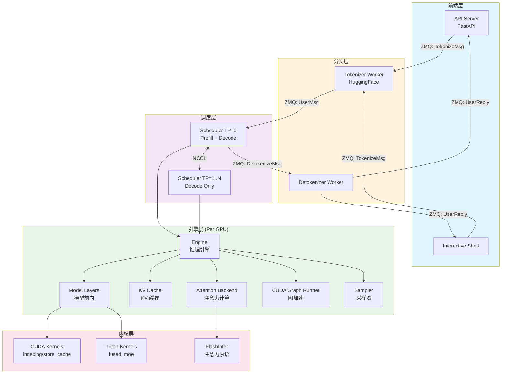
```mermaid
graph TB
    subgraph Frontend["前端层"]
        API["API Server<br/>FastAPI"]
        CLI["Interactive Shell"]
    end

    subgraph TokenizerLayer["分词层"]
        TK["Tokenizer Worker<br/>HuggingFace"]
        DTK["Detokenizer Worker"]
    end

    subgraph SchedulerLayer["调度层"]
        S0["Scheduler TP=0<br/>Prefill + Decode"]
        SN["Scheduler TP=1..N<br/>Decode Only"]
    end

    subgraph EngineLayer["引擎层 (Per GPU)"]
        ENG["Engine<br/>推理引擎"]
        MODEL["Model Layers<br/>模型前向"]
        KVC["KV Cache<br/>KV 缓存"]
        ATTN["Attention Backend<br/>注意力计算"]
        CG["CUDA Graph Runner<br/>图加速"]
        SMP["Sampler<br/>采样器"]
    end

    subgraph Kernel["内核层"]
        CU["CUDA Kernels<br/>indexing/store_cache"]
        TR["Triton Kernels<br/>fused_moe"]
        FI["FlashInfer<br/>注意力原语"]
    end

    API -->|" ZMQ: TokenizeMsg "| TK
    CLI -->|" ZMQ: TokenizeMsg "| TK
    TK -->|" ZMQ: UserMsg "| S0
    S0 <-->|" NCCL "| SN
    S0 --> ENG
    SN --> ENG
    ENG --> MODEL
    ENG --> KVC
    ENG --> ATTN
    ENG --> CG
    ENG --> SMP
    ATTN --> FI
    MODEL --> CU
    MODEL --> TR
    S0 -->|" ZMQ: DetokenizeMsg "| DTK
    DTK -->|" ZMQ: UserReply "| API
    DTK -->|" ZMQ: UserReply "| CLI
    style Frontend fill: #e1f5fe
    style TokenizerLayer fill: #fff3e0
    style SchedulerLayer fill: #f3e5f5
    style EngineLayer fill: #e8f5e9
    style Kernel fill: #fce4ec
```

### 2.2 多进程架构

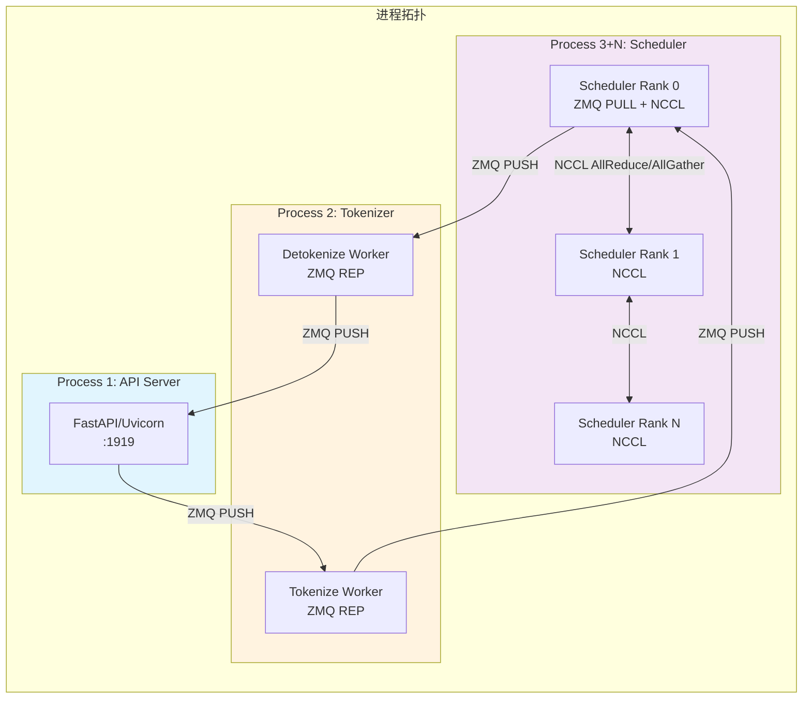
```mermaid
graph LR
    subgraph Processes["进程拓扑"]
        subgraph P1["Process 1: API Server"]
            FASTAPI["FastAPI/Uvicorn<br/>:1919"]
        end

        subgraph P2["Process 2: Tokenizer"]
            TOK["Tokenize Worker<br/>ZMQ REP"]
            DETOK["Detokenize Worker<br/>ZMQ REP"]
        end

        subgraph P3["Process 3+N: Scheduler"]
            SCH0["Scheduler Rank 0<br/>ZMQ PULL + NCCL"]
            SCH1["Scheduler Rank 1<br/>NCCL"]
            SCHN["Scheduler Rank N<br/>NCCL"]
        end
    end

    FASTAPI -->|" ZMQ PUSH "| TOK
    TOK -->|" ZMQ PUSH "| SCH0
    SCH0 <-->|" NCCL AllReduce/AllGather "| SCH1
    SCH1 <-->|" NCCL "| SCHN
    SCH0 -->|" ZMQ PUSH "| DETOK
    DETOK -->|" ZMQ PUSH "| FASTAPI
    style P1 fill: #e1f5fe
    style P2 fill: #fff3e0
    style P3 fill: #f3e5f5
```

### 2.3 进程间通信协议

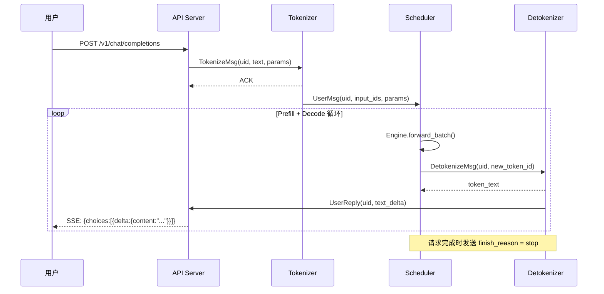
```mermaid
sequenceDiagram
    participant User as 用户
    participant API as API Server
    participant TK as Tokenizer
    participant Sched as Scheduler
    participant DTK as Detokenizer
    User ->> API: POST /v1/chat/completions
    API ->> TK: TokenizeMsg(uid, text, params)
    TK -->> API: ACK
    TK ->> Sched: UserMsg(uid, input_ids, params)

    loop Prefill + Decode 循环
        Sched ->> Sched: Engine.forward_batch()
        Sched ->> DTK: DetokenizeMsg(uid, new_token_id)
        DTK -->> Sched: token_text
        DTK ->> API: UserReply(uid, text_delta)
        API -->> User: SSE: {choices:[{delta:{content:"..."}}]}
    end

    Note over Sched, DTK: 请求完成时发送 finish_reason = stop
```

---

## 3. 核心数据结构

### 3.1 数据结构关系图

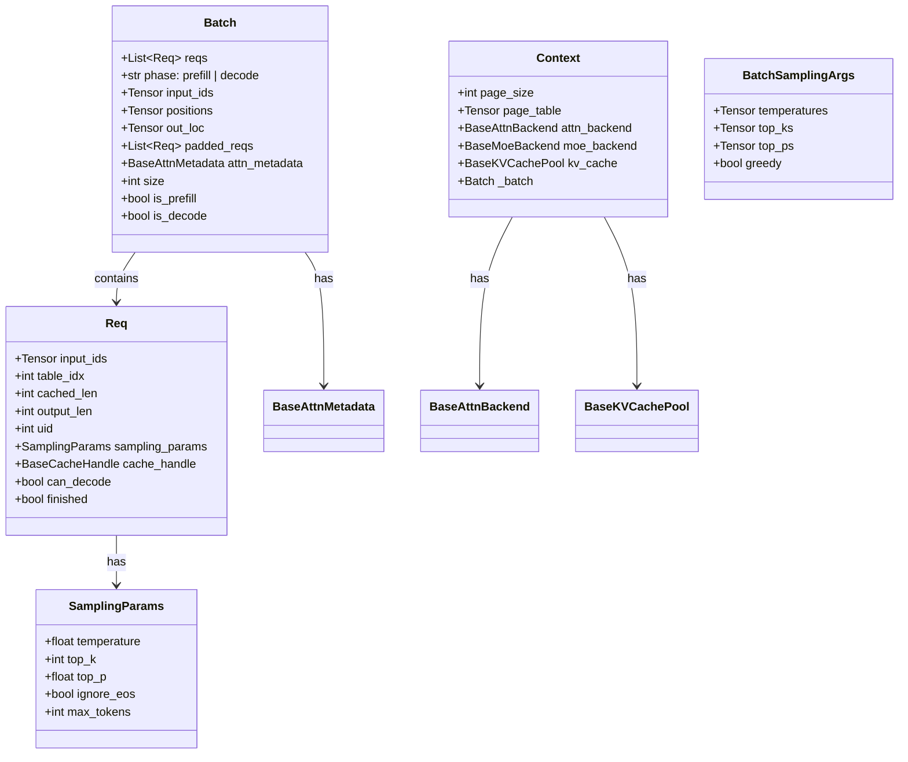
```mermaid
classDiagram
    class SamplingParams {
        +float temperature
        +int top_k
        +float top_p
        +bool ignore_eos
        +int max_tokens
    }

    class Req {
        +Tensor input_ids
        +int table_idx
        +int cached_len
        +int output_len
        +int uid
        +SamplingParams sampling_params
        +BaseCacheHandle cache_handle
        +bool can_decode
        +bool finished
    }

    class Batch {
        +List~Req~ reqs
        +str phase: prefill | decode
        +Tensor input_ids
        +Tensor positions
        +Tensor out_loc
        +List~Req~ padded_reqs
        +BaseAttnMetadata attn_metadata
        +int size
        +bool is_prefill
        +bool is_decode
    }

    class Context {
        +int page_size
        +Tensor page_table
        +BaseAttnBackend attn_backend
        +BaseMoeBackend moe_backend
        +BaseKVCachePool kv_cache
        +Batch _batch
    }

    class BatchSamplingArgs {
        +Tensor temperatures
        +Tensor top_ks
        +Tensor top_ps
        +bool greedy
    }

    Req --> SamplingParams: has
    Batch --> Req: contains
    Context --> BaseAttnBackend: has
    Context --> BaseKVCachePool: has
    Batch --> BaseAttnMetadata: has
```

### 3.2 核心字段说明

#### `SamplingParams` - 采样参数

控制模型生成行为的采样配置，每个请求携带一份：

```python 15:25:python/minisgl/core.py
@dataclass
class SamplingParams:
    temperature: float = 0.0  # 温度，<=0 表示贪婪解码
    top_k: int = -1  # Top-K 采样，-1 表示不限制
    top_p: float = 1.0  # Top-P (核) 采样
    ignore_eos: bool = False  # 是否忽略 EOS token
    max_tokens: int = 1024  # 最大生成 token 数

    @property
    def is_greedy(self) -> bool:
        """判断是否为贪婪解码模式"""
        return (self.temperature <= 0.0 or self.top_k == 1) and self.top_p == 1.0
```

关键点：当 `temperature <= 0` 时直接走 `argmax` 路径，避免不必要的 softmax 计算。

#### `Req` - 请求状态机

`Req` 是调度系统中最核心的数据结构，表示一个正在处理中的推理请求：

```python 28:68:python/minisgl/core.py
@dataclass(eq=False)
class Req:
    input_ids: torch.Tensor  # 输入 token 序列（CPU 上）
    table_idx: int  # 在全局 token 表中的索引
    cached_len: int  # 已缓存的 prefix 长度（Radix Cache 命中时 > 0）
    output_len: int  # 期望输出的 token 数量
    uid: int  # 全局唯一请求 ID
    sampling_params: SamplingParams  # 采样参数
    cache_handle: BaseCacheHandle  # KV 缓存句柄

    def __post_init__(self) -> None:
        assert self.input_ids.is_cpu
        self.device_len = len(self.input_ids)
        self.max_device_len = len(self.input_ids) + self.output_len

    @property
    def remain_len(self) -> int:
        """剩余可生成长度"""
        return self.max_device_len - self.device_len

    @property
    def extend_len(self) -> int:
        """本次需要处理的长度 = device_len - cached_len"""
        return self.device_len - self.cached_len

    def complete_one(self) -> None:
        """完成一个 token 的生成，更新长度"""
        self.cached_len = self.device_len
        self.device_len += 1

    @property
    def can_decode(self) -> bool:
        """是否可以继续 decode"""
        return self.remain_len > 0
```

**状态转换**：

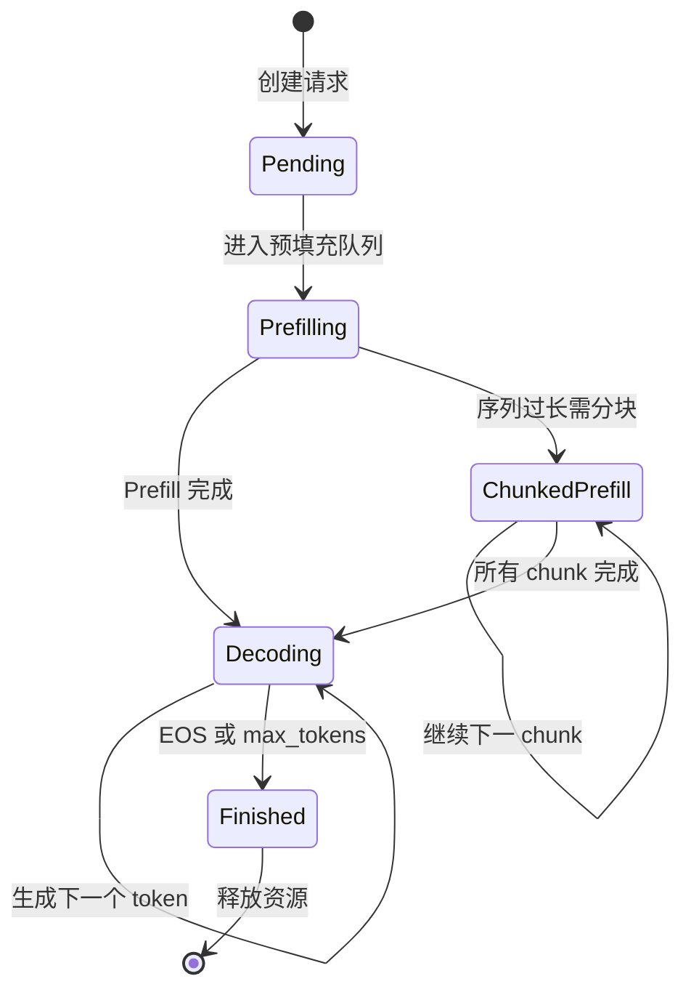
```mermaid
stateDiagram-v2
    [*] --> Pending: 创建请求
    Pending --> Prefilling: 进入预填充队列
    Prefilling --> Decoding: Prefill 完成
    Prefilling --> ChunkedPrefill: 序列过长需分块
    ChunkedPrefill --> ChunkedPrefill: 继续下一 chunk
    ChunkedPrefill --> Decoding: 所有 chunk 完成
    Decoding --> Decoding: 生成下一个 token
    Decoding --> Finished: EOS 或 max_tokens
    Finished --> [*]: 释放资源
```

**关键字段解读**：

| 字段               | 类型                   | 说明                                                   |
|------------------|----------------------|------------------------------------------------------|
| `input_ids`      | `torch.Tensor` (CPU) | 输入 token 序列，始终保存在 CPU 上                              |
| `device_len`     | `int` (动态计算)         | 当前设备上的总长度（含已生成的）                                     |
| `cached_len`     | `int`                | 已缓存的 prefix 长度（Radix Cache 命中时 > 0）                  |
| `extend_len`     | `int` (属性)           | 本次 forward 需要处理的 token 数 = `device_len - cached_len` |
| `complete_one()` | 方法                   | 每次 forward 完成后调用，推进 `cached_len` 和 `device_len`      |

**`extend_len` 是理解 prefill/decode 行为的关键**：

- **首次 prefill**：`cached_len=0, device_len=prompt_len` → `extend_len = prompt_len`
- **Radix Cache 命中后**：`cached_len>0, device_len=prompt_len` → `extend_len = 未命中的部分`
- **decode 阶段**：每次 `complete_one()` 后 `device_len+=1`, `cached_len` 跟进 → `extend_len = 1`

#### `Batch` - 批次容器

Batch 将多个请求打包，供 Engine 统一执行 forward：

```python 71:98:python/minisgl/core.py
@dataclass
class Batch:
    reqs: List[Req]
    phase: Literal["prefill", "decode"]
    # these fields should be set by scheduler
    input_ids: torch.Tensor = field(init=False)
    positions: torch.Tensor = field(init=False)
    out_loc: torch.Tensor = field(init=False)
    padded_reqs: List[Req] = field(init=False)
    # this field should be set by attention backend
    attn_metadata: BaseAttnMetadata = field(init=False)

    @property
    def is_prefill(self) -> bool:
        return self.phase == "prefill"

    @property
    def is_decode(self) -> bool:
        return self.phase == "decode"

    @property
    def size(self) -> int:
        return len(self.reqs)

    @property
    def padded_size(self) -> int:
        return len(self.padded_reqs)
```

注意 `size` vs `padded_size` 的区别：后者包含了用于 CUDA Graph 对齐的 dummy request 填充。

#### `Context` - 全局上下文（单例模式）

Context 作为全局单例，持有所有后端资源引用，通过 `forward_batch()` 上下文管理器将当前 batch 注入：

```python 100:123:python/minisgl/core.py
@dataclass
class Context:
    page_size: int  # KV Cache 页大小
    page_table: torch.Tensor = field(init=False)  # 页表
    attn_backend: BaseAttnBackend = field(init=False)  # 注意力后端
    moe_backend: BaseMoeBackend = field(init=False)  # MoE 后端
    kv_cache: BaseKVCachePool = field(init=False)  # KV 缓存池
    _batch: Batch | None = field(default=None, init=False)

    @property
    def batch(self) -> Batch:
        assert self._batch is not None, "No active batch in context"
        return self._batch

    @contextmanager
    def forward_batch(self, batch: Batch):
        """上下文管理器：设置当前 batch，forward 完成后自动清理"""
        assert self._batch is None, "Nested forward_batch is not allowed"
        try:
            self._batch = batch
            yield
        finally:
            self._batch = None
```

这种设计使得模型层（如 `AttentionLayer`、`MoELayer`）可以通过 `get_global_ctx().batch` 直接访问当前 batch 的元数据，避免了层层传递参数。

---

## 4. 请求处理全流程

### 4.1 端到端流程

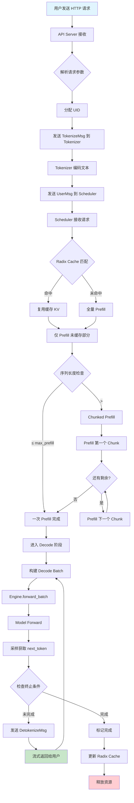
```mermaid
flowchart TD
    A[用户发送 HTTP 请求] --> B[API Server 接收]
    B --> C{解析请求参数}
    C --> D[分配 UID]
    D --> E[发送 TokenizeMsg 到 Tokenizer]
    E --> F[Tokenizer 编码文本]
    F --> G[发送 UserMsg 到 Scheduler]
    G --> H[Scheduler 接收请求]
    H --> I{Radix Cache 匹配}
    I -->|命中| J[复用缓存 KV]
    I -->|未命中| K[全量 Prefill]
    J --> L[仅 Prefill 未缓存部分]
    K --> L
    L --> M{序列长度检查}
    M -->|≤ max_prefill| N[一次 Prefill 完成]
    M -->|>| O[Chunked Prefill]
    O --> P[Prefill 第一个 Chunk]
    P --> Q{还有剩余?}
    Q -->|是| R[Prefill 下一个 Chunk]
    R --> Q
    Q -->|否| N
    N --> S[进入 Decode 阶段]
    S --> T[构建 Decode Batch]
    T --> U[Engine.forward_batch]
    U --> V[Model Forward]
    V --> W[采样获取 next_token]
    W --> X{检查终止条件}
    X -->|未完成| Y[发送 DetokenizeMsg]
    Y --> Z[流式返回给用户]
    Z --> T
    X -->|完成| AA[标记完成]
    AA --> AB[更新 Radix Cache]
    AB --> AC[释放资源]
    style A fill: #e1f5fe
    style Z fill: #c8e6c9
    style AC fill: #ffcdd2
```

### 4.2 Prefill vs Decode 对比

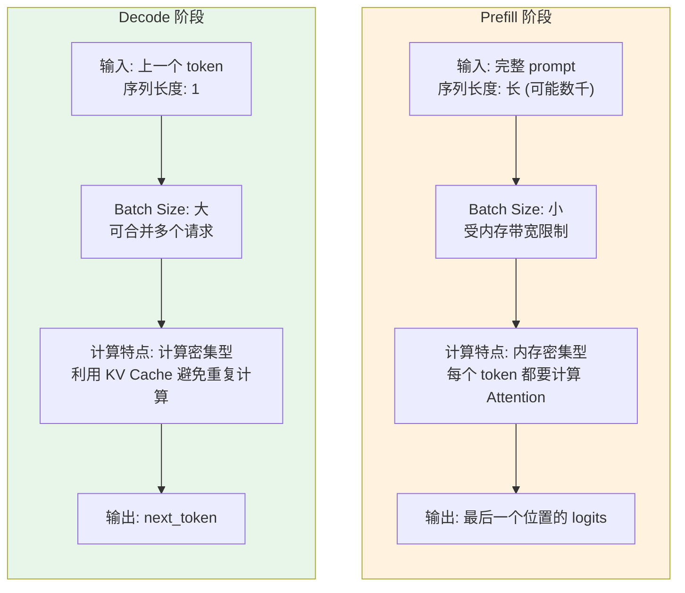
```mermaid
graph TB
    subgraph Prefill["Prefill 阶段"]
        direction TB
        P1["输入: 完整 prompt<br/>序列长度: 长 (可能数千)"]
        P2["Batch Size: 小<br/>受内存带宽限制"]
        P3["计算特点: 内存密集型<br/>每个 token 都要计算 Attention"]
        P4["输出: 最后一个位置的 logits"]
    end

    subgraph Decode["Decode 阶段"]
        direction TB
        D1["输入: 上一个 token<br/>序列长度: 1"]
        D2["Batch Size: 大<br/>可合并多个请求"]
        D3["计算特点: 计算密集型<br/>利用 KV Cache 避免重复计算"]
        D4["输出: next_token"]
    end

    P1 --> P2 --> P3 --> P4
    D1 --> D2 --> D3 --> D4
    style Prefill fill: #fff3e0
    style Decode fill: #e8f5e9
```

| 维度         | Prefill         | Decode           |
|------------|-----------------|------------------|
| 输入长度       | 可变（长）           | 固定 (=1)          |
| Batch Size | 小               | 大                |
| 瓶颈         | 内存带宽            | 计算               |
| KV Cache   | 写入新 KV          | 读取已有 KV + 追加 1 个 |
| 优化手段       | Chunked Prefill | CUDA Graph       |

---

## 5. 调度系统

### 5.1 调度器组件

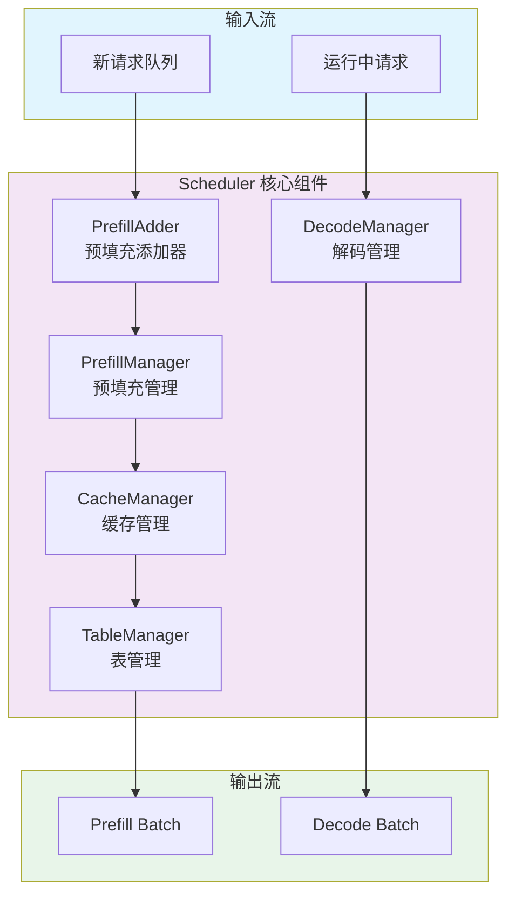
```mermaid
graph TB
    subgraph Scheduler["Scheduler 核心组件"]
        PM["PrefillManager<br/>预填充管理"]
        DM["DecodeManager<br/>解码管理"]
        CM["CacheManager<br/>缓存管理"]
        TM["TableManager<br/>表管理"]
        PA["PrefillAdder<br/>预填充添加器"]
    end

    subgraph Input["输入流"]
        REQ["新请求队列"]
        RUN["运行中请求"]
    end

    subgraph Output["输出流"]
        PREFILL_BS["Prefill Batch"]
        DECODE_BS["Decode Batch"]
    end

    REQ --> PA
    PA --> PM
    PM --> CM
    CM --> TM
    TM --> PREFILL_BS
    RUN --> DM
    DM --> DECODE_BS
    style Scheduler fill: #f3e5f5
    style Input fill: #e1f5fe
    style Output fill: #e8f5e9
```

### 5.2 Overlap Scheduling 工作原理

```mermaid
sequenceDiagram
    participant Loop as 主循环
    participant GPU as GPU 计算
    participant CPU as CPU 调度

    rect rgb(224, 247, 250)
        Note right of Loop: Normal Mode 串行执行
        Loop ->> CPU: 1. 调度准备 batch
        CPU -->> Loop: batch 就绪
        Loop ->> GPU: 2. 执行 forward
        GPU -->> Loop: 结果返回
        Loop ->> CPU: 3. 后处理采样和更新状态
        CPU -->> Loop: 完成
    end

    rect rgb(252, 228, 236)
        Note right of Loop: Overlap Mode 并行执行
        par GPU 计算与 CPU 调度并行
            Loop ->> GPU: N. 执行 forward 上一轮 batch
            GPU -->> Loop: 结果返回
        and
            Loop ->> CPU: N加1. 调度准备下一轮 batch
            CPU -->> Loop: 下一轮 batch 就绪
        end
        Loop ->> CPU: 后处理结果并准备好的下一轮 batch
    end
```

**关键思想**：在 GPU 执行当前 batch 的 forward 时，CPU 同时准备下一个 batch，隐藏调度开销。

**核心实现 - `overlap_loop`**：

```python 83:106:python/minisgl/scheduler/scheduler.py
def overlap_loop(self, last_data: ForwardData | None) -> ForwardData | None:
    """
    Overlap 调度的核心：
    - GPU 正在执行第 N 个 batch 时，CPU 同时准备第 N+1 个 batch
    - 返回 ongoing_data 给下一次迭代处理结果
    """
    # 1. 接收新消息（非阻塞）
    blocking = not (
            last_data is not None  # 有上一轮数据需要处理时不阻塞
            or self.prefill_manager.runnable  # 或有待处理的 prefill 请求
            or self.decode_manager.runnable  # 或有 decode 请求
    )
    for msg in self.receive_msg(blocking=blocking):
        self._process_one_msg(msg)

    # 2. 调度下一个 batch（在 CPU stream 上）
    forward_input = self._schedule_next_batch()

    # 3. 在 Engine 的 GPU stream 上执行当前 batch（与步骤 2 的下一次迭代并行）
    ongoing_data = None
    if forward_input is not None:
        with self.engine_stream_ctx:  # 切换到 Engine 的 CUDA stream
            self.engine.stream.wait_stream(self.stream)  # 等待 CPU 调度完成
            ongoing_data = (forward_input, self._forward(forward_input))

    # 4. 处理上一轮的结果（与步骤 3 的 GPU 执行并行）
    self._process_last_data(last_data)
    return ongoing_data
```

**主入口 `run_forever`** 根据 `DISABLE_OVERLAP_SCHEDULING` 环境变量选择模式：

```python 120:131:python/minisgl/scheduler/scheduler.py
@torch.inference_mode()
def run_forever(self) -> NoReturn:
    if ENV.DISABLE_OVERLAP_SCHEDULING:
        while True:
            self.normal_loop()  # 串行：调度 → 执行 → 后处理
    else:
        data = None
        while True:
            data = self.overlap_loop(data)  # 并行：GPU 执行 N 的同时 CPU 准备 N+1
```

**消息处理 `_process_one_msg`** 将 `UserMsg` 转化为内部请求：

```python 169:198:python/minisgl/scheduler/scheduler.py
def _process_one_msg(self, msg: BaseBackendMsg) -> None:
    if isinstance(msg, UserMsg):
        input_len, max_seq_len = len(msg.input_ids), self.engine.max_seq_len
        max_output_len = max_seq_len - input_len
        if max_output_len <= 0:
            return logger.warning(f"Input too long for request {msg.uid}, dropped.")
        if msg.sampling_params.max_tokens > max_output_len:
            msg.sampling_params.max_tokens = max_output_len  # 自动截断
        self.prefill_manager.add_one_req(msg)  # 加入 prefill 队列
    elif isinstance(msg, AbortBackendMsg):
        req_to_free = self.prefill_manager.abort_req(msg.uid)
        req_to_free = req_to_free or self.decode_manager.abort_req(msg.uid)
        if req_to_free is not None:
            self._free_req_resources(req_to_free)
```

### 5.3 Chunked Prefill 流程

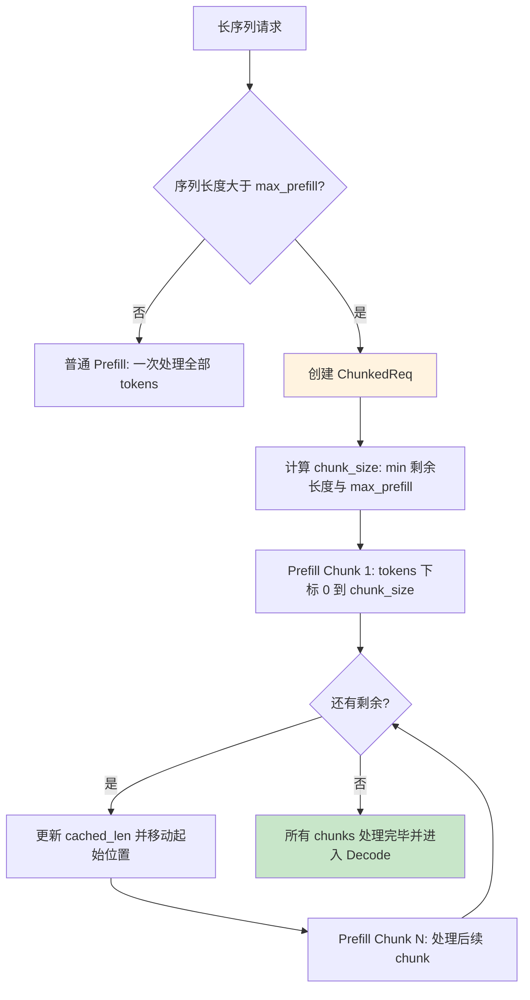
```mermaid
flowchart TD
    A[长序列请求] --> B{"序列长度大于 max_prefill?"}
    B -->|否| C[普通 Prefill: 一次处理全部 tokens]
    B -->|是| D[创建 ChunkedReq]
    D --> E[计算 chunk_size: min 剩余长度与 max_prefill]
    E --> F[Prefill Chunk 1: tokens 下标 0 到 chunk_size]
    F --> G{还有剩余?}
    G -->|是| H[更新 cached_len 并移动起始位置]
    H --> I[Prefill Chunk N: 处理后续 chunk]
    I --> G
    G -->|否| J[所有 chunks 处理完毕并进入 Decode]
    style D fill: #fff3e0
    style J fill: #c8e6c9
```

**ChunkedReq** 是 Req 的特殊子类，禁止进入 decode 阶段（因为尚未完成全部 prefill）：

```python 23:29:python/minisgl/scheduler/prefill.py
class ChunkedReq(Req):
    def append_host(self, next_token: torch.Tensor) -> None:
        raise NotImplementedError("ChunkedReq should not be sampled")

    @property
    def can_decode(self) -> bool:
        return False  # 避免 DecodeManager 接收未完成 prefill 的请求
```

**PrefillAdder.try_add_one** 决定如何将请求加入当前 prefill batch：

```python 92:113:python/minisgl/scheduler/prefill.py
def try_add_one(self, pending_req: PendingReq) -> Req | None:
    """尝试将一个待处理请求加入 prefill batch"""
    if self.token_budget <= 0:
        return None

    # 如果是 chunked request 的延续，直接复用之前的 handle
    if chunked_req := pending_req.chunked_req:
        return self._add_one_req(pending_req, chunked_req.cache_handle,
                                 chunked_req.table_idx, chunked_req.cached_len)

    # 尝试分配资源：匹配 Radix Cache + 检查预算
    if resource := self._try_allocate_one(pending_req):
        cache_handle, table_idx = resource
        return self._add_one_req(pending_req, cache_handle, table_idx,
                                 cache_handle.cached_len)
    return None
```

**核心分片逻辑 `_add_one_req`**：

```python 65:90:python/minisgl/scheduler/prefill.py
def _add_one_req(self, pending_req, cache_handle, table_idx, cached_len) -> Req:
    remain_len = pending_req.input_len - cached_len
    chunk_size = min(self.token_budget, remain_len)  # 关键：受 budget 限制
    is_chunked = chunk_size < remain_len  # 如果一次装不下，创建 ChunkedReq
    CLS = ChunkedReq if is_chunked else Req
    # 将 input_ids 对应部分拷贝到 GPU token_pool（使用 pin_memory 加速）
    device_ids = self.table_manager.token_pool[table_idx, slice(cached_len, cached_len + chunk_size)]
    device_ids.copy_(pending_req.input_ids[slice(cached_len, cached_len + chunk_size)].pin_memory())
    return CLS(input_ids=pending_req.input_ids[:cached_len + chunk_size],
               table_idx=table_idx, cached_len=cached_len, ...)
```

注意 `token_budget` 的双重约束作用：既限制单次 prefill 的 token 数，也通过 `reserved_size` 为正在 decode 的请求预留空间。

### 5.4 Radix Cache 前缀匹配

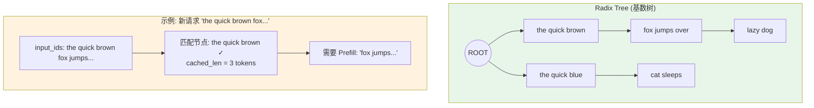
```mermaid
graph TD
    subgraph Tree["Radix Tree (基数树)"]
        ROOT(("ROOT"))
        N1["the quick brown"]
        N2["fox jumps over"]
        N3["the quick blue"]
        N4["lazy dog"]
        N5["cat sleeps"]
        ROOT --> N1
        ROOT --> N3
        N1 --> N2
        N2 --> N4
        N3 --> N5
    end

    subgraph Example["示例: 新请求 'the quick brown fox...'"]
        REQ["input_ids: the quick brown fox jumps..."]
        MATCH["匹配节点: the quick brown ✓<br/>cached_len = 3 tokens"]
        NEW["需要 Prefill: 'fox jumps...'"]
    end

    REQ --> MATCH
    MATCH --> NEW
    style Tree fill: #e8f5e9
    style Example fill: #fff3e0
```

**Radix Cache 核心操作**：

| 操作                         | 说明          | 复杂度            |
|----------------------------|-------------|----------------|
| `match_prefix(input_ids)`  | 在树中查找最长公共前缀 | O(depth)       |
| `insert_prefix(input_ids)` | 插入新的前缀节点    | O(depth)       |
| `evict(size)`              | LRU 驱逐，释放空间 | O(evict_count) |

**CacheManager** 负责 KV Cache 页面的分配、释放和前缀缓存的管理协调：

```python 15:26:python/minisgl/scheduler/cache.py
class CacheManager:
    def __init__(self, num_pages, page_size, page_table, type):
        # 空闲页槽位（page-aligned）
        self.free_slots = torch.arange(num_pages, dtype=torch.int32, device=device) * page_size
        self.prefix_cache = create_prefix_cache(device=device, type=type)  # Radix/Naive

    def match_req(self, req: PendingReq) -> MatchResult:
        """为新请求查找 Radix Cache 命中（去掉最后一个 token 以避免重复 EOS 匹配）"""
        return self.prefix_cache.match_prefix(req.input_ids[: req.input_len - 1])

    def allocate_paged(self, reqs: List[Req]) -> None:
        """为请求分配 KV Cache 物理页面，写入页表"""
        for req in reqs:
            first_page = div_ceil(req.cached_len, self.page_size)
            last_page = div_ceil(req.device_len, self.page_size)
            if last_page > first_page:  # 需要新分配的页
                needed_pages += last_page - first_page
        if needed_pages > 0:
            allocated = self._allocate(needed_pages)  # 可能触发驱逐
            _write_page_table(self.page_table, allocated, allocation_info, self.page_size)
```

**`cache_req` 方法在请求完成或 prefill 结束后更新缓存**：

```python 55:79:python/minisgl/scheduler/cache.py
def cache_req(self, req: Req, *, finished: bool) -> None:
    insert_ids = req.input_ids[: req.cached_len]
    page_indices = self.page_table[req.table_idx, : req.cached_len]
    old_handle = req.cache_handle

    # 插入前缀到 Radix Tree
    cached_len, new_handle = self.prefix_cache.insert_prefix(insert_ids, page_indices)
    self.unlock(old_handle)  # 解锁旧 handle

    # 释放已被其他请求缓存的部分（避免内存泄漏）
    self._free(page_indices[old_handle.cached_len: cached_len])

    if finished:  # 请求完成，释放尾部
        self._free(page_indices[new_handle.cached_len:])
    else:  # 更新 handle 继续使用
        req.cache_handle = new_handle
        self.lock(new_handle)
```

**DecodeManager** 管理所有正在 decode 的请求，负责构建 decode batch：

```python 9:39:python/minisgl/scheduler/decode.py
@dataclass
class DecodeManager:
    running_reqs: Set[Req] = field(default_factory=set)

    def filter_reqs(self, reqs: Iterable[Req]) -> None:
        """过滤掉已完成的请求，只保留还能继续 decode 的"""
        self.running_reqs = {req for req in self.running_reqs.union(reqs) if req.can_decode}

    @property
    def inflight_tokens(self) -> int:
        """计算正在使用的 token 预留量（用于 prefill budget 控制）"""
        tokens_reserved = (self.page_size - 1) * len(self.running_reqs)  # 每个请求保留 1 页
        return sum(req.remain_len for req in self.running_reqs) + tokens_reserved

    def schedule_next_batch(self) -> Batch | None:
        if not self.runnable:
            return None
        return Batch(reqs=list(self.running_reqs), phase="decode")
```

**TableManager** 管理 token 表的槽位分配（每个请求一行）：

```python 4:11:python/minisgl/scheduler/table.py
class TableManager:
    def __init__(self, max_running_reqs, page_table):
        self._free_slots = list(range(max_running_reqs))  # 可用的行索引
        self.token_pool = torch.zeros_like(page_table, dtype=torch.int32)  # GPU token 池

    def allocate(self) -> int:
        return self._free_slots.pop()

    def free(self, slot: int) -> None:
        self._free_slots.append(slot)
```

---

## 6. 推理引擎

### 6.1 Engine 核心循环

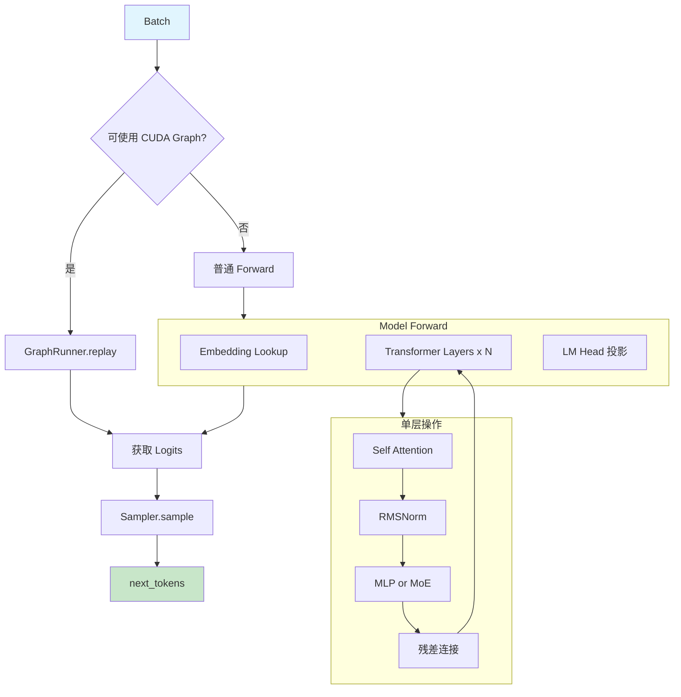
```mermaid
flowchart TD
    BATCH[Batch] --> CHECK{"可使用 CUDA Graph?"}
    CHECK -->|是| CG[GraphRunner.replay]
    CHECK -->|否| NORMAL[普通 Forward]

    subgraph Forward["Model Forward"]
        EMB[Embedding Lookup]
        LAYERS[Transformer Layers x N]
        HEAD[LM Head 投影]
    end

    subgraph LayerOps["单层操作"]
        ATTN[Self Attention]
        NORM[RMSNorm]
        MLP[MLP or MoE]
        RES[残差连接]
    end

    NORMAL --> Forward
    CG --> LOGITS[获取 Logits]
    Forward --> LOGITS
    LOGITS --> SAMPLE[Sampler.sample]
    SAMPLE --> NEXT[next_tokens]
    LAYERS --> LayerOps
    ATTN --> NORM
    NORM --> MLP
    MLP --> RES
    RES --> LAYERS
    style BATCH fill: #e1f5fe
    style NEXT fill: #c8e6c9
```

**Engine 初始化** 完成整个推理系统的资源分配和初始化：

```python 30:110:python/minisgl/engine/engine.py
class Engine:
    def __init__(self, config: EngineConfig):
        # 1. 初始化 CUDA 设备和通信
        set_tp_info(rank=config.tp_info.rank, size=config.tp_info.size)
        self.device = torch.device(f"cuda:{config.tp_info.rank}")
        self.stream = torch.cuda.Stream()  # 独立 CUDA stream
        self.ctx = Context(config.page_size)
        set_global_ctx(self.ctx)

        # 2. 初始化通信 (NCCL / PyNCCL)
        self.tp_cpu_group = self._init_communication(config)

        # 3. 创建模型（meta 设备，不占显存）并加载权重
        with torch.device("meta"), torch_dtype(config.dtype):
            self.model = create_model(config.model_config)  # 不占显存
        self.model.load_state_dict(self._load_weight_state_dict(config))  # 流式加载到 GPU

        # 4. 根据剩余显存计算 KV Cache 页数
        self.num_pages = self._determine_num_pages(init_free_memory, config)
        self.ctx.kv_cache = create_kvcache_pool(...)

        # 5. 初始化页表、注意力后端、MoE 后端、采样器
        self.ctx.page_table = torch.zeros((max_running_req + 1, aligned_max_seq_len), ...)
        self.ctx.attn_backend = create_attention_backend(...)
        if config.model_config.is_moe:
            self.ctx.moe_backend = create_moe_backend(config.moe_backend)
        self.sampler = Sampler(self.device, vocab_size)

        # 6. 初始化 CUDA Graph 捕获（为不同 BS 预捕获 graph）
        self.graph_runner = GraphRunner(stream=self.stream, model=self.model, ...)
```

**`forward_batch`** 是 Engine 对外暴露的核心方法，每个调度步调用一次：

```python 191:206:python/minisgl/engine/engine.py
def forward_batch(self, batch: Batch, args: BatchSamplingArgs) -> ForwardOutput:
    assert torch.cuda.current_stream() == self.stream
    with self.ctx.forward_batch(batch):  # 设置全局上下文的当前 batch
        if self.graph_runner.can_use_cuda_graph(batch):
            logits = self.graph_runner.replay(batch)  # CUDA Graph 路径
        else:
            logits = self.model.forward()  # 普通 Eager 路径

    for req in batch.reqs:
        req.complete_one()  # 更新每个请求的长度状态

    next_tokens_gpu = self.sampler.sample(logits[: batch.size], args).to(torch.int32)
    next_tokens_cpu = next_tokens_gpu.to("cpu", non_blocking=True)  # 异步拷贝到 CPU
    copy_done_event = torch.cuda.Event()
    copy_done_event.record(self.stream)  # 记录拷贝完成事件
    return ForwardOutput(next_tokens_gpu, next_tokens_cpu, copy_done_event)
```

注意 `next_tokens_cpu` 使用 `non_blocking=True` 异步拷贝，CPU 端通过 `copy_done_event.synchronize()` 确保拷贝完成后再使用。

### 6.2 GraphRunner - CUDA Graph 管理

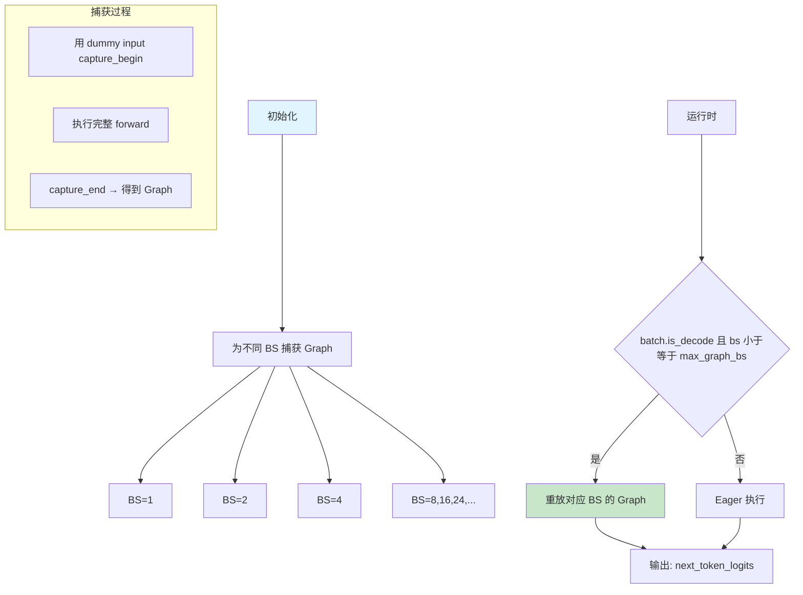
```mermaid
graph TB
    INIT["初始化"] --> CAPTURE["为不同 BS 捕获 Graph"]
    CAPTURE --> BS1["BS=1"]
    CAPTURE --> BS2["BS=2"]
    CAPTURE --> BS4["BS=4"]
    CAPTURE --> BSN["BS=8,16,24,..."]
    RUNTIME["运行时"] --> CHECK{"batch.is_decode 且 bs 小于等于 max_graph_bs"}
    CHECK -->|是| REPLAY["重放对应 BS 的 Graph"]
    CHECK -->|否| EAGER["Eager 执行"]

    subgraph CaptureDetail["捕获过程"]
        C1["用 dummy input capture_begin"]
        C2["执行完整 forward"]
        C3["capture_end → 得到 Graph"]
    end
    REPLAY --> OUT["输出: next_token_logits"]
    EAGER --> OUT
    style INIT fill: #e1f5fe
    style REPLAY fill: #c8e6c9
```

**CUDA Graph Batch Size 策略**：

```python 49:67:python/minisgl/engine/graph.py
def _determine_cuda_graph_bs(cuda_graph_bs, cuda_graph_max_bs, free_memory):
    """根据可用显存决定 CUDA Graph 捕获的 batch size 列表"""
    free_memory_gb = free_memory / (1 << 30)
    if cuda_graph_max_bs is None:
        cuda_graph_max_bs = 256 if free_memory_gb > 80 else 160  # H200 vs 其他
    # 小 BS 更密集（decode 常见），大 BS 每 8 一个
    return [1, 2, 4] + list(range(8, cuda_graph_max_bs + 1, 8))
    # 结果: [1, 2, 4, 8, 16, 24, 32, 40, ...]
```

**GraphCaptureBuffer** 是 CUDA Graph 的固定内存缓冲区，capture 和 replay 时都使用同一块内存：

```python 20:47:python/minisgl/engine/graph.py
@dataclass
class GraphCaptureBuffer:
    input_ids: torch.Tensor  # [max_bs] token 输入
    out_loc: torch.Tensor  # [max_bs] KV 写入位置
    positions: torch.Tensor  # [max_bs] 位置 ID
    logits: torch.Tensor  # [max_bs, vocab] 输出 logits

    def set_batch(self, batch: Batch) -> None:
        """capture 时：将 buffer 绑定到 batch 的字段"""
        _slice = slice(batch.padded_size)
        batch.input_ids = self.input_ids[_slice]
        batch.out_loc = self.out_loc[_slice]
        batch.positions = self.positions[_slice]

    def copy_from(self, batch: Batch) -> None:
        """replay 时：将实际数据拷贝到 buffer（唯一的数据拷贝开销）"""
        _slice = slice(batch.padded_size)
        self.input_ids[_slice] = batch.input_ids
        self.out_loc[_slice] = batch.out_loc
        self.positions[_slice] = batch.positions
```

**捕获过程 `_capture_graphs`**：

```python 105:148:python/minisgl/engine/graph.py
def _capture_graphs(self, max_seq_len, vocab_size, model):
    self.buffer = GraphCaptureBuffer.init(self.max_graph_bs, vocab_size, self.device)
    pool = None  # CUDA Graph 内存池，复用 graph handle 以减少内存
    for bs in sorted(self.graph_bs_list, reverse=True):  # 从大到小捕获
        graph = torch.cuda.CUDAGraph()
        batch = Batch(reqs=[self.dummy_req] * bs, phase="decode")
        batch.padded_reqs = batch.reqs
        self.attn_backend.prepare_for_capture(batch)  # 让后端准备 capture 状态
        self.buffer.set_batch(batch)
        with get_global_ctx().forward_batch(batch):
            self.buffer.logits[:bs] = model.forward()  # warmup run
            with torch.cuda.graph(graph, pool=pool, stream=self.stream):
                self.buffer.logits[:bs] = model.forward()  # 捕获这次 forward
        if pool is None:
            pool = graph.pool()  # 复用 CUDA Graph handle 以减少内存
        self.graph_map[bs] = graph
```

**重放过程** —— 极低开销，仅需一次数据拷贝 + `replay()`：

```python 149:158:python/minisgl/engine/graph.py
def can_use_cuda_graph(self, batch: Batch) -> bool:
    return batch.is_decode and batch.size <= self.max_graph_bs


def replay(self, batch: Batch) -> torch.Tensor:
    self.buffer.copy_from(batch)  # 将 batch 数据复制到捕获缓冲区
    g = self.graph_map[batch.padded_size]  # 选择对应 BS 的 graph
    self.attn_backend.prepare_for_replay(batch)
    g.replay()  # 重放！无需重新执行 kernel
    return self.buffer.logits[: batch.size]
```

**batch padding** —— 当实际 bs 不在捕获列表中时，向上取整到最近的捕获 bs 并用 dummy request 填充：

```python 160:166:python/minisgl/engine/graph.py
def pad_batch(self, batch: Batch) -> None:
    padded_size = next(bs for bs in self.graph_bs_list if bs >= batch.size)
        if self.can_use_cuda_graph(batch) else batch.size
    batch.padded_reqs = batch.reqs + [self.dummy_req] * (padded_size - batch.size)
```

### 6.3 Sampler - 采样策略

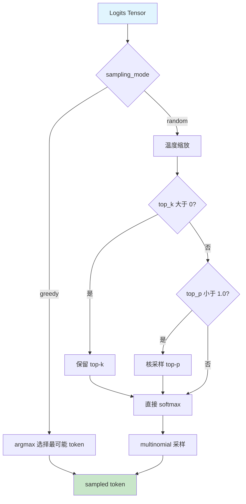
```mermaid
flowchart TD
    LOGITS[Logits Tensor] --> MODE{"sampling_mode"}
    MODE -->|" greedy "| ARGMAX[argmax 选择最可能 token]
    MODE -->|" random "| TEMP[温度缩放]
    TEMP --> TOPK{top_k 大于 0?}
    TOPK -->|是| FILTER_K[保留 top-k]
    TOPK -->|否| TOPP{top_p 小于 1.0?}
    TOPP -->|是| FILTER_P[核采样 top-p]
    TOPP -->|否| SOFTMAX[直接 softmax]
    FILTER_K --> SOFTMAX
    FILTER_P --> SOFTMAX
    SOFTMAX --> MULTINOMIAL[multinomial 采样]
    MULTINOMIAL --> TOKEN[sampled token]
    ARGMAX --> TOKEN
    style LOGITS fill: #e1f5fe
    style TOKEN fill: #c8e6c9
```

**Sampler.prepare** 从请求列表中提取批量采样的参数，自动检测全贪婪模式以跳过 softmax：

```python 48:68:python/minisgl/engine/sample.py
@dataclass
class Sampler:
    device: torch.device
    vocab_size: int

    def prepare(self, batch: Batch) -> BatchSamplingArgs:
        params = [r.sampling_params for r in batch.reqs]
        if all(p.is_greedy for p in params):
            return BatchSamplingArgs(temperatures=None)  # 全贪婪模式，跳过 softmax

        ts = [max(0.0 if p.is_greedy else p.temperature, 1e-6) for p in params]
        top_ks = [p.top_k if p.top_k >= 1 else self.vocab_size for p in params]
        top_ps = [min(max(p.top_p, MIN_P), 1.0) for p in params]
        temperatures = make_device_tensor(ts, torch.float32, self.device)  # pin_memory → GPU
        # 仅在需要时创建 top_k/top_p 张量（节省内存和带宽）
        top_k = make_device_tensor(top_ks, ...) if any(k != self.vocab_size for k in top_ks) else None
        top_p = make_device_tensor(top_ps, ...) if any(p < 1.0 for p in top_ps) else None
        return BatchSamplingArgs(temperatures, top_k=top_k, top_p=top_p)
```

**Sampler.sample** 执行采样：

```python 70:75:python/minisgl/engine/sample.py
@nvtx_annotate("Sampler")
def sample(self, logits, args):
    if args.temperatures is None:  # 全贪婪解码
        return torch.argmax(logits, dim=-1)
    return sample_impl(logits.float(), args.temperatures, args.top_k, args.top_p)
```

**sample_impl** 使用 FlashInfer 的高效采样原语：

```python 24:45:python/minisgl/engine/sample.py
def sample_impl(logits, temperatures, top_k, top_p):
    import flashinfer.sampling as sampling
    probs = sampling.softmax(logits, temperatures, enable_pdl=is_sm90_supported())
    if top_k is not None and top_p is not None:
        return sampling.top_k_top_p_sampling_from_probs(probs, top_k, top_p)
    elif top_k is not None:
        return sampling.top_k_sampling_from_probs(probs, top_k)
    elif top_p is not None:
        return sampling.top_p_sampling_from_probs(probs, top_p)
    return sampling.sampling_from_probs(probs)
```

---

## 7. 模型与层实现

### 7.1 模型层次结构

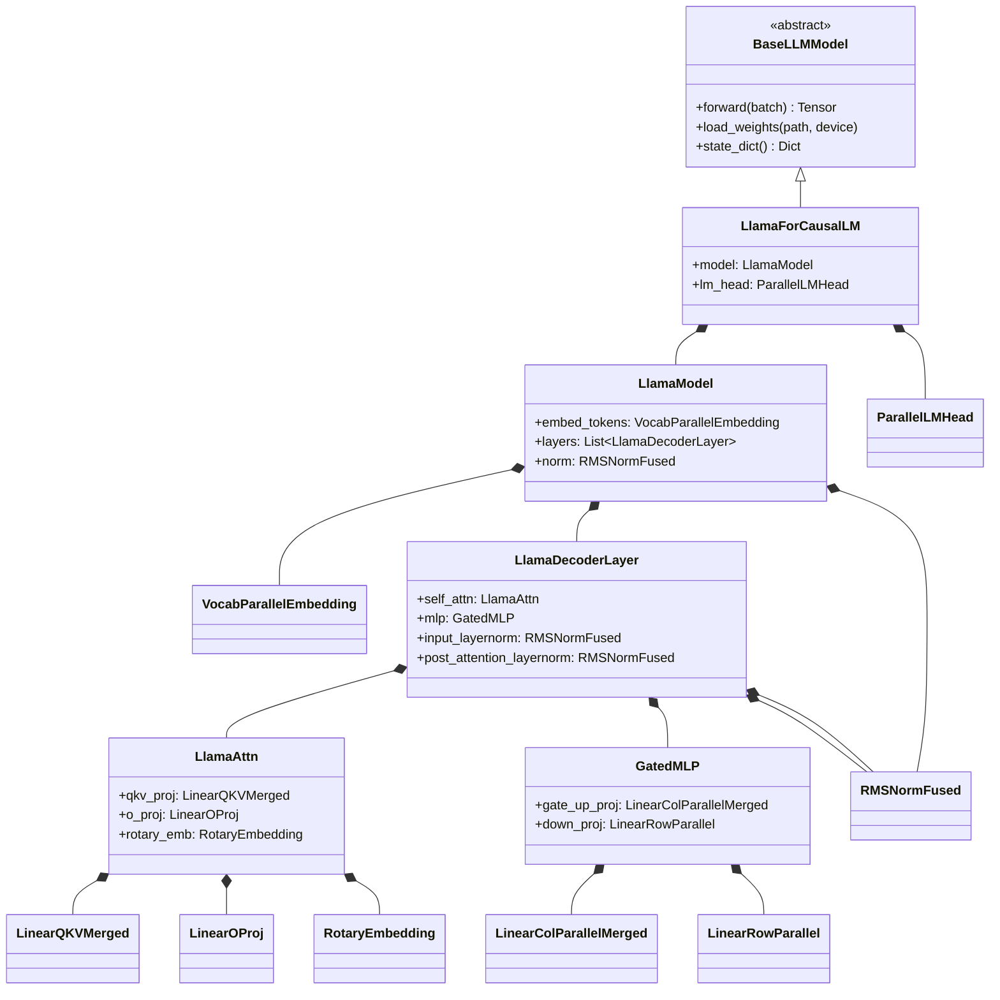
```mermaid
classDiagram
    class BaseLLMModel {
        <<abstract>>
        +forward(batch) Tensor
        +load_weights(path, device)
        +state_dict() Dict
    }

    class LlamaForCausalLM {
        +model: LlamaModel
        +lm_head: ParallelLMHead
    }

    class LlamaModel {
        +embed_tokens: VocabParallelEmbedding
        +layers: List~LlamaDecoderLayer~
        +norm: RMSNormFused
    }

    class LlamaDecoderLayer {
        +self_attn: LlamaAttn
        +mlp: GatedMLP
        +input_layernorm: RMSNormFused
        +post_attention_layernorm: RMSNormFused
    }

    class LlamaAttn {
        +qkv_proj: LinearQKVMerged
        +o_proj: LinearOProj
        +rotary_emb: RotaryEmbedding
    }

    class GatedMLP {
        +gate_up_proj: LinearColParallelMerged
        +down_proj: LinearRowParallel
    }

    BaseLLMModel <|-- LlamaForCausalLM
    LlamaForCausalLM *-- LlamaModel
    LlamaForCausalLM *-- ParallelLMHead
    LlamaModel *-- VocabParallelEmbedding
    LlamaModel *-- LlamaDecoderLayer
    LlamaModel *-- RMSNormFused
    LlamaDecoderLayer *-- LlamaAttn
    LlamaDecoderLayer *-- GatedMLP
    LlamaDecoderLayer *-- RMSNormFused
    LlamaDecoderLayer *-- RMSNormFused
    LlamaAttn *-- LinearQKVMerged
    LlamaAttn *-- LinearOProj
    LlamaAttn *-- RotaryEmbedding
    GatedMLP *-- LinearColParallelMerged
    GatedMLP *-- LinearRowParallel
```

**LlamaForCausalLM** 是模型的顶层入口，`forward()` 从全局 context 获取当前 batch 的 input_ids：

```python 68:85:python/minisgl/models/llama.py
class LlamaForCausalLM(BaseLLMModel):
    def __init__(self, config: ModelConfig):
        self.model = LlamaModel(config)  # Transformer 编码器
        self.lm_head = ParallelLMHead(...)  # 并行输出头（支持权重绑定）

    def forward(self) -> Tensor:
        """从全局 context 获取当前 batch 的 input_ids，执行完整前向传播"""
        output = self.model.forward(get_global_ctx().batch.input_ids)
        logits = self.lm_head.forward(output)
        return logits
```

**LlamaModel** 执行 Embedding → N × DecoderLayer → RMSNorm：

```python 46:65:python/minisgl/models/llama.py
class LlamaModel(BaseOP):
    def __init__(self, config: ModelConfig):
        self.embed_tokens = VocabParallelEmbedding(
            num_embeddings=config.vocab_size,
            embedding_dim=config.hidden_size,
        )
        self.layers = OPList(
            [LlamaDecoderLayer(config, layer_id) for layer_id in range(config.num_layers)]
        )
        self.norm = RMSNormFused(size=config.hidden_size, eps=config.rms_norm_eps)

    def forward(self, input_ids: Tensor) -> Tensor:
        x = self.embed_tokens.forward(input_ids)  # Token Embedding
        residual: Tensor | None = None
        for layer in self.layers.op_list:  # N 层 Decoder（顺序执行）
            x, residual = layer.forward(x, residual)
        return self.norm.forward(x, residual)[0]  # 最终 RMSNorm
```

**LlamaDecoderLayer** 每层执行 Pre-Attention Norm → Attention → Post-Attention Norm → MLP：

```python 18:43:python/minisgl/models/llama.py
class LlamaDecoderLayer(BaseOP):
    def __init__(self, config: ModelConfig, layer_id: int):
        self.self_attn = LlamaAttn(config, layer_id)
        self.mlp = LlamaMLP(config)
        self.input_layernorm = RMSNormFused(size=config.hidden_size, eps=config.rms_norm_eps)
        self.post_attention_layernorm = RMSNormFused(size=config.hidden_size, eps=config.rms_norm_eps)

    @nvtx_annotate("Layer_{}", layer_id_field="_layer_id")
    def forward(self, x, residual=None) -> Tuple[Tensor, Tensor]:
        x, residual = self.input_layernorm.forward(x, residual)  # Pre-Attention RMSNorm
        x = self.self_attn.forward(x)  # Multi-Head Attention + RoPE
        x, residual = self.post_attention_layernorm.forward(x, residual)  # Post-Attention RMSNorm
        x = self.mlp.forward(x)  # Gated MLP (SiLU)
        return x, residual  # 残差连接由 norm fused 处理
```

### 7.2 层类型与张量并行策略

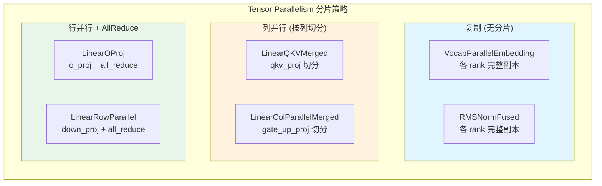
```mermaid
graph LR
    subgraph TP["Tensor Parallelism 分片策略"]
        direction TB
        subgraph Replicated["复制 (无分片)"]
            R1["VocabParallelEmbedding<br/>各 rank 完整副本"]
            R2["RMSNormFused<br/>各 rank 完整副本"]
        end
        subgraph ColParallel["列并行 (按列切分)"]
            C1["LinearQKVMerged<br/>qkv_proj 切分"]
            C2["LinearColParallelMerged<br/>gate_up_proj 切分"]
        end
        subgraph RowParallel["行并行 + AllReduce"]
            O1["LinearOProj<br/>o_proj + all_reduce"]
            O2["LinearRowParallel<br/>down_proj + all_reduce"]
        end
    end

    style Replicated fill: #e1f5fe
    style ColParallel fill: #fff3e0
    style RowParallel fill: #e8f5e9
```

**RopeAttn (QKV Projection + Attention + Output Projection)**：

```python 79:123:python/minisgl/models/utils.py
class RopeAttn(BaseOP):
    def __init__(self, config, layer_id, *, has_qk_norm=False):
        self.qkv_proj = LinearQKVMerged(  # QKV 融合列并行投影
            hidden_size=config.hidden_size,
            head_dim=config.head_dim,
            num_qo_heads=config.num_qo_heads,
            num_kv_heads=config.num_kv_heads,
        )
        if has_qk_norm:  # Qwen2 等模型使用 QK Norm
            self.q_norm = RMSNorm(head_dim, ...)
            self.k_norm = RMSNorm(head_dim, ...)
        self.attn = AttentionLayer(layer_id, ...)  # 注意力计算 + RoPE
        self.o_proj = LinearOProj(  # 行并行 + AllReduce
            head_dim * config.num_qo_heads, config.hidden_size
        )

    @nvtx_annotate("MHA")
    def forward(self, x):
        qkv = self.qkv_proj.forward(x)
        o = self.attn.forward(qkv)
        return self.o_proj.forward(o)
```

**GatedMLP (SwiGLU)** —— gate_proj 和 up_proj 融合为单次矩阵乘法：

```25:50:python/minisgl/models/utils.py
class GatedMLP(BaseOP):
    def __init__(self, config: ModelConfig):
        self.gate_up_proj = LinearColParallelMerged(   # [hidden, 2*inter] 列并行融合
            config.hidden_size,
            [config.intermediate_size, config.intermediate_size],
        )
        FN_MAP = {"silu": silu_and_mul, "gelu": gelu_and_mul}
        self.act_fn = FN_MAP.get(config.hidden_act)     # SiLU(gate) * up 融合激活
        self.down_proj = LinearRowParallel(             # [inter, hidden] 行并行
            config.intermediate_size, config.hidden_size
        )

    @nvtx_annotate("MLP")
    def forward(self, x):
        gate_up = self.gate_up_proj.forward(x)   # [bs, seq, 2 * intermediate]
        y = self.act_fn(gate_up)                 # SiLU(gate) * up (fused)
        return self.down_proj.forward(y)         # AllReduce 行并行
```

**MoEMLP** —— MoE 模型的 MLP 替代，包含 Router + Experts：

```53:76:python/minisgl/models/utils.py
class MoEMLP(BaseOP):
    def __init__(self, config: ModelConfig):
        self.experts = MoELayer(
            num_experts=config.num_experts,
            top_k=config.num_experts_per_tok,
            ...
        )
        self.gate = LinearReplicated(config.hidden_size, config.num_experts)  # Router

    def forward(self, hidden_states):
        router_logits = self.gate.forward(hidden_states)  # 计算路由 logits
        return self.experts.forward(hidden_states, router_logits)
```

### 7.3 权重加载与融合

```mermaid
flowchart TD
    SAFE["Safetensors 文件"] --> LOAD["流式加载权重"]
    LOAD --> QKV_FUSE{"包含 q/k/v proj?"}
    QKV_FUSE -->|是| MERGE_QKV["融合为 qkv_proj: q k v 拼接"]
    QKV_FUESE -->|否| SKIP1[保持原样]
    LOAD --> FFN_FUSE{"包含 gate/up proj?"}
    FFN_FUSE -->|是| MERGE_FFN["融合为 gate_up_proj: gate up 拼接"]
    FFN_FUSE -->|否| SKIP2[保持原样]
    LOAD --> MOE_PACK{"是 MoE 模型?"}
    MOE_PACK -->|是| PACK_EXP["打包 Expert 权重并 reshape 为连续块"]
    MOE_PACK -->|否| SKIP3[保持原样]
    MERGE_QKV --> TP_SHARD["按 TP rank 分片"]
    MERGE_FFN --> TP_SHARD
    PACK_EXP --> TP_SHARD
    TP_SHARD -> DEVICE["加载到 GPU"]
style SAFE fill: #e1f5fe
style DEVICE fill: #c8e6c9
```

**权重融合规则**：

- **QKV 融合**: `q_proj + k_proj + v_proj → qkv_proj` （减少 kernel launch）
- **FFN 融合**: `gate_proj + up_proj → gate_up_proj` （同上）
- **MoE 打包**: 将分散的 expert 权重 reshape 为连续内存布局

Engine 使用 `torch.device("meta")` 创建零显占用的模型，然后通过 `load_state_dict` 流式加载权重：

```139:146:python/minisgl/engine/engine.py
# 创建 meta 设备模型（不占显存）
with torch.device("meta"), torch_dtype(config.dtype):
    self.model = create_model(config.model_config)
# 加载权重到 GPU（自动按 TP rank 分片）
self.model.load_state_dict(self._load_weight_state_dict(config))

# 支持随机权重模式（用于测试）
def _load_weight_state_dict(self, config):
    if config.use_dummy_weight:
        return {k: torch.randn_like(v, device=self.device) for k, v in self.model.state_dict().items()}
    else:
        return {k: v.to(self.dtype) for k, v in load_weight(config.model_path, self.device)}
```

**KV Cache 页数计算** 根据模型加载前后的显存差值自动确定：

```148:168:python/minisgl/engine/engine.py
def _determine_num_pages(self, old_free_memory, config):
    new_free_memory = self._sync_get_memory()[1]  # 加载后的剩余显存
    cache_per_page = (
        2                                    # key + value
        * config.model_config.head_dim
        * div_even(config.model_config.num_kv_heads, config.tp_info.size, allow_replicate=True)
        * config.page_size
        * self.dtype.itemsize
        * config.model_config.num_layers
    )
    available_memory = int(config.memory_ratio * old_free_memory) - model_memory
    num_pages = available_memory // cache_per_page
    return num_pages  # 可能为 0 表示显存不足
```

---

## 8. 注意力机制

### 8.1 注意力后端体系

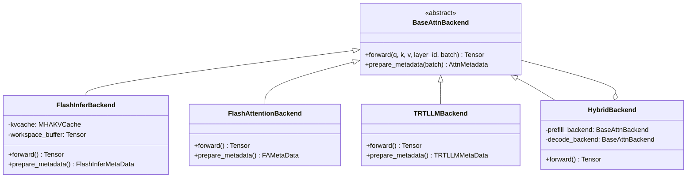
```mermaid
classDiagram
    class BaseAttnBackend {
        <<abstract>>
        +forward(q, k, v, layer_id, batch) Tensor
        +prepare_metadata(batch) AttnMetadata
    }

    class FlashInferBackend {
        -kvcache: MHAKVCache
        -workspace_buffer: Tensor
        +forward() Tensor
        +prepare_metadata() FlashInferMetaData
    }

    class FlashAttentionBackend {
        +forward() Tensor
        +prepare_metadata() FAMetaData
    }

    class TRTLLMBackend {
        +forward() Tensor
        +prepare_metadata() TRTLLMMetaData
    }

    class HybridBackend {
        -prefill_backend: BaseAttnBackend
        -decode_backend: BaseAttnBackend
        +forward() Tensor
    }

    BaseAttnBackend <|-- FlashInferBackend
    BaseAttnBackend <|-- FlashAttentionBackend
    BaseAttnBackend <|-- TRTLLMBackend
    BaseAttnBackend <|-- HybridBackend
    HybridBackend o-- BaseAttnBackend
```

### 8.2 FlashInfer 后端工作流

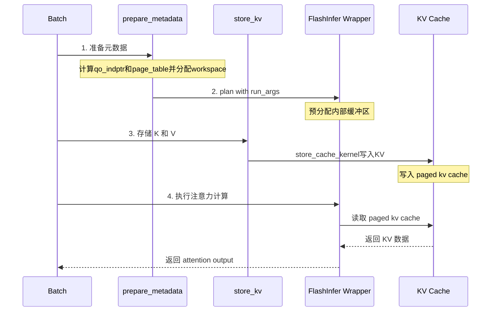
```mermaid
sequenceDiagram
    participant Batch as Batch
    participant Meta as prepare_metadata
    participant Store as store_kv
    participant Wrapper as FlashInfer Wrapper
    participant Cache as KV Cache
    Batch ->> Meta: 1. 准备元数据
    Note over Meta: 计算qo_indptr和page_table并分配workspace
    Meta ->> Wrapper: 2. plan with run_args
    Note over Wrapper: 预分配内部缓冲区
    Batch ->> Store: 3. 存储 K 和 V
    Store ->> Cache: store_cache_kernel写入KV
    Note over Cache: 写入 paged kv cache
    Batch ->> Wrapper: 4. 执行注意力计算
    Wrapper ->> Cache: 读取 paged kv cache
    Cache -->> Wrapper: 返回 KV 数据
    Wrapper -->> Batch: 返回 attention output
```

**AttentionLayer** 是注意力计算的入口，完成 QKV 拆分 → QK Norm → RoPE → Attention Backend 调用：

```18:57:python/minisgl/layers/attention.py
class AttentionLayer(StateLessOP):
    def forward(self, qkv: Tensor) -> Tensor:
        ctx = get_global_ctx()
        # 1. 拆分 QKV（已融合为单一投影）
        q, k, v = qkv.split([self.qo_attn_dim, self.kv_attn_dim, self.kv_attn_dim], dim=-1)
        # 2. 可选的 QK Norm（Qwen2 等模型需要）
        if self.q_norm is not None:
            self.q_norm.forward_inplace(q.view(-1, self.num_qo_heads, self.head_dim))
            self.k_norm.forward_inplace(k.view(-1, self.num_kv_heads, self.head_dim))
        # 3. 应用旋转位置编码 (RoPE)
        q, k = self.rotary.forward(ctx.batch.positions, q, k)
        # 4. 调用注意力后端（FlashInfer 等）计算 attention output
        q = q.view(-1, self.num_qo_heads, self.head_dim)
        o = ctx.attn_backend.forward(q, k, v, self.layer_id, ctx.batch)
        return o.view(-1, self.qo_attn_dim)
```

**FlashInferBackend.forward** —— store KV → run attention 的完整流程：

```176:188:python/minisgl/attention/fi.py
def forward(self, q, k, v, layer_id, batch) -> Tensor:
    def _flatten_cache(cache):  # 将 page_size 维度展平 (当前 page_size=1)
        return cache.view(-1, 1, cache.shape[2], cache.shape[3])

    metadata = batch.attn_metadata
    assert isinstance(metadata, FIMetadata)
    self._initialize_metadata_once(metadata)  # 懒初始化 plan（仅首次）
    self.kvcache.store_kv(k, v, batch.out_loc, layer_id)  # 写入 KV 到 paged cache
    kv_cache = (self.kvcache.k_cache(layer_id), self.kvcache.v_cache(layer_id))
    kv_cache = (_flatten_cache(kv_cache[0]), _flatten_cache(kv_cache[1]))
    return metadata.wrapper.run(q=q, paged_kv_cache=kv_cache)  # 执行注意力
```

**FIMetadata** 包含 FlashInfer 所需的全部元数据，在 `prepare_metadata` 中组装：

```47:78:python/minisgl/attention/fi.py
@dataclass
class FIMetadata(BaseAttnMetadata):
    cu_seqlens_q_cpu:   torch.Tensor  # query 累计序列长度 (CPU)
    cu_seqlens_k_cpu:   torch.Tensor  # key 累计序列长度 (CPU)
    cu_seqlens_q_gpu:   torch.Tensor  # query 累计序列长度 (GPU)
    indices:            torch.Tensor  # 页表索引 (GPU)
    last_page_len_cpu:  torch.Tensor  # 每请求最后一页长度 (CPU)
    num_qo_heads:       int
    num_kv_heads:       int
    head_dim:           int
    page_size:          Literal[1]  # 当前仅支持 page_size=1
    pos_encoding_mode:  str
    seq_lens_cpu:       torch.Tensor  # 各请求序列长度 (CPU)
    dtype:              torch.dtype
    wrapper:            BatchPrefillWithPagedKVCacheWrapper | BatchDecodeWithPagedKVCacheWrapper
    initialized:        bool = False       # 是否已完成 plan
```

**prepare_metadata** 是调度阶段的关键步骤，根据 batch 阶段选择不同的 cu_seqlens 计算策略：

```190:225:python/minisgl/attention/fi.py
def prepare_metadata(self, batch: Batch) -> None:
    reqs = batch.padded_reqs
    seqlens_q = [req.extend_len for req in reqs]   # query 序列长度
    seqlens_k = [req.device_len for req in reqs]    # key 序列总长度
    cached_lens = [req.cached_len for req in reqs]
    cu_seqlens_k_cpu = torch.tensor([0] + seqlens_k, **CPU_KWARGS).cumsum_(dim=0)

    if max_seqlen_q == 1:  # decode: 每个 request 只有一个 query token
        cu_seqlens_q_cpu = torch.arange(0, padded_size + 1, **CPU_KWARGS)
    elif all(l == 0 for l in cached_lens):  # prefill 无缓存命中
        cu_seqlens_q_cpu = cu_seqlens_k_cpu  # Q 和 K 长度相同
    else:  # partial cache hit prefill（Radix Cache 命中后的部分 prefill）
        cu_seqlens_q_cpu = torch.tensor([0] + seqlens_q, **CPU_KWARGS).cumsum_(dim=0)

    # 组装 FIMetadata，选择 prefill 或 decode wrapper
    batch.attn_metadata = FIMetadata(
        ..., wrapper=self.decode_wrappers if batch.is_decode else self.prefill_wrapper
    )
```

### 8.3 Paged Attention 数据布局

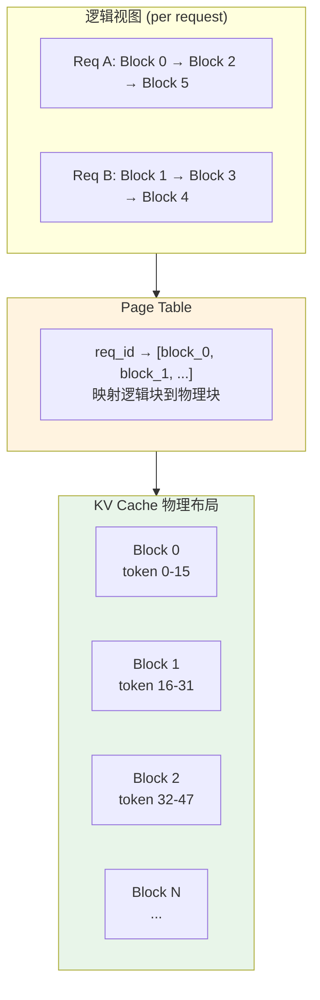
```mermaid
graph TB
    subgraph KV["KV Cache 物理布局"]
        direction LR
        BLOCK1["Block 0<br/>token 0-15"]
        BLOCK2["Block 1<br/>token 16-31"]
        BLOCK3["Block 2<br/>token 32-47"]
        BLOCKN["Block N<br/>..."]
    end

    subgraph Logical["逻辑视图 (per request)"]
        REQ1["Req A: Block 0 → Block 2 → Block 5"]
        REQ2["Req B: Block 1 → Block 3 → Block 4"]
    end

    subgraph PT["Page Table"]
        PT_TABLE["req_id → [block_0, block_1, ...]<br/>映射逻辑块到物理块"]
    end

    Logical --> PT
    PT --> KV
    style KV fill: #e8f5e9
    style PT fill: #fff3e0
```

**KV Cache 张量形状**：

```
kv_cache: (2, num_layers, num_pages, page_size, num_kv_heads, head_dim)
         │   │          │         │         │            │
         │   │          │         │         │            └── head_dim (128/64)
         │   │          │         │            └── KV head 数量
         │   │          │         └── page_size (默认 16)
         │   │          └── 总页数 (由显存决定)
         │   └── Transformer 层数
         └── K/V (2 个)
```

---

## 9. KV Cache 管理

KV Cache（键值缓存）是 LLM 推理系统的核心数据结构。自回归生成过程中，每个 token 的注意力计算需要访问之前所有 token 的 Key 和
Value，如果不缓存这些 KV 对，每次生成都要重新计算，复杂度将达到 $O(n^2)$。Mini-SGLang 实现了**分页式 KV Cache** + **Radix
前缀缓存**的完整方案。

### 9.1 架构概览

```mermaid
graph TB
    subgraph KVSystem["KV Cache 系统"]
        subgraph Pool["物理存储层 - MHAKVCache"]
            KBUF["K Buffer\n(2, L, P, S, H, D)"]
            VBUF["V Buffer"]
            STORE["store_kv → CUDA Kernel"]
        end

        subgraph Prefix["逻辑管理层 - RadixPrefixCache"]
            TREE["Radix Tree\n前缀匹配与复用"]
            MATCH["match_prefix"]
            INSERT["insert_prefix"]
            EVICT["evict 驱逐"]
        end

        subgraph Manager["调度层 - CacheManager"]
            ALLOC["allocate_paged 分配"]
            FREE["_free 释放"]
            LOCK["lock/unlock 引用计数"]
            PT["Page Table 页表"]
        end
    end

    Manager --> Pool
    Manager --> Prefix
    Pool -->|" CUDA Kernel 写入 "| KBUF
    Pool -->|" CUDA Kernel 写入 "| VBUF
    Prefix -->|" 匹配/插入/驱逐 "| TREE
    style KVSystem fill: #f8f9fa
    style Pool fill: #e3f2fd
    style Prefix fill: #fff3e0
    style Manager fill: #e8f5e9
```

Mini-SGLang 的 KV Cache 系统分为三层：

- **物理存储层** (`MHAKVCache`)：管理 GPU 显存中的实际 KV 数据
- **逻辑管理层** (`RadixPrefixCache`)：基于基数树实现前缀匹配和复用
- **调度层** (`CacheManager`)：协调页面分配、引用计数、前后缀缓存交互

### 9.2 物理存储层 — MHAKVCache

`MHAKVCache` 是分页式 KV Cache 的核心实现，负责在 GPU 显存中分配和管理 KV 缓冲区。

#### 9.2.1 存储布局

```python
# python/minisgl/kvcache/mha_pool.py
class MHAKVCache(BaseKVCachePool):
    def __init__(
            self,
            num_kv_heads: int,  # KV 头数 (GQA 时可能小于 Q 头数)
            num_layers: int,  # Transformer 层数
            head_dim: int,  # 每个头的维度 (通常 128)
            num_pages: int,  # 总页数
            page_size: int,  # 每页 token 数 (通常 16)
            dtype: torch.dtype,  # 数据类型 (fp16/bf16)
            device: torch.device,  # GPU 设备
    ) -> None:
        tp_info = get_tp_info()
        local_kv_heads = div_even(num_kv_heads, tp_info.size, allow_replicate=True)
        self._kv_buffer = torch.empty(
            (2, num_layers, num_pages, page_size, local_kv_heads, head_dim),
            device=device,
            dtype=dtype,
        )
```

关键设计点：

- **维度 `(2, L, P, S, H, D)`**：`2` 表示 K/V 两个缓冲区；`L` 是层数；`P` 是页数；`S` 是每页大小；`H` 是本地 KV 头数（考虑 TP
  切分）；`D` 是头维度
- **TP 感知**：通过 `div_even` 将 KV 头均匀分配到各 GPU，当 `num_kv_heads < tp_size` 时允许复制（`allow_replicate=True`）
- **连续内存**：使用单个 `torch.empty` 分配所有层的 KV 缓存，保证内存连续性

#### 9.2.2 KV 写入操作

```python
# python/minisgl/kvcache/mha_pool.py
def store_kv(
        self, k: torch.Tensor, v: torch.Tensor,
        out_loc: torch.Tensor, layer_id: int
) -> None:
    from minisgl.kernel import store_cache

    store_cache(
        k_cache=self._k_buffer[layer_id].view(self._storage_shape),
        v_cache=self._v_buffer[layer_id].view(self._storage_shape),
        indices=out_loc,
        k=k,
        v=v,
    )
```

`store_kv` 是每层 Transformer 调用的核心接口。它接收当前层计算出的 K、V 张量以及目标位置 `out_loc`（来自页表），调用 CUDA
kernel 将 KV 值写入预分配的缓冲区。`out_loc` 是一个索引张量，每个元素对应一个 token 在 KV buffer 中的物理位置。

#### 9.2.3 抽象基类接口

```python
# python/minisgl/kvcache/base.py
class BaseKVCachePool(ABC):
    """KV Cache 存储池抽象基类"""

    @abstractmethod
    def k_cache(self, index: int) -> torch.Tensor:
        """获取第 index 层的 K 缓冲区"""

    @abstractmethod
    def v_cache(self, index: int) -> torch.Tensor:
        """获取第 index 层的 V 缓冲区"""

    @abstractmethod
    def store_kv(
            self, k: torch.Tensor, v: torch.Tensor,
            out_loc: torch.Tensor, layer_id: int
    ) -> None:
        """将 KV 写入指定位置"""
```

基类定义了统一的接口契约，使得注意力后端可以不关心底层存储实现细节。

### 9.3 逻辑管理层 — RadixPrefixCache

RadixPrefixCache 基于**基数树（Radix Tree）**数据结构实现前缀缓存。其核心思想是：多个请求如果共享相同的前缀（如 system
prompt），可以复用已计算的 KV Cache，避免重复计算。

#### 9.3.1 树节点结构

```python
# python/minisgl/kvcache/radix_cache.py
class RadixTreeNode:
    counter: int = 0  # 全局节点计数器

    def __init__(self, key_fn: KEY_FN, tic: int | None = None) -> None:
        self.key_fn = key_fn  # 键提取函数
        self.children: Dict[Any, RadixTreeNode] = {}  # 子节点字典
        self._parent: RadixTreeNode | None = None  # 父节点
        self.ref_count: int = 0  # 引用计数 (0=可驱逐)
        self.uuid = RadixTreeNode.counter
        RadixTreeNode.counter += 1
        self.timestamp = tic or time.monotonic_ns()  # 用于 LRU 驱逐排序

        # 后续设置的字段
        self._key: torch.Tensor  # 该节点对应的 token IDs
        self._value: torch.Tensor  # 该节点对应的物理页索引
        self._length: int  # key/value 的长度
```

每个树节点代表一段连续的 token 序列及其对应的物理页索引。关键属性：

- **`ref_count`**：引用计数，> 0 表示有活跃请求在使用该节点（受保护，不可驱逐）；= 0 表示可被驱逐
- **`timestamp`**：最后访问时间戳，用于 LRU 驱逐策略——优先驱逐最久未访问的叶子节点
- **`key_fn`**：键提取函数，根据 `page_size` 决定是用单个 token 还是 token 元组作为字典键

#### 9.3.2 核心操作：分裂

```python
# python/minisgl/kvcache/radix_cache.py
def split_at(self, pos: int) -> RadixTreeNode:
    """在位置 pos 处分裂节点，返回新的父节点"""
    assert 0 < pos < self.length
    parent = self.parent

    new_node = RadixTreeNode(self.key_fn, self.timestamp)
    new_node.set_key_value(self._key[:pos], self._value[:pos])
    new_node.set_parent(parent)
    new_node.ref_count = self.ref_count

    self.set_key_value(self._key[pos:], self._value[pos:])
    self.set_parent(new_node)

    return new_node
```

`split_at` 是 Radix Tree 的核心操作之一。当新请求的前缀与现有节点**部分匹配**时（即匹配长度小于节点长度），需要在匹配边界处分裂节点。例如：

```
原始节点: [A, B, C, D] → pages [0, 1, 2, 3]
新输入:   [A, B, X, Y]
匹配长度: 2

分裂后:
  父节点: [A, B] → pages [0, 1]  (共享前缀)
    ├── 原子节点(子): [C, D] → pages [2, 3]
    └── 新节点(子):   [X, Y] → pages [4, 5]  (待分配)
```

#### 9.3.3 核心操作：树遍历匹配

```python
# python/minisgl/kvcache/radix_cache.py
def _tree_walk(self, input_ids: torch.Tensor) -> Tuple[RadixTreeNode, int]:
    prefix_len = 0
    indice_len = len(input_ids)
    node = self.root_node
    tic = time.monotonic_ns()

    while prefix_len < indice_len:
        # 用 key_fn 提取键，查找子节点
        child_node = node.children.get(self.key_fn(input_ids[prefix_len:]))
        if child_node is None:
            return node, prefix_len  # 无匹配子节点，停止
        node = child_node

        # 使用 CUDA kernel 快速比较，找到第一个不匹配的位置
        match_len = node.get_match_len(input_ids[prefix_len:])
        match_len = align_down(match_len, self.page_size)  # 按 page_size 向下对齐
        prefix_len += match_len

        # 部分匹配时需要分裂节点
        if match_len != node.length:
            node = node.split_at(match_len)
            node.timestamp = tic
            return node, prefix_len

        # 完全匹配，更新访问时间戳 (LRU)
        node.timestamp = tic

    return node, prefix_len
```

`_tree_walk` 实现了前缀匹配的核心算法：

1. 从根节点开始，用 `key_fn` 提取键查找子节点
2. 对每个候选子节点调用 `get_match_len`（底层是 CUDA kernel `fast_compare_key`）进行快速比较
3. 匹配长度按 `page_size` 向下对齐——因为 KV cache 以页为单位管理
4. **部分匹配**时触发 `split_at` 分裂；**完全匹配**时更新 LRU 时间戳

#### 9.3.4 前缀匹配与插入

```python
# python/minisgl/kvcache/radix_cache.py
def match_prefix(self, input_ids: torch.Tensor) -> MatchResult:
    """匹配前缀，返回匹配结果（不修改树结构）"""
    node, prefix_len = self._tree_walk(input_ids)
    return MatchResult(RadixCacheHandle(prefix_len, node))


def insert_prefix(
        self, input_ids: torch.Tensor, indices: torch.Tensor
) -> InsertResult:
    """插入新前缀到树中（会修改树结构）"""
    insert_len = align_down(len(input_ids), self.page_size)
    input_ids, indices = input_ids[:insert_len], indices[:insert_len]
    node, prefix_len = self._tree_walk(input_ids)
    if prefix_len != insert_len:  # 有未命中部分需要插入
        new_node = RadixTreeNode(self.key_fn)
        new_node.set_key_value(
            input_ids[prefix_len:], indices[prefix_len:].clone()
        )
        new_node.set_parent(node)
        self.evictable_size += new_node.length
        node = new_node
    return InsertResult(prefix_len, RadixCacheHandle(insert_len, node))
```

- **`match_prefix`**：只读操作，查找最长公共前缀，返回 `MatchResult` 包含匹配长度和对应的树节点句柄
- **`insert_prefix`**：写操作，在匹配位置之后插入新的 token 序列和对应页索引。注意只插入 `page_size` 对齐长度的前缀

#### 9.3.5 引用计数与锁机制

```python
# python/minisgl/kvcache/radix_cache.py
def lock_handle(
        self, handle: BaseCacheHandle, unlock: bool = False
) -> None:
    assert isinstance(handle, RadixCacheHandle)
    node = handle.node
    if unlock:  # 解锁：减少引用计数
        while not node.is_root():
            node.ref_count -= 1
            if node.ref_count == 0:
                self.evictable_size += node.length
                self.protected_size -= node.length
            node = node.parent
    else:  # 锁定：增加引用计数
        while not node.is_root():
            if node.ref_count == 0:
                self.evictable_size -= node.length
                self.protected_size += node.length
            node.ref_count += 1
            node = node.parent
```

引用计数沿着从叶节点到根节点的路径传播。锁定（`unlock=False`）时增加 ref_count，使路径上的所有节点变为「受保护」状态；解锁时减少
ref_count，ref_count 归零的节点变为「可驱逐」状态。这确保了活跃请求使用的 KV Cache 不会被误驱逐。

#### 9.3.6 LRU 驱逐策略

```python
# python/minisgl/kvcache/radix_cache.py
def evict(self, size: int) -> torch.Tensor:
    """驱逐至少 size 个 token 的缓存，返回被释放的页索引"""
    if size == 0:
        return self.empty_tensor
    assert size <= self.evictable_size

    # 收集所有可驱逐的叶子节点
    leave_nodes = self._collect_leave_nodes_for_evict()
    heapq.heapify(leave_nodes)  # 最小堆，按 timestamp 排序 (LRU)
    evicted_indices: List[torch.Tensor] = []
    evicted_size = 0

    while evicted_size < size:
        node = heapq.heappop(leave_nodes)  # 弹出最久未访问的
        assert node.ref_count == 0 and node.is_leaf() and not node.is_root()
        evicted_size += node.length
        evicted_indices.append(node.value)
        self.evictable_size -= node.length
        parent = node.parent
        del parent.children[self.key_fn(node._key)]  # 从父节点移除
        # 如果父节点也变成可驱逐的叶子，加入堆
        if parent.is_leaf() and parent.ref_count == 0:
            heapq.heappush(leave_nodes, parent)

    return torch.cat(evicted_indices)
```

驱逐策略采用 **LRU + 叶子优先**：

1. 只收集 `ref_count == 0` 且为叶子的节点（非叶子节点有子节点依赖，不能直接删）
2. 用最小堆按 `timestamp` 排序，优先驱逐最久未访问的
3. 驱逐后检查父节点是否变为可驱逐叶子，如果是则递归加入候选
4. 返回被释放的物理页索引供 CacheManager 回收

#### 9.3.7 缓存句柄

```python
# python/minisgl/kvcache/radix_cache.py
@dataclass(frozen=True)
class RadixCacheHandle(BaseCacheHandle):
    node: RadixTreeNode

    def get_matched_indices(self) -> torch.Tensor:
        """从根到当前节点收集所有页索引"""
        node = self.node
        value_list: List[torch.Tensor] = []
        while not node.is_root():
            value_list.append(node.value)
            node = node.parent
        value_list.reverse()  # 从根到叶的顺序
        return torch.cat(value_list)
```

`RadixCacheHandle` 是不可变的数据类（`frozen=True`），持有指向 Radix Tree 中某个节点的引用。`get_matched_indices`
沿着父指针回溯到根，收集完整路径上的所有页索引——这就是该请求可以复用的全部 KV Cache 物理位置。

### 9.4 调度层 — CacheManager

`CacheManager` 是连接物理存储和逻辑管理的桥梁，负责页面分配、请求缓存、完整性校验等。

#### 9.4.1 初始化

```python
# python/minisgl/scheduler/cache.py
class CacheManager:
    def __init__(
            self, num_pages: int, page_size: int,
            page_table: torch.Tensor, type: str
    ):
        device = page_table.device
        # 空闲槽位列表，按 page_size 对齐
        # 例如 page_size=2 时: [0, 2, 4, 6, ...]
        self.free_slots = torch.arange(
            num_pages, dtype=torch.int32, device=device
        ) * page_size
        self.prefix_cache = create_prefix_cache(device=device, type=type)
        self.device = device
        self.num_pages = num_pages
        self.page_table = page_table  # [num_reqs, max_seq_len] 页表
        self.page_size = page_size
```

初始化时创建空闲页槽位列表（按 `page_size` 对齐的 token 级索引）和前缀缓存实例。`page_table` 是一个二维张量，
`page_table[req_idx, token_pos]` 存储该请求该位置的物理页索引。

#### 9.4.2 页面分配

```python
# python/minisgl/scheduler/cache.py
def allocate_paged(self, reqs: List[Req]) -> None:
    needed_pages = 0
    allocation_info: List[Tuple[int, int, int]] = []
    for req in reqs:
        first_page = div_ceil(req.cached_len, self.page_size)
        last_page = div_ceil(req.device_len, self.page_size)
        if last_page > first_page:
            needed_pages += last_page - first_page
            allocation_info.append((req.table_idx, first_page, last_page))
    if needed_pages > 0:
        allocated = self._page_to_token(self._allocate(needed_pages))
        _write_page_table(self.page_table, allocated, allocation_info, self.page_size)
```

分配策略：只为每个请求的**非缓存部分**（`cached_len` 到 `device_len`）分配新页面。已命中的前缀部分不需要重新分配。

#### 9.4.3 内部分配与驱逐

```python
# python/minisgl/scheduler/cache.py
def _allocate(self, needed_pages: int) -> torch.Tensor:
    if needed_pages > (free_pages := len(self.free_slots)):
        # 空闲页不足，触发前缀缓存驱逐
        evicted = self.prefix_cache.evict(
            (needed_pages - free_pages) * self.page_size
        )
        self.free_slots = torch.cat([self.free_slots, evicted[:: self.page_size]])
        assert len(self.free_slots) >= needed_pages
    allocated = self.free_slots[:needed_pages]
    self.free_slots = self.free_slots[needed_pages:]
    return allocated
```

当空闲页不足时，自动调用 `prefix_cache.evict()` 从 Radix Cache 中驱逐 LRU 页面来回收空间。这是 PagedAttention 和 Radix
Cache 协同工作的关键机制。

#### 9.4.4 请求缓存流程

```python
# python/minisgl/scheduler/cache.py
def cache_req(self, req: Req, *, finished: bool) -> None:
    """
    缓存区域说明:
    [0, req.cached_len)                       注意力 kernel 可读写的有效区域
    [0, old_handle.cached_len)                prefill 时已在缓存中的部分
    [old_handle.cached_len, req.cached_len)  本次为新请求分配的新页面
    ---
    [old_handle.cached_len, cached_len)      prefill 时不在缓存但后来被其他请求缓存的，需释放防泄漏
    [cached_len, new_handle.cached_len)      新插入到前缀缓存的部分
    [new_handle.cached_len, req.cached_len)  无法插入缓存的尾部，请求完成时应释放
    """
    insert_ids = req.input_ids[: req.cached_len]
    page_indices = self.page_table[req.table_idx, : req.cached_len]
    old_handle = req.cache_handle
    cached_len, new_handle = self.prefix_cache.insert_prefix(insert_ids, page_indices)
    self.unlock(old_handle)  # 先解锁旧句柄
    # 释放已被其他请求缓存的部分（防止内存泄漏）
    self._free(page_indices[old_handle.cached_len: cached_len])
    if finished:  # 请求完成，释放尾部
        self._free(page_indices[new_handle.cached_len:])
    else:  # 请求继续，更新句柄并重新锁定
        req.cache_handle = new_handle
        self.lock(new_handle)
```

这是整个 KV Cache 管理中最复杂的操作之一。代码注释详细说明了各区域的语义：

1. 将请求当前的 token 序列和页索引插入 Radix Tree
2. 解锁旧句柄（允许旧节点被驱逐）
3. 释放已被其他请求间接缓存的部分（避免内存泄漏）
4. 请求完成时释放无法对齐到页边界的尾部；否则保留新句柄供后续 decode 使用

#### 9.4.5 惰性释放

```python
# python/minisgl/scheduler/cache.py
@contextmanager
def lazy_free_region(self):
    """惰性释放上下文管理器，批量回收页面"""

    def lazy_free(indices: torch.Tensor) -> None:
        lazy_free_list.append(indices[:: self.page_size])

    lazy_free_list: List[torch.Tensor] = []
    try:
        self._free = lazy_free  # 临时替换 _free 方法
        yield
    finally:
        del self._free  # 恢复原始方法
        # 一次性合并所有待释放的页
        self.free_slots = torch.cat([self.free_slots] + lazy_free_list)
```

`lazy_free_region` 是一个精巧的设计：在上下文内，`_free` 操作不会立即修改 `free_slots`，而是收集到一个列表中。退出上下文时一次性
`torch.cat` 合并。这避免了频繁的小张量拼接操作，提高了效率。

#### 9.4.6 页表写入

```python
# python/minisgl/scheduler/cache.py
def _write_page_table(
        page_table: torch.Tensor,
        allocated: torch.Tensor,
        allocation_info: List[Tuple[int, int, int]],
        page_size: int,
) -> None:
    needed_tokens = len(allocated)
    # 使用 pinned memory 加速 CPU→GPU 传输
    table_idx_host = torch.empty(needed_tokens, dtype=torch.int64, pin_memory=True)
    positions_host = torch.empty(needed_tokens, dtype=torch.int64, pin_memory=True)
    offset = 0
    for table_idx, first_page, last_page in allocation_info:
        first_pos, last_pos = first_page * page_size, last_page * page_size
        length = last_pos - first_pos
        table_idx_host[offset: offset + length].fill_(table_idx)
        torch.arange(first_pos, last_pos, out=positions_host[offset: offset + length])
        offset += length
    # 异步传输到 GPU 并写入页表
    table_idxs = table_idx_host.to(page_table.device, non_blocking=True)
    offsets = positions_host.to(page_table.device, non_blocking=True)
    page_table[table_idxs, offsets] = allocated
```

页表写入使用了 **pinned memory** + **non_blocking transfer** 优化：先在 pinned memory（页锁定内存）上准备数据，然后异步传输到
GPU，避免阻塞。

### 9.5 完整生命周期图

```mermaid
sequenceDiagram
    participant Req as 新请求
    participant CM as CacheManager
    participant RPC as RadixPrefixCache
    participant Pool as MHAKVCache
    Req ->> CM: match_req(input_ids)
    CM ->> RPC: match_prefix(input_ids)
    RPC -->> CM: MatchResult(handle, cached_len)
    CM -->> Req: 返回匹配结果
    Note over Req, Pool: Prefill 阶段
    Req ->> CM: allocate_paged(reqs)
    CM ->> CM: _allocate(needed_pages)
    alt 空闲页不足
        CM ->> RPC: evict(size)
        RPC -->> CM: evicted_indices
    end
    CM ->> CM: _write_page_table(...)
    Note over Req, Pool: 模型前向 (每层)
    Req ->> Pool: store_kv(k, v, out_loc, layer_id)
    Pool ->> Pool: CUDA Kernel 写入 KV Buffer
    Note over Req, Pool: Decode 完成 / 迭代结束
    Req ->> CM: cache_req(req, finished=False/True)
    CM ->> RPC: insert_prefix(ids, indices)
    RPC -->> CM: InsertResult(cached_len, new_handle)
    CM ->> CM: unlock(old_handle) + _free(leaked)
    alt 请求未完成
        CM ->> RPC: lock(new_handle)
    end
```

### 9.6 关键设计总结

| 设计决策                | 说明                      |
|---------------------|-------------------------|
| **分页式存储**           | 固定大小页面，灵活分配，避免碎片化       |
| **Radix Tree 前缀匹配** | $O(L)$ 复杂度的前缀查找（L 为树深度） |
| **引用计数保护**          | 活跃请求的缓存不会被驱逐            |
| **LRU 驱逐**          | 优先驱逐最久未访问的叶子节点          |
| **惰性释放**            | 批量回收页面，减少 GPU 内存操作      |
| **Pinned Memory**   | 页表写入使用零拷贝传输             |
| **Page-aligned**    | 所有操作按 page_size 对齐，简化管理 |

---

## 10. MoE 支持

混合专家模型（Mixture of Experts, MoE）通过将不同的 token 路由到不同的「专家」子网络来扩展模型容量，而无需成倍增加计算量。Mini-SGLang
完整支持 MoE 推理，包括路由、Token 对齐、融合 kernel 计算和 TP 通信。

### 10.1 整体架构

```mermaid
graph TB
    subgraph MoESystem["MoE 推理系统"]
        subgraph Layer["MoELayer (layers/moe.py)"]
            INIT["初始化: gate_up_proj + down_proj\nTP 切分权重"]
            FWD["forward: 路由 → Expert → AllReduce"]
        end

        subgraph Backend["FusedMoe (moe/fused.py)"]
            TOPK["fused_topk: TopK + Softmax"]
            IMPL["fused_experts_impl:\nAlign → W1 → Act → W2 → Reduce"]
        end

        subgraph Kernels["Triton Kernels"]
            ALIGN_K["moe_align_block_size"]
            MATMUL1["fused_moe_kernel_triton Stage 1"]
            ACT_K["silu_and_mul / gelu_and_mul"]
            MATMUL2["fused_moe_kernel_triton Stage 2"]
            REDUCE_K["moe_sum_reduce_triton"]
        end
    end

    Layer --> Backend
    Backend --> Kernels
    INIT --> FWD
    FWD --> TOPK
    TOPK --> IMPL
    IMPL --> ALIGN_K
    ALIGN_K --> MATMUL1
    MATMUL1 --> ACT_K
    ACT_K --> MATMUL2
    MATMUL2 --> REDUCE_K
    style MoESystem fill: #faf5ff
    style Layer fill: #ede9fe
    style Backend fill: #ddd6fe
    style Kernels fill: #c4b5fd
```

### 10.2 MoELayer — 层级接口

`MoELayer` 是模型中使用的 MoE 层封装，负责权重管理、TP 协调和后端调用。

#### 10.2.1 初始化与权重布局

```python
# python/minisgl/layers/moe.py
class MoELayer(BaseOP):
    def __init__(
            self,
            num_experts: int,  # 专家数量 (如 64 for Qwen3-MoE)
            top_k: int,  # 每个 token 激活的专家数 (通常 2-8)
            hidden_size: int,  # 隐藏层维度
            intermediate_size: int,  # 中间层维度 (FFN 维度)
            renormalize: bool = True,  # 是否对路由权重重新归一化
            activation: str = "silu",  # 激活函数类型
            apply_router_weight_on_input: bool = False,
    ):
        super().__init__()

        self.num_experts = num_experts
        self.top_k = top_k
        self.hidden_size = hidden_size
        self.intermediate_size = intermediate_size
        self._comm = DistributedCommunicator()

        tp_info = get_tp_info()
        self.tp_size = tp_size = tp_info.size
        # TP 切分：将中间维度均匀分配到各 GPU
        intermediate_size_per_partition = div_even(intermediate_size, tp_size)
        # gate_up_proj 形状: [num_experts, 2 * inter_size_per_part, hidden_size]
        # 将 gate 投影和 up 投影合并为一个权重矩阵（融合优化）
        self.gate_up_proj = torch.empty(
            num_experts,
            2 * intermediate_size_per_partition,
            hidden_size,
        )
        # down_proj 形状: [num_experts, hidden_size, inter_size_per_part]
        self.down_proj = torch.empty(
            num_experts,
            hidden_size,
            intermediate_size_per_partition,
        )
```

关键设计点：

- **权重融合**：`gate_up_proj` 将 gate 投影和 up 投影合并为单一张量 `[E, 2N, H]`，减少内存访问次数
- **TP 切分**：中间维度 `N` 按 TP rank 数切分，每个 GPU 持有 `N / tp_size`
- **专家并行**：所有专家的权重在同一个张量中，通过 `expert_ids` 索引区分

#### 10.2.2 前向传播

```python
# python/minisgl/layers/moe.py
def forward(
        self, hidden_states: torch.Tensor, router_logits: torch.Tensor
) -> torch.Tensor:
    ctx = get_global_ctx()
    # 委托给 moe_backend (FusedMoe) 执行核心计算
    final_hidden_states = ctx.moe_backend.forward(
        hidden_states=hidden_states,
        w1=self.gate_up_proj,  # [E, 2N, H]
        w2=self.down_proj,  # [E, H, N]
        gating_output=router_logits,  # [seq_len, E] 路由 logits
        topk=self.top_k,
        renormalize=self.renormalize,
        activation=self.activation,
        apply_router_weight_on_input=self.apply_router_weight_on_input,
    )
    # TP 模式下需要 AllReduce 汇总各 rank 的部分结果
    if self.tp_size > 1:
        final_hidden_states = self._comm.all_reduce(final_hidden_states)
    return final_hidden_states
```

前向传播流程清晰：

1. 将输入和路由 logits 传给后端 (`FusedMoe`) 进行 fused 计算
2. 如果处于 TP 模式（多 GPU），执行 `all_reduce` 合并各 rank 的部分结果——因为中间维度被切分了，每个 rank 只计算了部分结果

### 10.3 FusedMoe — 融合后端实现

`FusedMoe` 是 MoE 计算的核心后端，封装了完整的 **Router → Align → MatMul → Activate → Reduce** 流程。

#### 10.3.1 Router: TopK + Softmax

```python
# python/minisgl/moe/fused.py
def fused_topk(
        hidden_states: torch.Tensor,  # [M, H] 输入隐藏状态
        gating_output: torch.Tensor,  # [M, E] 路由 logits
        topk: int,  # 选出的专家数
        renormalize: bool,  # 是否重新归一化
        num_token_non_padded: torch.Tensor | None = None,
) -> Tuple[torch.Tensor, torch.Tensor]:
    from sgl_kernel import topk_softmax

    M, _ = hidden_states.shape
    # 预分配输出缓冲区
    topk_weights = torch.empty(M, topk, dtype=torch.float32, device=hidden_states.device)
    topk_ids = torch.empty(M, topk, dtype=torch.int32, device=hidden_states.device)
    # 调用 fused CUDA kernel 同时完成 TopK 和 Softmax
    topk_softmax(topk_weights, topk_ids, gating_output.float(), renormalize)
    if renormalize:
        # 可选的二次归一化，确保权重和为 1
        topk_weights = topk_weights / (
                topk_weights.sum(dim=-1, keepdim=True) + 1e-8
        )
    if num_token_non_padded is not None:
        # 将 padding token 的 expert id 设为 -1（无效标记）
        indices = torch.arange(0, topk_ids.shape[0], device=topk_ids.device)
        topk_ids[indices >= num_token_non_padded, :] = -1
    return topk_weights, topk_ids
```

`fused_topk` 使用 `sgl_kernel` 的 `topk_softmax` fused kernel，一次调用同时完成：

1. 对每个 token 的路由 logits 取 Top-K
2. 对选出的 K 个 logits 做 Softmax 归一化
3. 返回权重 `topk_weights[M, K]` 和专家 ID `topk_ids[M, K]`

#### 10.3.2 Token 对齐：Block Size Alignment

```python
# python/minisgl/moe/fused.py
def moe_align_block_size(
        topk_ids: torch.Tensor,  # [total_tokens, top_k]
        block_size: int,  # Triton kernel 的 block size
        num_experts: int,
) -> Tuple[torch.Tensor, torch.Tensor, torch.Tensor]:
    """
    将 token 按 expert 分组并按 block_size 对齐填充。

    示例:
    topk_ids = [[2,3], [1,2], [1,3], [1,2]], block_size=4, num_experts=4
    → 展平: [2,3,1,2,1,3,1,2] (8 tokens, 4 experts 各 2 个)
    → padding 后每个 expert 补到 4 的倍数: 各补 2 → 总共 16
    → 按 expert 排序后的 token_ids: [2,5,7,pad, 1,3,6,pad, 0,4,pad,pad, ...]
    """
    from sgl_kernel import moe_align_block_size as sgl_moe_align_block_size

    max_num_tokens_padded = (
            topk_ids.numel() + (num_experts + 1) * (block_size - 1)
    )
    sorted_ids = torch.empty(
        (max_num_tokens_padded,), dtype=torch.int32, device=topk_ids.device
    )
    max_num_m_blocks = div_ceil(max_num_tokens_padded, block_size)
    expert_ids = torch.empty(
        (max_num_m_blocks,), dtype=torch.int32, device=topk_ids.device
    )
    num_tokens_post_pad = torch.empty((1), dtype=torch.int32, device=topk_ids.device)
    cumsum_buffer = torch.empty(
        (num_experts + 2,), dtype=torch.int32, device=topk_ids.device
    )
    sgl_moe_align_block_size(
        topk_ids, num_experts + 1, block_size,
        sorted_ids, expert_ids, num_tokens_post_pad, cumsum_buffer, True,
    )
    return sorted_ids, expert_ids, num_tokens_post_pad
```

这是 MoE 性能的关键优化。Triton kernel 以 `block_size`（如 64）为单位处理 token，因此需要：

1. 将属于同一 expert 的 token 在物理上连续排列（`sorted_ids` 给出排列后的顺序）
2. 每个 expert 的 token 数向上取整到 `block_size` 的倍数（padding 无效 token）
3. 返回 `expert_ids` 标识每个 block 属于哪个 expert

返回值说明：

- **`sorted_ids`**：重排后的 token 索引数组，使得同一 expert 的 token 连续存放
- **`expert_ids`**：每个 block 对应的 expert ID
- **`num_tokens_post_pad`**：padding 后的总 token 数

#### 10.3.3 核心：Fused Expert 实现

```python
# python/minisgl/moe/fused.py
def fused_experts_impl(
        hidden_states: torch.Tensor,  # [M, H] 输入
        w1: torch.Tensor,  # [E, 2N, H] 第一层权重 (gate+up 融合)
        w2: torch.Tensor,  # [E, H, N] 第二层权重 (down)
        topk_weights: torch.Tensor,  # [M, K] 路由权重
        topk_ids: torch.Tensor,  # [M, K] 专家 ID
        activation: str = "silu",
        apply_router_weight_on_input: bool = False,
) -> torch.Tensor:
    from minisgl.kernel import fused_moe_kernel_triton, moe_sum_reduce_triton
    from minisgl.layers import gelu_and_mul, silu_and_mul

    num_tokens, _ = hidden_states.shape
    E, N, _ = w1.shape  # E=专家数, N=中间维度(每半)
    M = num_tokens
    K = topk_ids.shape[1]  # top-k 值

    # 根据输入形状选择最优 Triton kernel 配置
    config = try_get_optimal_moe_config(w1.shape, w2.shape, topk_ids.shape[1], M)

    # 分配中间缓冲区
    cache = torch.empty(
        M * K * max(N, w2.shape[1]),
        device=hidden_states.device, dtype=hidden_states.dtype,
    )
    intermediate_cache1 = cache[: M * K * N].view((M, K, N))  # W1 输出
    intermediate_cache2 = torch.empty(
        (M * K, N // 2), device=hidden_states.device, dtype=hidden_states.dtype,
    )  # 激活函数输出 (SwiGLU: N → N/2)
    intermediate_cache3 = cache[: M * K * w2.shape[1]].view(
        (M, K, w2.shape[1])
    )  # W2 输出

    # === Step 1: Token 对齐 ===
    sorted_token_ids, expert_ids, num_tokens_post_padded = moe_align_block_size(
        topk_ids, config["BLOCK_SIZE_M"], E
    )

    # === Step 2: Stage 1 MatMul — hidden × W1 (gate+up) ===
    fused_moe_kernel_triton(
        curr_hidden_states, w1, intermediate_cache1,
        curr_topk_weights, curr_topk_ids,
        sorted_token_ids, expert_ids, num_tokens_post_padded,
        apply_router_weight_on_input, topk_ids.shape[1], config,
    )

    # === Step 3: 激活函数 (SiLU/GELU) + element-wise mul (SwiGLU) ===
    FN_MAP = {"silu": silu_and_mul, "gelu": gelu_and_mul}
    FN_MAP[activation](
        intermediate_cache1.view(-1, N), intermediate_cache2
    )

    # === Step 4: Stage 2 MatMul — act × W2 (down) ===
    fused_moe_kernel_triton(
        intermediate_cache2, w2, intermediate_cache3,
        curr_topk_weights, curr_topk_ids,
        sorted_token_ids, expert_ids, num_tokens_post_padded,
        not apply_router_weight_on_input, 1, config,
    )

    # === Step 5: 加权求和归约 (多个 expert 结果合并) ===
    moe_sum_reduce_triton(intermediate_cache3, out_hidden_states)
    return out_hidden_states
```

完整的数据流如下：

```
hidden_states [M, H]
    │
    ▼ moe_align_block_size
sorted_token_ids (按 expert 重排的索引)
    │
    ▼ fused_moe_kernel_triton (Stage 1)
intermediate_cache1 [M, K, N]  ← hidden @ W1^T, 乘以路由权重
    │
    ▼ silu_and_mul / gelu_and_mul (SwiGLU)
intermediate_cache2 [M*K, N/2]  ← SiLU(x) * x (门控激活)
    │
    ▼ fused_moe_kernel_triton (Stage 2)
intermediate_cache3 [M, K, H]  ← act @ W2^T, 乘以路由权重
    │
    ▼ moe_sum_reduce_triton
out_hidden_states [M, H]  ← 对 K 个 expert 结果求和
```

#### 10.3.4 FusedMoe 类封装

```python
# python/minisgl/moe/fused.py
class FusedMoe(BaseMoeBackend):
    def forward(
            self,
            hidden_states: torch.Tensor,
            w1: torch.Tensor,
            w2: torch.Tensor,
            gating_output: torch.Tensor,
            topk: int,
            renormalize: bool,
            activation: str = "silu",
            apply_router_weight_on_input: bool = False,
    ) -> torch.Tensor:
        # Phase 1: 路由决策
        topk_weights, topk_ids = fused_topk(
            hidden_states=hidden_states,
            gating_output=gating_output,
            topk=topk,
            renormalize=renormalize,
        )
        # Phase 2: Expert 计算
        return fused_experts_impl(
            hidden_states, w1, w2,
            topk_weights, topk_ids,
            activation,
            apply_router_weight_on_input=apply_router_weight_on_input,
        )
```

`FusedMoe` 将整个 MoE 计算分为两个清晰的阶段：**路由决策**（哪些 token 去哪些 expert）和 **Expert 计算**
（实际的矩阵乘法）。这种分离使得可以独立优化每个阶段。

### 10.4 Triton Kernel 配置调优

```python
# python/minisgl/moe/fused.py
def get_default_config(M, E, N, K, topk):
    """根据输入形状选择最优的 Triton kernel tile 大小"""
    config = {
        "BLOCK_SIZE_M": 64,  # M 维度的 tile 大小
        "BLOCK_SIZE_N": 64,  # N 维度的 tile 大小
        "BLOCK_SIZE_K": 32,  # K 维度的 tile 大小
        "GROUP_SIZE_M": 8,  # 每个 program group 处理的 M 行数
    }
    if M <= E:  # token 数少于等于专家数时使用更小的配置
        config = {
            "BLOCK_SIZE_M": 16,
            "BLOCK_SIZE_N": 32,
            "BLOCK_SIZE_K": 64,
            "GROUP_SIZE_M": 1,
        }
    return config
```

Triton kernel 的性能高度依赖 tile size 配置。Mini-SGLang 根据输入形状动态选择配置：当 token 数较少时（如 decode 阶段），使用更小的
`BLOCK_SIZE_M` 避免 resource waste；当 token 数较多时（如 prefill 阶段），使用更大的 tile 提高 parallelism。

### 10.5 完整数据流图

```mermaid
flowchart TD
    INPUT["hidden_states: [M, H]\nrouter_logits: [M, E]"]
    INPUT --> TOPK["fused_topk\ntopk_softmax CUDA kernel"]
    TOPK -->|" topk_weights [M,K]\ntop_ids [M,K] "| ALIGN
    ALIGN["moe_align_block_size\nCUDA kernel"]
    ALIGN -->|" sorted_ids\nexpert_ids\npadded_len "| S1
    S1["Stage 1: fused_moe_kernel_triton\nhidden @ W1^T × weight"]
    S1 -->|" cache1 [M, K, N] "| ACT
    ACT["silu_and_mul / gelu_and_mul\nSwiGLU 门控激活"]
    ACT -->|" cache2 [M*K, N/2] "| S2
    S2["Stage 2: fused_moe_kernel_triton\nact @ W2^T × weight"]
    S2 -->|" cache3 [M, K, H] "| REDUCE
    REDUCE["moe_sum_reduce_triton\n对 K 个 expert 求和"]
    REDUCE --> OUTPUT["output: [M, H]"]
    style INPUT fill: #e1f5fe
    style OUTPUT fill: #c8e6c9
    style S1 fill: #fff8e1
    style S2 fill: #fff8e1
    style ACT fill: #fce4ec
    style REDUCE fill: #e8f5e9
```

### 10.6 关键优化总结

| 优化技术                     | 说明                                     | 性能影响                            |
|--------------------------|----------------------------------------|---------------------------------|
| **Fused TopK+Softmax**   | 单次 CUDA kernel 完成路由决策                  | 减少 kernel launch，降低延迟           |
| **Block Size Alignment** | 按 Triton tile 大小对齐 token               | 提高 GPU 利用率，避免 branch divergence |
| **Gate-Up 权重融合**         | gate_proj 和 up_proj 合并为一个矩阵            | 减少一次全局内存读取                      |
| **Fused MatMul Kernel**  | 自定义 Triton kernel，内置 routing weight 乘法 | 避免中间结果写回 global memory          |
| **SwiGLU Fuse**          | SiLU activation + element-wise mul 融合  | 单次 kernel pass 完成激活             |
| **Sum Reduce**           | 多 expert 结果原地归约                        | 避免额外分配输出缓冲区                     |
| **TP AllReduce**         | 中间维度切分后跨 GPU 汇总                        | 支持 MoE 模型的多 GPU 并行              |
| **动态 Tile Config**       | 根据 M/E/N 自动选择 kernel 参数                | 不同 batch size 下均保持高性能           |

---

## 11. 分布式通信

Mini-SGLang 通过**张量并行（Tensor Parallelism, TP）**将模型计算分布到多个 GPU 上。分布式通信层提供了统一的抽象接口，支持两种后端实现：PyTorch
原生 distributed 和高性能的 PyNCCL。

### 11.1 架构概览

```mermaid
graph TB
    subgraph DistSystem["分布式通信系统"]
        subgraph Info["TP 信息 (distributed/info.py)"]
            DI["DistributedInfo\nrank, size"]
            GLOBAL["全局单例 _TP_INFO"]
        end

        subgraph Abs["抽象层 (distributed/impl.py)"]
            IFACE["DistributedImpl (ABC)\n+all_reduce\n+all_gather"]
            COMM["DistributedCommunicator\n插件式后端选择"]
        end

        subgraph Backends["后端实现"]
            TORCH["TorchDistributedImpl\ndist.all_reduce / all_gather"]
            NCCL["PyNCCLDistributedImpl\nsgl_kernel NCCL communicator"]
        end
    end

    COMM --> IFACE
    IFACE <|- - TORCH
IFACE <|-- NCCL
COMM -->|" plugins[-1] "|Backends

style DistSystem fill: #f3e5f5
style Info fill: #e8eaf6
style Abs fill: #fce4ec
style Backends fill: #e0f2f1
```

### 11.2 TP 信息管理

```mermaid
graph TB
    subgraph Rank0["GPU Rank 0"]
        Q0["Q₀, K₀, V₀<br/>(列并行的一部分)"]
        ATTN0["Attention 计算"]
        O0["O₀ (部分结果)"]
        AR0["AllReduce(SUM)"]
        OUT0["完整 O"]
    end

    subgraph Rank1["GPU Rank 1"]
        Q1["Q₁, K₁, V₁<br/>(列并行的一部分)"]
        ATTN1["Attention 计算"]
        O1["O₁ (部分结果)"]
        AR1["AllReduce(SUM)"]
        OUT1["完整 O"]
    end

    Q0 --> ATTN0
    Q1 --> ATTN1
    ATTN0 --> O0
    ATTN1 --> O1
    O0 <-->|" NCCL AllReduce "| O1
    O0 --> AR0
    O1 --> AR1
    AR0 --> OUT0
    AR1 --> OUT1
    style Rank0 fill: #e1f5fe
    style Rank1 fill: #fff3e0
```

```python
# python/minisgl/distributed/info.py
@dataclass(frozen=True)
class DistributedInfo:
    """不可变的 TP 信息数据类"""
    rank: int  # 当前 GPU 的 rank (0 ~ size-1)
    size: int  # 总 GPU 数量

    def __post_init__(self):
        assert 0 <= self.rank < self.size

    def is_primary(self) -> bool:
        return self.rank == 0  # rank 0 是主进程


# 全局单例，在初始化时设置，之后只读
_TP_INFO: DistributedInfo | None = None


def set_tp_info(rank: int, size: int) -> None:
    global _TP_INFO
    if _TP_INFO is not None:
        raise RuntimeError("TP info has been set")  # 只能设置一次
    _TP_INFO = DistributedInfo(rank, size)


def get_tp_info() -> DistributedInfo:
    if _TP_INFO is None:
        raise RuntimeError("TP info has not been set")
    return _TP_INFO
```

`DistributedInfo` 使用 `frozen=True` 确保不可变性。`_TP_INFO` 作为模块级全局变量存储当前进程的 TP
信息，采用「一次性设置」策略——在系统启动时由主流程调用 `set_tp_info()` 设置，后续通过 `get_tp_info()` 只读访问。

**TP 各阶段通信量**：

| 操作              | 通信模式                | 数据量                         |
|-----------------|---------------------|-----------------------------|
| QKV 列并行         | 无通信                 | 0                           |
| Attention       | 各 rank 独立计算         | 0                           |
| O 投影输出          | **AllReduce (SUM)** | `bs × seq_len × hidden_dim` |
| MLP Gate-Up 列并行 | 无通信                 | 0                           |
| MLP Down 行并行    | **AllReduce (SUM)** | `bs × seq_len × hidden_dim` |

### 11.3 抽象接口

```mermaid
classDiagram
    class DistributedComm {
        <<interface>>
        +all_reduce(tensor) tensor
        +all_gather(tensor, dim) tensor
        +broadcast(tensor, src) tensor
        +rank() int
        +world_size() int
    }

    class TorchDistributedImpl {
        -process_group: ProcessGroup
        +all_reduce() dist.all_reduce
        +all_gather() dist.all_gather
    }

    class PyNCCLDistributedImpl {
        -comm: NCCLCommunicator
        -buffer_pool: BufferPool
        +all_reduce() comm.all_reduce
        +all_gather() comm.all_gather
    }

    DistributedComm <|.. TorchDistributedImpl
    DistributedComm <|.. PyNCCLDistributedImpl
```

```python
# python/minisgl/distributed/impl.py
@dataclass
class DistributedImpl(ABC):
    """分布式通信后端的抽象基类"""

    @abstractmethod
    def all_reduce(self, x: torch.Tensor) -> torch.Tensor:
        """All-Reduce: 所有 rank 的张量求和，结果广播回所有 rank"""

    @abstractmethod
    def all_gather(self, x: torch.Tensor) -> torch.Tensor:
        """All-Gather: 收集所有 rank 的张量并拼接"""
```

只定义了两个核心原语：

- **`all_reduce`**：用于 TP 中列并行后的结果汇总（如 Attention 输出、MoE 层输出）
- **`all_gather`**：用于收集所有 rank 的部分数据（如 KV Cache 收集）

### 11.4 后端实现一：PyTorch Native

```python
# python/minisgl/distributed/impl.py
@dataclass
class TorchDistributedImpl(DistributedImpl):
    """基于 torch.distributed 的默认实现"""

    def all_reduce(self, x: torch.Tensor) -> torch.Tensor:
        tp_size = dist.get_world_size()
        if tp_size == 1:
            return x  # 单 GPU 时直接返回，无需通信
        dist.all_reduce(x, op=dist.ReduceOp.SUM)  # 原地求和
        return x

    def all_gather(self, x: torch.Tensor) -> torch.Tensor:
        tp_size = dist.get_world_size()
        if tp_size == 1:
            return x
        shape = list(x.shape)
        shape[0] = shape[0] * tp_size  # 第 0 维扩展 tp_size 倍
        out = torch.empty(shape, dtype=x.dtype, device=x.device)
        dist.all_gather_into_tensor(out, x)  # 收集到 out
        return out
```

PyTorch 原生实现的要点：

- **快速路径**：`tp_size == 1` 时跳过所有通信操作（零开销）
- **原地操作**：`all_reduce` 直接修改输入张量，避免额外内存分配
- **预分配输出**：`all_gather` 预先分配正确形状的输出缓冲区

### 11.5 后端实现二：PyNCCL

```python
# python/minisgl/distributed/impl.py
@dataclass
class PyNCCLDistributedImpl(DistributedImpl):
    """基于 sgl_kernel PyNCCL 的高性能实现"""
    comm: PyNCCLCommunicator  # C++/CUDA 级别的 NCCL 封装

    def all_reduce(self, x: torch.Tensor) -> torch.Tensor:
        self.comm.all_reduce(x, "sum")  # 调用底层 NCCL AllReduce
        return x

    def all_gather(self, x: torch.Tensor) -> torch.Tensor:
        from .info import get_tp_info

        world_size = get_tp_info().size
        output_shape = list(x.shape)
        output_shape[0] *= world_size
        result = x.new_empty(output_shape)  # 保持 dtype 和 device
        self.comm.all_gather(result, x)  # 调用底层 NCCL AllGather
        return result
```

PyNCCL 实现使用 `sgl_kernel` 提供的底层 NCCL communicator，相比 PyTorch 原生实现通常有更低的延迟和更高的带宽利用率——因为它绕过了
Python GIL 和一些 PyTorch 框架层的开销。

### 11.6 插件式通信器

```python
# python/minisgl/distributed/impl.py
class DistributedCommunicator:
    """插件式分布式通信器，支持运行时切换后端"""
    plugins: List[DistributedImpl] = [TorchDistributedImpl()]  # 默认后端

    def all_reduce(self, x: torch.Tensor) -> torch.Tensor:
        return self.plugins[-1].all_reduce(x)  # 使用最后一个注册的后端

    def all_gather(self, x: torch.Tensor) -> torch.Tensor:
        return self.plugins[-1].all_gather(x)
```

**插件模式设计**：`plugins` 列表存储所有可用的后端实现，始终使用最后一个（最新注册的）作为活跃后端。这使得可以在运行时动态切换通信后端：

```python
# 启用 PyNCCL 后端（覆盖默认的 Torch 实现）
def enable_pynccl_distributed(
        tp_info: DistributedInfo,
        tp_cpu_group: torch.distributed.ProcessGroup,
        max_bytes: int,
) -> None:
    if tp_info.size == 1:
        return  # 单 GPU 无需启用
    from minisgl.kernel import init_pynccl

    comm = init_pynccl(
        tp_rank=tp_info.rank,
        tp_size=tp_info.size,
        tp_cpu_group=tp_cpu_group,
        max_size_bytes=max_bytes,  # 通信缓冲区最大字节数
    )
    # 追加到 plugins 列表末尾，成为新的活跃后端
    DistributedCommunicator.plugins.append(PyNCCLDistributedImpl(comm))


def destroy_distributed() -> None:
    """销毁所有通信插件（用于清理）"""
    DistributedCommunicator.plugins = []
```

### 11.7 TP 通信模式详解

#### 11.7.1 列并行 + AllReduce（Attention）

```mermaid
sequenceDiagram
    participant R0 as Rank 0
    participant R1 as Rank 1
    participant NCCL as NCCL Backend
    Note over R0, R1: Q/K/V 权重按列切分到各 rank
    R0 ->> R0: Q₀ = x @ Wq[:, 0:N/2]
    R1 ->> R1: Q₁ = x @ Wq[:, N/2:N]
    R0 ->> R0: Attn₀ = Softmax(Q₀K₀ᵀ/√d) V₀
    R1 ->> R1: Attn₁ = Softmax(Q₁K₁ᵀ/√d) V₁
    R0 ->> NCCL: all_reduce(O₀, SUM)
    R1 ->> NCCL: all_reduce(O₁, SUM)
    NCCL -->> R0: O = O₀ + O₁ ✓
    NCCL -->> R1: O = O₀ + O₁ ✓
```

这是最常用的 TP 通信模式：

1. 每个 rank 持有权重的不同列切片
2. 各自独立计算局部的 Attention 结果
3. 通过 `AllReduce(SUM)` 将部分结果求和得到完整输出

#### 11.7.2 行并行 + AllGather（KV Cache）

某些场景下需要按行切分权重，此时使用 `AllGather` 从各 rank 收集完整的张量：

```mermaid
graph LR
    subgraph Before["AllGather 前"]
        R0V["Rank 0: [seq/2, H]"]
        R1V["Rank 1: [seq/2, H]"]
    end
    subgraph After["AllGather 后"]
        FULL["两个 Rank 都持有: [seq, H]"]
    end
    Before -->|" all_gather "| After
    style Before fill: #e3f2fd
    style After fill: #c8e6c9
```

### 11.8 通信开销分析

| 操作                      | 数据量                      | 频率      | 优化手段                        |
|-------------------------|--------------------------|---------|-----------------------------|
| **Attention AllReduce** | `[batch, seq, head_dim]` | 每层每步    | PyNCCL、overlap with compute |
| **FFN AllReduce**       | `[batch, seq, hidden]`   | 每层每步    | 同上                          |
| **MoE AllReduce**       | `[batch, seq, hidden]`   | MoE 层每步 | 中间维度已切分，通信量不变               |
| **Embedding AllGather** | `[batch, seq, hidden]`   | 仅首层     | 可与 prefill overlap          |

关键优化思路：**通信-计算重叠**。在 Attention 计算中，`all_reduce` 可以与最后的线性投影（output_proj）部分重叠执行，隐藏通信延迟。

## 12. 性能优化技术

### 12.1 优化技术总览

```mermaid
quadrantChart
    title 性能优化技术分类
    x-axis "低实现复杂度" --> "高实现复杂度"
    y-axis "低收益" --> "高收益"
    "CUDA Graph": [0.75, 0.95]
    "Overlap Scheduling": [0.6, 0.85]
    "PagedAttention": [0.65, 0.9]
    "Radix Cache": [0.55, 0.8]
    "Chunked Prefill": [0.5, 0.75]
    "Tensor Parallelism": [0.8, 0.85]
    "Kernel Fusion": [0.45, 0.7]
    "MoE Token Align": [0.4, 0.6]
```

### 12.2 各优化技术的效果与原理

| 优化技术                   | 解决的问题                  | 原理                                | 收益                 |
|------------------------|------------------------|-----------------------------------|--------------------|
| **CUDA Graph**         | GPU kernel launch 开销   | 预先捕获整个 forward 过程， replay 时只需一次调用 | Decode 吞吐提升 10-30% |
| **Overlap Scheduling** | CPU 调度等待 GPU           | GPU 计算与 CPU 调度流水线化                | 延迟降低 1-3ms/batch   |
| **PagedAttention**     | KV Cache 内存碎片          | 类似虚拟内存的页式管理                       | 显存利用率提升 20-50%     |
| **Radix Cache**        | 重复 prompt 重复计算         | 基数树存储公共前缀的 KV                     | 相似请求加速显著           |
| **Chunked Prefill**    | 长 prompt 导致首 token 延迟高 | 分块处理，与 decode 交错                  | TTFT 降低，吞吐提升       |
| **Kernel Fusion**      | 多次 kernel launch 开销    | 将多个操作合并为一个 kernel                 | 减少 GPU 同步点         |

### 12.3 CUDA Graph 捕获范围

```mermaid
graph TB
    subgraph Captured["CUDA Graph 捕获范围内"]
        EMB[Embedding]
        LAYER1[Layer 1: Attn + MLP]
        LAYER2[Layer 2: Attn + MLP]
        LAYERN["... 更多层 ..."]
        LAST_LAYER[Layer N: Attn + MLP]
        HEAD[LM Head]
    end

    subgraph NotCaptured["不在捕获范围内"]
        KV_STORE["KV Cache 写入 (动态地址)"]
        SAMPLING["采样 (依赖动态 logits)"]
        META_PREP["元数据准备 (每批变化)"]
    end

    Captured --> LOGITS[Logits 输出]
    LOGITS --> NotCaptured
    style Captured fill: #c8e6c9
    style NotCaptured fill: #ffcdd2
```

> **注意**：KV Cache 写入使用动态索引（`out_loc`），无法被 CUDA Graph 捕获，因此在 graph replay 后单独执行。

---

## 13. 扩展性设计

### 13.1 注册器模式

Mini-SGLang 使用注册器模式实现插件化扩展：

```mermaid
graph TB
    REG_ATTN["Registry: SUPPORTED_ATTENTION_BACKENDS"]
    REG_CACHE["Registry: SUPPORTED_CACHE_MANAGER"]
    REG_MOE["Registry: SUPPORTED_MOE_BACKENDS"]
    REG_MODEL["Registry: _MODEL_REGISTRY"]
    FA["@register('fa')<br/>FlashAttentionBackend"]
    FI["@register('fi')<br/>FlashInferBackend"]
    TRT["@register('trtllm')<br/>TRTLLMBackend"]
    RADIX["@register('radix')<br/>RadixCacheManager"]
    NAIVE["@register('naive')<br/>NaiveCacheManager"]
    LLAMA["@register('LlamaForCausalLM')<br/>Llama 模型"]
    QWEN3["@register('Qwen3ForCausalLM')<br/>Qwen3 模型"]
    REG_ATTN --> FA
    REG_ATTN --> FI
    REG_ATTN --> TRT
    REG_CACHE --> RADIX
    REG_CACHE --> NAIVE
    REG_MODEL --> LLAMA
    REG_MODEL --> QWEN3
    style REG_ATTN fill: #e1f5fe
    style REG_CACHE fill: #fff3e0
    style REG_MODEL fill: #e8f5e9
```

**如何添加新的注意力后端**：

```python
# 1. 继承 BaseAttnBackend
class MyAttnBackend(BaseAttnBackend):
    def forward(self, q, k, v, layer_id, batch):
        # 自定义实现
        pass


# 2. 注册
@SUPPORTED_ATTENTION_BACKENDS.register("my_backend")
def create_my_backend(config):
    return MyAttnBackend(config)

# 3. 使用
# python -m minisgl --model ... --attn my_backend
```

### 13.2 抽象基类体系

```mermaid
classDiagram
    class BaseOP {
        <<abstract>>
        +forward(*args, **kwargs) Any
        +state_dict(prefix) Dict
        +load_state_dict(state_dict) void
    }

    class BaseLLMModel {
        <<abstract>>
        +forward(batch) Tensor
        +load_weights(path, device) void
    }

    class BaseAttnBackend {
        <<abstract>>
        +forward(q, k, v, layer_id, batch) Tensor
        +prepare_metadata(batch) BaseAttnMetadata
    }

    class BaseKVCachePool {
        <<abstract>>
        +allocate(num_pages) BaseCacheHandle
        +free(handle) void
        +store_kv(k, v, out_loc, layer_id) void
    }

    class BasePrefixCache {
        <<abstract>>
        +match_prefix(input_ids) MatchResult
        +insert_prefix(input_ids, indices) InsertResult
        +evict(size) int
    }

    class BaseMoeBackend {
        <<abstract>>
        +forward(hidden_states, w1, w2, topk_weights, topk_ids, ...) Tensor
    }

    class BaseCacheHandle {
        <<abstract>>
        +lock()
        +unlock()
    }

    class DistributedComm {
        <<interface>>
        +all_reduce(tensor) tensor
        +all_gather(tensor, dim) tensor
        +rank() int
        +world_size() int
    }
```

### 13.3 项目目录与模块职责

| 目录             | 职责             | 核心文件                                         |
|----------------|----------------|----------------------------------------------|
| `core/`        | 核心数据结构         | `core.py` - Req, Batch, Context 等            |
| `engine/`      | 推理引擎           | `engine.py` - Engine, GraphRunner, Sampler   |
| `scheduler/`   | 请求调度           | `scheduler.py` - 主调度循环                       |
| `models/`      | 模型定义           | `llama/`, `qwen2/`, `qwen3/`, `mistral/`     |
| `layers/`      | 神经网络层          | `linear.py`, `norm.py`, `rope.py`            |
| `attention/`   | 注意力后端          | `flashinfer.py`, `flashattn.py`, `hybrid.py` |
| `kvcache/`     | KV 缓存管理        | `mha_kv_cache.py`, `radix_cache.py`          |
| `moe/`         | MoE 实现         | `moe_layer.py`, `kernel.py`                  |
| `distributed/` | 分布式通信          | `py_torch_distributed.py`, `pynccl.py`       |
| `server/`      | API 服务         | `launch.py` - 服务启动                           |
| `message/`     | 消息协议           | `defs.py` - 消息类型定义                           |
| `tokenizer/`   | 分词服务           | `worker.py` - Tokenizer/Detokenizer worker   |
| `kernel/`      | CUDA/Triton 内核 | `csrc/`, `triton/` - 自定义 kernel              |

---

## 附录：快速启动指南

### 安装依赖

```bash
cd mini-sglang
pip install -e .
```

### 启动 API 服务

```bash
# 单卡启动
python -m minisgl --model Qwen/Qwen3-0.6B --port 1919

# 多卡张量并行
python -m minisgl --model Qwen/Qwen3-4B --tp 4 --port 1919

# 指定注意力后端
python -m minisgl --model Qwen/Qwen3-0.6B --attn fa,fi

# 使用 Radix Cache
python -m minisgl --model Qwen/Qwen3-0.6B --cache radix
```

### 发送请求

```bash
curl http://localhost:1919/v1/chat/completions \
  -H "Content-Type: application/json" \
  -d '{
    "model": "default",
    "messages": [{"role": "user", "content": "你好！"}],
    "max_tokens": 100,
    "stream": true
  }'
```

### 交互式 Shell

```bash
python -m minisgl --model Qwen/Qwen3-0.6B --shell
```

---

### 完整调用链路总结

```
用户 HTTP 请求
    │
    ▼
API Server (api_server.py)
    ├── new_user() → 分配 uid
    ├── send_one(TokenizeMsg) ──ZMQ──▶ Tokenizer Worker
    │                              ├── HuggingFace encode
    │                              └── send(UserMsg) ──ZMQ──▶ Scheduler Rank 0
    │                                                    │
    ▼                                                    ▼
StreamingResponse                               Scheduler.run_forever()
    │                                          │
    │  ◄── stream_chat_completions() ◄────────┤ overlap_loop():
    │     ◄── wait_for_ack() ◄───────────────│   ├── receive_msg() 接收新请求
    │        ◄── UserReply (via ZMQ) ◄──────┤   ├── _schedule_next_batch() 调度
    │                                         │   │   ├── PrefillManager.schedule_next_batch()
    │                                         │   │   │   └── PrefillAdder.try_add_one()
    │                                         │   │   │       ├── RadixCache.match_prefix()
    │                                         │   │   │       └── 创建 Req / ChunkedReq
    │                                         │   │   └── DecodeManager.schedule_next_batch()
    │                                         │   ├── _forward() 执行推理
    │                                         │   │   ├── Engine.forward_batch()
    │                                         │   │   │   ├── GraphRunner.replay() 或 model.forward()
    │                                         │   │   │   │   ├── LlamaModel.forward()
    │                                         │   │   │   │   │   ├── Embedding
    │                                         │   │   │   │   │   ├── N × DecoderLayer
    │                                         │   │   │   │   │   │   ├── RMSNorm + Attention(QKV+RoPE+FlashInfer)
    │                                         │   │   │   │   │   │   └── RMSNorm + MLP/MoE
    │                                         │   │   │   │   └── LM Head
    │                                         │   │   │   └── Sampler.sample() → argmax / flashinfer sampling
    │                                         │   │   └── _process_last_data() 处理上一轮结果
    │                                         │   │       ├── append_host() 追加 token
    │                                         │   │       ├── send(DetokenizeMsg) ──ZMQ──▶ Detokenizer
    │                                         │   │       └── CacheManager.cache_req() 更新 Radix Cache
    │                                         ▼   └── (返回 ongoing_data 给下一轮)
    │                              Detokenizer Worker
    │                                  ├── HuggingFace decode
    │                                  └── send(UserReply) ──ZMQ──▶ API Server
    ▼
SSE: data: {"choices": [{"delta": {"content": "..."}}]}
```

---

> 📖 **文档说明**：本文档基于 mini-sglang 源码自动生成，所有 Mermaid 图表均反映真实代码架构。附录 A
> 包含了各模块的关键源码片段，建议结合源码阅读以获得更深入的理解。

