# Mini-SGLang 学习指南

> 本文档基于 mini-sglang 源码深度分析，帮助理解 LLM 推理系统的核心设计与实现。

---

## 目录

- [1. 项目概述](#1-项目概述)
- [2. 系统架构](#2-系统架构)
- [3. 核心数据结构](#3-核心数据结构)
- [4. 请求处理全流程](#4-请求处理全流程)
- [5. 调度系统](#5-调度系统)
- [6. 推理引擎](#6-推理引擎)
- [7. 模型与层实现](#7-模型与层实现)
- [8. 注意力机制](#8-注意力机制)
- [9. KV Cache 管理](#9-kv-cache-管理)
- [10. MoE 支持](#10-moe-支持)
- [11. 分布式通信](#11-分布式通信)
- [12. 性能优化技术](#12-性能优化技术)
- [13. 扩展性设计](#13-扩展性设计)
- [14. 消息协议与通信机制](#14-消息协议与通信机制)
- [15. API Server 与前端层](#15-api-server-与前端层)
- [16. Tokenizer/Detokenizer 服务](#16-tokendetokenizer-服务)
- [17. 服务启动与命令行参数](#17-服务启动与命令行参数)
- [18. CUDA/Triton Kernel 基础设施](#18-cudatriton-kernel-基础设施)
- [19. 配置系统](#19-配置系统)
- [20. 环境变量系统](#20-环境变量系统)
- [附录](#附录补充内容)
    - [A.1 FlashAttention 后端详解](#a1-flashattention-后端详解)
    - [A.2 NaiveCache — 无缓存实现](#a2-naivicache--无缓存实现)
    - [A.3 HybridBackend — 混合后端](#a3-hybridbackend--混合后端)
    - [A.4 权重加载流水线](#a4-权重加载流水线)
    - [A.5 层基类体系](#a5-层基类体系)
    - [A.6 线性层类型与 TP 策略完整参考](#a6-线性层类型与-tp-策略完整参考)
    - [A.7 RMSNorm 变体](#a7-rmsnorm-变体)
    - [A.8 核心数据结构详解](#a8-核心数据结构详解)
    - [A.9 分布式通信系统](#a9-分布式通信系统)
    - [A.10 离线模式 LLM 接口](#a10-离线模式-llm-接口)
    - [A.11 采样器实现](#a11-采样器实现)
    - [A.12 CUDA Graph 运行器](#a12-cuda-graph-运行器)
    - [A.13 工具函数库](#a13-工具函数库)
    - [A.14 Embedding 层与 RoPE 位置编码](#a14-embedding-层与-rope-位置编码)

---

## 1. 项目概述

### 1.1 什么是 Mini-SGLang

**Mini-SGLang** 是一个轻量级、高性能的 LLM（大语言模型）推理框架，代码量约 **5000 行 Python**，是对 SGLang 的精简教学实现。

### 1.2 核心特性

| 特性                 | 说明                                         |
|--------------------|--------------------------------------------|
| OpenAI 兼容 API      | 提供 `/v1/chat/completions` 接口               |
| Tensor Parallelism | 支持多 GPU 张量并行                               |
| Chunked Prefill    | 分块预填充，提升吞吐量                                |
| Radix Cache        | 基数树前缀缓存，复用 KV Cache                        |
| Overlap Scheduling | 重叠调度，隐藏延迟                                  |
| CUDA Graph         | CUDA Graph 加速 Decode 阶段                    |
| 多注意力后端             | FlashAttention / FlashInfer / TensorRT-LLM |
| MoE 支持             | 支持混合专家模型                                   |

### 1.3 支持的模型

```
LlamaForCausalLM
Qwen2ForCausalLM
Qwen3ForCausalLM
Qwen3MoeForCausalLM    ← MoE 模型
MistralForCausalLM
```

---

## 2. 系统架构

### 2.1 整体架构图

Mini-SGLang 采用**分层多进程架构**，将推理系统划分为五个逻辑层次，每个层次职责明确、松耦合：

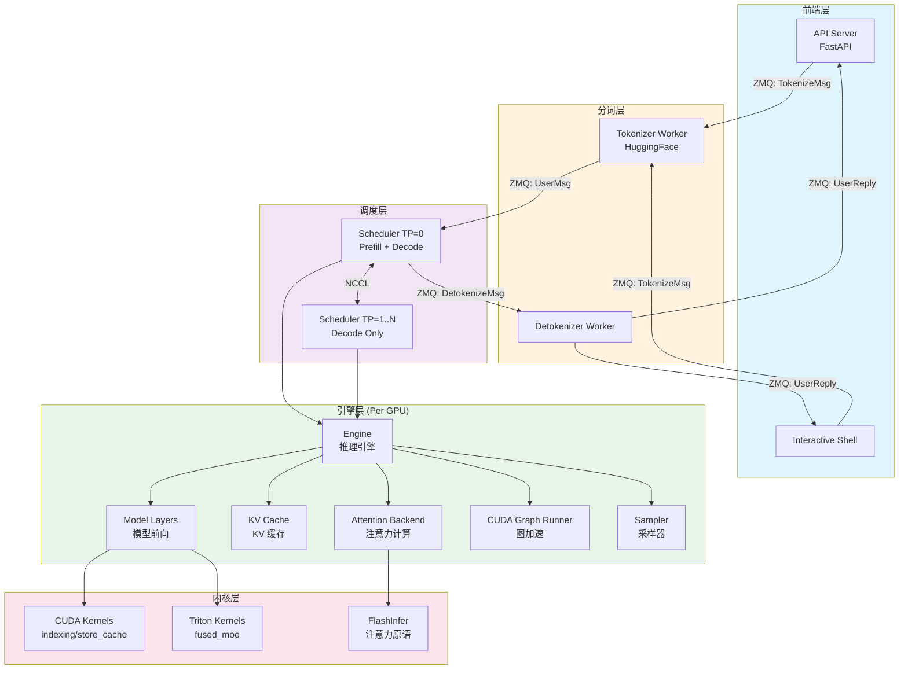

**各层职责详解**：

- **前端层（Frontend）**：系统的对外入口。`API Server` 基于 FastAPI 提供 OpenAI 兼容的 RESTful API（`/v1/chat/completions`
  ），接收 HTTP 请求并返回 SSE 流式响应；`Interactive Shell` 提供交互式命令行界面，适合调试和对话测试。两者最终都将用户输入转化为
  `TokenizeMsg` 发送给分词层。

- **分词层（Tokenizer Layer）**：独立的子进程，负责 CPU 密集型的文本编解码工作。`Tokenizer Worker` 接收前端发来的文本，使用
  HuggingFace Tokenizer 将其编码为 token ID 序列（`UserMsg`），然后转发给调度层；`Detokenizer Worker` 接收调度层生成的 token
  ID，将其解码为可读文本（`UserReply`），流式返回给前端。这种设计将 GPU 密集的推理进程从 CPU 密集的文本处理中解放出来。

- **调度层（Scheduler Layer）**：推理系统的核心大脑。Rank 0 的 Scheduler 负责接收新请求、执行 Prefill 和 Decode 调度、管理 KV
  Cache 的分配与回收；其他 Rank（1..N）的 Scheduler 仅参与 Decode 阶段的计算。多个 Scheduler 之间通过 NCCL 进行张量并行通信。

- **引擎层（Engine Layer）**：每个 GPU 一个实例，是实际执行模型推理的组件。`Engine` 协调 `Model Layers`（Transformer 前向传播）、
  `KV Cache`（键值缓存管理）、`Attention Backend`（注意力计算，支持 FlashInfer/FlashAttention 等后端）、`CUDA Graph Runner`
  （Decode 阶段加速）和 `Sampler`（采样策略）。

- **内核层（Kernel Layer）**：提供底层高性能计算原语。包括自定义 CUDA Kernels（如 `store_cache` 用于 KV 写入、`indexing` 用于
  Embedding 查找）、Triton Kernels（如 `fused_moe` 用于 MoE 专家计算），以及第三方库 FlashInfer 提供的注意力原语。

**数据流向总结**：用户的文本请求从前端进入 → 经 Tokenizer 编码为 token IDs → Scheduler 调度并执行 Prefill/Decode → Engine
完成模型前向计算 → Sampler 采样生成新 token → Detokenizer 解码为文本 → 流式返回给用户。

### 2.2 多进程架构

Mini-SGLang 采用**多进程架构**实现模块解耦和并行处理，各进程通过 ZMQ（ZeroMQ）进行高效通信：

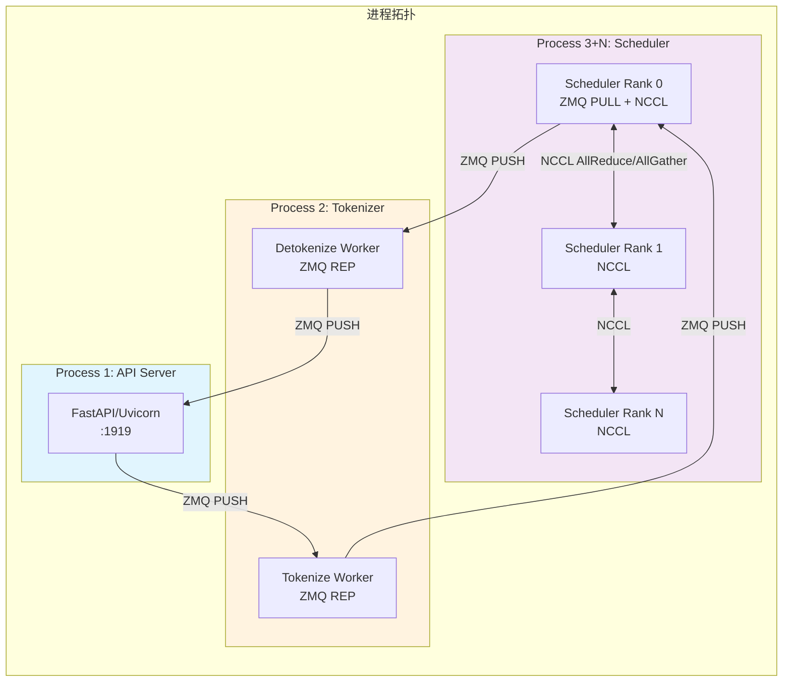

**进程组成与通信模式**：

1. **API Server 进程（Process 1）**：运行 FastAPI/Uvicorn 服务，监听端口 1919。它作为整个系统的入口点，负责接收 HTTP 请求、分配全局唯一
   UID、将文本发送给 Tokenizer 进程编码、以及接收 Detokenizer 进程的流式结果并转换为 SSE 响应返回给客户端。它使用 ZMQ PUSH
   模式主动发送消息，使用 ZMQ PULL 模式异步接收结果。

2. **Tokenizer 进程（Process 2）**：包含两个 Worker——Tokenize Worker 和 Detokenizer Worker（共享模式下为同一进程）。Tokenize
   Worker 使用 ZMQ REP 模式监听来自 API Server 的 `TokenizeMsg`，调用 HuggingFace Tokenizer 编码文本后以 `UserMsg` 形式发送给
   Scheduler Rank 0；Detokenize Worker 接收 Scheduler 发来的 `DetokenizeMsg`，将 token ID 解码为文本后以 `UserReply` 形式返回给
   API Server。

3. **Scheduler 进程（Process 3+N）**：每个 GPU 对应一个 Scheduler 进程。Rank 0 是主进程，额外承担接收新请求（ZMQ PULL）、执行
   Prefill 调度、发送 Detokenize 消息等职责；Rank 1..N 仅参与 Decode 阶段计算。所有 Scheduler 进程之间通过 NCCL 进行
   AllReduce/AllGather 通信，实现张量并行计算。

**为什么选择多进程而非多线程？**

- **隔离性**：各进程独立崩溃互不影响，Tokenizer 的 GIL 不会阻塞 GPU 计算
- **通信清晰**：进程间只能通过显式的消息传递（ZMQ/NCCL）通信，避免复杂的锁竞争
- **部署灵活**：可将不同进程部署到不同机器上（虽然当前版本仅支持单机）

### 2.3 进程间通信协议

Mini-SGLang 的进程间通信遵循严格的协议时序，确保消息可靠传递和流式输出的实时性：

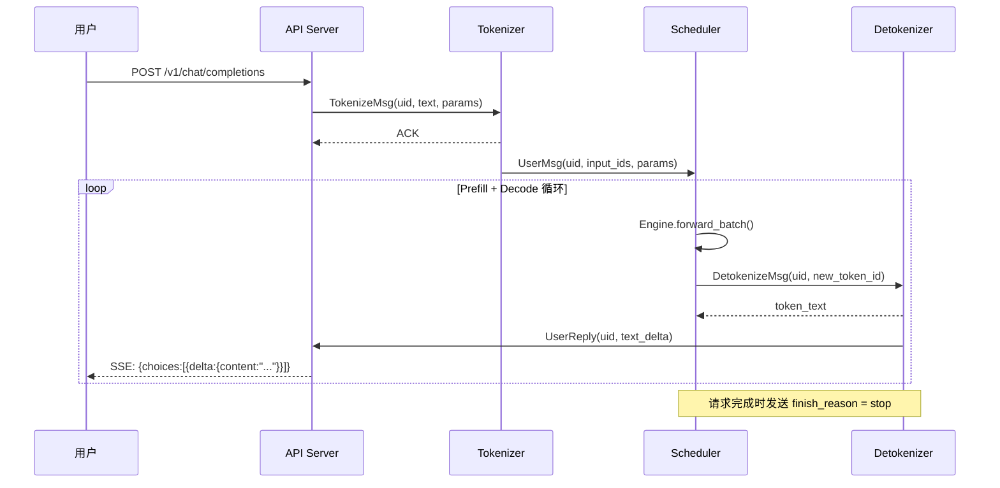

**完整通信流程解析**：

**阶段一：请求提交（User → API → Tokenizer → Scheduler）**

1. 用户发送 HTTP POST 请求到 `/v1/chat/completions` 端点，携带 messages、sampling_params 等参数
2. API Server 分配全局唯一 UID，创建该请求的回复缓冲区和同步事件
3. API Server 将文本和参数封装为 `TokenizeMsg`，通过 ZMQ 异步发送给 Tokenizer Worker
4. Tokenizer Worker 接收消息，调用 HuggingFace Tokenizer 将文本编码为 token ID 张量
5. Tokenizer 将编码结果封装为 `UserMsg`（包含 uid、input_ids、sampling_params），通过 ZMQ 发送给 Scheduler Rank 0

**阶段二：推理循环（Scheduler 内部迭代）**

6. Scheduler 接收 `UserMsg` 后将其加入 Prefill 队列，经过 Radix Cache 匹配、资源分配后构建 Batch
7. 调用 `Engine.forward_batch()` 执行模型前向传播——这是核心计算步骤，涉及 Embedding → N×Transformer Layer → LM Head →
   Sampling
8. 采样得到新的 token ID 后，Scheduler 立即发送 `DetokenizeMsg` 给 Detokenizer Worker
9. Detokenizer Worker 将 token ID 解码为文本片段，封装为 `UserReply`
10. `UserReply` 通过两条路径返回：一是通知 Scheduler 解码完成，二是直接发送给 API Server
11. API Server 收到 `UserReply` 后，通过 SSE（Server-Sent Events）将文本增量推送给用户
12. 循环回到步骤 6，直到生成 EOS token 或达到 max_tokens

**关键设计点**：

- **异步非阻塞**：API Server 使用 asyncio 异步发送/接收 ZMQ 消息，不阻塞 HTTP 处理
- **UID 关联**：所有消息都携带 UID，API Server 通过 UID 将回复路由到正确的 HTTP 连接
- **流式输出**：每生成一个 token 就立即解码返回，无需等待完整响应

---

## 3. 核心数据结构

### 3.1 数据结构关系图

Mini-SGLang 的核心数据结构构成了一个层次化的依赖关系图，从采样参数到请求状态，再到批次容器和全局上下文：

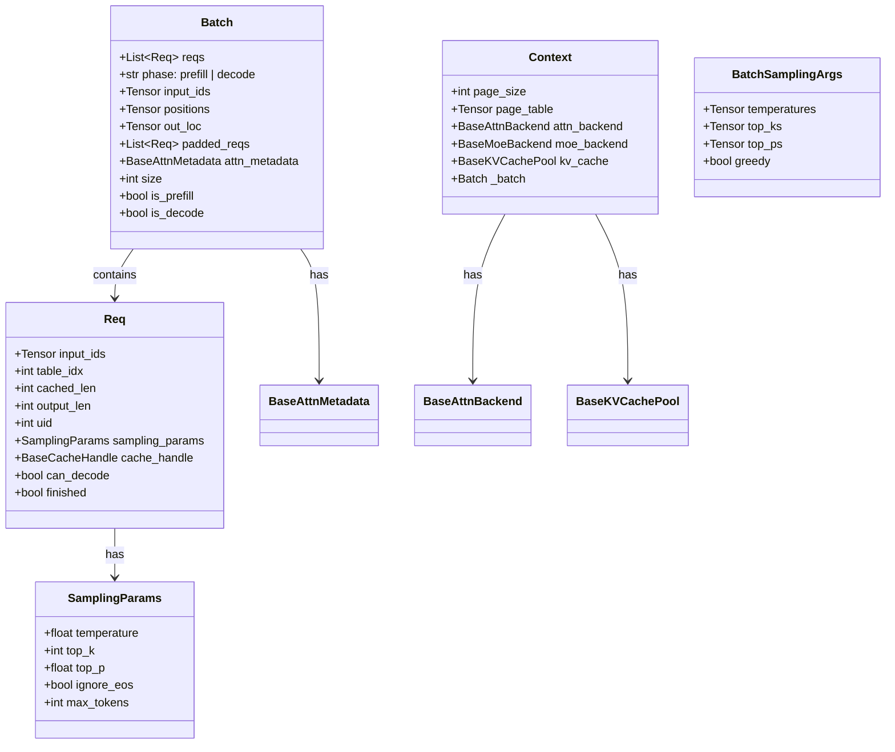

**数据结构层次关系**：

- **`SamplingParams`**（最底层）：定义单个请求的采样行为配置，包括温度、Top-K、Top-P 等参数。每个 `Req` 持有一份。

- **`Req`**（请求核心）：代表一个活跃的推理请求，包含输入 token 序列（CPU 上）、在 KV Cache 表中的索引位置、已缓存长度、输出长度、全局唯一
  ID、采样参数和缓存句柄。`Req` 是调度系统操作的基本单元。

- **`Batch`**（批次容器）：将多个 `Req` 打包为一个批次，供 Engine 统一执行 forward。除了请求列表外，还包含 Scheduler 填充的张量字段（
  `input_ids`、`positions`、`out_loc`）、Attention Backend 填充的元数据（`attn_metadata`），以及用于 CUDA Graph 对齐的填充请求列表（
  `padded_reqs`）。

- **`Context`**（全局单例）：持有所有后端资源的引用——页表、注意力后端、MoE 后端、KV Cache 池。通过 `forward_batch()` 上下文管理器将当前
  `Batch` 注入，使得模型层可以通过 `get_global_ctx().batch` 直接访问当前批次的元数据，避免层层传递参数。

- **`BatchSamplingArgs`**：从 Batch 中提取的批量采样参数，将各请求的标量参数合并为设备张量，供 FlashInfer 的高性能采样
  kernel 使用。

### 3.2 核心字段说明

#### `SamplingParams` - 采样参数

控制模型生成行为的采样配置，每个请求携带一份：

```python
# 15:25:python/minisgl/core.py
@dataclass
class SamplingParams:
    temperature: float = 0.0  # 温度，<=0 表示贪婪解码
    top_k: int = -1  # Top-K 采样，-1 表示不限制
    top_p: float = 1.0  # Top-P (核) 采样
    ignore_eos: bool = False  # 是否忽略 EOS token
    max_tokens: int = 1024  # 最大生成 token 数

    @property
    def is_greedy(self) -> bool:
        """判断是否为贪婪解码模式"""
        return (self.temperature <= 0.0 or self.top_k == 1) and self.top_p == 1.0
```

关键点：当 `temperature <= 0` 时直接走 `argmax` 路径，避免不必要的 softmax 计算。

#### `Req` - 请求状态机

`Req` 是调度系统中最核心的数据结构，表示一个正在处理中的推理请求：

```python
# 28:68:python/minisgl/core.py
@dataclass(eq=False)
class Req:
    input_ids: torch.Tensor  # 输入 token 序列（CPU 上）
    table_idx: int  # 在全局 token 表中的索引
    cached_len: int  # 已缓存的 prefix 长度（Radix Cache 命中时 > 0）
    output_len: int  # 期望输出的 token 数量
    uid: int  # 全局唯一请求 ID
    sampling_params: SamplingParams  # 采样参数
    cache_handle: BaseCacheHandle  # KV 缓存句柄

    def __post_init__(self) -> None:
        assert self.input_ids.is_cpu
        self.device_len = len(self.input_ids)
        self.max_device_len = len(self.input_ids) + self.output_len

    @property
    def remain_len(self) -> int:
        """剩余可生成长度"""
        return self.max_device_len - self.device_len

    @property
    def extend_len(self) -> int:
        """本次需要处理的长度 = device_len - cached_len"""
        return self.device_len - self.cached_len

    def complete_one(self) -> None:
        """完成一个 token 的生成，更新长度"""
        self.cached_len = self.device_len
        self.device_len += 1

    @property
    def can_decode(self) -> bool:
        """是否可以继续 decode"""
        return self.remain_len > 0
```

**状态转换**：

`Req` 在其生命周期中经历一系列状态转换，如下图所示。理解这些状态对于掌握调度系统的工作原理至关重要：

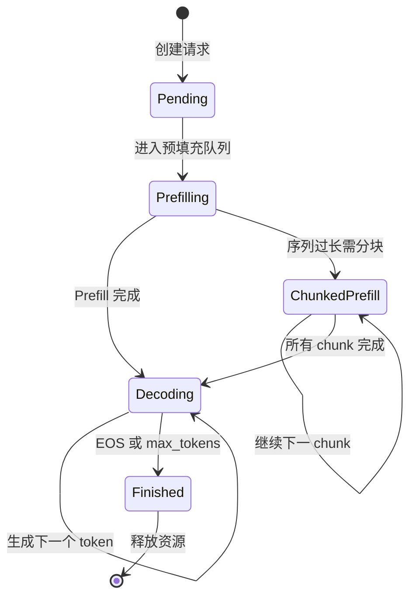

**各状态含义与转换条件**：

- **Pending → Prefilling**：请求被创建并加入 PrefillManager 的等待队列。此时请求尚未占用任何 GPU 资源。

- **Prefilling → Decoding**：正常情况下，Prefill 一次性完成整个 prompt 的处理（序列长度 ≤ `max_prefill_token`），请求转入
  DecodeManager 的运行队列。

- **Prefilling → ChunkedPrefill**：当 prompt 长度超过 `max_prefill_token` 时，无法一次完成 Prefill，需要分块处理。此时创建
  `ChunkedReq`（`Req` 的子类），标记为「不可 Decode」。

- **ChunkedPrefill → ChunkedPrefill**：继续处理下一个 chunk。每次 chunk 处理完后更新 `cached_len`，移动起始位置，直到所有
  tokens 都被处理。

- **ChunkedPrefill → Decoding**：所有 chunks 处理完毕，请求转为普通 `Req` 状态，进入 Decode 阶段。

- **Decoding → Decoding**：每个 decode step 生成一个新 token，通过 `complete_one()` 更新状态。只要 `remain_len > 0` 且未遇到
  EOS token，就持续循环。

- **Decoding → Finished**：满足以下任一条件时结束——生成 EOS token（且 `ignore_eos=False`）、达到 `max_tokens`
  上限、或用户主动中止。此时释放 KV Cache 资源并从运行队列移除。

**关键字段解读**：

| 字段               | 类型                   | 说明                                                   |
|------------------|----------------------|------------------------------------------------------|
| `input_ids`      | `torch.Tensor` (CPU) | 输入 token 序列，始终保存在 CPU 上                              |
| `device_len`     | `int` (动态计算)         | 当前设备上的总长度（含已生成的）                                     |
| `cached_len`     | `int`                | 已缓存的 prefix 长度（Radix Cache 命中时 > 0）                  |
| `extend_len`     | `int` (属性)           | 本次 forward 需要处理的 token 数 = `device_len - cached_len` |
| `complete_one()` | 方法                   | 每次 forward 完成后调用，推进 `cached_len` 和 `device_len`      |

**`extend_len` 是理解 prefill/decode 行为的关键**：

- **首次 prefill**：`cached_len=0, device_len=prompt_len` → `extend_len = prompt_len`
- **Radix Cache 命中后**：`cached_len>0, device_len=prompt_len` → `extend_len = 未命中的部分`
- **decode 阶段**：每次 `complete_one()` 后 `device_len+=1`, `cached_len` 跟进 → `extend_len = 1`

#### `Batch` - 批次容器

Batch 将多个请求打包，供 Engine 统一执行 forward：

```python
# 71:98:python/minisgl/core.py
@dataclass
class Batch:
    reqs: List[Req]
    phase: Literal["prefill", "decode"]
    # these fields should be set by scheduler
    input_ids: torch.Tensor = field(init=False)
    positions: torch.Tensor = field(init=False)
    out_loc: torch.Tensor = field(init=False)
    padded_reqs: List[Req] = field(init=False)
    # this field should be set by attention backend
    attn_metadata: BaseAttnMetadata = field(init=False)

    @property
    def is_prefill(self) -> bool:
        return self.phase == "prefill"

    @property
    def is_decode(self) -> bool:
        return self.phase == "decode"

    @property
    def size(self) -> int:
        return len(self.reqs)

    @property
    def padded_size(self) -> int:
        return len(self.padded_reqs)
```

注意 `size` vs `padded_size` 的区别：后者包含了用于 CUDA Graph 对齐的 dummy request 填充。

#### `Context` - 全局上下文（单例模式）

Context 作为全局单例，持有所有后端资源引用，通过 `forward_batch()` 上下文管理器将当前 batch 注入：

```python 
# 100:123:python/minisgl/core.py
@dataclass
class Context:
    page_size: int  # KV Cache 页大小
    page_table: torch.Tensor = field(init=False)  # 页表
    attn_backend: BaseAttnBackend = field(init=False)  # 注意力后端
    moe_backend: BaseMoeBackend = field(init=False)  # MoE 后端
    kv_cache: BaseKVCachePool = field(init=False)  # KV 缓存池
    _batch: Batch | None = field(default=None, init=False)

    @property
    def batch(self) -> Batch:
        assert self._batch is not None, "No active batch in context"
        return self._batch

    @contextmanager
    def forward_batch(self, batch: Batch):
        """上下文管理器：设置当前 batch，forward 完成后自动清理"""
        assert self._batch is None, "Nested forward_batch is not allowed"
        try:
            self._batch = batch
            yield
        finally:
            self._batch = None
```

这种设计使得模型层（如 `AttentionLayer`、`MoELayer`）可以通过 `get_global_ctx().batch` 直接访问当前 batch 的元数据，避免了层层传递参数。

---

## 4. 请求处理全流程

### 4.1 端到端流程

下图展示了一个请求从用户发送 HTTP 请求到最终完成响应的完整生命周期，涵盖了所有关键处理阶段：

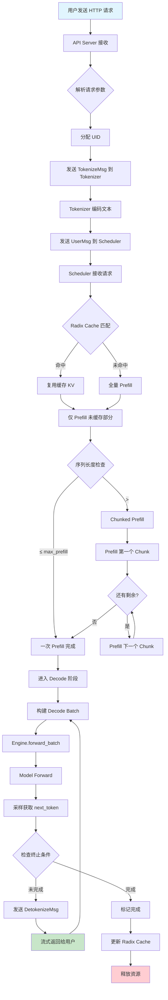

**端到端流程详解**：

**阶段一：请求接入与预处理（A → G）**

用户发送 HTTP POST 请求到 `/v1/chat/completions` 端点。API Server 解析请求中的 messages、temperature、max_tokens 等参数，分配全局唯一
UID，然后封装为 `TokenizeMsg` 通过 ZMQ 发送给 Tokenizer Worker。Tokenizer 调用 HuggingFace 的 `encode()` 方法将文本转换为
token ID 序列，再封装为 `UserMsg` 发送给 Scheduler。

**阶段二：调度与 Prefill（H → N）**

Scheduler 接收到 `UserMsg` 后，首先进行 **Radix Cache 前缀匹配**（步骤 I）：在基数树中查找与新请求最长公共前缀。如果命中（I →
J），则复用已缓存的 KV 数据，仅对未命中的部分执行 Prefill；如果未命中（I → K），则对整个 prompt 执行全量 Prefill。

接下来进行 **序列长度检查**（步骤 M）：如果 prompt 长度超过 `max_prefill_token`（默认 8192），触发 **Chunked Prefill**（M → O →
P → Q），将长序列分割为多个 chunk 逐个处理；否则一次性完成 Prefill（M → N）。

**阶段三：Decode 循环（S → X）**

Prefill 完成后请求进入 Decode 阶段。每个 Decode 步骤包括：

- **T**：将所有运行中请求打包为 Decode Batch
- **U**：调用 `Engine.forward_batch()` 执行模型前向传播
- **V**：完整的 Transformer Forward（Embedding → N×Layer → LM Head）
- **W**：从 logits 中采样获取下一个 token
- **X**：检查终止条件（EOS / max_tokens / 用户中止）

**阶段四：流式输出与清理（Y → AC）**

每生成一个新 token 后，立即发送 `DetokenizeMsg` 给 Detokenizer Worker 解码为文本（Y → Z），通过 SSE
流式推送给用户。当请求完成时（X → AA → AB → AC），更新 Radix Cache（可能插入新的前缀节点）并释放 KV Cache 资源。

### 4.2 Prefill vs Decode 对比

LLM 推理分为两个截然不同的阶段——**Prefill（预填充）**和 **Decode（解码）**，它们在输入特征、计算特点和优化手段上都有本质区别：

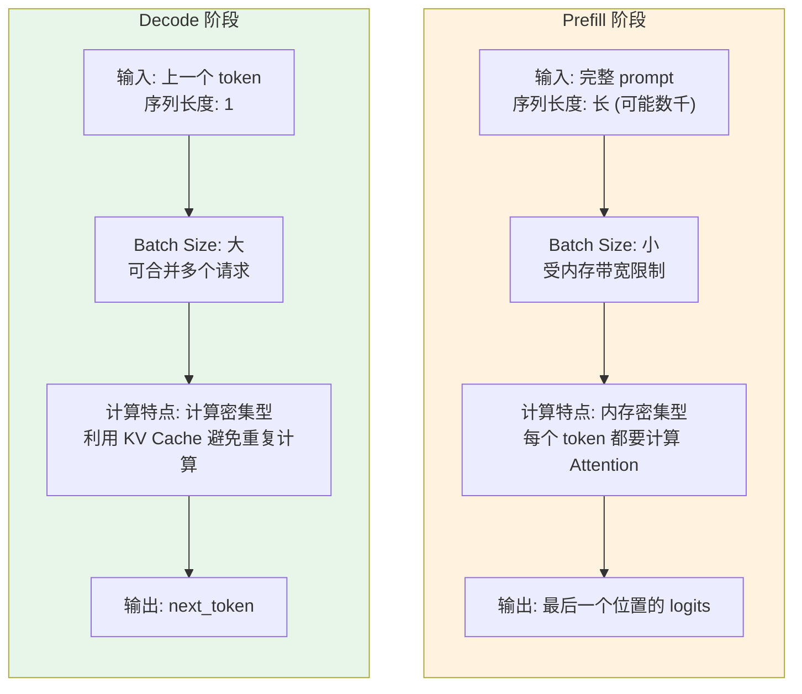

**核心差异分析**：

| 维度         | Prefill         | Decode           |
|------------|-----------------|------------------|
| 输入长度       | 可变（长）           | 固定 (=1)          |
| Batch Size | 小               | 大                |
| 瓶颈         | 内存带宽            | 计算               |
| KV Cache   | 写入新 KV          | 读取已有 KV + 追加 1 个 |
| 优化手段       | Chunked Prefill | CUDA Graph       |

**Prefill 阶段特点**：

- **内存带宽瓶颈**：需要对整个 prompt 序列计算 Attention，每个 query token 都要与所有 key token 计算点积。当序列长度达到数千甚至数万时，KV
  Cache 的读写成为主要瓶颈。
- **小 Batch Size**：由于显存限制（需要存储完整序列的中间状态），通常只能同时处理少量请求。
- **输出只需最后一个位置**：虽然计算了所有位置的注意力，但只需要最后一个位置的 logits 用于预测第一个生成 token。
- **优化手段**：**Chunked Prefill** 将长序列分块处理，允许在 Prefill 过程中穿插 Decode 操作，降低首 token 延迟（TTFT）；*
  *Radix Cache** 复用公共前缀的 KV Cache，减少重复计算。

**Decode 阶段特点**：

- **计算密集型**：每次只输入一个新 token，利用已缓存的 KV 数据计算 Attention。计算量相对固定（与序列长度成正比），但可以利用
  GPU 的计算并行能力。
- **大 Batch Size**：由于每个请求只占用很少的额外显存（仅需存储 1 个新 token 的中间状态），可以同时合并大量请求一起处理，提高
  GPU 利用率。
- **KV Cache 追加**：每次 decode 只需将新计算的 K/V 追加到已有 Cache 末尾，读取量随序列长度线性增长。
- **优化手段**：**CUDA Graph** 捕获整个 forward 过程并重放，消除 Python 开销和 kernel launch 延迟；**Attention 优化**使用
  FlashInfer/FlashAttention 的高性能 decode kernel。

---

## 5. 调度系统

### 5.1 调度器组件

Scheduler 是推理系统的核心调度中枢，由五个紧密协作的组件构成，负责将用户请求转化为 GPU 可执行的 Batch：

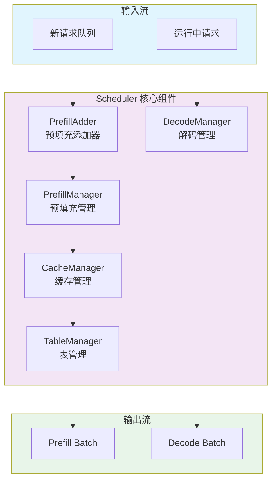

**组件职责详解**：

- **PrefillManager（PrefillManager）**：管理等待执行 Prefill 的请求队列。负责维护 `pending_reqs` 列表，决定何时触发 Prefill
  调度。通过 `schedule_next_batch()` 方法构建 Prefill Batch。

- **DecodeManager（DecodeManager）**：管理所有正在 Decode 阶段的请求。维护 `running_reqs` 集合，每个调度步过滤掉已完成的请求（
  `can_decode=False`），将剩余请求打包为 Decode Batch。

- **CacheManager（CacheManager）**：KV Cache 资源的总协调者。负责物理页面的分配（`allocate_paged`）、释放（`_free`）、Radix Cache
  前缀匹配（`match_req`）和缓存更新（`cache_req`）。当空闲页面不足时，自动触发 LRU 驱逐。

- **TableManager（TableManager）**：管理全局 token 表的行槽位分配。每个请求在 token 表中占有一行，用于存储该请求的所有 token
  ID（GPU 端）。提供 `allocate()` 和 `free()` 接口。

- **PrefillAdder（PrefillAdder）**：Prefill 阶段的核心决策组件。决定哪些 pending 请求可以加入当前 Prefill Batch，受
  `token_budget`（token 预算）约束。调用 Radix Cache 进行前缀匹配，处理 Chunked Prefill 的分片逻辑。

**数据流向**：新请求队列 → PrefillAdder 尝试加入 → PrefillManager 构建 Batch → CacheManager 分配 KV 页面 → TableManager
分配 token 表行 → 输出 Prefill Batch；运行中请求 → DecodeManager 过滤 → 输出 Decode Batch。

### 5.2 Overlap Scheduling 工作原理

Overlap Scheduling（重叠调度）是 Mini-SGLang 的核心性能优化技术之一，其核心思想是**让 GPU 计算与 CPU 调度并行执行**，隐藏
CPU 调度开销：

```mermaid
sequenceDiagram
    participant Loop as 主循环
    participant GPU as GPU 计算
    participant CPU as CPU 调度

    rect rgb(224, 247, 250)
        Note right of Loop: Normal Mode 串行执行
        Loop ->> CPU: 1. 调度准备 batch
        CPU -->> Loop: batch 就绪
        Loop ->> GPU: 2. 执行 forward
        GPU -->> Loop: 结果返回
        Loop ->> CPU: 3. 后处理采样和更新状态
        CPU -->> Loop: 完成
    end

    rect rgb(252, 228, 236)
        Note right of Loop: Overlap Mode 并行执行
        par GPU 计算与 CPU 调度并行
            Loop ->> GPU: N. 执行 forward 上一轮 batch
            GPU -->> Loop: 结果返回
        and
            Loop ->> CPU: N加1. 调度准备下一轮 batch
            CPU -->> Loop: 下一轮 batch 就绪
        end
        Loop ->> CPU: 后处理结果并准备好的下一轮 batch
    end
```

**Normal Mode vs Overlap Mode 对比**：

在 **Normal Mode**（串行模式）中，每个迭代的三步操作严格顺序执行：CPU 调度 → GPU 计算 → CPU 后处理。GPU 在等待 CPU 调度时空闲，CPU
在等待 GPU 计算时也空闲。

在 **Overlap Mode**（并行模式）中，通过精巧的流水线设计，当 GPU 正在执行第 N 个 batch 的 forward 时，CPU 同时准备第 N+1 个
batch。这样 CPU 的调度开销被完全隐藏在 GPU 计算时间之内。

**实现关键点**：

- **非阻塞消息接收**：`receive_msg(blocking=...)` 在有未处理的上一轮数据或待处理请求时不阻塞，确保调度循环可以继续
- **CUDA Stream 同步**：通过 `self.engine.stream.wait_stream(self.stream)` 确保 CPU 调度完成后 GPU 才开始执行，避免数据竞争
- **延迟后处理**：`_process_last_data(last_data)` 处理的是上一轮的结果，与当前轮的 GPU 执行并行

**关键思想**：在 GPU 执行当前 batch 的 forward 时，CPU 同时准备下一个 batch，隐藏调度开销。

**核心实现 - `overlap_loop`**：

```python
# 83:106:python/minisgl/scheduler/scheduler.py
def overlap_loop(self, last_data: ForwardData | None) -> ForwardData | None:
    """
    Overlap 调度的核心：
    - GPU 正在执行第 N 个 batch 时，CPU 同时准备第 N+1 个 batch
    - 返回 ongoing_data 给下一次迭代处理结果
    """
    # 1. 接收新消息（非阻塞）
    blocking = not (
            last_data is not None  # 有上一轮数据需要处理时不阻塞
            or self.prefill_manager.runnable  # 或有待处理的 prefill 请求
            or self.decode_manager.runnable  # 或有 decode 请求
    )
    for msg in self.receive_msg(blocking=blocking):
        self._process_one_msg(msg)

    # 2. 调度下一个 batch（在 CPU stream 上）
    forward_input = self._schedule_next_batch()

    # 3. 在 Engine 的 GPU stream 上执行当前 batch（与步骤 2 的下一次迭代并行）
    ongoing_data = None
    if forward_input is not None:
        with self.engine_stream_ctx:  # 切换到 Engine 的 CUDA stream
            self.engine.stream.wait_stream(self.stream)  # 等待 CPU 调度完成
            ongoing_data = (forward_input, self._forward(forward_input))

    # 4. 处理上一轮的结果（与步骤 3 的 GPU 执行并行）
    self._process_last_data(last_data)
    return ongoing_data
```

**主入口 `run_forever`** 根据 `DISABLE_OVERLAP_SCHEDULING` 环境变量选择模式：

```python
# 120:131:python/minisgl/scheduler/scheduler.py
@torch.inference_mode()
def run_forever(self) -> NoReturn:
    if ENV.DISABLE_OVERLAP_SCHEDULING:
        while True:
            self.normal_loop()  # 串行：调度 → 执行 → 后处理
    else:
        data = None
        while True:
            data = self.overlap_loop(data)  # 并行：GPU 执行 N 的同时 CPU 准备 N+1
```

**消息处理 `_process_one_msg`** 将 `UserMsg` 转化为内部请求：

```python
# 169:198:python/minisgl/scheduler/scheduler.py
def _process_one_msg(self, msg: BaseBackendMsg) -> None:
    if isinstance(msg, UserMsg):
        input_len, max_seq_len = len(msg.input_ids), self.engine.max_seq_len
        max_output_len = max_seq_len - input_len
        if max_output_len <= 0:
            return logger.warning(f"Input too long for request {msg.uid}, dropped.")
        if msg.sampling_params.max_tokens > max_output_len:
            msg.sampling_params.max_tokens = max_output_len  # 自动截断
        self.prefill_manager.add_one_req(msg)  # 加入 prefill 队列
    elif isinstance(msg, AbortBackendMsg):
        req_to_free = self.prefill_manager.abort_req(msg.uid)
        req_to_free = req_to_free or self.decode_manager.abort_req(msg.uid)
        if req_to_free is not None:
            self._free_req_resources(req_to_free)
```

### 5.3 Chunked Prefill 流程

当请求的 prompt 长度超过 `max_prefill_token`（默认 8192）时，无法一次性完成 Prefill，需要将其分割为多个 chunk 逐个处理：

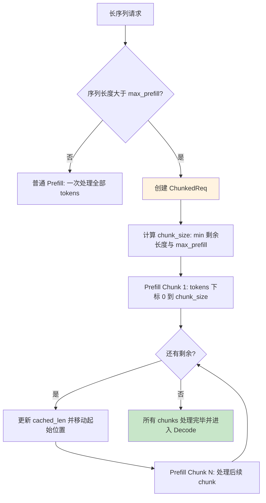

**Chunked Prefill 工作流程详解**：

1. **触发条件检测**（步骤 A → B）：当新请求的 `input_len > max_prefill_token` 时，触发 Chunked Prefill 路径。否则走普通
   Prefill 路径一次处理全部 tokens。

2. **ChunkedReq 创建**（步骤 D）：创建 `ChunkedReq` 实例（`Req` 的子类），其 `can_decode` 属性始终返回 `False`，防止未完成
   prefill 的请求被错误地加入 Decode Batch。

3. **Chunk 大小计算**（步骤 E）：每个 chunk 的大小为 `min(剩余 token 数, max_prefill_token, token_budget)`。其中
   `token_budget` 是 PrefillAdder 的动态预算，为正在 decode 的请求预留空间。

4. **迭代处理**（步骤 F → G → H/I）：每次处理一个 chunk 后更新 `cached_len`，移动起始位置到下一个未处理的 token。循环直到所有
   tokens 都被处理完毕。

5. **转入 Decode**（步骤 J）：所有 chunks 处理完毕后，请求转为普通状态，加入 DecodeManager 的运行队列开始逐 token 生成。

**ChunkedReq** 是 Req 的特殊子类，禁止进入 decode 阶段（因为尚未完成全部 prefill）：

```python
# 23:29:python/minisgl/scheduler/prefill.py
class ChunkedReq(Req):
    def append_host(self, next_token: torch.Tensor) -> None:
        raise NotImplementedError("ChunkedReq should not be sampled")

    @property
    def can_decode(self) -> bool:
        return False  # 避免 DecodeManager 接收未完成 prefill 的请求
```

**PrefillAdder.try_add_one** 决定如何将请求加入当前 prefill batch：

```python
# 92:113:python/minisgl/scheduler/prefill.py
def try_add_one(self, pending_req: PendingReq) -> Req | None:
    """尝试将一个待处理请求加入 prefill batch"""
    if self.token_budget <= 0:
        return None

    # 如果是 chunked request 的延续，直接复用之前的 handle
    if chunked_req := pending_req.chunked_req:
        return self._add_one_req(pending_req, chunked_req.cache_handle,
                                 chunked_req.table_idx, chunked_req.cached_len)

    # 尝试分配资源：匹配 Radix Cache + 检查预算
    if resource := self._try_allocate_one(pending_req):
        cache_handle, table_idx = resource
        return self._add_one_req(pending_req, cache_handle, table_idx,
                                 cache_handle.cached_len)
    return None
```

**核心分片逻辑 `_add_one_req`**：

```python
# 65:90:python/minisgl/scheduler/prefill.py
def _add_one_req(self, pending_req, cache_handle, table_idx, cached_len) -> Req:
    remain_len = pending_req.input_len - cached_len
    chunk_size = min(self.token_budget, remain_len)  # 关键：受 budget 限制
    is_chunked = chunk_size < remain_len  # 如果一次装不下，创建 ChunkedReq
    CLS = ChunkedReq if is_chunked else Req
    # 将 input_ids 对应部分拷贝到 GPU token_pool（使用 pin_memory 加速）
    device_ids = self.table_manager.token_pool[table_idx, slice(cached_len, cached_len + chunk_size)]
    device_ids.copy_(pending_req.input_ids[slice(cached_len, cached_len + chunk_size)].pin_memory())
    return CLS(input_ids=pending_req.input_ids[:cached_len + chunk_size],
               table_idx=table_idx, cached_len=cached_len, ...)
```

注意 `token_budget` 的双重约束作用：既限制单次 prefill 的 token 数，也通过 `reserved_size` 为正在 decode 的请求预留空间。

### 5.4 Radix Cache 前缀匹配

Radix Cache（基数树缓存）是 Mini-SGLang 的核心优化技术之一，通过**前缀复用**避免重复计算相同 prompt 前缀的 KV Cache：

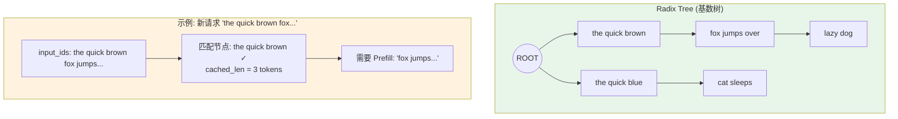

**Radix Cache 工作原理详解**：

上图展示了一个具体的 Radix Tree 示例。树中已缓存了两组前缀：

- **路径 1**：`the quick brown` → `fox jumps over` → `lazy dog`
- **路径 2**：`the quick blue` → `cat sleeps`

当新请求 `"the quick brown fox..."` 到达时：

1. 从根节点开始逐层匹配 token 序列
2. 在第一层匹配到 `"the quick"`（节点 N1 和 N3 的公共前缀）
3. 继续向下匹配到 `"brown"`（命中节点 N1）
4. 返回匹配结果 `cached_len = 3`（即 "the quick brown" 三个 token 已被缓存）
5. 只需要对剩余部分 `"fox jumps..."` 执行 Prefill

**Radix Tree 的优势**：

- **O(L) 匹配复杂度**：L 为树深度，与已缓存的请求数量无关
- **自动去重**：公共前缀只存储一份 KV Cache，多个请求共享
- **LRU 驱逐**：当内存不足时，优先驱逐最久未访问的叶子节点

**Radix Cache 核心操作**：

| 操作                         | 说明          | 复杂度            |
|----------------------------|-------------|----------------|
| `match_prefix(input_ids)`  | 在树中查找最长公共前缀 | O(depth)       |
| `insert_prefix(input_ids)` | 插入新的前缀节点    | O(depth)       |
| `evict(size)`              | LRU 驱逐，释放空间 | O(evict_count) |

**CacheManager** 负责 KV Cache 页面的分配、释放和前缀缓存的管理协调：

```python
# 15:26:python/minisgl/scheduler/cache.py
class CacheManager:
    def __init__(self, num_pages, page_size, page_table, type):
        # 空闲页槽位（page-aligned）
        self.free_slots = torch.arange(num_pages, dtype=torch.int32, device=device) * page_size
        self.prefix_cache = create_prefix_cache(device=device, type=type)  # Radix/Naive

    def match_req(self, req: PendingReq) -> MatchResult:
        """为新请求查找 Radix Cache 命中（去掉最后一个 token 以避免重复 EOS 匹配）"""
        return self.prefix_cache.match_prefix(req.input_ids[: req.input_len - 1])

    def allocate_paged(self, reqs: List[Req]) -> None:
        """为请求分配 KV Cache 物理页面，写入页表"""
        for req in reqs:
            first_page = div_ceil(req.cached_len, self.page_size)
            last_page = div_ceil(req.device_len, self.page_size)
            if last_page > first_page:  # 需要新分配的页
                needed_pages += last_page - first_page
        if needed_pages > 0:
            allocated = self._allocate(needed_pages)  # 可能触发驱逐
            _write_page_table(self.page_table, allocated, allocation_info, self.page_size)
```

**`cache_req` 方法在请求完成或 prefill 结束后更新缓存**：

```python
# 55:79:python/minisgl/scheduler/cache.py
def cache_req(self, req: Req, *, finished: bool) -> None:
    insert_ids = req.input_ids[: req.cached_len]
    page_indices = self.page_table[req.table_idx, : req.cached_len]
    old_handle = req.cache_handle

    # 插入前缀到 Radix Tree
    cached_len, new_handle = self.prefix_cache.insert_prefix(insert_ids, page_indices)
    self.unlock(old_handle)  # 解锁旧 handle

    # 释放已被其他请求缓存的部分（避免内存泄漏）
    self._free(page_indices[old_handle.cached_len: cached_len])

    if finished:  # 请求完成，释放尾部
        self._free(page_indices[new_handle.cached_len:])
    else:  # 更新 handle 继续使用
        req.cache_handle = new_handle
        self.lock(new_handle)
```

**DecodeManager** 管理所有正在 decode 的请求，负责构建 decode batch：

```python
# 9:39:python/minisgl/scheduler/decode.py
@dataclass
class DecodeManager:
    running_reqs: Set[Req] = field(default_factory=set)

    def filter_reqs(self, reqs: Iterable[Req]) -> None:
        """过滤掉已完成的请求，只保留还能继续 decode 的"""
        self.running_reqs = {req for req in self.running_reqs.union(reqs) if req.can_decode}

    @property
    def inflight_tokens(self) -> int:
        """计算正在使用的 token 预留量（用于 prefill budget 控制）"""
        tokens_reserved = (self.page_size - 1) * len(self.running_reqs)  # 每个请求保留 1 页
        return sum(req.remain_len for req in self.running_reqs) + tokens_reserved

    def schedule_next_batch(self) -> Batch | None:
        if not self.runnable:
            return None
        return Batch(reqs=list(self.running_reqs), phase="decode")
```

**TableManager** 管理 token 表的槽位分配（每个请求一行）：

```python
# 4:11:python/minisgl/scheduler/table.py
class TableManager:
    def __init__(self, max_running_reqs, page_table):
        self._free_slots = list(range(max_running_reqs))  # 可用的行索引
        self.token_pool = torch.zeros_like(page_table, dtype=torch.int32)  # GPU token 池

    def allocate(self) -> int:
        return self._free_slots.pop()

    def free(self, slot: int) -> None:
        self._free_slots.append(slot)
```

---

## 6. 推理引擎

### 6.1 Engine 核心循环

Engine 是推理引擎的核心执行单元，每个 GPU 一个实例。下图展示了 `forward_batch()` 的完整执行路径：

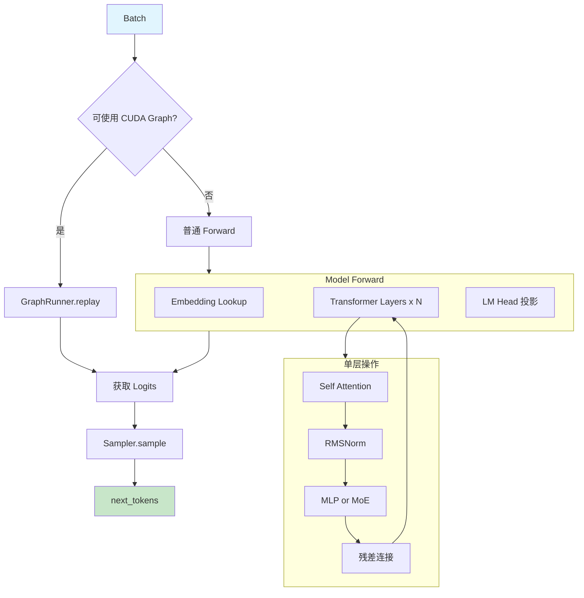

**Engine 执行流程详解**：

**入口判断（Batch → Check）**：Engine 接收 Scheduler 构建的 Batch 后，首先判断是否可以使用 CUDA Graph 加速。条件为：
`batch.is_decode` 且 `batch.size <= max_graph_bs`。满足条件时走 GraphRunner.replay 路径，否则走普通 Forward 路径。

**两条执行路径**：

- **CUDA Graph 路径（Check → CG）**：将 batch 数据拷贝到预捕获的静态缓冲区，然后调用 `graph.replay()` 重放整个 forward
  过程。开销极低（约微秒级），适合 Decode 阶段的高频调用。
- **普通 Forward 路径（Check → Normal → Forward）**：逐层执行 Transformer 的标准前向传播。每层包括 Embedding 查找、N 个
  DecoderLayer（每个包含 Attention + MLP）、以及最终的 LM Head 投影。

**采样输出（Logits → Sample → Next）**：无论走哪条路径，最终都得到 logits 张量。Sampler 根据各请求的采样参数（temperature/top_k/top_p）从
logits 中采样得到 next_tokens。

**单层操作细节（LayerOps）**：每个 DecoderLayer 内部执行 Pre-Attention RMSNorm → Self Attention（含 QKV 投影、RoPE、注意力计算、O
投影）→ Post-Attention RMSNorm → MLP/MoE → 残差连接。

**Engine 初始化** 完成整个推理系统的资源分配和初始化：

```python
# 30:110:python/minisgl/engine/engine.py
class Engine:
    def __init__(self, config: EngineConfig):
        # 1. 初始化 CUDA 设备和通信
        set_tp_info(rank=config.tp_info.rank, size=config.tp_info.size)
        self.device = torch.device(f"cuda:{config.tp_info.rank}")
        self.stream = torch.cuda.Stream()  # 独立 CUDA stream
        self.ctx = Context(config.page_size)
        set_global_ctx(self.ctx)

        # 2. 初始化通信 (NCCL / PyNCCL)
        self.tp_cpu_group = self._init_communication(config)

        # 3. 创建模型（meta 设备，不占显存）并加载权重
        with torch.device("meta"), torch_dtype(config.dtype):
            self.model = create_model(config.model_config)  # 不占显存
        self.model.load_state_dict(self._load_weight_state_dict(config))  # 流式加载到 GPU

        # 4. 根据剩余显存计算 KV Cache 页数
        self.num_pages = self._determine_num_pages(init_free_memory, config)
        self.ctx.kv_cache = create_kvcache_pool(...)

        # 5. 初始化页表、注意力后端、MoE 后端、采样器
        self.ctx.page_table = torch.zeros((max_running_req + 1, aligned_max_seq_len), ...)
        self.ctx.attn_backend = create_attention_backend(...)
        if config.model_config.is_moe:
            self.ctx.moe_backend = create_moe_backend(config.moe_backend)
        self.sampler = Sampler(self.device, vocab_size)

        # 6. 初始化 CUDA Graph 捕获（为不同 BS 预捕获 graph）
        self.graph_runner = GraphRunner(stream=self.stream, model=self.model, ...)
```

**`forward_batch`** 是 Engine 对外暴露的核心方法，每个调度步调用一次：

```python
# 191:206:python/minisgl/engine/engine.py
def forward_batch(self, batch: Batch, args: BatchSamplingArgs) -> ForwardOutput:
    assert torch.cuda.current_stream() == self.stream
    with self.ctx.forward_batch(batch):  # 设置全局上下文的当前 batch
        if self.graph_runner.can_use_cuda_graph(batch):
            logits = self.graph_runner.replay(batch)  # CUDA Graph 路径
        else:
            logits = self.model.forward()  # 普通 Eager 路径

    for req in batch.reqs:
        req.complete_one()  # 更新每个请求的长度状态

    next_tokens_gpu = self.sampler.sample(logits[: batch.size], args).to(torch.int32)
    next_tokens_cpu = next_tokens_gpu.to("cpu", non_blocking=True)  # 异步拷贝到 CPU
    copy_done_event = torch.cuda.Event()
    copy_done_event.record(self.stream)  # 记录拷贝完成事件
    return ForwardOutput(next_tokens_gpu, next_tokens_cpu, copy_done_event)
```

注意 `next_tokens_cpu` 使用 `non_blocking=True` 异步拷贝，CPU 端通过 `copy_done_event.synchronize()` 确保拷贝完成后再使用。

### 6.2 GraphRunner - CUDA Graph 管理

GraphRunner 负责 CUDA Graph 的捕获、存储和重放，是 Decode 阶段高性能的关键：

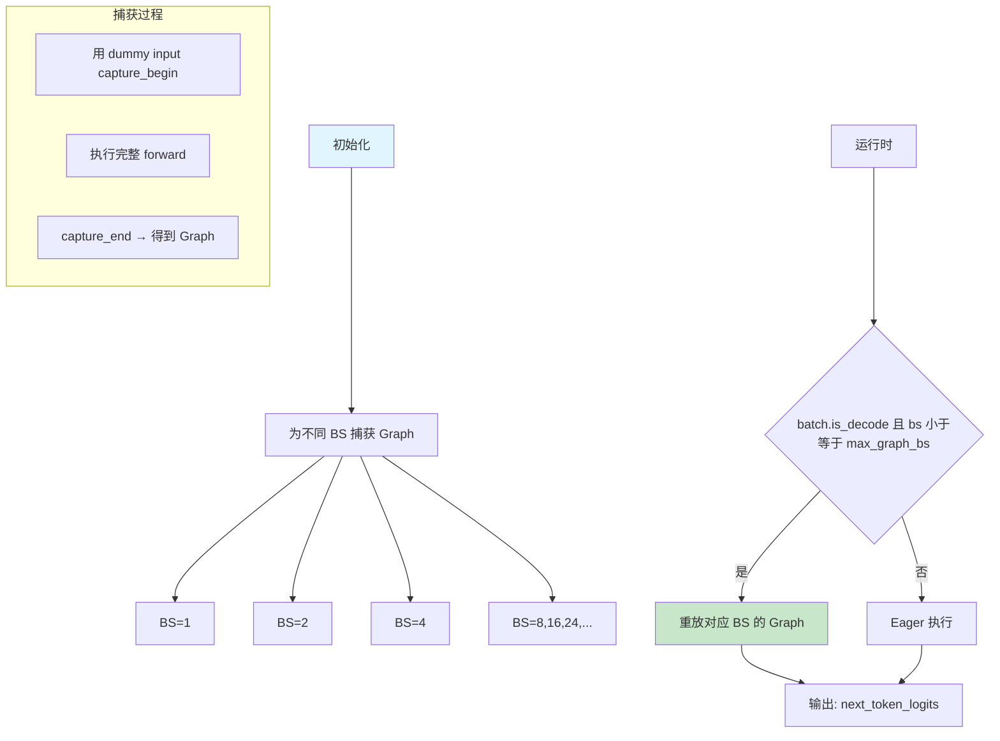

**CUDA Graph 生命周期详解**：

**初始化阶段（Init → Capture）**：Engine 启动时，GraphRunner 根据可用显存确定要捕获的 batch size 列表。默认策略为
`[1, 2, 4] + list(range(8, max_bs+1, 8))`——小 BS 更密集（因为 decode 常见小 batch），大 BS 每 8 一个。H200（>80GB 显存）默认
max_bs=256，其他 GPU 为 160。

**捕获过程（CaptureDetail）**：对每个目标 BS：

1. 创建 `GraphCaptureBuffer`（固定大小的静态内存缓冲区）
2. 用 dummy input 调用 `capture_begin()` 开始捕获
3. 执行一次完整的 model.forward() 作为 warmup
4. 在 `torch.cuda.graph()` 上下文中再次执行 forward，此时 CUDA 操作不被立即执行，而是被记录到 graph 中
5. `capture_end` 后得到可重用的 `CUDAGraph` 对象

**运行时阶段（Runtime → Check → Replay/Eager）**：每次 decode 调用时检查条件。满足条件时只需两步操作：① 将动态数据拷贝到静态缓冲区（
`buffer.copy_from(batch)`），② 调用 `graph.replay()`。总开销约等于一次内存拷贝，相比 eager 模式消除了所有 Python 开销和
kernel launch 延迟。

**Padding 策略**：当实际 bs 不在预捕获列表中时（如 bs=5），向上取整到最近的捕获 bs（bs=8），并用 dummy request 填充剩余位置。

**CUDA Graph Batch Size 策略**：

```python
# 49:67:python/minisgl/engine/graph.py
def _determine_cuda_graph_bs(cuda_graph_bs, cuda_graph_max_bs, free_memory):
    """根据可用显存决定 CUDA Graph 捕获的 batch size 列表"""
    free_memory_gb = free_memory / (1 << 30)
    if cuda_graph_max_bs is None:
        cuda_graph_max_bs = 256 if free_memory_gb > 80 else 160  # H200 vs 其他
    # 小 BS 更密集（decode 常见），大 BS 每 8 一个
    return [1, 2, 4] + list(range(8, cuda_graph_max_bs + 1, 8))
    # 结果: [1, 2, 4, 8, 16, 24, 32, 40, ...]
```

**GraphCaptureBuffer** 是 CUDA Graph 的固定内存缓冲区，capture 和 replay 时都使用同一块内存：

```python 20:47:python/minisgl/engine/graph.py
@dataclass
class GraphCaptureBuffer:
    input_ids: torch.Tensor  # [max_bs] token 输入
    out_loc: torch.Tensor  # [max_bs] KV 写入位置
    positions: torch.Tensor  # [max_bs] 位置 ID
    logits: torch.Tensor  # [max_bs, vocab] 输出 logits

    def set_batch(self, batch: Batch) -> None:
        """capture 时：将 buffer 绑定到 batch 的字段"""
        _slice = slice(batch.padded_size)
        batch.input_ids = self.input_ids[_slice]
        batch.out_loc = self.out_loc[_slice]
        batch.positions = self.positions[_slice]

    def copy_from(self, batch: Batch) -> None:
        """replay 时：将实际数据拷贝到 buffer（唯一的数据拷贝开销）"""
        _slice = slice(batch.padded_size)
        self.input_ids[_slice] = batch.input_ids
        self.out_loc[_slice] = batch.out_loc
        self.positions[_slice] = batch.positions
```

**捕获过程 `_capture_graphs`**：

```python
# 105:148:python/minisgl/engine/graph.py
def _capture_graphs(self, max_seq_len, vocab_size, model):
    self.buffer = GraphCaptureBuffer.init(self.max_graph_bs, vocab_size, self.device)
    pool = None  # CUDA Graph 内存池，复用 graph handle 以减少内存
    for bs in sorted(self.graph_bs_list, reverse=True):  # 从大到小捕获
        graph = torch.cuda.CUDAGraph()
        batch = Batch(reqs=[self.dummy_req] * bs, phase="decode")
        batch.padded_reqs = batch.reqs
        self.attn_backend.prepare_for_capture(batch)  # 让后端准备 capture 状态
        self.buffer.set_batch(batch)
        with get_global_ctx().forward_batch(batch):
            self.buffer.logits[:bs] = model.forward()  # warmup run
            with torch.cuda.graph(graph, pool=pool, stream=self.stream):
                self.buffer.logits[:bs] = model.forward()  # 捕获这次 forward
        if pool is None:
            pool = graph.pool()  # 复用 CUDA Graph handle 以减少内存
        self.graph_map[bs] = graph
```

**重放过程** —— 极低开销，仅需一次数据拷贝 + `replay()`：

```python
# 149:158:python/minisgl/engine/graph.py
def can_use_cuda_graph(self, batch: Batch) -> bool:
    return batch.is_decode and batch.size <= self.max_graph_bs


def replay(self, batch: Batch) -> torch.Tensor:
    self.buffer.copy_from(batch)  # 将 batch 数据复制到捕获缓冲区
    g = self.graph_map[batch.padded_size]  # 选择对应 BS 的 graph
    self.attn_backend.prepare_for_replay(batch)
    g.replay()  # 重放！无需重新执行 kernel
    return self.buffer.logits[: batch.size]
```

**batch padding** —— 当实际 bs 不在捕获列表中时，向上取整到最近的捕获 bs 并用 dummy request 填充：

```python
# 160:166:python/minisgl/engine/graph.py
def pad_batch(self, batch: Batch) -> None:
    padded_size = next(bs for bs in self.graph_bs_list if bs >= batch.size)
    if self.can_use_cuda_graph(batch) else batch.size


batch.padded_reqs = batch.reqs + [self.dummy_req] * (padded_size - batch.size)
```

### 6.3 Sampler - 采样策略

Sampler 负责从模型输出的 logits 中采样生成下一个 token，支持多种采样策略：

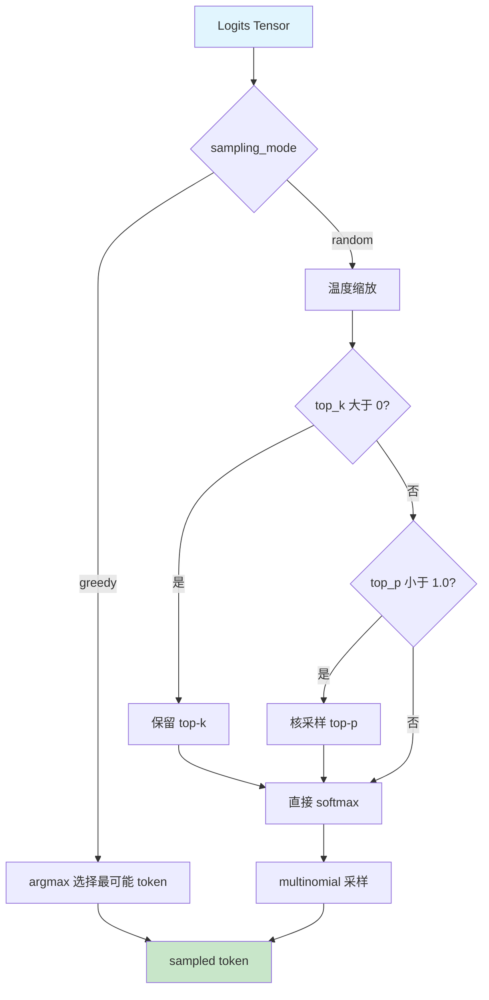

**采样流程详解**：

**模式选择（Logits → Mode）**：首先检查是否所有请求都是贪婪模式（`temperature ≤ 0` 或 `top_k = 1` 且 `top_p = 1`）。如果是，直接走
argmax 快速路径，完全跳过 softmax 计算。

**随机采样路径（Mode → Temp → TopK/TopP → Softmax → Multinomial）**：

1. **温度缩放（Temp）**：将 logits 除以 temperature。temperature > 1 使分布更平坦（更随机），< 1 使分布更尖锐（更确定）。
2. **Top-K 过滤（TopK → Filter_K）**：如果 `top_k > 0`，只保留概率最高的 K 个 token，其余置为 -∞。限制候选范围。
3. **核采样 Top-P（TopP → Filter_P）**：如果 `top_p < 1.0`，按概率降序排列，累计概率超过 P 的 token 被截断。自适应控制候选数量。
4. **Softmax 归一化**：将 logits 转换为概率分布。
5. **Multinomial 采样**：根据概率分布随机抽取一个 token。

**性能优化**：全贪婪检测可以跳过 softmax；使用 FlashInfer 的 fused kernel 在 GPU 上完成温度缩放+softmax+采样，避免 CPU-GPU
数据往返。

**Sampler.prepare** 从请求列表中提取批量采样的参数，自动检测全贪婪模式以跳过 softmax：

```python
# 48:68:python/minisgl/engine/sample.py
@dataclass
class Sampler:
    device: torch.device
    vocab_size: int

    def prepare(self, batch: Batch) -> BatchSamplingArgs:
        params = [r.sampling_params for r in batch.reqs]
        if all(p.is_greedy for p in params):
            return BatchSamplingArgs(temperatures=None)  # 全贪婪模式，跳过 softmax

        ts = [max(0.0 if p.is_greedy else p.temperature, 1e-6) for p in params]
        top_ks = [p.top_k if p.top_k >= 1 else self.vocab_size for p in params]
        top_ps = [min(max(p.top_p, MIN_P), 1.0) for p in params]
        temperatures = make_device_tensor(ts, torch.float32, self.device)  # pin_memory → GPU
        # 仅在需要时创建 top_k/top_p 张量（节省内存和带宽）
        top_k = make_device_tensor(top_ks, ...) if any(k != self.vocab_size for k in top_ks) else None
        top_p = make_device_tensor(top_ps, ...) if any(p < 1.0 for p in top_ps) else None
        return BatchSamplingArgs(temperatures, top_k=top_k, top_p=top_p)
```

**Sampler.sample** 执行采样：

```python
# 70:75:python/minisgl/engine/sample.py
@nvtx_annotate("Sampler")
def sample(self, logits, args):
    if args.temperatures is None:  # 全贪婪解码
        return torch.argmax(logits, dim=-1)
    return sample_impl(logits.float(), args.temperatures, args.top_k, args.top_p)
```

**sample_impl** 使用 FlashInfer 的高效采样原语：

```python
# 24:45:python/minisgl/engine/sample.py
def sample_impl(logits, temperatures, top_k, top_p):
    import flashinfer.sampling as sampling
    probs = sampling.softmax(logits, temperatures, enable_pdl=is_sm90_supported())
    if top_k is not None and top_p is not None:
        return sampling.top_k_top_p_sampling_from_probs(probs, top_k, top_p)
    elif top_k is not None:
        return sampling.top_k_sampling_from_probs(probs, top_k)
    elif top_p is not None:
        return sampling.top_p_sampling_from_probs(probs, top_p)
    return sampling.sampling_from_probs(probs)
```

---

## 7. 模型与层实现

### 7.1 模型层次结构

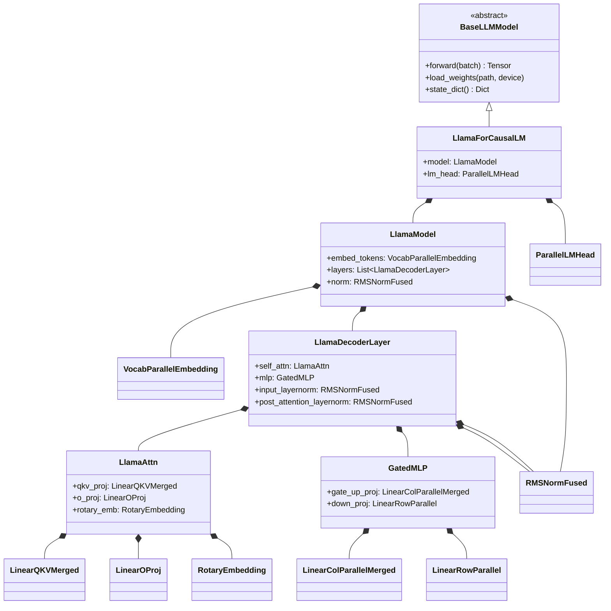

上图展示了 mini-sglang 中模型类的**四层继承与组合体系**。从顶层到底层，各层的职责如下：

**第一层：抽象基类 `BaseLLMModel`**

所有模型（Llama、Qwen2、Qwen3、Mistral 及其 MoE 变体）都继承自 `BaseLLMModel`。该基类定义了统一接口：

- `forward()` — 执行前向传播，返回 logits
- `load_weights()` / `state_dict()` — 权重管理

通过 `create_model()` 工厂函数（位于 `python/minisgl/models/__init__.py`），根据 `config.architectures[0]`
动态选择具体模型类。所有支持的模型共享几乎相同的结构模板——它们之间的差异主要在于 DecoderLayer 内部的注意力实现细节（如
Qwen2 额外的 QK Norm）。

**第二层：模型外壳（如 `LlamaForCausalLM`）**

这是用户直接实例化的类，负责组装两个核心组件：

- **`model`** (`LlamaModel`)：Transformer 编码器主体，包含 Embedding、N 层 DecoderLayer 和最终的 RMSNorm。
- **`lm_head`** (`ParallelLMHead`)：输出投影层，将隐藏状态映射到词表大小的 logits。支持**权重绑定**（weight tying）——当
  `config.tie_word_embeddings=True` 时，`lm_head` 直接复用 `embed_tokens` 的权重矩阵，节省显存。

`forward()` 的执行路径为：从全局调度上下文 `get_global_ctx().batch.input_ids` 获取当前 batch 的 token ID → 送入
Transformer 编码器 → 经 lm_head 投影 → 返回 logits。

**第三层：Transformer 编码器（如 `LlamaModel`）**

编码器维护三个核心属性：

| 属性             | 类型                          | 说明                      |
|----------------|-----------------------------|-------------------------|
| `embed_tokens` | `VocabParallelEmbedding`    | 词嵌入层，将 token ID 映射为隐藏向量 |
| `layers`       | `OPList[LlamaDecoderLayer]` | N 个相同的解码器层，顺序执行         |
| `norm`         | `RMSNormFused`              | 最终的 RMS 归一化层            |

`forward()` 的数据流为：**Token Embedding → 循环执行 N 层 DecoderLayer → RMSNorm**。注意残差连接的管理方式：每层
DecoderLayer 返回 `(x, residual)` 元组，残差在层间传递，由 `RMSNormFused` 的融合操作处理最终累加。

**第四层：解码器层（`LlamaDecoderLayer`）**

每个 DecoderLayer 是一个完整的 Transformer Block，包含四个子模块：

1. **`input_layernorm`** (`RMSNormFused`) — Pre-Attention Norm，对输入做 RMS 归一化并 fused-add 残差
2. **`self_attn`** (`LlamaAttn` / `RopeAttn`) — 多头注意力 + RoPE 位置编码
3. **`post_attention_layernorm`** (`RMSNormFused`) — Post-Attention Norm
4. **`mlp`** (`GatedMLP` / `MoEMLP`) — 前馈网络（密集型或 MoE 型）

数据流遵循标准 LLaMA 架构的 Pre-Norm 范式：`x → Norm → Attention → Add → Norm → MLP → Add`。其中两次 "Add"（残差连接）被融合进
`RMSNormFused` 的 `fused_add_rmsnorm` 操作中，避免了显式的加法节点。

**更深层：注意力内部结构（`LlamaAttn` / `RopeAttn`）**

注意力模块进一步分解为：

- **`qkv_proj`** (`LinearQKVMerged`) — 将 Q、K、V 三路投影**融合**为单次矩阵乘法，输出形状为
  `[seq_len, (num_qo_heads + 2*num_kv_heads) * head_dim]`
- **`attn`** (`AttentionLayer`) — 执行 QKV 拆分、可选的 QK Norm、RoPE 旋转位置编码、以及调用注意力后端（FlashInfer /
  FlashAttention 等）
- **`o_proj`** (`LinearOProj`) — 输出行并行投影 + AllReduce

**最底层：MLP 结构（`GatedMLP`）**

采用 SwiGLU 激活函数的变体：

- **`gate_up_proj`** (`LinearColParallelMerged`) — 将 gate_proj 和 up_proj 的权重沿列维度拼接后融合为一次矩阵乘法，输出
  `[bs, seq, 2 * intermediate_size]`
- **激活函数** — `silu_and_mul`（或 `gelu_and_mul`），在单一 kernel 中完成 SiLU(gate) ⊙ up 的逐元素运算
- **`down_proj`** (`LinearRowParallel`) — 行并行投影 + AllReduce，将中间维度映射回隐藏维度

对于 MoE 模型（如 Qwen3Moe），`GatedMLP` 被替换为 `MoEMLP`，内部包含 Router（`LinearReplicated`）+ Expert 集合（`MoELayer`），详见第
10 章。

**LlamaForCausalLM** 是模型的顶层入口，`forward()` 从全局 context 获取当前 batch 的 input_ids：

```python
# 68:85:python/minisgl/models/llama.py
class LlamaForCausalLM(BaseLLMModel):
    def __init__(self, config: ModelConfig):
        self.model = LlamaModel(config)  # Transformer 编码器
        self.lm_head = ParallelLMHead(...)  # 并行输出头（支持权重绑定）

    def forward(self) -> Tensor:
        """从全局 context 获取当前 batch 的 input_ids，执行完整前向传播"""
        output = self.model.forward(get_global_ctx().batch.input_ids)
        logits = self.lm_head.forward(output)
        return logits
```

**LlamaModel** 执行 Embedding → N × DecoderLayer → RMSNorm：

```python
# 46:65:python/minisgl/models/llama.py
class LlamaModel(BaseOP):
    def __init__(self, config: ModelConfig):
        self.embed_tokens = VocabParallelEmbedding(
            num_embeddings=config.vocab_size,
            embedding_dim=config.hidden_size,
        )
        self.layers = OPList(
            [LlamaDecoderLayer(config, layer_id) for layer_id in range(config.num_layers)]
        )
        self.norm = RMSNormFused(size=config.hidden_size, eps=config.rms_norm_eps)

    def forward(self, input_ids: Tensor) -> Tensor:
        x = self.embed_tokens.forward(input_ids)  # Token Embedding
        residual: Tensor | None = None
        for layer in self.layers.op_list:  # N 层 Decoder（顺序执行）
            x, residual = layer.forward(x, residual)
        return self.norm.forward(x, residual)[0]  # 最终 RMSNorm
```

**LlamaDecoderLayer** 每层执行 Pre-Attention Norm → Attention → Post-Attention Norm → MLP：

```python
# 18:43:python/minisgl/models/llama.py
class LlamaDecoderLayer(BaseOP):
    def __init__(self, config: ModelConfig, layer_id: int):
        self.self_attn = LlamaAttn(config, layer_id)
        self.mlp = LlamaMLP(config)
        self.input_layernorm = RMSNormFused(size=config.hidden_size, eps=config.rms_norm_eps)
        self.post_attention_layernorm = RMSNormFused(size=config.hidden_size, eps=config.rms_norm_eps)

    @nvtx_annotate("Layer_{}", layer_id_field="_layer_id")
    def forward(self, x, residual=None) -> Tuple[Tensor, Tensor]:
        x, residual = self.input_layernorm.forward(x, residual)  # Pre-Attention RMSNorm
        x = self.self_attn.forward(x)  # Multi-Head Attention + RoPE
        x, residual = self.post_attention_layernorm.forward(x, residual)  # Post-Attention RMSNorm
        x = self.mlp.forward(x)  # Gated MLP (SiLU)
        return x, residual  # 残差连接由 norm fused 处理
```

### 7.2 层类型与张量并行策略

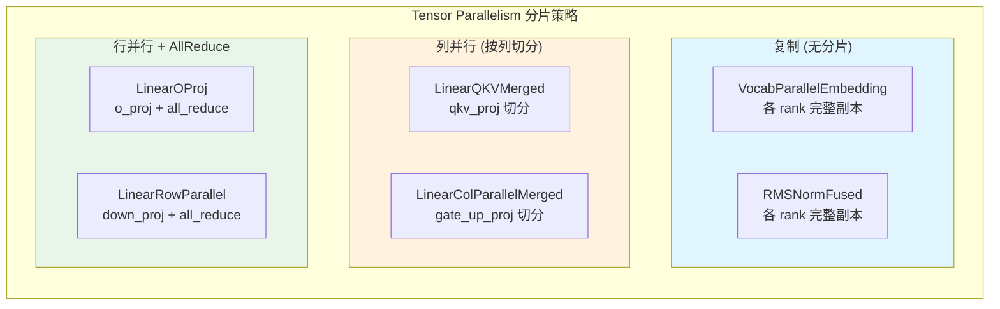

上图将 mini-sglang 中所有线性层类型按 TP（Tensor Parallelism）分片策略划分为**三大类**。理解这个分类是掌握模型并行执行的关键。

**类别一：复制层（Replicated）— 各 rank 保存完整副本**

这类层的权重在所有 GPU 上完全相同，不进行任何分片。属于此类的有：

| 层类型                        | 说明                                 | 为什么不需要分片                                                                             |
|----------------------------|------------------------------------|--------------------------------------------------------------------------------------|
| `VocabParallelEmbedding`   | 词嵌入矩阵 `[vocab_size, hidden_size]`  | 虽然 Embedding 权重本身按词表范围切分（每个 rank 负责 vocab 的一个子集），但前向传播后通过 `all_reduce` 汇总，逻辑上等价于完整副本 |
| `RMSNormFused` / `RMSNorm` | 归一化层，仅有 `[hidden_size]` 的 scale 参数 | 参数量极小（~4KB for Llama-7B），复制开销可忽略                                                     |
| `LinearReplicated`         | MoE Router 等场景使用                   | 需要每个 rank 看到完整的路由 logits 以做出一致的 expert 选择                                            |

**类别二：列并行层（Column-Parallel）— 按输出维度切分**

权重矩阵沿**输出维度（dim=0 / 行方向）**切分到各个 rank。每个 rank 计算输出的不同"列切片"，无需通信即可独立完成矩阵乘法。属于此类的有：

| 层类型                       | 切分方式                                       | 本地权重形状                                                        |
|---------------------------|--------------------------------------------|---------------------------------------------------------------|
| `LinearQKVMerged`         | Q 头均分到各 rank；K/V 头均分（当 KV 头数 < rank 数时则复制） | `[local_q_heads + 2*local_kv_heads) * head_dim, hidden_size]` |
| `LinearColParallelMerged` | 支持多输出融合（如 gate+up），每个输出维度分别均分              | `[sum(local_output_sizes), input_size]`                       |

以 `LinearQKVMerged` 为例，假设模型配置为 `num_qo_heads=32, num_kv_heads=8, head_dim=128, tp_size=4`：

- Rank 0 负责的 Q 头：0~7，K/V 头：0~2 → 本地输出维度 = `(8 + 2×2) × 128 = 1536`
- 全量输出维度 = `(32 + 2×8) × 128 = 6144`
- 每个 rank 仅需存储和计算 1/4 的输出

**关键细节 — GQA（Grouped Query Attention）下的 K/V 切分**：

当 `num_kv_heads < tp_size` 时（例如 8 个 KV 头但用 4 张 GPU），K 和 V 的头无法均分。此时采用**复制策略**（
`allow_replicate=True`）：每张 GPU 都持有完整的 K/V 投影权重。这是 GQA 架构下 TP 的标准处理方式——因为 Attention 计算中 Q
头需要与对应的 K/V 做点积，如果 K/V 被过度切分会导致跨 rank 的注意力依赖。

**类别三：行并行层（Row-Parallel）— 按输入维度切分 + AllReduce**

权重矩阵沿**输入维度（dim=1 / 列方向）**切分。每个 rank 拿到的输入是完整向量，但只与本地权重切片做乘法，得到**部分结果**。因此
forward 末尾必须执行 **AllReduce（求和）** 才能还原完整输出。属于此类的有：

| 层类切                 | 切分方式                                             | 通信操作         |
|---------------------|--------------------------------------------------|--------------|
| `LinearOProj`       | 注意力输出投影，输入维度 = `num_qo_heads * head_dim` 按 tp 切分 | `all_reduce` |
| `LinearRowParallel` | MLP 下行投影，输入维度 = `intermediate_size` 按 tp 切分      | `all_reduce` |

**三类策略在单个 Transformer Block 中的数据流示意**：

```
输入 x [bs, seq, hidden]
    │
    ▼
┌─ RMSNormFused (Replicated) ──────────────────────┐
│  无分片，各 rank 独立计算                          │
└──────────────────────────────────────────────────┘
    │
    ▼
┌─ LinearQKVMerged (ColParallel) ──────────────────┐
│  x @ W_qkv_local → qkv_local                      │
│  各 rank 得到不同的头 subset                       │
└──────────────────────────────────────────────────┘
    │
    ▼
┌─ AttentionLayer (计算) ───────────────────────────┐
│  QKV 拆分 → RoPE → Attention Backend              │
│  （可能涉及 KV Cache 读写，不涉及 TP 通信）          │
└──────────────────────────────────────────────────┘
    │
    ▼
┌─ LinearOProj (RowParallel + AllReduce) ───────────┐
│  attn_out @ W_o_local → partial_out                │
│  all_reduce(partial_out) → full_out  ◄── 通信点     │
└──────────────────────────────────────────────────┘
    │
    ▼
┌─ RMSNormFused (Replicated) ──────────────────────┐
└──────────────────────────────────────────────────┘
    │
    ▼
┌─ LinearColParallelMerged (ColParallel) ────────────┐
│  x @ W_gate_up_local → gate_up_local               │
│  gate_up = SiLU(gate) ⊙ up                         │
└──────────────────────────────────────────────────┘
    │
    ▼
┌─ LinearRowParallel (RowParallel + AllReduce) ──────┐
│  y @ W_down_local → partial_out                    │
│  all_reduce(partial_out) → output   ◄── 通信点      │
└──────────────────────────────────────────────────┘
```

整个 DecoderLayer 中存在 **两个通信同步点**（AllReduce），分别位于注意力输出投影之后和 MLP 下行投影之后。这两个点是 TP
并行的性能瓶颈所在——Overlap Scheduling 的核心目标之一就是用计算来隐藏这些通信延迟。

**RopeAttn (QKV Projection + Attention + Output Projection)**：

```python
# 79:123:python/minisgl/models/utils.py
class RopeAttn(BaseOP):
    def __init__(self, config, layer_id, *, has_qk_norm=False):
        self.qkv_proj = LinearQKVMerged(  # QKV 融合列并行投影
            hidden_size=config.hidden_size,
            head_dim=config.head_dim,
            num_qo_heads=config.num_qo_heads,
            num_kv_heads=config.num_kv_heads,
        )
        if has_qk_norm:  # Qwen2 等模型使用 QK Norm
            self.q_norm = RMSNorm(head_dim, ...)
            self.k_norm = RMSNorm(head_dim, ...)
        self.attn = AttentionLayer(layer_id, ...)  # 注意力计算 + RoPE
        self.o_proj = LinearOProj(  # 行并行 + AllReduce
            head_dim * config.num_qo_heads, config.hidden_size
        )

    @nvtx_annotate("MHA")
    def forward(self, x):
        qkv = self.qkv_proj.forward(x)
        o = self.attn.forward(qkv)
        return self.o_proj.forward(o)
```

**GatedMLP (SwiGLU)** —— gate_proj 和 up_proj 融合为单次矩阵乘法：

```python
# 25:50:python/minisgl/models/utils.py
class GatedMLP(BaseOP):
    def __init__(self, config: ModelConfig):
        self.gate_up_proj = LinearColParallelMerged(   # [hidden, 2*inter] 列并行融合
            config.hidden_size,
            [config.intermediate_size, config.intermediate_size],
        )
        FN_MAP = {"silu": silu_and_mul, "gelu": gelu_and_mul}
        self.act_fn = FN_MAP.get(config.hidden_act)     # SiLU(gate) * up 融合激活
        self.down_proj = LinearRowParallel(             # [inter, hidden] 行并行
            config.intermediate_size, config.hidden_size
        )

    @nvtx_annotate("MLP")
    def forward(self, x):
        gate_up = self.gate_up_proj.forward(x)   # [bs, seq, 2 * intermediate]
        y = self.act_fn(gate_up)                 # SiLU(gate) * up (fused)
        return self.down_proj.forward(y)         # AllReduce 行并行
```

**MoEMLP** —— MoE 模型的 MLP 替代，包含 Router + Experts：

```53:76:python/minisgl/models/utils.py
class MoEMLP(BaseOP):
    def __init__(self, config: ModelConfig):
        self.experts = MoELayer(
            num_experts=config.num_experts,
            top_k=config.num_experts_per_tok,
            ...
        )
        self.gate = LinearReplicated(config.hidden_size, config.num_experts)  # Router

    def forward(self, hidden_states):
        router_logits = self.gate.forward(hidden_states)  # 计算路由 logits
        return self.experts.forward(hidden_states, router_logits)
```

### 7.3 权重加载与融合

```mermaid
flowchart TD
    SAFE["Safetensors 文件"] --> LOAD["流式加载权重"]
    LOAD --> QKV_FUSE{"包含 q/k/v proj?"}
    QKV_FUSE -->|是| MERGE_QKV["融合为 qkv_proj: q k v 拼接"]
    QKV_FUESE -->|否| SKIP1[保持原样]
    LOAD --> FFN_FUSE{"包含 gate/up proj?"}
    FFN_FUSE -->|是| MERGE_FFN["融合为 gate_up_proj: gate up 拼接"]
    FFN_FUSE -->|否| SKIP2[保持原样]
    LOAD --> MOE_PACK{"是 MoE 模型?"}
    MOE_PACK -->|是| PACK_EXP["打包 Expert 权重并 reshape 为连续块"]
    MOE_PACK -->|否| SKIP3[保持原样]
    MERGE_QKV --> TP_SHARD["按 TP rank 分片"]
    MERGE_FFN --> TP_SHARD
    PACK_EXP --> TP_SHARD
    TP_SHARD -> DEVICE["加载到 GPU"]
style SAFE fill: #e1f5fe
style DEVICE fill: #c8e6c9
```

上图描绘了从 HuggingFace Safetensors 格式 checkpoint 到 GPU 上可运行模型的完整权重处理流水线。该过程由
`python/minisgl/models/weight.py` 中的 `load_weight()` 函数驱动，核心设计目标是**最小化 CPU 峰值内存**
——整个流程以流式（Generator/Iterator）方式逐 tensor 处理，任何时候 CPU 内存中只保留一个完整的原始 tensor 加上一个小的合并缓冲区。

**阶段一：流式读取与预处理**

```python
for file in safetensors_files:          # 遍历所有 .safetensors 文件
    with safe_open(file) as f:
        for name in f.keys():           # 逐个 tensor 读取
            raw = f.get_tensor(name)     # 从磁盘加载到 CPU (可能含 fp16 量化)
            name = strip_prefix(name)    # 移除 "language_model." 等前缀
            tensor = shard(raw)          # 按 TP rank 切分 (见下文)
            del raw                      # 立即释放原始 tensor
            → 进入阶段二（合并/直通）
```

关键设计点：

- **跳过多模态权重**：如果检测到 `vision_tower.` 或 `multi_modal_projector.` 前缀，直接跳过——mini-sglang 仅处理纯语言模型。
- **前缀剥离**：某些 checkpoint 的权重名带有 `language_model.` 前缀（来自 HuggingFace 的包装结构），需要统一去除。

**阶段二：TP 分片（`_shard_tensor`）**

在合并之前，每个 tensor 先按当前 rank 的 TP 身份进行切分。分片规则由 `_SPLIT_DIM_0` 和 `_SPLIT_DIM_1` 两个列表决定：

| 权重名包含                           | 分片维度          | 说明                            |
|---------------------------------|---------------|-------------------------------|
| `.q_proj`, `.k_proj`, `.v_proj` | dim=0（行/输出维度） | 注意力 Q/K/V 投影，**K/V 特殊处理 GQA** |
| `.gate_proj`, `.up_proj`        | dim=0（行/输出维度） | MLP 门控和上行投影                   |
| `.o_proj`, `.down_proj`         | dim=1（列/输入维度） | 注意力输出和 MLP 下行投影               |
| `lm_head`, `embed_tokens`       | dim=0（词表范围）   | 词表并行，各 rank 负责一段连续 token ID   |

**GQA 下的 K/V 分片细节**：当 K/V 投影的 head 数量 (`num_kv_heads`) 小于 TP 大小时，不能简单均分。此时按 head 粒度计算每个
rank 负责的头范围：

```python
head_dim = value.shape[0] // num_kv_heads  # 每个 head 的维度
head_idx = r * num_kv_heads // n  # 该 rank 的起始 head 编号
return value[head_idx * head_dim: (head_idx + 1) * head_dim].clone()
```

例如 `num_kv_heads=8, tp_size=4` 时，rank 0~3 各负责 2 个 KV 头；若 `num_kv_heads=4, tp_size=8`，则部分 rank
会拿到空切片（实际配置不会这样用）。

**阶段三：权重融合（Merge Groups）**

HuggingFace checkpoint 中，Q、K、V 投影是三个独立的权重张量。但 mini-sglang 运行时使用**融合后的单一张量**以减少 kernel
launch 开销。融合规则定义在 `_MERGE_GROUPS` 字典中：

```python
_MERGE_GROUPS = {
    ".q_proj": (".qkv_proj", ("q", "k", "v")),  # q/k/v → qkv_proj
    ".k_proj": (".qkv_proj", ("q", "k", "v")),
    ".v_proj": (".qkv_proj", ("q", "k", "v")),
    ".gate_proj": (".gate_up_proj", ("gate", "up")),  # gate/up → gate_up_proj
    ".up_proj": (".gate_up_proj", ("gate", "up")),
}
```

融合机制采用**缓冲区收集模式**：

1. 当遇到某个组的一个成员（如 `q_proj`）时，将其存入 `merge_buf[merged_key][slot]`
2. 检查该组的所有 slot 是否已到齐（如 q、k、v 三个都到了）
3. 若未到齐，继续等待后续 tensor；若已到齐，按 slot 顺序 `torch.cat(parts, dim=0)` 拼接为融合张量
4. 清空该组的缓冲区条目

这种延迟合并策略的优势是：**不要求 checkpoint 中权重名的字典序与融合顺序一致**。无论 q_proj 在 k_proj 之前还是之后出现，都能正确组装。

**QKV 融合的具体布局**：拼接后 `qkv_proj` 的形状为 `[num_qo_heads * head_dim + 2 * num_kv_heads * head_dim, hidden_size]`
，内部排列顺序为 `[Q | K | V]`。在前向传播中，通过 `qkv.split([qo_attn_dim, kv_attn_dim, kv_attn_dim], dim=-1)` 重新拆开。

**FFN 融合同理**：`gate_up_proj` 形状为 `[2 * intermediate_size, hidden_size]`，排列为 `[Gate | Up]`。前向传播中
`silu_and_mul` 直接消费这个融合格式。

**阶段四：MoE Expert 打包**

对于 MoE 模型（如 Qwen3Moe），checkpoint 中每个 expert 的权重以扁平化形式存储：

```python
model.layers.0.mlp.experts.0.gate_up_proj.weight   # expert 0
model.layers.0.mlp.experts.1.gate_up_proj.weight   # expert 1
...
model.layers.0.mlp.experts.N.gate_up_proj.weight   # expert N-1
```

正则表达式 `_EXPERT_PATTERN = r"^(?P<prefix>.+\.experts)\.(?P<idx>\d+)\.(?P<name>.+)$"` 解析出
`(prefix, expert_idx, packed_name)` 三元组。

打包机制同样使用缓冲区收集：

1. 将同一 prefix + packed_name 下的不同 expert 权重存入 `expert_buf[packed_key][expert_idx]`
2. 当收集齐全部 `num_experts` 个后，沿新维度 `torch.stack(experts, dim=0)`
3. 输出形状变为 `[num_experts, original_shape...]`，例如 `gate_up_proj` 变为
   `[num_experts, 2*inter_per_partition, hidden_size]`

这个连续内存布局使得 MoE 前向传播中可以高效地用 indexing 操作路由到选中的 experts。

**阶段五：GPU 加载与 meta 设备模型初始化**

整个权重加载流水线的调用上下文如下：

```python
# Step 1: 在 meta 设备上创建模型（零显存占用）
with torch.device("meta"), torch_dtype(config.dtype):
    self.model = create_model(config.model_config)
# 此时 model 的所有参数都是 shape 正确但无实际数据的 "meta" tensor

# Step 2: 流式加载权重（自动完成分片+融合+MoE打包）
self.model.load_state_dict(self._load_weight_state_dict(config))
# load_weight() 是 Generator，yield (name, sharded_tensor) 对
# load_state_dict() 逐一将 tensor 填入对应参数位置

# Step 3（可选）：随机权重测试模式
if config.use_dummy_weight:
    return {k: torch.randn_like(v, device=self.device) for k, v in ...}
```

**为什么使用 meta 设备？** 传统方式先创建全参数模型再加载权重意味着需要 **2× 模型大小** 的峰值 GPU 显存（初始随机参数 +
checkpoint 权重）。Meta 设备让 PyTorch 只分配 shape 元信息而不分配实际内存，将峰值降低到 **1× 模型大小**（仅 checkpoint
权重本身）。

**阶段六：自动 KV Cache 容量计算**

权重加载完成后，Engine 通过比较加载前后的 GPU 空闲显存来**自动推算可用于 KV Cache 的页数**：

```python
cache_per_page = (
        2  # key + value 两份 cache
        * head_dim  # 每个 head 的维度
        * local_num_kv_heads  # 本 rank 负责的 KV 头数
        * page_size  # 每页的 token 数（通常 16）
        * dtype.itemsize  # 每个元素的字节数（fp16=2）
        * num_layers  # Transformer 层数
)
available_memory = memory_ratio * (free_before - free_after) - model_memory
num_pages = available_memory // cache_per_page
```

这意味着用户无需手动指定 `max_num_seqs` 或 `gpu_memory_utilization`——系统根据实际剩余显存最大化 KV Cache 容量。当返回
`num_pages=0` 时表示显存不足以分配任何缓存页。

**权重融合规则总结**：

- **QKV 融合**: `q_proj + k_proj + v_proj → qkv_proj` （减少 kernel launch，三合一矩阵乘法）
- **FFN 融合**: `gate_proj + up_proj → gate_up_proj` （同上，两合一矩阵乘法 + fused activation）
- **MoE 打包**: 将分散的 expert 权重 reshape 为连续内存布局 `[num_experts, ...]`，支持高效 routing

```139:146:python/minisgl/engine/engine.py
# 创建 meta 设备模型（不占显存）
with torch.device("meta"), torch_dtype(config.dtype):
    self.model = create_model(config.model_config)
# 加载权重到 GPU（自动按 TP rank 分片）
self.model.load_state_dict(self._load_weight_state_dict(config))

# 支持随机权重模式（用于测试）
def _load_weight_state_dict(self, config):
    if config.use_dummy_weight:
        return {k: torch.randn_like(v, device=self.device) for k, v in self.model.state_dict().items()}
    else:
        return {k: v.to(self.dtype) for k, v in load_weight(config.model_path, self.device)}
```

**KV Cache 页数计算** 根据模型加载前后的显存差值自动确定：

```148:168:python/minisgl/engine/engine.py
def _determine_num_pages(self, old_free_memory, config):
    new_free_memory = self._sync_get_memory()[1]  # 加载后的剩余显存
    cache_per_page = (
        2                                    # key + value
        * config.model_config.head_dim
        * div_even(config.model_config.num_kv_heads, config.tp_info.size, allow_replicate=True)
        * config.page_size
        * self.dtype.itemsize
        * config.model_config.num_layers
    )
    available_memory = int(config.memory_ratio * old_free_memory) - model_memory
    num_pages = available_memory // cache_per_page
    return num_pages  # 可能为 0 表示显存不足
```

---

## 8. 注意力机制

### 8.1 注意力后端体系


上图展示了 mini-sglang 的**可插拔注意力后端架构**。所有后端继承自抽象基类 `BaseAttnBackend`，通过工厂函数
`create_attention_backend()` 按名称（或逗号分隔的 hybrid 配置）实例化。

**抽象基类 `BaseAttnBackend` 定义了 5 个接口方法**：

| 方法                                         | 调用时机                  | 说明                            |
|--------------------------------------------|-----------------------|-------------------------------|
| `forward(q, k, v, layer_id, batch)`        | 每层前向传播                | 执行注意力计算，返回 output             |
| `prepare_metadata(batch)`                  | 调度阶段（模型执行前）           | 根据当前 batch 信息组装后端专用的元数据       |
| `init_capture_graph(max_seq_len, bs_list)` | 引擎初始化                 | 为 CUDA Graph 模式预分配 capture 数据 |
| `prepare_for_capture(batch)`               | CUDA Graph capture 阶段 | 准备 capture 所需的元数据             |
| `prepare_for_replay(batch)`                | CUDA Graph replay 阶段  | 更新 replay 时的动态数据              |

**四种具体后端的特性对比**：

| 后端                        | 注册名                                | KV Cache 管理                        | 适用场景                | 特点                                                                             |
|---------------------------|------------------------------------|------------------------------------|---------------------|--------------------------------------------------------------------------------|
| **FlashInferBackend**     | `"fi"`                             | 内置 `MHAKVCache` + workspace buffer | **默认推荐**，通用场景       | 使用 FlashInfer C++/CUDA kernel，支持 Paged Attention，自动选择 Tensor Core              |
| **FlashAttentionBackend** | `"fa"`                             | 共享全局 `kv_cache`                    | 需要 sgl-kernel 的环境   | 基于 flash-attn 的 `flash_attn_with_kvcache` 接口，支持 FA3 (Hopper) / FA4 (Blackwell) |
| **TRTLLMBackend**         | `"trtllm"`                         | 共享全局 `kv_cache` + workspace buffer | TensorRT-LLM 生态集成   | 使用 TRT-LLM 的注意力实现，需要 128MB workspace                                           |
| **HybridBackend**         | `"prefill_backend,decode_backend"` | 委托给子后端                             | Prefill/Decode 分别优化 | 运行时根据 `batch.is_prefill` 动态分发到不同子后端                                            |

**后端创建机制（Registry 模式）**：

通过 `@SUPPORTED_ATTENTION_BACKENDS.register("name")` 装饰器注册每个后端的创建函数。
`create_attention_backend(backend_str, config)` 支持三种调用形式：

```python
# 形式一：单一后端
create_attention_backend("fi", config)  # → FlashInferBackend

# 形式二：混合后端（逗号分隔）
create_attention_backend("fa,fi", config)  # → HybridBackend(prefill=FA, decode=FI)

# 形式三：auto 自动检测（启动时根据可用库选择最优后端）
```

**HybridBackend 的设计动机**：Prefill 和 Decode 阶段的注意力模式截然不同——Prefill 是稠密的 long-sequence attention（Q 和 K
序列都较长），Decode 是稀疏的单 token attention（Q=1, K 为累积序列）。某些后端在其中一种模式下表现更好。例如可以用
FlashAttention 处理长 sequence prefill（更好的 memory layout 利用），用 FlashInfer 处理 decode（更低的 per-token
latency）。HybridBackend 在 `forward()` 和 `prepare_metadata()` 中根据 `batch.is_prefill` 标志将调用路由到对应的子后端。

**CUDA Graph 支持**：所有后端都需要实现 `init_capture_graph / prepare_for_capture / prepare_for_replay` 三件套接口。这是因为注意力是少数在
CUDA Graph replay 时需要更新动态输入（序列长度、页表索引等）的组件。各后端通过不同的 wrapper 类来处理这一差异：

- FlashInfer：使用 `CUDAGraphBatchDecodeWithPagedKVCacheWrapper`（capture 专用）替代运行时 wrapper
- FlashAttention / TRTLLM：使用 capture 数据对象中的 pre-allocated buffer

### 8.2 FlashInfer 后端工作流

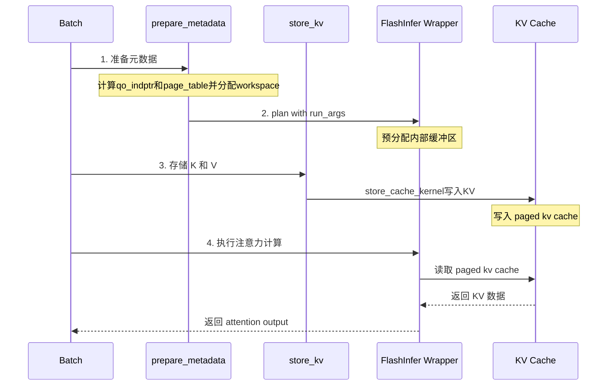

上图展示了 FlashInfer 后端在一次前向传播中的**四个关键阶段**。这些阶段由调度器和模型执行协同完成——`prepare_metadata`
在调度阶段调用（CPU 上执行），而 `store_kv` 和 `wrapper.run` 在模型执行的每层 AttentionLayer 中调用（GPU 上执行）。

**阶段 1：元数据准备（`prepare_metadata`，调度阶段 / CPU）**

此阶段在 Scheduler 组装好 Batch 之后、模型 forward 之前执行。目标是将 batch 中各请求的**结构化信息**转换为 FlashInfer
kernel 所需的**低级张量格式**。

核心任务是计算三组关键数据：

**① `cu_seqlens_q`（Query 累计序列长度）**— 描述每个请求的 query token 数量在拼接后的 batch 中的偏移：

```python
# 三种不同的计算策略：
if max_seqlen_q == 1:  # Decode 阶段：每个请求恰好 1 个 query token
    cu_seqlens_q_cpu = torch.arange(0, padded_size + 1, **CPU_KWARGS)
elif all(l == 0 for l in cached_lens):  # 完整 Prefill（无缓存命中）
    cu_seqlens_q_cpu = cu_seqlens_k_cpu  # Q 和 K 的序列长度相同
else:  # 部分 Prefill（Radix Cache 命中后，仅处理新 token）
    cu_seqlens_q_cpu = torch.tensor([0] + seqlens_q, **CPU_KWARGS).cumsum_(dim=0)
```

三种策略对应了 LLM 推理的三种执行模式：

- **Decode 模式**：batch 中所有请求都只生成 1 个新 token → `cu_seqlens_q = [0, 1, 2, 3, ...]`
- **完整 Prefill**：新请求的 prompt 全部需要处理 → Q 长度 = K 长度
- **部分 Prefill**（Chunked Prefill 或 Radix Cache 命中后）：只有 prompt 的新增部分作为 query → Q 长度 < K 长度

**② `cu_seqlens_k`（Key 累计序列长度）**— 描述每个请求的完整历史 K 序列（包含缓存部分），始终等于
`cumsum([0] + [req.device_len for req in reqs])`。

**③ `indices`（页表索引）**— 将逻辑 token 位置映射到物理 cache 页面。这是一个 GPU 张量，形状为 `[total_kv_tokens]`，每个元素是该
token 的 KV 数据所在的物理页编号。

此外还需要计算 `last_page_len_cpu`（每个请求最后一页的有效 token 数，用于处理非对齐的页面尾部）和 `seq_lens_cpu`（各请求的 K
序列长度）。

**阶段 2：Plan（懒初始化 / 首次执行时）**

FlashInfer 采用**两阶段执行模式**：先 plan 后 run。Plan 阶段根据元数据预分配内部工作缓冲区：

```python
metadata.wrapper.plan(
    qo_indptr=metadata.cu_seqlens_q_cpu,  # Query 偏移指针 (Prefill) 或 indptr (Decode)
    paged_kv_indptr=metadata.cu_seqlens_k_cpu,  # KV 偏移指针
    paged_kv_indices=metadata.indices,  # 页表
    paged_kv_last_page_len=metadata.last_page_len_cpu,
    num_qo_heads=..., num_kv_heads=..., head_dim=...,
    page_size=1, pos_encoding_mode="ROPE_LLAMA",  # 当前固定 page_size=1
    data_type=dtype, non_blocking=True,
    causal=True,  # 仅 Prefill 需要 causal 标志
)
```

Plan 只在**首次**执行时触发（通过 `initialized` 标志位守卫）。后续同一 batch shape 的请求可以复用已分配的缓冲区。Plan
内部会发起一次异步 H2D（Host-to-Device）拷贝，通过 CUDA event 同步确保安全。

**Tensor Core 自动选择**：FlashInferBackend 通过 `use_tensor_cores` 属性决定是否使用 Tensor Core kernel：

```python
GQA = config.num_qo_heads // config.num_kv_heads
use_tensor_cores = (GQA >= 4)  # 当 GQA ratio ≥ 4 时启用 Tensor Core
```

这是因为高 GQA ratio 下 KV head 数远小于 Q head 数，Tensor Core 的矩阵乘法优势更明显。

**阶段 3：KV 存储（`store_kv`，每层 / GPU Kernel）**

在注意力计算之前，必须先将当前层新计算的 K、V 写入 Paged KV Cache：

```python
self.kvcache.store_kv(k, v, batch.out_loc, layer_id)
```

底层调用 CUDA kernel `store_cache`，将 `[num_tokens, num_kv_heads, head_dim]` 的 K/V 张量 scatter-write 到
`_kv_buffer[layer_id]` 的对应位置。`out_loc` 来自 batch 的页表，指明每个 token 应写入哪个物理页面。

**关键细节 — page_size 展平**：当前 mini-sglang 固定 `page_size=1`，但在传入 FlashInfer 前会将 page_size 维度展平：

```python
def _flatten_cache(cache):
    return cache.view(-1, 1, cache.shape[2], cache.shape[3])
# 原始: [num_pages, page_size, num_kv_heads, head_dim]
# 展平: [num_pages * page_size, 1, num_kv_heads, head_dim]
```

这是为了适配 FlashInfer wrapper 对输入 layout 的要求（NHD 格式要求中间维度为 1）。

**阶段 4：注意力执行（`wrapper.run`，每层 / GPU Kernel）**

最后一步是实际调用 FlashInfer 的注意力 kernel：

```python
return metadata.wrapper.run(q=q, paged_kv_cache=kv_cache)
```

FlashInfer kernel 内部完成以下操作：

1. 根据 `qo_indptr` 从拼接的 Q 张量中提取各请求的子序列
2. 根据 `paged_kv_indptr` + `paged_kv_indices` 从 Paged KV Cache 中 gather 各请求的历史 K/V
3. 执行缩放点积注意力（SDPA）：`softmax(Q @ K^T / √d) @ V`
4. 应用 causal mask（Prefill 阶段，Decode 阶段的 single-token 天然满足 causal）
5. 返回拼接后的 attention output

整个过程中，**阶段 1-2 在 CPU/调度线程中执行，阶段 3-4 在 GPU 上逐层执行**。这种设计使得元数据准备的 CPU 开销与 GPU 计算重叠（通过
Overlap Scheduling）。

```python
# 18:57:python/minisgl/layers/attention.py
class AttentionLayer(StateLessOP):
    def forward(self, qkv: Tensor) -> Tensor:
        ctx = get_global_ctx()
        # 1. 拆分 QKV（已融合为单一投影）
        q, k, v = qkv.split([self.qo_attn_dim, self.kv_attn_dim, self.kv_attn_dim], dim=-1)
        # 2. 可选的 QK Norm（Qwen2 等模型需要）
        if self.q_norm is not None:
            self.q_norm.forward_inplace(q.view(-1, self.num_qo_heads, self.head_dim))
            self.k_norm.forward_inplace(k.view(-1, self.num_kv_heads, self.head_dim))
        # 3. 应用旋转位置编码 (RoPE)
        q, k = self.rotary.forward(ctx.batch.positions, q, k)
        # 4. 调用注意力后端（FlashInfer 等）计算 attention output
        q = q.view(-1, self.num_qo_heads, self.head_dim)
        o = ctx.attn_backend.forward(q, k, v, self.layer_id, ctx.batch)
        return o.view(-1, self.qo_attn_dim)
```

**FlashInferBackend.forward** —— store KV → run attention 的完整流程：

```python
176:188:python/minisgl/attention/fi.py
def forward(self, q, k, v, layer_id, batch) -> Tensor:
    def _flatten_cache(cache):  # 将 page_size 维度展平 (当前 page_size=1)
        return cache.view(-1, 1, cache.shape[2], cache.shape[3])

    metadata = batch.attn_metadata
    assert isinstance(metadata, FIMetadata)
    self._initialize_metadata_once(metadata)  # 懒初始化 plan（仅首次）
    self.kvcache.store_kv(k, v, batch.out_loc, layer_id)  # 写入 KV 到 paged cache
    kv_cache = (self.kvcache.k_cache(layer_id), self.kvcache.v_cache(layer_id))
    kv_cache = (_flatten_cache(kv_cache[0]), _flatten_cache(kv_cache[1]))
    return metadata.wrapper.run(q=q, paged_kv_cache=kv_cache)  # 执行注意力
```

**FIMetadata** 包含 FlashInfer 所需的全部元数据，在 `prepare_metadata` 中组装：

```47:78:python/minisgl/attention/fi.py
@dataclass
class FIMetadata(BaseAttnMetadata):
    cu_seqlens_q_cpu:   torch.Tensor  # query 累计序列长度 (CPU)
    cu_seqlens_k_cpu:   torch.Tensor  # key 累计序列长度 (CPU)
    cu_seqlens_q_gpu:   torch.Tensor  # query 累计序列长度 (GPU)
    indices:            torch.Tensor  # 页表索引 (GPU)
    last_page_len_cpu:  torch.Tensor  # 每请求最后一页长度 (CPU)
    num_qo_heads:       int
    num_kv_heads:       int
    head_dim:           int
    page_size:          Literal[1]  # 当前仅支持 page_size=1
    pos_encoding_mode:  str
    seq_lens_cpu:       torch.Tensor  # 各请求序列长度 (CPU)
    dtype:              torch.dtype
    wrapper:            BatchPrefillWithPagedKVCacheWrapper | BatchDecodeWithPagedKVCacheWrapper
    initialized:        bool = False       # 是否已完成 plan
```

**prepare_metadata** 是调度阶段的关键步骤，根据 batch 阶段选择不同的 cu_seqlens 计算策略：

```190:225:python/minisgl/attention/fi.py
def prepare_metadata(self, batch: Batch) -> None:
    reqs = batch.padded_reqs
    seqlens_q = [req.extend_len for req in reqs]   # query 序列长度
    seqlens_k = [req.device_len for req in reqs]    # key 序列总长度
    cached_lens = [req.cached_len for req in reqs]
    cu_seqlens_k_cpu = torch.tensor([0] + seqlens_k, **CPU_KWARGS).cumsum_(dim=0)

    if max_seqlen_q == 1:  # decode: 每个 request 只有一个 query token
        cu_seqlens_q_cpu = torch.arange(0, padded_size + 1, **CPU_KWARGS)
    elif all(l == 0 for l in cached_lens):  # prefill 无缓存命中
        cu_seqlens_q_cpu = cu_seqlens_k_cpu  # Q 和 K 长度相同
    else:  # partial cache hit prefill（Radix Cache 命中后的部分 prefill）
        cu_seqlens_q_cpu = torch.tensor([0] + seqlens_q, **CPU_KWARGS).cumsum_(dim=0)

    # 组装 FIMetadata，选择 prefill 或 decode wrapper
    batch.attn_metadata = FIMetadata(
        ..., wrapper=self.decode_wrappers if batch.is_decode else self.prefill_wrapper
    )
```

### 8.3 Paged Attention 数据布局

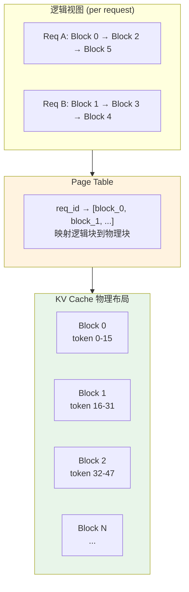

上图展示了 **Paged Attention** 的核心思想——借鉴操作系统的虚拟内存分页机制，将逻辑上连续的 KV 序列映射到物理上不连续的固定大小内存页。

**为什么需要 Paged Attention？**

在传统的连续 KV Cache 方案中，每个请求需要分配一个能容纳其最大可能序列长度的连续内存块。这导致两个问题：

1. **内存浪费**：必须按最大序列长度预分配，但大多数请求在到达最大长度前就结束了
2. **内存碎片**：不同请求的序列长度不同，释放后产生难以复用的碎片

Paged Attention 通过**固定大小的页（Page）+ 页表（Page Table）映射**解决了这两个问题。每个请求的 KV Cache
由若干个物理页组成，这些页在物理内存中无需连续，通过页表维护逻辑序号到物理页号的映射关系。

**物理存储层（Physical Blocks）**

KV Cache 在 GPU 显存中是一个预先分配的大张量：

```
kv_cache: (2, num_layers, num_pages, page_size, num_kv_heads, head_dim)
         │   │          │         │         │            │
         │   │          │         │         │            └── head_dim (128 或 64)
         │   │          │         │            └── 本地 KV 头数（TP 切分后）
         │   │          │         └── page_size（当前固定为 1）
         │   │          └── 总页数（由显存容量自动计算决定，通常数千~数万）
         │   └── Transformer 层数（如 32 层）
         └── K/V 两个缓冲区（index 0 = Key, index 1 = Value）
```

以 Llama-3-8B 为例（`head_dim=128, num_kv_heads=8, num_layers=32, page_size=1, dtype=fp16`）：

- **每页大小** = `2 × 32 × 1 × 8 × 128 × 2 bytes = 128 KB`
- 若有 4096 页：总占用 `4096 × 128 KB = 512 MB`
- 每页存储 1 个 token 在所有层的完整 KV 状态

**逻辑视图（Logical View — per request）**

从单个请求的视角看，其 KV Cache 是一个**有序的页链表**：

```
请求 A（已生成 48 个 token，page_size=1）:
  逻辑位置: [0, 1, 2, ..., 47]
  物理页号: [0, 2, 5, ...]     ← 通过页表查询

请求 B（已生成 33 个 token）:
  逻辑位置: [0, 1, 2, ..., 32]
  物理页号: [1, 3, 4, ...]     ← 与请求 A 的物理页交错
```

注意请求 A 和 B 的物理页是**交错分配**的——这正是分页机制的优势：物理内存可以被任意请求灵活使用，不受逻辑顺序约束。

**页表（Page Table）**

页表是连接逻辑视图和物理存储的核心数据结构。在 mini-sglang 中，页表信息分布在两处：

1. **`Req.page_ids`** (`list[int]`)：每个请求维护自己占用的物理页 ID 列表，顺序对应逻辑位置
2. **`FIMetadata.indices`** (`torch.Tensor`)：FlashInfer 所需的 GPU 张量版本，由所有请求的 `page_ids` 拼接而成

当注意力后端需要读取某请求的 KV 数据时：

```python
# 给定请求 i 的第 j 个逻辑 token：
physical_page_id = batch.reqs[i].page_ids[j]  # 页表查找
kv_data = kv_cache[:, layer_id, physical_page_id, :, :, :]  # 物理地址访问
```

FlashInfer 的 Paged KV Cache kernel 直接消费 `indices` 张量，在 GPU 内部高效完成 gather 操作，避免了逐 index 的 Python 循环。

**页面分配与释放**

页面的生命周期由 `CacheManager`（详见第 9 章）管理：

| 事件               | 页面操作                  |
|------------------|-----------------------|
| 新请求到达            | 从空闲页池分配初始页            |
| Prefill / Decode | 按需追加新页（当现有页不够时）       |
| 请求完成             | 所有页归还空闲池              |
| Radix Cache 命中   | 复用已有页（不重新分配），仅追加未命中部分 |

**page_size=1 的特殊设计**

当前 mini-sglang 固定 `page_size=1`，即每页只存 1 个 token 的 KV 数据。这与 vLLM 等系统默认 `page_size=16` 不同：

| 设计选择                       | 优势           | 劣势                    |
|----------------------------|--------------|-----------------------|
| `page_size=16`（vLLM）       | 页表更小，内部碎片少   | 可能浪费近一页的空间（15/16）     |
| `page_size=1`（mini-sglang） | 零内部碎片，精确按需分配 | 页表较大，每次 decode 都需分配新页 |

选择 `page_size=1` 大大简化了实现——不需要处理"最后一页部分填充"的边界情况（`last_page_len` 始终等于 page_size），同时也使得
Radix Cache 的粒度匹配更自然（每个 token 对应一个独立的缓存单元）。

---

## 9. KV Cache 管理

KV Cache（键值缓存）是 LLM 推理系统的核心数据结构。自回归生成过程中，每个 token 的注意力计算需要访问之前所有 token 的 Key 和
Value，如果不缓存这些 KV 对，每次生成都要重新计算，复杂度将达到 $O(n^2)$。Mini-SGLang 实现了**分页式 KV Cache** + **Radix
前缀缓存**的完整方案。

### 9.1 架构概览

```mermaid
graph TB
    subgraph KVSystem["KV Cache 系统"]
        subgraph Pool["物理存储层 - MHAKVCache"]
            KBUF["K Buffer\n(2, L, P, S, H, D)"]
            VBUF["V Buffer"]
            STORE["store_kv → CUDA Kernel"]
        end

        subgraph Prefix["逻辑管理层 - RadixPrefixCache"]
            TREE["Radix Tree\n前缀匹配与复用"]
            MATCH["match_prefix"]
            INSERT["insert_prefix"]
            EVICT["evict 驱逐"]
        end

        subgraph Manager["调度层 - CacheManager"]
            ALLOC["allocate_paged 分配"]
            FREE["_free 释放"]
            LOCK["lock/unlock 引用计数"]
            PT["Page Table 页表"]
        end
    end

    Manager --> Pool
    Manager --> Prefix
    Pool -->|" CUDA Kernel 写入 "| KBUF
    Pool -->|" CUDA Kernel 写入 "| VBUF
    Prefix -->|" 匹配/插入/驱逐 "| TREE
    style KVSystem fill: #f8f9fa
    style Pool fill: #e3f2fd
    style Prefix fill: #fff3e0
    style Manager fill: #e8f5e9
```

Mini-SGLang 的 KV Cache 系统采用**三层分离架构**，每层职责清晰、通过明确定义的接口交互：

**物理存储层（MHAKVCache）**是整个系统的底座，负责在 GPU 显存中实际存储 KV
数据。它在初始化时预分配一块形状为 `(2, L, P, S, H, D)` 的连续张量——其中 `2` 代表 K/V 双缓冲区、`L` 为 Transformer
层数、`P` 为总页数、`S` 为每页 token 数（mini-sglang 固定为 1）、`H` 为本地 KV 头数（经 TP 切分后）、`D`
为头维度。该层对外暴露的核心操作是 `store_kv()`：接收当前层计算出的 K/V 张量和目标位置索引 `out_loc`（来自页表），调用 CUDA
kernel (`store_cache`) 将数据**散播写入**到预分配缓冲区的对应位置。关键设计点在于 TP 感知——通过 `div_even` 将 KV 头均匀分配到各
GPU，当 `num_kv_heads < tp_size` 时允许复制（`allow_replicate=True`），确保 GQA（分组查询注意力）模型也能正确运行。

**逻辑管理层（RadixPrefixCache）**构建于物理层之上，实现基于**基数树（Radix Tree）**的前缀匹配与复用机制。它维护一棵以
`input_ids` 为键的树形结构，每个叶子节点存储一段已计算好的 KV 缓存的物理页索引。核心操作包括三个：`match_prefix()`
沿树执行前缀查找，返回最长公共前缀对应的缓存句柄；`insert_prefix()` 将新计算的 KV 序列插入树中（按 `page_size` 对齐）；
`evict()` 当内存不足时按策略驱逐最久未访问的叶子节点，释放其占用的物理页。每个节点携带引用计数（`ref_count`
），被活跃请求引用的节点处于"受保护"状态，不会被驱逐。

**调度层（CacheManager）**是连接上层的枢纽，它同时持有物理层的页表（Page Table）和逻辑层的前缀缓存实例。当调度器为新请求分配资源时，CacheManager
的 `allocate_paged()` 方法会先检查空闲页池（`free_slots`），不足时触发 RadixPrefixCache 的 `evict()`
驱逐来回收页面，然后将分配的页索引写入全局页表的对应行。`lock()/unlock()` 操作管理缓存句柄的引用计数——在请求使用某段缓存前
lock（防止被驱逐），完成后 unlock。`cache_req()` 在请求完成一个阶段后将新生成的 KV 序列插入前缀缓存，同时释放不再需要的中间页面。

**三层数据流总览**：请求进入系统 → CacheManager.match_prefix() 查询 RadixTree 获取已缓存的前缀 →
CacheManager.allocate_paged() 为未命中部分分配新页 → 模型逐层 forward，每层 Attention 计算出 K/V → MHAKVCache.store_kv()
通过 CUDA kernel 写入物理缓冲区（位置由 out_loc/页表指定）→ 请求完成后 CacheManager.cache_req() 将完整序列插入
RadixTree。这种分层设计使得物理存储策略（如何分配显存页）和逻辑复用策略（如何匹配公共前缀）可以独立演进。

- **物理存储层** (`MHAKVCache`)：管理 GPU 显存中的实际 KV 数据
- **逻辑管理层** (`RadixPrefixCache`)：基于基数树实现前缀匹配和复用
- **调度层** (`CacheManager`)：协调页面分配、引用计数、前后缀缓存交互

### 9.2 物理存储层 — MHAKVCache

`MHAKVCache` 是分页式 KV Cache 的核心实现，负责在 GPU 显存中分配和管理 KV 缓冲区。

#### 9.2.1 存储布局

```python
# python/minisgl/kvcache/mha_pool.py
class MHAKVCache(BaseKVCachePool):
    def __init__(
            self,
            num_kv_heads: int,  # KV 头数 (GQA 时可能小于 Q 头数)
            num_layers: int,  # Transformer 层数
            head_dim: int,  # 每个头的维度 (通常 128)
            num_pages: int,  # 总页数
            page_size: int,  # 每页 token 数 (通常 16)
            dtype: torch.dtype,  # 数据类型 (fp16/bf16)
            device: torch.device,  # GPU 设备
    ) -> None:
        tp_info = get_tp_info()
        local_kv_heads = div_even(num_kv_heads, tp_info.size, allow_replicate=True)
        self._kv_buffer = torch.empty(
            (2, num_layers, num_pages, page_size, local_kv_heads, head_dim),
            device=device,
            dtype=dtype,
        )
```

关键设计点：

- **维度 `(2, L, P, S, H, D)`**：`2` 表示 K/V 两个缓冲区；`L` 是层数；`P` 是页数；`S` 是每页大小；`H` 是本地 KV 头数（考虑 TP
  切分）；`D` 是头维度
- **TP 感知**：通过 `div_even` 将 KV 头均匀分配到各 GPU，当 `num_kv_heads < tp_size` 时允许复制（`allow_replicate=True`）
- **连续内存**：使用单个 `torch.empty` 分配所有层的 KV 缓存，保证内存连续性

#### 9.2.2 KV 写入操作

```python
# python/minisgl/kvcache/mha_pool.py
def store_kv(
        self, k: torch.Tensor, v: torch.Tensor,
        out_loc: torch.Tensor, layer_id: int
) -> None:
    from minisgl.kernel import store_cache

    store_cache(
        k_cache=self._k_buffer[layer_id].view(self._storage_shape),
        v_cache=self._v_buffer[layer_id].view(self._storage_shape),
        indices=out_loc,
        k=k,
        v=v,
    )
```

`store_kv` 是每层 Transformer 调用的核心接口。它接收当前层计算出的 K、V 张量以及目标位置 `out_loc`（来自页表），调用 CUDA
kernel 将 KV 值写入预分配的缓冲区。`out_loc` 是一个索引张量，每个元素对应一个 token 在 KV buffer 中的物理位置。

#### 9.2.3 抽象基类接口

```python
# python/minisgl/kvcache/base.py
class BaseKVCachePool(ABC):
    """KV Cache 存储池抽象基类"""

    @abstractmethod
    def k_cache(self, index: int) -> torch.Tensor:
        """获取第 index 层的 K 缓冲区"""

    @abstractmethod
    def v_cache(self, index: int) -> torch.Tensor:
        """获取第 index 层的 V 缓冲区"""

    @abstractmethod
    def store_kv(
            self, k: torch.Tensor, v: torch.Tensor,
            out_loc: torch.Tensor, layer_id: int
    ) -> None:
        """将 KV 写入指定位置"""
```

基类定义了统一的接口契约，使得注意力后端可以不关心底层存储实现细节。

### 9.3 逻辑管理层 — RadixPrefixCache

RadixPrefixCache 基于**基数树（Radix Tree）**数据结构实现前缀缓存。其核心思想是：多个请求如果共享相同的前缀（如 system
prompt），可以复用已计算的 KV Cache，避免重复计算。

#### 9.3.1 树节点结构

```python
# python/minisgl/kvcache/radix_cache.py
class RadixTreeNode:
    counter: int = 0  # 全局节点计数器

    def __init__(self, key_fn: KEY_FN, tic: int | None = None) -> None:
        self.key_fn = key_fn  # 键提取函数
        self.children: Dict[Any, RadixTreeNode] = {}  # 子节点字典
        self._parent: RadixTreeNode | None = None  # 父节点
        self.ref_count: int = 0  # 引用计数 (0=可驱逐)
        self.uuid = RadixTreeNode.counter
        RadixTreeNode.counter += 1
        self.timestamp = tic or time.monotonic_ns()  # 用于 LRU 驱逐排序

        # 后续设置的字段
        self._key: torch.Tensor  # 该节点对应的 token IDs
        self._value: torch.Tensor  # 该节点对应的物理页索引
        self._length: int  # key/value 的长度
```

每个树节点代表一段连续的 token 序列及其对应的物理页索引。关键属性：

- **`ref_count`**：引用计数，> 0 表示有活跃请求在使用该节点（受保护，不可驱逐）；= 0 表示可被驱逐
- **`timestamp`**：最后访问时间戳，用于 LRU 驱逐策略——优先驱逐最久未访问的叶子节点
- **`key_fn`**：键提取函数，根据 `page_size` 决定是用单个 token 还是 token 元组作为字典键

#### 9.3.2 核心操作：分裂

```python
# python/minisgl/kvcache/radix_cache.py
def split_at(self, pos: int) -> RadixTreeNode:
    """在位置 pos 处分裂节点，返回新的父节点"""
    assert 0 < pos < self.length
    parent = self.parent

    new_node = RadixTreeNode(self.key_fn, self.timestamp)
    new_node.set_key_value(self._key[:pos], self._value[:pos])
    new_node.set_parent(parent)
    new_node.ref_count = self.ref_count

    self.set_key_value(self._key[pos:], self._value[pos:])
    self.set_parent(new_node)

    return new_node
```

`split_at` 是 Radix Tree 的核心操作之一。当新请求的前缀与现有节点**部分匹配**时（即匹配长度小于节点长度），需要在匹配边界处分裂节点。例如：

```
原始节点: [A, B, C, D] → pages [0, 1, 2, 3]
新输入:   [A, B, X, Y]
匹配长度: 2

分裂后:
  父节点: [A, B] → pages [0, 1]  (共享前缀)
    ├── 原子节点(子): [C, D] → pages [2, 3]
    └── 新节点(子):   [X, Y] → pages [4, 5]  (待分配)
```

#### 9.3.3 核心操作：树遍历匹配

```python
# python/minisgl/kvcache/radix_cache.py
def _tree_walk(self, input_ids: torch.Tensor) -> Tuple[RadixTreeNode, int]:
    prefix_len = 0
    indice_len = len(input_ids)
    node = self.root_node
    tic = time.monotonic_ns()

    while prefix_len < indice_len:
        # 用 key_fn 提取键，查找子节点
        child_node = node.children.get(self.key_fn(input_ids[prefix_len:]))
        if child_node is None:
            return node, prefix_len  # 无匹配子节点，停止
        node = child_node

        # 使用 CUDA kernel 快速比较，找到第一个不匹配的位置
        match_len = node.get_match_len(input_ids[prefix_len:])
        match_len = align_down(match_len, self.page_size)  # 按 page_size 向下对齐
        prefix_len += match_len

        # 部分匹配时需要分裂节点
        if match_len != node.length:
            node = node.split_at(match_len)
            node.timestamp = tic
            return node, prefix_len

        # 完全匹配，更新访问时间戳 (LRU)
        node.timestamp = tic

    return node, prefix_len
```

`_tree_walk` 实现了前缀匹配的核心算法：

1. 从根节点开始，用 `key_fn` 提取键查找子节点
2. 对每个候选子节点调用 `get_match_len`（底层是 CUDA kernel `fast_compare_key`）进行快速比较
3. 匹配长度按 `page_size` 向下对齐——因为 KV cache 以页为单位管理
4. **部分匹配**时触发 `split_at` 分裂；**完全匹配**时更新 LRU 时间戳

#### 9.3.4 前缀匹配与插入

```python
# python/minisgl/kvcache/radix_cache.py
def match_prefix(self, input_ids: torch.Tensor) -> MatchResult:
    """匹配前缀，返回匹配结果（不修改树结构）"""
    node, prefix_len = self._tree_walk(input_ids)
    return MatchResult(RadixCacheHandle(prefix_len, node))


def insert_prefix(
        self, input_ids: torch.Tensor, indices: torch.Tensor
) -> InsertResult:
    """插入新前缀到树中（会修改树结构）"""
    insert_len = align_down(len(input_ids), self.page_size)
    input_ids, indices = input_ids[:insert_len], indices[:insert_len]
    node, prefix_len = self._tree_walk(input_ids)
    if prefix_len != insert_len:  # 有未命中部分需要插入
        new_node = RadixTreeNode(self.key_fn)
        new_node.set_key_value(
            input_ids[prefix_len:], indices[prefix_len:].clone()
        )
        new_node.set_parent(node)
        self.evictable_size += new_node.length
        node = new_node
    return InsertResult(prefix_len, RadixCacheHandle(insert_len, node))
```

- **`match_prefix`**：只读操作，查找最长公共前缀，返回 `MatchResult` 包含匹配长度和对应的树节点句柄
- **`insert_prefix`**：写操作，在匹配位置之后插入新的 token 序列和对应页索引。注意只插入 `page_size` 对齐长度的前缀

#### 9.3.5 引用计数与锁机制

```python
# python/minisgl/kvcache/radix_cache.py
def lock_handle(
        self, handle: BaseCacheHandle, unlock: bool = False
) -> None:
    assert isinstance(handle, RadixCacheHandle)
    node = handle.node
    if unlock:  # 解锁：减少引用计数
        while not node.is_root():
            node.ref_count -= 1
            if node.ref_count == 0:
                self.evictable_size += node.length
                self.protected_size -= node.length
            node = node.parent
    else:  # 锁定：增加引用计数
        while not node.is_root():
            if node.ref_count == 0:
                self.evictable_size -= node.length
                self.protected_size += node.length
            node.ref_count += 1
            node = node.parent
```

引用计数沿着从叶节点到根节点的路径传播。锁定（`unlock=False`）时增加 ref_count，使路径上的所有节点变为「受保护」状态；解锁时减少
ref_count，ref_count 归零的节点变为「可驱逐」状态。这确保了活跃请求使用的 KV Cache 不会被误驱逐。

#### 9.3.6 LRU 驱逐策略

```python
# python/minisgl/kvcache/radix_cache.py
def evict(self, size: int) -> torch.Tensor:
    """驱逐至少 size 个 token 的缓存，返回被释放的页索引"""
    if size == 0:
        return self.empty_tensor
    assert size <= self.evictable_size

    # 收集所有可驱逐的叶子节点
    leave_nodes = self._collect_leave_nodes_for_evict()
    heapq.heapify(leave_nodes)  # 最小堆，按 timestamp 排序 (LRU)
    evicted_indices: List[torch.Tensor] = []
    evicted_size = 0

    while evicted_size < size:
        node = heapq.heappop(leave_nodes)  # 弹出最久未访问的
        assert node.ref_count == 0 and node.is_leaf() and not node.is_root()
        evicted_size += node.length
        evicted_indices.append(node.value)
        self.evictable_size -= node.length
        parent = node.parent
        del parent.children[self.key_fn(node._key)]  # 从父节点移除
        # 如果父节点也变成可驱逐的叶子，加入堆
        if parent.is_leaf() and parent.ref_count == 0:
            heapq.heappush(leave_nodes, parent)

    return torch.cat(evicted_indices)
```

驱逐策略采用 **LRU + 叶子优先**：

1. 只收集 `ref_count == 0` 且为叶子的节点（非叶子节点有子节点依赖，不能直接删）
2. 用最小堆按 `timestamp` 排序，优先驱逐最久未访问的
3. 驱逐后检查父节点是否变为可驱逐叶子，如果是则递归加入候选
4. 返回被释放的物理页索引供 CacheManager 回收

#### 9.3.7 缓存句柄

```python
# python/minisgl/kvcache/radix_cache.py
@dataclass(frozen=True)
class RadixCacheHandle(BaseCacheHandle):
    node: RadixTreeNode

    def get_matched_indices(self) -> torch.Tensor:
        """从根到当前节点收集所有页索引"""
        node = self.node
        value_list: List[torch.Tensor] = []
        while not node.is_root():
            value_list.append(node.value)
            node = node.parent
        value_list.reverse()  # 从根到叶的顺序
        return torch.cat(value_list)
```

`RadixCacheHandle` 是不可变的数据类（`frozen=True`），持有指向 Radix Tree 中某个节点的引用。`get_matched_indices`
沿着父指针回溯到根，收集完整路径上的所有页索引——这就是该请求可以复用的全部 KV Cache 物理位置。

### 9.4 调度层 — CacheManager

`CacheManager` 是连接物理存储和逻辑管理的桥梁，负责页面分配、请求缓存、完整性校验等。

#### 9.4.1 初始化

```python
# python/minisgl/scheduler/cache.py
class CacheManager:
    def __init__(
            self, num_pages: int, page_size: int,
            page_table: torch.Tensor, type: str
    ):
        device = page_table.device
        # 空闲槽位列表，按 page_size 对齐
        # 例如 page_size=2 时: [0, 2, 4, 6, ...]
        self.free_slots = torch.arange(
            num_pages, dtype=torch.int32, device=device
        ) * page_size
        self.prefix_cache = create_prefix_cache(device=device, type=type)
        self.device = device
        self.num_pages = num_pages
        self.page_table = page_table  # [num_reqs, max_seq_len] 页表
        self.page_size = page_size
```

初始化时创建空闲页槽位列表（按 `page_size` 对齐的 token 级索引）和前缀缓存实例。`page_table` 是一个二维张量，
`page_table[req_idx, token_pos]` 存储该请求该位置的物理页索引。

#### 9.4.2 页面分配

```python
# python/minisgl/scheduler/cache.py
def allocate_paged(self, reqs: List[Req]) -> None:
    needed_pages = 0
    allocation_info: List[Tuple[int, int, int]] = []
    for req in reqs:
        first_page = div_ceil(req.cached_len, self.page_size)
        last_page = div_ceil(req.device_len, self.page_size)
        if last_page > first_page:
            needed_pages += last_page - first_page
            allocation_info.append((req.table_idx, first_page, last_page))
    if needed_pages > 0:
        allocated = self._page_to_token(self._allocate(needed_pages))
        _write_page_table(self.page_table, allocated, allocation_info, self.page_size)
```

分配策略：只为每个请求的**非缓存部分**（`cached_len` 到 `device_len`）分配新页面。已命中的前缀部分不需要重新分配。

#### 9.4.3 内部分配与驱逐

```python
# python/minisgl/scheduler/cache.py
def _allocate(self, needed_pages: int) -> torch.Tensor:
    if needed_pages > (free_pages := len(self.free_slots)):
        # 空闲页不足，触发前缀缓存驱逐
        evicted = self.prefix_cache.evict(
            (needed_pages - free_pages) * self.page_size
        )
        self.free_slots = torch.cat([self.free_slots, evicted[:: self.page_size]])
        assert len(self.free_slots) >= needed_pages
    allocated = self.free_slots[:needed_pages]
    self.free_slots = self.free_slots[needed_pages:]
    return allocated
```

当空闲页不足时，自动调用 `prefix_cache.evict()` 从 Radix Cache 中驱逐 LRU 页面来回收空间。这是 PagedAttention 和 Radix
Cache 协同工作的关键机制。

#### 9.4.4 请求缓存流程

```python
# python/minisgl/scheduler/cache.py
def cache_req(self, req: Req, *, finished: bool) -> None:
    """
    缓存区域说明:
    [0, req.cached_len)                       注意力 kernel 可读写的有效区域
    [0, old_handle.cached_len)                prefill 时已在缓存中的部分
    [old_handle.cached_len, req.cached_len)  本次为新请求分配的新页面
    ---
    [old_handle.cached_len, cached_len)      prefill 时不在缓存但后来被其他请求缓存的，需释放防泄漏
    [cached_len, new_handle.cached_len)      新插入到前缀缓存的部分
    [new_handle.cached_len, req.cached_len)  无法插入缓存的尾部，请求完成时应释放
    """
    insert_ids = req.input_ids[: req.cached_len]
    page_indices = self.page_table[req.table_idx, : req.cached_len]
    old_handle = req.cache_handle
    cached_len, new_handle = self.prefix_cache.insert_prefix(insert_ids, page_indices)
    self.unlock(old_handle)  # 先解锁旧句柄
    # 释放已被其他请求缓存的部分（防止内存泄漏）
    self._free(page_indices[old_handle.cached_len: cached_len])
    if finished:  # 请求完成，释放尾部
        self._free(page_indices[new_handle.cached_len:])
    else:  # 请求继续，更新句柄并重新锁定
        req.cache_handle = new_handle
        self.lock(new_handle)
```

这是整个 KV Cache 管理中最复杂的操作之一。代码注释详细说明了各区域的语义：

1. 将请求当前的 token 序列和页索引插入 Radix Tree
2. 解锁旧句柄（允许旧节点被驱逐）
3. 释放已被其他请求间接缓存的部分（避免内存泄漏）
4. 请求完成时释放无法对齐到页边界的尾部；否则保留新句柄供后续 decode 使用

#### 9.4.5 惰性释放

```python
# python/minisgl/scheduler/cache.py
@contextmanager
def lazy_free_region(self):
    """惰性释放上下文管理器，批量回收页面"""

    def lazy_free(indices: torch.Tensor) -> None:
        lazy_free_list.append(indices[:: self.page_size])

    lazy_free_list: List[torch.Tensor] = []
    try:
        self._free = lazy_free  # 临时替换 _free 方法
        yield
    finally:
        del self._free  # 恢复原始方法
        # 一次性合并所有待释放的页
        self.free_slots = torch.cat([self.free_slots] + lazy_free_list)
```

`lazy_free_region` 是一个精巧的设计：在上下文内，`_free` 操作不会立即修改 `free_slots`，而是收集到一个列表中。退出上下文时一次性
`torch.cat` 合并。这避免了频繁的小张量拼接操作，提高了效率。

#### 9.4.6 页表写入

```python
# python/minisgl/scheduler/cache.py
def _write_page_table(
        page_table: torch.Tensor,
        allocated: torch.Tensor,
        allocation_info: List[Tuple[int, int, int]],
        page_size: int,
) -> None:
    needed_tokens = len(allocated)
    # 使用 pinned memory 加速 CPU→GPU 传输
    table_idx_host = torch.empty(needed_tokens, dtype=torch.int64, pin_memory=True)
    positions_host = torch.empty(needed_tokens, dtype=torch.int64, pin_memory=True)
    offset = 0
    for table_idx, first_page, last_page in allocation_info:
        first_pos, last_pos = first_page * page_size, last_page * page_size
        length = last_pos - first_pos
        table_idx_host[offset: offset + length].fill_(table_idx)
        torch.arange(first_pos, last_pos, out=positions_host[offset: offset + length])
        offset += length
    # 异步传输到 GPU 并写入页表
    table_idxs = table_idx_host.to(page_table.device, non_blocking=True)
    offsets = positions_host.to(page_table.device, non_blocking=True)
    page_table[table_idxs, offsets] = allocated
```

页表写入使用了 **pinned memory** + **non_blocking transfer** 优化：先在 pinned memory（页锁定内存）上准备数据，然后异步传输到
GPU，避免阻塞。

### 9.5 完整生命周期图

```mermaid
sequenceDiagram
    participant Req as 新请求
    participant CM as CacheManager
    participant RPC as RadixPrefixCache
    participant Pool as MHAKVCache
    Req ->> CM: match_req(input_ids)
    CM ->> RPC: match_prefix(input_ids)
    RPC -->> CM: MatchResult(handle, cached_len)
    CM -->> Req: 返回匹配结果
    Note over Req, Pool: Prefill 阶段
    Req ->> CM: allocate_paged(reqs)
    CM ->> CM: _allocate(needed_pages)
    alt 空闲页不足
        CM ->> RPC: evict(size)
        RPC -->> CM: evicted_indices
    end
    CM ->> CM: _write_page_table(...)
    Note over Req, Pool: 模型前向 (每层)
    Req ->> Pool: store_kv(k, v, out_loc, layer_id)
    Pool ->> Pool: CUDA Kernel 写入 KV Buffer
    Note over Req, Pool: Decode 完成 / 迭代结束
    Req ->> CM: cache_req(req, finished=False/True)
    CM ->> RPC: insert_prefix(ids, indices)
    RPC -->> CM: InsertResult(cached_len, new_handle)
    CM ->> CM: unlock(old_handle) + _free(leaked)
    alt 请求未完成
        CM ->> RPC: lock(new_handle)
    end
```

### 9.6 关键设计总结

| 设计决策                | 说明                      |
|---------------------|-------------------------|
| **分页式存储**           | 固定大小页面，灵活分配，避免碎片化       |
| **Radix Tree 前缀匹配** | $O(L)$ 复杂度的前缀查找（L 为树深度） |
| **引用计数保护**          | 活跃请求的缓存不会被驱逐            |
| **LRU 驱逐**          | 优先驱逐最久未访问的叶子节点          |
| **惰性释放**            | 批量回收页面，减少 GPU 内存操作      |
| **Pinned Memory**   | 页表写入使用零拷贝传输             |
| **Page-aligned**    | 所有操作按 page_size 对齐，简化管理 |

---

## 10. MoE 支持

混合专家模型（Mixture of Experts, MoE）通过将不同的 token 路由到不同的「专家」子网络来扩展模型容量，而无需成倍增加计算量。Mini-SGLang
完整支持 MoE 推理，包括路由、Token 对齐、融合 kernel 计算和 TP 通信。

### 10.1 整体架构

Mini-SGLang 的 MoE 推理系统采用**三层分层架构**，每一层职责清晰、可独立替换：

```mermaid
graph TB
    subgraph MoESystem["MoE 推理系统"]
        subgraph Layer["MoELayer (layers/moe.py)"]
            INIT["初始化: gate_up_proj + down_proj\nTP 切分权重"]
            FWD["forward: 路由 → Expert → AllReduce"]
        end

        subgraph Backend["FusedMoe (moe/fused.py)"]
            TOPK["fused_topk: TopK + Softmax"]
            IMPL["fused_experts_impl:\nAlign → W1 → Act → W2 → Reduce"]
        end

        subgraph Kernels["Triton Kernels"]
            ALIGN_K["moe_align_block_size"]
            MATMUL1["fused_moe_kernel_triton Stage 1"]
            ACT_K["silu_and_mul / gelu_and_mul"]
            MATMUL2["fused_moe_kernel_triton Stage 2"]
            REDUCE_K["moe_sum_reduce_triton"]
        end
    end

    Layer --> Backend
    Backend --> Kernels
    INIT --> FWD
    FWD --> TOPK
    TOPK --> IMPL
    IMPL --> ALIGN_K
    ALIGN_K --> MATMUL1
    MATMUL1 --> ACT_K
    ACT_K --> MATMUL2
    MATMUL2 --> REDUCE_K
    style MoESystem fill: #faf5ff
    style Layer fill: #ede9fe
    style Backend fill: #ddd6fe
    style Kernels fill: #c4b5fd
```

**层级说明**：

- **Layer 层（`MoELayer`）**：模型层面的封装，负责权重管理（初始化时分配 `gate_up_proj` 和 `down_proj` 张量）、TP 协调（中间维度按
  GPU 数量切分）以及后端调用（将计算委托给 `FusedMoe`）。前向传播结束后，如果处于 TP 模式，还需执行 AllReduce 汇总各 rank
  的部分结果。

- **Backend 层（`FusedMoe`）**：计算逻辑的核心编排者。它将整个 MoE 计算分解为两个阶段——**路由决策阶段**（`fused_topk`：对每个
  token 的路由 logits 执行 Top-K 选择和 Softmax 归一化，确定每个 token 应该被发送到哪些专家）和 **Expert 计算阶段**（
  `fused_experts_impl`：执行完整的 Align → MatMul → Activate → MatMul → Reduce 流水线）。

- **Kernel 层（Triton Kernels）**：最底层的 GPU 计算单元。所有性能关键操作都以自定义 Triton kernel 实现：
  `moe_align_block_size` 负责将 token 按 expert 分组并对齐到 block size；`fused_moe_kernel_triton` 分两个 stage 分别执行
  W1（gate+up 融合权重）和 W2（down 权重）的矩阵乘法；`silu_and_mul` / `gelu_and_mul` 实现 SwiGLU 门控激活；
  `moe_sum_reduce_triton` 将多个 expert 的加权结果归约为最终输出。这种 kernel-level 的融合避免了中间结果写回全局内存，是
  MoE 高性能的关键。

**数据流向**：输入的 `hidden_states [M, H]` 和 `router_logits [M, E]` 从 Layer 层进入 Backend 层，首先经过 TopK+Softmax
路由得到每个 token 的 expert 分配和权重，然后通过 Token 对齐将分散的 token 重新排列为按 expert 连续的组织形式，接着依次通过两个
fused MatMul kernel 和激活函数，最后经 Sum Reduce 合并多 expert 结果，输出 `out_hidden_states [M, H]` 返回给 Layer 层。

### 10.2 MoELayer — 层级接口

`MoELayer` 是模型中使用的 MoE 层封装，负责权重管理、TP 协调和后端调用。

#### 10.2.1 初始化与权重布局

```python
# python/minisgl/layers/moe.py
class MoELayer(BaseOP):
    def __init__(
            self,
            num_experts: int,  # 专家数量 (如 64 for Qwen3-MoE)
            top_k: int,  # 每个 token 激活的专家数 (通常 2-8)
            hidden_size: int,  # 隐藏层维度
            intermediate_size: int,  # 中间层维度 (FFN 维度)
            renormalize: bool = True,  # 是否对路由权重重新归一化
            activation: str = "silu",  # 激活函数类型
            apply_router_weight_on_input: bool = False,
    ):
        super().__init__()

        self.num_experts = num_experts
        self.top_k = top_k
        self.hidden_size = hidden_size
        self.intermediate_size = intermediate_size
        self._comm = DistributedCommunicator()

        tp_info = get_tp_info()
        self.tp_size = tp_size = tp_info.size
        # TP 切分：将中间维度均匀分配到各 GPU
        intermediate_size_per_partition = div_even(intermediate_size, tp_size)
        # gate_up_proj 形状: [num_experts, 2 * inter_size_per_part, hidden_size]
        # 将 gate 投影和 up 投影合并为一个权重矩阵（融合优化）
        self.gate_up_proj = torch.empty(
            num_experts,
            2 * intermediate_size_per_partition,
            hidden_size,
        )
        # down_proj 形状: [num_experts, hidden_size, inter_size_per_part]
        self.down_proj = torch.empty(
            num_experts,
            hidden_size,
            intermediate_size_per_partition,
        )
```

关键设计点：

- **权重融合**：`gate_up_proj` 将 gate 投影和 up 投影合并为单一张量 `[E, 2N, H]`，减少内存访问次数
- **TP 切分**：中间维度 `N` 按 TP rank 数切分，每个 GPU 持有 `N / tp_size`
- **专家并行**：所有专家的权重在同一个张量中，通过 `expert_ids` 索引区分

#### 10.2.2 前向传播

```python
# python/minisgl/layers/moe.py
def forward(
        self, hidden_states: torch.Tensor, router_logits: torch.Tensor
) -> torch.Tensor:
    ctx = get_global_ctx()
    # 委托给 moe_backend (FusedMoe) 执行核心计算
    final_hidden_states = ctx.moe_backend.forward(
        hidden_states=hidden_states,
        w1=self.gate_up_proj,  # [E, 2N, H]
        w2=self.down_proj,  # [E, H, N]
        gating_output=router_logits,  # [seq_len, E] 路由 logits
        topk=self.top_k,
        renormalize=self.renormalize,
        activation=self.activation,
        apply_router_weight_on_input=self.apply_router_weight_on_input,
    )
    # TP 模式下需要 AllReduce 汇总各 rank 的部分结果
    if self.tp_size > 1:
        final_hidden_states = self._comm.all_reduce(final_hidden_states)
    return final_hidden_states
```

前向传播流程清晰：

1. 将输入和路由 logits 传给后端 (`FusedMoe`) 进行 fused 计算
2. 如果处于 TP 模式（多 GPU），执行 `all_reduce` 合并各 rank 的部分结果——因为中间维度被切分了，每个 rank 只计算了部分结果

### 10.3 FusedMoe — 融合后端实现

`FusedMoe` 是 MoE 计算的核心后端，封装了完整的 **Router → Align → MatMul → Activate → Reduce** 流程。

#### 10.3.1 Router: TopK + Softmax

```python
# python/minisgl/moe/fused.py
def fused_topk(
        hidden_states: torch.Tensor,  # [M, H] 输入隐藏状态
        gating_output: torch.Tensor,  # [M, E] 路由 logits
        topk: int,  # 选出的专家数
        renormalize: bool,  # 是否重新归一化
        num_token_non_padded: torch.Tensor | None = None,
) -> Tuple[torch.Tensor, torch.Tensor]:
    from sgl_kernel import topk_softmax

    M, _ = hidden_states.shape
    # 预分配输出缓冲区
    topk_weights = torch.empty(M, topk, dtype=torch.float32, device=hidden_states.device)
    topk_ids = torch.empty(M, topk, dtype=torch.int32, device=hidden_states.device)
    # 调用 fused CUDA kernel 同时完成 TopK 和 Softmax
    topk_softmax(topk_weights, topk_ids, gating_output.float(), renormalize)
    if renormalize:
        # 可选的二次归一化，确保权重和为 1
        topk_weights = topk_weights / (
                topk_weights.sum(dim=-1, keepdim=True) + 1e-8
        )
    if num_token_non_padded is not None:
        # 将 padding token 的 expert id 设为 -1（无效标记）
        indices = torch.arange(0, topk_ids.shape[0], device=topk_ids.device)
        topk_ids[indices >= num_token_non_padded, :] = -1
    return topk_weights, topk_ids
```

`fused_topk` 使用 `sgl_kernel` 的 `topk_softmax` fused kernel，一次调用同时完成：

1. 对每个 token 的路由 logits 取 Top-K
2. 对选出的 K 个 logits 做 Softmax 归一化
3. 返回权重 `topk_weights[M, K]` 和专家 ID `topk_ids[M, K]`

#### 10.3.2 Token 对齐：Block Size Alignment

```python
# python/minisgl/moe/fused.py
def moe_align_block_size(
        topk_ids: torch.Tensor,  # [total_tokens, top_k]
        block_size: int,  # Triton kernel 的 block size
        num_experts: int,
) -> Tuple[torch.Tensor, torch.Tensor, torch.Tensor]:
    """
    将 token 按 expert 分组并按 block_size 对齐填充。

    示例:
    topk_ids = [[2,3], [1,2], [1,3], [1,2]], block_size=4, num_experts=4
    → 展平: [2,3,1,2,1,3,1,2] (8 tokens, 4 experts 各 2 个)
    → padding 后每个 expert 补到 4 的倍数: 各补 2 → 总共 16
    → 按 expert 排序后的 token_ids: [2,5,7,pad, 1,3,6,pad, 0,4,pad,pad, ...]
    """
    from sgl_kernel import moe_align_block_size as sgl_moe_align_block_size

    max_num_tokens_padded = (
            topk_ids.numel() + (num_experts + 1) * (block_size - 1)
    )
    sorted_ids = torch.empty(
        (max_num_tokens_padded,), dtype=torch.int32, device=topk_ids.device
    )
    max_num_m_blocks = div_ceil(max_num_tokens_padded, block_size)
    expert_ids = torch.empty(
        (max_num_m_blocks,), dtype=torch.int32, device=topk_ids.device
    )
    num_tokens_post_pad = torch.empty((1), dtype=torch.int32, device=topk_ids.device)
    cumsum_buffer = torch.empty(
        (num_experts + 2,), dtype=torch.int32, device=topk_ids.device
    )
    sgl_moe_align_block_size(
        topk_ids, num_experts + 1, block_size,
        sorted_ids, expert_ids, num_tokens_post_pad, cumsum_buffer, True,
    )
    return sorted_ids, expert_ids, num_tokens_post_pad
```

这是 MoE 性能的关键优化。Triton kernel 以 `block_size`（如 64）为单位处理 token，因此需要：

1. 将属于同一 expert 的 token 在物理上连续排列（`sorted_ids` 给出排列后的顺序）
2. 每个 expert 的 token 数向上取整到 `block_size` 的倍数（padding 无效 token）
3. 返回 `expert_ids` 标识每个 block 属于哪个 expert

返回值说明：

- **`sorted_ids`**：重排后的 token 索引数组，使得同一 expert 的 token 连续存放
- **`expert_ids`**：每个 block 对应的 expert ID
- **`num_tokens_post_pad`**：padding 后的总 token 数

#### 10.3.3 核心：Fused Expert 实现

```python
# python/minisgl/moe/fused.py
def fused_experts_impl(
        hidden_states: torch.Tensor,  # [M, H] 输入
        w1: torch.Tensor,  # [E, 2N, H] 第一层权重 (gate+up 融合)
        w2: torch.Tensor,  # [E, H, N] 第二层权重 (down)
        topk_weights: torch.Tensor,  # [M, K] 路由权重
        topk_ids: torch.Tensor,  # [M, K] 专家 ID
        activation: str = "silu",
        apply_router_weight_on_input: bool = False,
) -> torch.Tensor:
    from minisgl.kernel import fused_moe_kernel_triton, moe_sum_reduce_triton
    from minisgl.layers import gelu_and_mul, silu_and_mul

    num_tokens, _ = hidden_states.shape
    E, N, _ = w1.shape  # E=专家数, N=中间维度(每半)
    M = num_tokens
    K = topk_ids.shape[1]  # top-k 值

    # 根据输入形状选择最优 Triton kernel 配置
    config = try_get_optimal_moe_config(w1.shape, w2.shape, topk_ids.shape[1], M)

    # 分配中间缓冲区
    cache = torch.empty(
        M * K * max(N, w2.shape[1]),
        device=hidden_states.device, dtype=hidden_states.dtype,
    )
    intermediate_cache1 = cache[: M * K * N].view((M, K, N))  # W1 输出
    intermediate_cache2 = torch.empty(
        (M * K, N // 2), device=hidden_states.device, dtype=hidden_states.dtype,
    )  # 激活函数输出 (SwiGLU: N → N/2)
    intermediate_cache3 = cache[: M * K * w2.shape[1]].view(
        (M, K, w2.shape[1])
    )  # W2 输出

    # === Step 1: Token 对齐 ===
    sorted_token_ids, expert_ids, num_tokens_post_padded = moe_align_block_size(
        topk_ids, config["BLOCK_SIZE_M"], E
    )

    # === Step 2: Stage 1 MatMul — hidden × W1 (gate+up) ===
    fused_moe_kernel_triton(
        curr_hidden_states, w1, intermediate_cache1,
        curr_topk_weights, curr_topk_ids,
        sorted_token_ids, expert_ids, num_tokens_post_padded,
        apply_router_weight_on_input, topk_ids.shape[1], config,
    )

    # === Step 3: 激活函数 (SiLU/GELU) + element-wise mul (SwiGLU) ===
    FN_MAP = {"silu": silu_and_mul, "gelu": gelu_and_mul}
    FN_MAP[activation](
        intermediate_cache1.view(-1, N), intermediate_cache2
    )

    # === Step 4: Stage 2 MatMul — act × W2 (down) ===
    fused_moe_kernel_triton(
        intermediate_cache2, w2, intermediate_cache3,
        curr_topk_weights, curr_topk_ids,
        sorted_token_ids, expert_ids, num_tokens_post_padded,
        not apply_router_weight_on_input, 1, config,
    )

    # === Step 5: 加权求和归约 (多个 expert 结果合并) ===
    moe_sum_reduce_triton(intermediate_cache3, out_hidden_states)
    return out_hidden_states
```

完整的数据流如下：

```
hidden_states [M, H]
    │
    ▼ moe_align_block_size
sorted_token_ids (按 expert 重排的索引)
    │
    ▼ fused_moe_kernel_triton (Stage 1)
intermediate_cache1 [M, K, N]  ← hidden @ W1^T, 乘以路由权重
    │
    ▼ silu_and_mul / gelu_and_mul (SwiGLU)
intermediate_cache2 [M*K, N/2]  ← SiLU(x) * x (门控激活)
    │
    ▼ fused_moe_kernel_triton (Stage 2)
intermediate_cache3 [M, K, H]  ← act @ W2^T, 乘以路由权重
    │
    ▼ moe_sum_reduce_triton
out_hidden_states [M, H]  ← 对 K 个 expert 结果求和
```

#### 10.3.4 FusedMoe 类封装

```python
# python/minisgl/moe/fused.py
class FusedMoe(BaseMoeBackend):
    def forward(
            self,
            hidden_states: torch.Tensor,
            w1: torch.Tensor,
            w2: torch.Tensor,
            gating_output: torch.Tensor,
            topk: int,
            renormalize: bool,
            activation: str = "silu",
            apply_router_weight_on_input: bool = False,
    ) -> torch.Tensor:
        # Phase 1: 路由决策
        topk_weights, topk_ids = fused_topk(
            hidden_states=hidden_states,
            gating_output=gating_output,
            topk=topk,
            renormalize=renormalize,
        )
        # Phase 2: Expert 计算
        return fused_experts_impl(
            hidden_states, w1, w2,
            topk_weights, topk_ids,
            activation,
            apply_router_weight_on_input=apply_router_weight_on_input,
        )
```

`FusedMoe` 将整个 MoE 计算分为两个清晰的阶段：**路由决策**（哪些 token 去哪些 expert）和 **Expert 计算**
（实际的矩阵乘法）。这种分离使得可以独立优化每个阶段。

### 10.4 Triton Kernel 配置调优

```python
# python/minisgl/moe/fused.py
def get_default_config(M, E, N, K, topk):
    """根据输入形状选择最优的 Triton kernel tile 大小"""
    config = {
        "BLOCK_SIZE_M": 64,  # M 维度的 tile 大小
        "BLOCK_SIZE_N": 64,  # N 维度的 tile 大小
        "BLOCK_SIZE_K": 32,  # K 维度的 tile 大小
        "GROUP_SIZE_M": 8,  # 每个 program group 处理的 M 行数
    }
    if M <= E:  # token 数少于等于专家数时使用更小的配置
        config = {
            "BLOCK_SIZE_M": 16,
            "BLOCK_SIZE_N": 32,
            "BLOCK_SIZE_K": 64,
            "GROUP_SIZE_M": 1,
        }
    return config
```

Triton kernel 的性能高度依赖 tile size 配置。Mini-SGLang 根据输入形状动态选择配置：当 token 数较少时（如 decode 阶段），使用更小的
`BLOCK_SIZE_M` 避免 resource waste；当 token 数较多时（如 prefill 阶段），使用更大的 tile 提高 parallelism。

### 10.5 完整数据流图

```mermaid
flowchart TD
    INPUT["hidden_states: [M, H]\nrouter_logits: [M, E]"]
    INPUT --> TOPK["fused_topk\ntopk_softmax CUDA kernel"]
    TOPK -->|" topk_weights [M,K]\ntop_ids [M,K] "| ALIGN
    ALIGN["moe_align_block_size\nCUDA kernel"]
    ALIGN -->|" sorted_ids\nexpert_ids\npadded_len "| S1
    S1["Stage 1: fused_moe_kernel_triton\nhidden @ W1^T × weight"]
    S1 -->|" cache1 [M, K, N] "| ACT
    ACT["silu_and_mul / gelu_and_mul\nSwiGLU 门控激活"]
    ACT -->|" cache2 [M*K, N/2] "| S2
    S2["Stage 2: fused_moe_kernel_triton\nact @ W2^T × weight"]
    S2 -->|" cache3 [M, K, H] "| REDUCE
    REDUCE["moe_sum_reduce_triton\n对 K 个 expert 求和"]
    REDUCE --> OUTPUT["output: [M, H]"]
    style INPUT fill: #e1f5fe
    style OUTPUT fill: #c8e6c9
    style S1 fill: #fff8e1
    style S2 fill: #fff8e1
    style ACT fill: #fce4ec
    style REDUCE fill: #e8f5e9
```

### 10.6 关键优化总结

| 优化技术                     | 说明                                     | 性能影响                            |
|--------------------------|----------------------------------------|---------------------------------|
| **Fused TopK+Softmax**   | 单次 CUDA kernel 完成路由决策                  | 减少 kernel launch，降低延迟           |
| **Block Size Alignment** | 按 Triton tile 大小对齐 token               | 提高 GPU 利用率，避免 branch divergence |
| **Gate-Up 权重融合**         | gate_proj 和 up_proj 合并为一个矩阵            | 减少一次全局内存读取                      |
| **Fused MatMul Kernel**  | 自定义 Triton kernel，内置 routing weight 乘法 | 避免中间结果写回 global memory          |
| **SwiGLU Fuse**          | SiLU activation + element-wise mul 融合  | 单次 kernel pass 完成激活             |
| **Sum Reduce**           | 多 expert 结果原地归约                        | 避免额外分配输出缓冲区                     |
| **TP AllReduce**         | 中间维度切分后跨 GPU 汇总                        | 支持 MoE 模型的多 GPU 并行              |
| **动态 Tile Config**       | 根据 M/E/N 自动选择 kernel 参数                | 不同 batch size 下均保持高性能           |

---

## 11. 分布式通信

Mini-SGLang 通过**张量并行（Tensor Parallelism, TP）**将模型计算分布到多个 GPU 上。分布式通信层提供了统一的抽象接口，支持两种后端实现：PyTorch
原生 distributed 和高性能的 PyNCCL。

### 11.1 架构概览

Mini-SGLang 的分布式通信系统采用**三层模块化设计**——信息层、抽象层和后端实现层，各层之间通过清晰的接口解耦：

```mermaid
graph TB
    subgraph DistSystem["分布式通信系统"]
        subgraph Info["TP 信息 (distributed/info.py)"]
            DI["DistributedInfo\nrank, size"]
            GLOBAL["全局单例 _TP_INFO"]
        end

        subgraph Abs["抽象层 (distributed/impl.py)"]
            IFACE["DistributedImpl (ABC)\n+all_reduce\n+all_gather"]
            COMM["DistributedCommunicator\n插件式后端选择"]
        end

        subgraph Backends["后端实现"]
            TORCH["TorchDistributedImpl\ndist.all_reduce / all_gather"]
            NCCL["PyNCCLDistributedImpl\nsgl_kernel NCCL communicator"]
        end
    end

    COMM --> IFACE
    IFACE <|- - TORCH
IFACE <|-- NCCL
COMM -->|" plugins[-1] "|Backends

style DistSystem fill: #f3e5f5
style Info fill: #e8eaf6
style Abs fill: #fce4ec
style Backends fill: #e0f2f1
```

**信息层（`distributed/info.py`）**是整个系统的配置基础。它维护一个不可变的 `DistributedInfo` 数据类（包含当前进程的 `rank`
和总 GPU 数量 `size`），并通过全局单例 `_TP_INFO` 暴露。该单例采用「一次性写入」策略——在系统启动时由主流程调用
`set_tp_info()` 设置一次，之后所有模块通过 `get_tp_info()` 只读访问。这种设计确保了 TP 配置在运行期间的一致性，避免因意外修改导致的并行错误。

**抽象层（`distributed/impl.py`）**定义了通信操作的统一接口。`DistributedImpl` 抽象基类只声明两个核心原语：`all_reduce()`（跨
rank 归约求和）和 `all_gather()`（跨 rank 数据收集）。`DistributedCommunicator` 是实际的调度器，它内部维护一个 `plugins`
列表，存储所有可用的后端实现。每次调用通信操作时，它将请求委托给列表中**最后一个**
注册的后端（即最新激活的后端）。这种插件栈设计使得可以在运行时动态切换通信后端——例如从默认的 PyTorch 原生实现无缝切换到高性能的
PyNCCL 实现。

**后端实现层**提供两种具体实现：`TorchDistributedImpl` 基于 PyTorch 原生的 `torch.distributed` 包，兼容性最好但有一定框架开销；
`PyNCCLDistributedImpl` 基于 `sgl_kernel` 提供的底层 NCCL 封装，绕过了 Python GIL 和部分 PyTorch
框架层开销，通常能获得更低的延迟和更高的带宽利用率。两种实现共享相同的接口签名，切换时无需修改任何上层代码。

### 11.2 TP 信息管理

上图展示了**双 GPU 张量并行（TP=2）下 Attention 模块的计算与通信流程**，这是理解 TP 并行执行的最直观示例：

```mermaid
graph TB
    subgraph Rank0["GPU Rank 0"]
        Q0["Q₀, K₀, V₀<br/>(列并行的一部分)"]
        ATTN0["Attention 计算"]
        O0["O₀ (部分结果)"]
        AR0["AllReduce(SUM)"]
        OUT0["完整 O"]
    end

    subgraph Rank1["GPU Rank 1"]
        Q1["Q₁, K₁, V₁<br/>(列并行的一部分)"]
        ATTN1["Attention 计算"]
        O1["O₁ (部分结果)"]
        AR1["AllReduce(SUM)"]
        OUT1["完整 O"]
    end

    Q0 --> ATTN0
    Q1 --> ATTN1
    ATTN0 --> O0
    ATTN1 --> O1
    O0 <-->|" NCCL AllReduce "| O1
    O0 --> AR0
    O1 --> AR1
    AR0 --> OUT0
    AR1 --> OUT1
    style Rank0 fill: #e1f5fe
    style Rank1 fill: #fff3e0
```

整个流程分为四个阶段：

**阶段 1：列并行投影（无通信）**。输入张量 `x` 同时送入两个 rank。Rank 0 将 `x` 与本地持有的 Q/K/V 权重切片 `W_qkv[:, 0:N/2]`
相乘，得到属于自己负责的那部分 Q₀、K₀、V₀ 头；Rank 1 同理计算 `x @ W_qkv[:, N/2:N]` 得到 Q₁、K₁、V₁。由于权重是按输出维度（头维度）切分的，每个
rank 独立完成矩阵乘法，**无需任何跨 GPU 通信**。

**阶段 2：独立 Attention 计算（无通信）**。每个 rank 使用本地的 Q、K、V 执行完整的注意力计算——包括 RoPE
位置编码、缩放点积注意力（Softmax(QK^T/√d)V）和可能的 GQA 广播。关键点在于：由于 Q 和 K/V 都在同一 rank 内部（每个 rank 拥有完整的
Q-K 配对关系），Attention 计算可以完全独立进行，不依赖其他 rank 的数据。Rank 0 输出部分结果 O₀，Rank 1 输出部分结果 O₁。

**阶段 3：AllReduce 通信同步点**。这是整个 TP 流程中**唯一的通信操作**。两个 rank 各自持有输出的一部分（O₀ 包含前一半头的注意力输出，O₁
包含后一半头的输出），需要通过 NCCL 的 AllReduce(SUM) 操作将两部分求和还原为完整的输出张量 O = O₀ + O₁。通信数据量为
`bs × seq_len × hidden_dim`，对于典型的 batch size 和序列长度，这个数据量通常在几 MB 到几十 MB 之间。

**阶段 4：完整输出**。AllReduce 完成后，两个 rank 都持有相同的完整输出 O，后续层可以继续使用。

从图中可以看出，TP 并行的核心特征是：**计算密集的矩阵乘法完全并行（零通信），仅在结果汇总时发生一次集合通信**。这种设计使得 TP
在计算/通信比高的场景（如大模型推理）中非常高效。

`DistributedInfo` 使用 `frozen=True` 确保不可变性。`_TP_INFO` 作为模块级全局变量存储当前进程的 TP
信息，采用「一次性设置」策略——在系统启动时由主流程调用 `set_tp_info()` 设置，后续通过 `get_tp_info()` 只读访问。

```python
# python/minisgl/distributed/info.py
@dataclass(frozen=True)
class DistributedInfo:
    """不可变的 TP 信息数据类"""
    rank: int  # 当前 GPU 的 rank (0 ~ size-1)
    size: int  # 总 GPU 数量

    def __post_init__(self):
        assert 0 <= self.rank < self.size

    def is_primary(self) -> bool:
        return self.rank == 0  # rank 0 是主进程


# 全局单例，在初始化时设置，之后只读
_TP_INFO: DistributedInfo | None = None


def set_tp_info(rank: int, size: int) -> None:
    global _TP_INFO
    if _TP_INFO is not None:
        raise RuntimeError("TP info has been set")  # 只能设置一次
    _TP_INFO = DistributedInfo(rank, size)


def get_tp_info() -> DistributedInfo:
    if _TP_INFO is None:
        raise RuntimeError("TP info has not been set")
    return _TP_INFO
```

**TP 各阶段通信量**：

| 操作              | 通信模式                | 数据量                         |
|-----------------|---------------------|-----------------------------|
| QKV 列并行         | 无通信                 | 0                           |
| Attention       | 各 rank 独立计算         | 0                           |
| O 投影输出          | **AllReduce (SUM)** | `bs × seq_len × hidden_dim` |
| MLP Gate-Up 列并行 | 无通信                 | 0                           |
| MLP Down 行并行    | **AllReduce (SUM)** | `bs × seq_len × hidden_dim` |

### 11.3 抽象接口

上图以 UML 类图形式展示了分布式通信模块的**接口继承体系**，核心设计遵循「接口隔离」原则——顶层只声明最少的通信原语：

```mermaid
classDiagram
    class DistributedComm {
        <<interface>>
        +all_reduce(tensor) tensor
        +all_gather(tensor, dim) tensor
        +broadcast(tensor, src) tensor
        +rank() int
        +world_size() int
    }

    class TorchDistributedImpl {
        -process_group: ProcessGroup
        +all_reduce() dist.all_reduce
        +all_gather() dist.all_gather
    }

    class PyNCCLDistributedImpl {
        -comm: NCCLCommunicator
        -buffer_pool: BufferPool
        +all_reduce() comm.all_reduce
        +all_gather() comm.all_gather
    }

    DistributedComm <|.. TorchDistributedImpl
    DistributedComm <|.. PyNCCLDistributedImpl
```

**`DistributedComm` 接口**定义了 5 个方法签名（图中为设计视图），但实际抽象基类 `DistributedImpl` 只强制要求实现其中 2
个核心方法：

- **`all_reduce(tensor)`**：归约操作。所有 rank 将各自持有的张量按元素求和（SUM），结果广播回每个 rank。这是 TP
  并行中使用最频繁的通信原语——每当行并行层（如 `LinearOProj`、`LinearRowParallel`）完成局部计算后，都需要调用 `all_reduce`
  来汇总各 rank 的部分结果。语义上等价于 MPI 的 `AllReduce` + `SUM_OP`。
- **`all_gather(tensor)`**：收集操作。每个 rank 提供一个张量片段，最终所有 rank 都获得拼接后的完整张量。典型使用场景包括 KV
  Cache 收集（当需要跨 rank 组装完整的 KV 序列时）和 Embedding 层的词汇表并行输出。

两种具体实现的内部差异体现在私有字段上：`TorchDistributedImpl` 持有 PyTorch 的 `ProcessGroup` 对象（用于指定通信组）；
`PyNCCLDistributedImpl` 持有 `sgl_kernel` 提供的原生 NCCL Communicator 和 BufferPool（用于管理预分配的通信缓冲区，减少运行时内存分配开销）。

### 11.4 后端实现一：PyTorch Native

```python
# python/minisgl/distributed/impl.py
@dataclass
class TorchDistributedImpl(DistributedImpl):
    """基于 torch.distributed 的默认实现"""

    def all_reduce(self, x: torch.Tensor) -> torch.Tensor:
        tp_size = dist.get_world_size()
        if tp_size == 1:
            return x  # 单 GPU 时直接返回，无需通信
        dist.all_reduce(x, op=dist.ReduceOp.SUM)  # 原地求和
        return x

    def all_gather(self, x: torch.Tensor) -> torch.Tensor:
        tp_size = dist.get_world_size()
        if tp_size == 1:
            return x
        shape = list(x.shape)
        shape[0] = shape[0] * tp_size  # 第 0 维扩展 tp_size 倍
        out = torch.empty(shape, dtype=x.dtype, device=x.device)
        dist.all_gather_into_tensor(out, x)  # 收集到 out
        return out
```

PyTorch 原生实现的要点：

- **快速路径**：`tp_size == 1` 时跳过所有通信操作（零开销）
- **原地操作**：`all_reduce` 直接修改输入张量，避免额外内存分配
- **预分配输出**：`all_gather` 预先分配正确形状的输出缓冲区

### 11.5 后端实现二：PyNCCL

```python
# python/minisgl/distributed/impl.py
@dataclass
class PyNCCLDistributedImpl(DistributedImpl):
    """基于 sgl_kernel PyNCCL 的高性能实现"""
    comm: PyNCCLCommunicator  # C++/CUDA 级别的 NCCL 封装

    def all_reduce(self, x: torch.Tensor) -> torch.Tensor:
        self.comm.all_reduce(x, "sum")  # 调用底层 NCCL AllReduce
        return x

    def all_gather(self, x: torch.Tensor) -> torch.Tensor:
        from .info import get_tp_info

        world_size = get_tp_info().size
        output_shape = list(x.shape)
        output_shape[0] *= world_size
        result = x.new_empty(output_shape)  # 保持 dtype 和 device
        self.comm.all_gather(result, x)  # 调用底层 NCCL AllGather
        return result
```

PyNCCL 实现使用 `sgl_kernel` 提供的底层 NCCL communicator，相比 PyTorch 原生实现通常有更低的延迟和更高的带宽利用率——因为它绕过了
Python GIL 和一些 PyTorch 框架层的开销。

### 11.6 插件式通信器

```python
# python/minisgl/distributed/impl.py
class DistributedCommunicator:
    """插件式分布式通信器，支持运行时切换后端"""
    plugins: List[DistributedImpl] = [TorchDistributedImpl()]  # 默认后端

    def all_reduce(self, x: torch.Tensor) -> torch.Tensor:
        return self.plugins[-1].all_reduce(x)  # 使用最后一个注册的后端

    def all_gather(self, x: torch.Tensor) -> torch.Tensor:
        return self.plugins[-1].all_gather(x)
```

**插件模式设计**：`plugins` 列表存储所有可用的后端实现，始终使用最后一个（最新注册的）作为活跃后端。这使得可以在运行时动态切换通信后端：

```python
# 启用 PyNCCL 后端（覆盖默认的 Torch 实现）
def enable_pynccl_distributed(
        tp_info: DistributedInfo,
        tp_cpu_group: torch.distributed.ProcessGroup,
        max_bytes: int,
) -> None:
    if tp_info.size == 1:
        return  # 单 GPU 无需启用
    from minisgl.kernel import init_pynccl

    comm = init_pynccl(
        tp_rank=tp_info.rank,
        tp_size=tp_info.size,
        tp_cpu_group=tp_cpu_group,
        max_size_bytes=max_bytes,  # 通信缓冲区最大字节数
    )
    # 追加到 plugins 列表末尾，成为新的活跃后端
    DistributedCommunicator.plugins.append(PyNCCLDistributedImpl(comm))


def destroy_distributed() -> None:
    """销毁所有通信插件（用于清理）"""
    DistributedCommunicator.plugins = []
```

### 11.7 TP 通信模式详解

#### 11.7.1 列并行 + AllReduce（Attention）

```mermaid
sequenceDiagram
    participant R0 as Rank 0
    participant R1 as Rank 1
    participant NCCL as NCCL Backend
    Note over R0, R1: Q/K/V 权重按列切分到各 rank
    R0 ->> R0: Q₀ = x @ Wq[:, 0:N/2]
    R1 ->> R1: Q₁ = x @ Wq[:, N/2:N]
    R0 ->> R0: Attn₀ = Softmax(Q₀K₀ᵀ/√d) V₀
    R1 ->> R1: Attn₁ = Softmax(Q₁K₁ᵀ/√d) V₁
    R0 ->> NCCL: all_reduce(O₀, SUM)
    R1 ->> NCCL: all_reduce(O₁, SUM)
    NCCL -->> R0: O = O₀ + O₁ ✓
    NCCL -->> R1: O = O₀ + O₁ ✓
```

这是最常用的 TP 通信模式：

1. 每个 rank 持有权重的不同列切片
2. 各自独立计算局部的 Attention 结果
3. 通过 `AllReduce(SUM)` 将部分结果求和得到完整输出

#### 11.7.2 行并行 + AllGather（KV Cache）

某些场景下需要按行切分权重，此时使用 `AllGather` 从各 rank 收集完整的张量：

```mermaid
graph LR
    subgraph Before["AllGather 前"]
        R0V["Rank 0: [seq/2, H]"]
        R1V["Rank 1: [seq/2, H]"]
    end
    subgraph After["AllGather 后"]
        FULL["两个 Rank 都持有: [seq, H]"]
    end
    Before -->|" all_gather "| After
    style Before fill: #e3f2fd
    style After fill: #c8e6c9
```

这种模式在 KV Cache 场景中尤为关键：

1. **按行切分**：每个 rank 持有序列的不同片段（如 Rank 0 持有前 `seq/2` 个 token 的 K/V，Rank 1 持有后 `seq/2` 个）
2. **AllGather 收集**：Attention 计算需要完整的 K/V 序列来计算点积注意力，因此每个 rank 需要通过 `all_gather` 从所有 rank
   收集完整的 `[seq, H]` 张量
3. **通信代价**：AllGather 的数据量为 `[seq, H] × (size - 1)`，比 AllReduce 更大，因此应尽量减少使用频率

实际应用中，FlashInfer 等注意力后端会自动处理 KV Cache 的分片与收集，上层代码无需手动调用 AllGather。

### 11.8 通信开销分析

| 操作                      | 数据量                      | 频率      | 优化手段                        |
|-------------------------|--------------------------|---------|-----------------------------|
| **Attention AllReduce** | `[batch, seq, head_dim]` | 每层每步    | PyNCCL、overlap with compute |
| **FFN AllReduce**       | `[batch, seq, hidden]`   | 每层每步    | 同上                          |
| **MoE AllReduce**       | `[batch, seq, hidden]`   | MoE 层每步 | 中间维度已切分，通信量不变               |
| **Embedding AllGather** | `[batch, seq, hidden]`   | 仅首层     | 可与 prefill overlap          |

关键优化思路：**通信-计算重叠**。在 Attention 计算中，`all_reduce` 可以与最后的线性投影（output_proj）部分重叠执行，隐藏通信延迟。

## 12. 性能优化技术

### 12.1 优化技术总览

```mermaid
quadrantChart
    title 性能优化技术分类
    x-axis "低实现复杂度" --> "高实现复杂度"
    y-axis "低收益" --> "高收益"
    "CUDA Graph": [0.75, 0.95]
    "Overlap Scheduling": [0.6, 0.85]
    "PagedAttention": [0.65, 0.9]
    "Radix Cache": [0.55, 0.8]
    "Chunked Prefill": [0.5, 0.75]
    "Tensor Parallelism": [0.8, 0.85]
    "Kernel Fusion": [0.45, 0.7]
    "MoE Token Align": [0.4, 0.6]
```

上图将 mini-sglang 采用的八种优化技术按照**实现复杂度**和**性能收益**两个维度进行分类：

- **右上角（高收益 / 中高复杂度）**：**CUDA Graph** 是性价比最高的优化，在 Decode 阶段通过捕获-重放 GPU 操作序列消除 Python
  开销和 kernel launch 延迟，吞吐提升可达 10-30%。**PagedAttention** 通过页式管理显著提升显存利用率。**Tensor Parallelism**
  实现复杂度高但线性扩展性好。
- **中上区域（高收益 / 中等复杂度）**：**Overlap Scheduling** 将 CPU 调度与 GPU 计算流水线化，隐藏调度延迟。**Radix Cache**
  利用前缀复用减少重复计算。
- **左下区域（中等收益 / 较低复杂度）**：**Chunked Prefill**、**Kernel Fusion**、**MoE Token Align**
  属于基础优化手段，虽然单独收益有限，但与其他技术组合时能产生协同效应。

整体来看，mini-sglang 的优化策略遵循「**抓主要矛盾**」原则——优先实现高收益的核心优化（CUDA
Graph、PagedAttention），再逐步补充辅助优化手段。

### 12.2 各优化技术的效果与原理

| 优化技术                   | 解决的问题                  | 原理                                | 收益                 |
|------------------------|------------------------|-----------------------------------|--------------------|
| **CUDA Graph**         | GPU kernel launch 开销   | 预先捕获整个 forward 过程， replay 时只需一次调用 | Decode 吞吐提升 10-30% |
| **Overlap Scheduling** | CPU 调度等待 GPU           | GPU 计算与 CPU 调度流水线化                | 延迟降低 1-3ms/batch   |
| **PagedAttention**     | KV Cache 内存碎片          | 类似虚拟内存的页式管理                       | 显存利用率提升 20-50%     |
| **Radix Cache**        | 重复 prompt 重复计算         | 基数树存储公共前缀的 KV                     | 相似请求加速显著           |
| **Chunked Prefill**    | 长 prompt 导致首 token 延迟高 | 分块处理，与 decode 交错                  | TTFT 降低，吞吐提升       |
| **Kernel Fusion**      | 多次 kernel launch 开销    | 将多个操作合并为一个 kernel                 | 减少 GPU 同步点         |

### 12.3 CUDA Graph 捕获范围

```mermaid
graph TB
    subgraph Captured["CUDA Graph 捕获范围内"]
        EMB[Embedding]
        LAYER1[Layer 1: Attn + MLP]
        LAYER2[Layer 2: Attn + MLP]
        LAYERN["... 更多层 ..."]
        LAST_LAYER[Layer N: Attn + MLP]
        HEAD[LM Head]
    end

    subgraph NotCaptured["不在捕获范围内"]
        KV_STORE["KV Cache 写入 (动态地址)"]
        SAMPLING["采样 (依赖动态 logits)"]
        META_PREP["元数据准备 (每批变化)"]
    end

    Captured --> LOGITS[Logits 输出]
    LOGITS --> NotCaptured
    style Captured fill: #c8e6c9
    style NotCaptured fill: #ffcdd2
```

CUDA Graph 的核心约束是**捕获期间的所有内存操作必须使用固定地址**。基于此约束，图中绿色区域表示可以被捕获到 CUDA Graph
中的操作，红色区域则必须在 graph replay 之外执行：

- **✅ 可捕获（绿色）**：模型的前向传播主体，包括 Embedding、N 层 Transformer DecoderLayer（每层含 Attention + MLP/MoE）、以及 LM
  Head。这些操作的内存布局是固定的——输入张量从静态缓冲区读取，中间结果写入固定位置的缓冲区。

- **❌ 不可捕获（红色）**：
    - **KV Cache 写入**：每次 decode step 的 `out_loc`（输出位置索引）取决于各请求的已生成长度，是动态变化的。CUDA Graph
      要求固定的内存地址，因此无法捕获分散写操作。
    - **采样**：采样依赖当前步的 logits 分布，且不同请求可能采用不同的采样策略（贪婪 vs 随机），必须在 graph 外执行。
    - **元数据准备**：每批请求的组成、位置 ID、序列长度等元数据都在变化，无法静态确定。

实际执行流程为：`Graph Replay（固定计算） → KV Store（动态写入） → Sampling（动态采样） → 准备下一轮元数据`。这种设计使得 CUDA
Graph 能覆盖 ~90% 以上的 GPU 计算量，同时保持调度的灵活性。

> **注意**：KV Cache 写入使用动态索引（`out_loc`），无法被 CUDA Graph 捕获，因此在 graph replay 后单独执行。

---

## 13. 扩展性设计

### 13.1 注册器模式

Mini-SGLang 使用注册器模式实现插件化扩展：

```mermaid
graph TB
    REG_ATTN["Registry: SUPPORTED_ATTENTION_BACKENDS"]
    REG_CACHE["Registry: SUPPORTED_CACHE_MANAGER"]
    REG_MOE["Registry: SUPPORTED_MOE_BACKENDS"]
    REG_MODEL["Registry: _MODEL_REGISTRY"]
    FA["@register('fa')<br/>FlashAttentionBackend"]
    FI["@register('fi')<br/>FlashInferBackend"]
    TRT["@register('trtllm')<br/>TRTLLMBackend"]
    RADIX["@register('radix')<br/>RadixCacheManager"]
    NAIVE["@register('naive')<br/>NaiveCacheManager"]
    LLAMA["@register('LlamaForCausalLM')<br/>Llama 模型"]
    QWEN3["@register('Qwen3ForCausalLM')<br/>Qwen3 模型"]
    REG_ATTN --> FA
    REG_ATTN --> FI
    REG_ATTN --> TRT
    REG_CACHE --> RADIX
    REG_CACHE --> NAIVE
    REG_MODEL --> LLAMA
    REG_MODEL --> QWEN3
    style REG_ATTN fill: #e1f5fe
    style REG_CACHE fill: #fff3e0
    style REG_MODEL fill: #e8f5e9
```

**如何添加新的注意力后端**：

```python
# 1. 继承 BaseAttnBackend
class MyAttnBackend(BaseAttnBackend):
    def forward(self, q, k, v, layer_id, batch):
        # 自定义实现
        pass


# 2. 注册
@SUPPORTED_ATTENTION_BACKENDS.register("my_backend")
def create_my_backend(config):
    return MyAttnBackend(config)

# 3. 使用
# python -m minisgl --model ... --attn my_backend
```

### 13.2 抽象基类体系

```mermaid
classDiagram
    class BaseOP {
        <<abstract>>
        +forward(*args, **kwargs) Any
        +state_dict(prefix) Dict
        +load_state_dict(state_dict) void
    }

    class BaseLLMModel {
        <<abstract>>
        +forward(batch) Tensor
        +load_weights(path, device) void
    }

    class BaseAttnBackend {
        <<abstract>>
        +forward(q, k, v, layer_id, batch) Tensor
        +prepare_metadata(batch) BaseAttnMetadata
    }

    class BaseKVCachePool {
        <<abstract>>
        +allocate(num_pages) BaseCacheHandle
        +free(handle) void
        +store_kv(k, v, out_loc, layer_id) void
    }

    class BasePrefixCache {
        <<abstract>>
        +match_prefix(input_ids) MatchResult
        +insert_prefix(input_ids, indices) InsertResult
        +evict(size) int
    }

    class BaseMoeBackend {
        <<abstract>>
        +forward(hidden_states, w1, w2, topk_weights, topk_ids, ...) Tensor
    }

    class BaseCacheHandle {
        <<abstract>>
        +lock()
        +unlock()
    }

    class DistributedComm {
        <<interface>>
        +all_reduce(tensor) tensor
        +all_gather(tensor, dim) tensor
        +rank() int
        +world_size() int
    }
```

上图展示了 mini-sglang 的**抽象基类体系**，这些基类构成了整个框架的骨架，定义了各模块之间的契约：

- **`BaseOP`**：所有神经网络层的根基类。提供 `forward()` 抽象方法和 `state_dict()` / `load_state_dict()`
  的默认递归实现。所有具体层（Linear、Attention、MLP 等）都直接或间接继承自它。

- **`BaseLLMModel`**：模型级基类（如 `LlamaModel`、`Qwen2Model`）。封装了完整的 Transformer 前向传播逻辑——从 Embedding → N ×
  DecoderLayer → LM Head。它组合了多个 `BaseOP` 子类实例。

- **`BaseAttnBackend`**：注意力后端基类。定义了 `forward(q, k, v, layer_id, batch)` 和 `prepare_metadata(batch)`
  两个核心接口。不同的注意力实现（FlashInfer、FlashAttention、TensorRT-LLM）通过实现此接口来互换。

- **`BaseKVCachePool`**：KV Cache 池基类。定义了 `allocate()`、`free()`、`store_kv()` 三个生命周期操作。Paged Attention 和
  Radix Cache 是其典型实现。

- **`BasePrefixCache`**：前缀缓存基类（Radix Tree 缓存接口）。定义了 `match_prefix()`（前缀匹配）、`insert_prefix()`（插入缓存）、
  `evict()`（驱逐回收）三个操作。

- **`BaseMoeBackend`**：MoE 后端基类。定义 MoE 层的统一前向接口，隐藏了不同 MoE 实现的差异。

- **`BaseCacheHandle`**：缓存句柄基类。提供 `lock()` / `unlock()` 接口用于并发访问控制。

- **`DistributedComm`**：分布式通信接口。定义了 `all_reduce()` 和 `all_gather()` 两个通信原语，PyTorch Distributed 和
  PyNCCL 是两种典型实现。

这套基类体系的核心理念是**面向接口编程**——上层模块只依赖抽象接口，不依赖具体实现，从而使得替换注意力后端、缓存策略或通信方式时无需修改上层代码。

### 13.3 项目目录与模块职责

| 目录             | 职责             | 核心文件                                         |
|----------------|----------------|----------------------------------------------|
| `core/`        | 核心数据结构         | `core.py` - Req, Batch, Context 等            |
| `engine/`      | 推理引擎           | `engine.py` - Engine, GraphRunner, Sampler   |
| `scheduler/`   | 请求调度           | `scheduler.py` - 主调度循环                       |
| `models/`      | 模型定义           | `llama/`, `qwen2/`, `qwen3/`, `mistral/`     |
| `layers/`      | 神经网络层          | `linear.py`, `norm.py`, `rope.py`            |
| `attention/`   | 注意力后端          | `flashinfer.py`, `flashattn.py`, `hybrid.py` |
| `kvcache/`     | KV 缓存管理        | `mha_kv_cache.py`, `radix_cache.py`          |
| `moe/`         | MoE 实现         | `moe_layer.py`, `kernel.py`                  |
| `distributed/` | 分布式通信          | `py_torch_distributed.py`, `pynccl.py`       |
| `server/`      | API 服务         | `launch.py` - 服务启动                           |
| `message/`     | 消息协议           | `defs.py` - 消息类型定义                           |
| `tokenizer/`   | 分词服务           | `worker.py` - Tokenizer/Detokenizer worker   |
| `kernel/`      | CUDA/Triton 内核 | `csrc/`, `triton/` - 自定义 kernel              |

---

## 附录：快速启动指南

### 安装依赖

```bash
cd mini-sglang
pip install -e .
```

### 启动 API 服务

```bash
# 单卡启动
python -m minisgl --model Qwen/Qwen3-0.6B --port 1919

# 多卡张量并行
python -m minisgl --model Qwen/Qwen3-4B --tp 4 --port 1919

# 指定注意力后端
python -m minisgl --model Qwen/Qwen3-0.6B --attn fa,fi

# 使用 Radix Cache
python -m minisgl --model Qwen/Qwen3-0.6B --cache radix
```

### 发送请求

```bash
curl http://localhost:1919/v1/chat/completions \
  -H "Content-Type: application/json" \
  -d '{
    "model": "default",
    "messages": [{"role": "user", "content": "你好！"}],
    "max_tokens": 100,
    "stream": true
  }'
```

### 交互式 Shell

```bash
python -m minisgl --model Qwen/Qwen3-0.6B --shell
```

---

### 完整调用链路总结

```
用户 HTTP 请求
    │
    ▼
API Server (api_server.py)
    ├── new_user() → 分配 uid
    ├── send_one(TokenizeMsg) ──ZMQ──▶ Tokenizer Worker
    │                              ├── HuggingFace encode
    │                              └── send(UserMsg) ──ZMQ──▶ Scheduler Rank 0
    │                                                    │
    ▼                                                    ▼
StreamingResponse                               Scheduler.run_forever()
    │                                          │
    │  ◄── stream_chat_completions() ◄────────┤ overlap_loop():
    │     ◄── wait_for_ack() ◄───────────────│   ├── receive_msg() 接收新请求
    │        ◄── UserReply (via ZMQ) ◄──────┤   ├── _schedule_next_batch() 调度
    │                                         │   │   ├── PrefillManager.schedule_next_batch()
    │                                         │   │   │   └── PrefillAdder.try_add_one()
    │                                         │   │   │       ├── RadixCache.match_prefix()
    │                                         │   │   │       └── 创建 Req / ChunkedReq
    │                                         │   │   └── DecodeManager.schedule_next_batch()
    │                                         │   ├── _forward() 执行推理
    │                                         │   │   ├── Engine.forward_batch()
    │                                         │   │   │   ├── GraphRunner.replay() 或 model.forward()
    │                                         │   │   │   │   ├── LlamaModel.forward()
    │                                         │   │   │   │   │   ├── Embedding
    │                                         │   │   │   │   │   ├── N × DecoderLayer
    │                                         │   │   │   │   │   │   ├── RMSNorm + Attention(QKV+RoPE+FlashInfer)
    │                                         │   │   │   │   │   │   └── RMSNorm + MLP/MoE
    │                                         │   │   │   │   └── LM Head
    │                                         │   │   │   └── Sampler.sample() → argmax / flashinfer sampling
    │                                         │   │   └── _process_last_data() 处理上一轮结果
    │                                         │   │       ├── append_host() 追加 token
    │                                         │   │       ├── send(DetokenizeMsg) ──ZMQ──▶ Detokenizer
    │                                         │   │       └── CacheManager.cache_req() 更新 Radix Cache
    │                                         ▼   └── (返回 ongoing_data 给下一轮)
    │                              Detokenizer Worker
    │                                  ├── HuggingFace decode
    │                                  └── send(UserReply) ──ZMQ──▶ API Server
    ▼
SSE: data: {"choices": [{"delta": {"content": "..."}}]}
```

---

## 14. 消息协议与通信机制

Mini-SGLang 的多进程架构依赖一套完整的**消息协议**来实现进程间通信（IPC）。这套协议基于 **ZMQ (ZeroMQ)** 进行传输，使用 *
*MessagePack** 进行序列化，并定义了三组独立的消息类型分别用于前端→Tokenizer、Tokenizer→Scheduler、Scheduler→Tokenizer 的通信。

### 14.1 消息类型体系

```mermaid
classDiagram
    class BaseBackendMsg {
        <<abstract>>
        +encoder() Dict
        +decoder(json) BaseBackendMsg
    }
    class BaseFrontendMsg {
        <<abstract>>
        +encoder(msg) Dict
        +decoder(json) BaseFrontendMsg
    }
    class BaseTokenizerMsg {
        <<abstract>>
        +encoder(msg) Dict
        +decoder(json) BaseTokenizerMsg
    }

    class UserMsg {
        +uid: int
        +input_ids: Tensor
        +sampling_params: SamplingParams
    }
    class AbortBackendMsg {
        +uid: int
    }
    class UserReply {
        +uid: int
        +incremental_output: str
        +finished: bool
    }
    class TokenizeMsg {
        +uid: int
        +text: str | List
        +sampling_params: SamplingParams
    }
    class DetokenizeMsg {
        +uid: int
        +next_token: int
        +finished: bool
    }

    class BatchBackendMsg {
        +data: List~BaseBackendMsg~
    }
    class BatchFrontendMsg {
        +data: List~BaseFrontendMsg~
    }
    class BatchTokenizerMsg {
        +data: List~BaseTokenizerMsg~
    }

    BaseBackendMsg <|-- UserMsg
    BaseBackendMsg <|-- AbortBackendMsg
    BaseBackendMsg <|-- BatchBackendMsg
    BaseFrontendMsg <|-- UserReply
    BaseFrontendMsg <|-- BatchFrontendMsg
    BaseTokenizerMsg <|-- TokenizeMsg
    BaseTokenizerMsg <|-- DetokenizeMsg
    BaseTokenizerMsg <|-- AbortMsg
    BaseTokenizerMsg <|-- BatchTokenizerMsg
```

**三组消息的职责划分**：

| 消息组                | 发送方 → 接收方                | 用途        | 关键消息                         |
|--------------------|--------------------------|-----------|------------------------------|
| `BaseTokenizerMsg` | API Server → Tokenizer   | 编码文本、中止请求 | `TokenizeMsg`, `AbortMsg`    |
| `BaseBackendMsg`   | Tokenizer → Scheduler    | 投递编码后的请求  | `UserMsg`, `AbortBackendMsg` |
| `BaseFrontendMsg`  | Detokenizer → API Server | 流式返回生成的文本 | `UserReply`                  |

### 14.2 序列化机制 — 基于 dataclass 反射

Mini-SGLang 使用基于 **Python dataclass 反射** 的自动序列化系统，无需手动编写序列化代码：

```python
# python/minisgl/message/utils.py
def serialize_type(self) -> Dict:
    if isinstance(self, torch.Tensor):
        # Tensor 特殊处理：转为 bytes
        serialized["__type__"] = "Tensor"
        serialized["buffer"] = self.numpy().tobytes()
        serialized["dtype"] = str(self.dtype)
        return serialized

    # 普通 dataclass：递归序列化每个字段
    serialized["__type__"] = self.__class__.__name__
    for k, v in self.__dict__.items():
        serialized[k] = _serialize_any(v)
    return serialized
```

**设计要点**：

- **`__type__` 字段**：记录类型名称，反序列化时用于查找对应的类
- **Tensor 序列化**：将 1D CPU Tensor 转为 numpy bytes，支持跨进程传递 token 序列
- **递归处理**：嵌套的 dataclass（如 `SamplingParams`）会被自动递归序列化
- **零拷贝传输**：MessagePack 的 `use_bin_type=True` 保证二进制数据高效传输

### 14.3 ZMQ 通信队列封装

系统对 ZMQ 进行了面向对象的封装，提供同步和异步两种模式：

```mermaid
graph LR
    subgraph Sync["同步队列 (Tokenizer/Scheduler 线程)"]
        PUSH["ZmqPushQueue<br/>PUSH 模式"]
        PULL["ZmqPullQueue<br/>PULL 模式"]
    end
    subgraph Async["异步队列 (API Server asyncio)"]
        APUSH["ZmqAsyncPushQueue"]
        APULL["ZmqAsyncPullQueue"]
    end
    subgraph Broadcast["广播 (多 TP Rank)"]
        PUB["ZmqPubQueue<br/>PUB 模式"]
        SUB["ZmqSubQueue<br/>SUB 模式"]
    end

    PUSH -->|" ipc:///tmp/minisgl_0 "| PULL
    PUSH -->|" ipc:///tmp/minisgl_4 "| PULL
    PUB -->|" ipc:///tmp/minisgl_2 "| SUB
    style Sync fill: #e3f2fd
    style Async fill: #e8f5e9
    style Broadcast fill: #fff3e0
```

**队列类型与使用场景**：

| 队列类                 | ZMQ 模式       | 使用者                         | 说明            |
|---------------------|--------------|-----------------------------|---------------|
| `ZmqPushQueue`      | PUSH         | API Server → Tokenizer      | 发送待编码请求       |
| `ZmqPullQueue`      | PULL         | Tokenizer 接收 / Scheduler 接收 | 阻塞接收消息        |
| `ZmqAsyncPushQueue` | PUSH (async) | API Server → Tokenizer      | 异步发送          |
| `ZmqAsyncPullQueue` | PULL (async) | API Server ← Detokenizer    | 异步接收流式结果      |
| `ZmqPubQueue`       | PUB          | Scheduler Rank 0            | 广播消息到其他 Rank  |
| `ZmqSubQueue`       | SUB          | Scheduler Rank 1..N         | 订阅 Rank 0 的广播 |

**IPC 地址命名规则**（基于 PID 隔离）：

```
ipc:///tmp/minisgl_0.pid=12345   # Scheduler 接收地址
ipc:///tmp/minisgl_1.pid=12345   # Detokenizer 地址
ipc:///tmp/minisgl_2.pid=12345   # Scheduler 广播地址
ipc:///tmp/minisgl_3.pid=12345   # Frontend 接收地址
ipc:///tmp/minisgl_4.pid=12345   # Tokenizer 地址（独立模式）
```

---

## 15. API Server 与前端层

API Server 是 Mini-SGLang 对外暴露的入口，提供 **OpenAI 兼容的 RESTful API**，同时管理整个服务的生命周期。

### 15.1 架构总览

```mermaid
graph TB
    subgraph Frontend["API Server 进程"]
        APP["FastAPI 应用"]
        FM["FrontendManager<br/>全局状态单例"]
        SEND["ZmqAsyncPushQueue → Tokenizer"]
        RECV["ZmqAsyncPullQueue ← Detokenizer"]
    end

    Client["HTTP 客户端"] -->|" POST /v1/chat/completions "| APP
    APP --> FM
    FM -->|" TokenizeMsg "| SEND
    RECV -->|" UserReply "| FM
    FM -->|" SSE Stream "| Client
    style Frontend fill: #e1f5fe
    style FM fill: #fff3e0
```

API Server 进程是用户请求的**唯一入口**，内部由四个核心组件协作：

1. **FastAPI 应用 (`APP`)**：HTTP 服务器，监听端口接收客户端 REST 请求。主要处理 `/v1/chat/completions`（OpenAI 兼容对话接口）、
   `/generate`（简化生成接口）、`/v1/models`（模型列表）等路由。

2. **FrontendManager (`FM`)**：全局单例，是 API Server 的「大脑」。它维护所有活跃请求的状态，包括 UID 分配器、回复缓冲区（
   `ack_map`）和异步事件（`event_map`）。每个新请求先通过 `new_user()` 获取唯一 ID，然后通过 ZMQ 异步队列发送到 Tokenizer
   进程进行编码。

3. **ZmqAsyncPushQueue (`SEND`)**：异步推送队列，将 `TokenizeMsg` 消息发送给 Tokenizer Worker 进程。使用 asyncio
   集成，不阻塞事件循环。

4. **ZmqAsyncPullQueue (`RECV`)**：异步拉取队列，从 Detokenizer Worker 接收 `UserReply` 消息。收到回复后，FrontendManager
   将其缓冲并通知对应的等待协程，最终以 SSE 格式流式返回给 HTTP 客户端。

整个数据流为：
`HTTP Request → FastAPI → FrontendManager → [ZMQ] → Tokenizer → [ZMQ] → Scheduler (GPU推理) → [ZMQ] → Detokenizer → [ZMQ] → FrontendManager → SSE Response`。

### 15.2 FrontendManager — 核心状态管理

`FrontendManager` 是 API Server 的核心协调器，管理请求生命周期：

```python
# python/minisgl/server/api_server.py
@dataclass
class FrontendManager:
    config: ServerArgs
    send_tokenizer: ZmqAsyncPushQueue[BaseTokenizerMsg]  # → Tokenizer
    recv_tokenizer: ZmqAsyncPullQueue[BaseFrontendMsg]  # ← Detokenizer
    uid_counter: int = 0  # 全局 UID 分配器
    initialized: bool = False
    ack_map: Dict[int, List[UserReply]] = field(default_factory=dict)  # UID → 回复缓冲
    event_map: Dict[int, asyncio.Event] = field(default_factory=dict)  # UID → 就绪事件
```

**关键方法**：

| 方法                             | 功能                             |
|--------------------------------|--------------------------------|
| `new_user()`                   | 分配全局唯一 UID，初始化回复缓冲和事件          |
| `send_one(msg)`                | 异步发送消息到 Tokenizer（自动启动监听器）     |
| `wait_for_ack(uid)`            | 异步生成器，逐个 yield 收到的 `UserReply` |
| `stream_chat_completions(uid)` | 生成 OpenAI 格式的 SSE 流            |
| `stream_generate(uid)`         | 生成纯文本 SSE 流                    |
| `abort_user(uid)`              | 中止指定请求，清理资源                    |

### 15.3 OpenAI 兼容 API

#### `/v1/chat/completions` — 对话补全接口

```python
# python/minisgl/server/api_server.py
@app.post("/v1/chat/completions")
async def v1_completions(req: OpenAICompletionRequest, request: Request):
    state = get_global_state()
    # 1. 解析 messages 为 prompt
    prompt = [msg.model_dump() for msg in req.messages] if req.messages else req.prompt
    # 2. 分配 UID 并发送到 Tokenizer
    uid = state.new_user()
    await state.send_one(TokenizeMsg(uid=uid, text=prompt, sampling_params=...))
    # 3. 返回 SSE 流式响应（支持客户端断开检测）
    return StreamingResponse(
        state.stream_with_cancellation(state.stream_chat_completions(uid), request, uid),
        media_type="text/event-stream",
    )
```

**SSE 数据格式**（OpenAI 兼容）：

```
data: {"id":"cmpl-1","object":"text_completion.chunk","choices":[{"delta":{"role":"assistant"},"index":0,"finish_reason":null}]}

data: {"id":"cmpl-1","object":"text_completion.chunk","choices":[{"delta":{"content":"你好！"},"index":0,"finish_reason":null}]}

data: {"id":"cmpl-1","object":"text_completion.chunk","choices":[{}],"index":0,"finish_reason":"stop"}

data: [DONE]
```

**请求参数映射**：

| OpenAI 参数         | 映射到 `SamplingParams` | 默认值      |
|-------------------|----------------------|----------|
| `temperature`     | `temperature`        | 1.0      |
| `top_k`           | `top_k`              | -1 (不限制) |
| `top_p`           | `top_p`              | 1.0      |
| `max_tokens`      | `max_tokens`         | 16       |
| `ignore_eos` (扩展) | `ignore_eos`         | false    |

#### 其他路由

| 路由           | 方法       | 功能               |
|--------------|----------|------------------|
| `/generate`  | POST     | 简化的生成接口（纯文本 SSE） |
| `/v1/models` | GET      | 返回可用模型列表         |
| `/v1`        | GET/POST | 健康检查端点           |

### 15.4 客户端断开检测

API Server 支持检测客户端提前断开连接，及时释放服务端资源：

```python
async def stream_with_cancellation(self, generator, request: Request, uid: int):
    try:
        async for chunk in generator:
            if await request.is_disconnected():  # 检测客户端是否断开
                raise asyncio.CancelledError
            yield chunk
    except asyncio.CancelledError:
        asyncio.create_task(self.abort_user(uid))  # 异步发送中止消息
        raise
```

### 15.5 交互式 Shell 模式

除了 HTTP API，Mini-SGLang 还提供了交互式 Shell 模式（`--shell` 参数），基于 `prompt_toolkit` 实现：

```python
# python/minisgl/server/api_server.py
async def shell():
    completer = WordCompleter(["/exit", "/reset"])  # 命令补全
    session = PromptSession("$ ", completer=completer)
    history: List[Tuple[str, str]] = []  # 对话历史
    while True:
        cmd = (await session.prompt_async()).strip()
        if cmd == "/exit":
            return
        if cmd == "/reset":
            history = []
            continue
        # 将历史 + 当前输入作为 messages 发送
        req = OpenAICompletionRequest(
            messages=history_messages + [Message(role="user", content=cmd)],
            stream=True,
            ...
        )
        # 流式输出结果
        async for chunk in response:
            print(msg, end="", flush=True)
        history.append((cmd, cur_msg))
```

Shell 模式下的特殊配置：

- `cuda_graph_max_bs=1`：禁用 CUDA Graph（仅单个请求）
- `max_running_req=1`：同时只处理一个请求
- `silent_output=True`：抑制后端日志输出

---

## 16. Tokenizer/Detokenizer 服务

Tokenizer 和 Detokenizer 是独立的子进程，负责文本编解码工作，将 GPU 密集型的推理进程从 CPU 密集集的文本处理中解放出来。

### 16.1 整体架构

```mermaid
graph TB
    subgraph TokenizerWorker["Tokenizer Worker 进程"]
        RECV["ZmqPullQueue<br/>接收 TokenizeMsg/AbortMsg"]
        TOK_MGR["TokenizeManager<br/>HuggingFace encode"]
        DET_MGR["DetokenizeManager<br/>HuggingFace decode"]
        SEND_BE["ZmqPushQueue → Scheduler<br/>发送 UserMsg"]
        SEND_FE["ZmqPushQueue → API Server<br/>发送 UserReply"]
    end

    API["API Server"] -->|" TokenizeMsg "| RECV
    RECV --> TOK_MGR
    TOK_MGR --> SEND_BE
    SEND_BE --> SCHED["Scheduler"]
    SCHED -->|" DetokenizeMsg "| RECV
    RECV --> DET_MGR
    DET_MGR --> SEND_FE
    SEND_FE --> API
    style TokenizerWorker fill: #fff3e0
```

Tokenizer Worker 是一个**独立子进程**，承担了所有 CPU 密集型的文本编解码工作，使 GPU 进程能专注于推理计算。其内部架构如下：

- **输入端**：通过 `ZmqPullQueue` 从两个来源接收消息：
    - 来自 API Server 的 `TokenizeMsg`（文本编码请求）和 `AbortMsg`（中止请求）
    - 来自 Scheduler 的 `DetokenizeMsg`（token 解码请求）

- **TokenizeManager**：处理文本 → token ID 的转换。支持纯文本和对话消息列表两种格式，后者会先应用 HuggingFace
  chat_template（如 Qwen 的 `<|im_start|>` 模板），再调用 tokenizer.encode。

- **DetokenizeManager**：处理 token ID → 文本的增量解码。维护每个请求的解码状态（已解码 IDs、确认文本、试探性指针等），实现流式输出所需的增量文本提取。

- **输出端**：通过两个 `ZmqPushQueue` 发送结果：
    - → Scheduler：发送 `UserMsg`（含编码后的 token ID 张量）
    - → API Server：发送 `UserReply`（含增量文本）

这种设计实现了**关注点分离**——GPU 进程不接触任何文本处理逻辑，CPU 进程不接触任何张量运算。

### 16.2 TokenizeWorker 主循环

```python
# python/minisgl/tokenizer/server.py
@torch.inference_mode()
def tokenize_worker(*, tokenizer_path, addr, ...):
    # 初始化 ZMQ 连接和 HuggingFace Tokenizer
    tokenizer = load_tokenizer(tokenizer_path)
    tokenize_manager = TokenizeManager(tokenizer)
    detokenize_manager = DetokenizeManager(tokenizer)

    while True:
        # 1. 接收消息（支持批量收集）
        pending_msg = _unwrap_msg(recv_listener.get())
        while len(pending_msg) < local_bs and not recv_listener.empty():
            pending_msg.extend(_unwrap_msg(recv_listener.get()))

        # 2. 按类型分发处理
        detokenize_msg = [m for m in pending_msg if isinstance(m, DetokenizeMsg)]
        tokenize_msg = [m for m in pending_msg if isinstance(m, TokenizeMsg)]
        abort_msg = [m for m in pending_msg if isinstance(m, AbortMsg)]

        # 3. Detokenize：token ID → 文本 → 返回给 API Server
        if len(detokenize_msg) > 0:
            replies = detokenize_manager.detokenize(detokenize_msg)
            send_frontend(UserReply(...) for each)

        # 4. Tokenize：文本 → token ID → 发送给 Scheduler
        if len(tokenize_msg) > 0:
            tensors = tokenize_manager.tokenize(tokenize_msg)
            send_backend(UserMsg(input_ids=t, ...) for each)

        # 5. Abort：转发中止消息
        if len(abort_msg) > 0:
            send_backend(AbortBackendMsg(uid=m.uid) for each)
```

**批量收集优化**：当 `local_bs > 1` 时，Worker 会等待收集足够多的消息再批量处理，减少 ZMQ 往返开销。

### 16.3 TokenizeManager — 文本编码

```python
# python/minisgl/tokenizer/tokenize.py
class TokenizeManager:
    def tokenize(self, msgs: List[TokenizeMsg]) -> List[torch.Tensor]:
        results = []
        for msg in msgs:
            if isinstance(msg.text, list):
                # Chat 模板：应用 apply_chat_template
                prompt = self.tokenizer.apply_chat_template(
                    msg.text, tokenize=False, add_generation_prompt=True
                )
            else:
                prompt = msg.text
            # HuggingFace encode → 转 int32 1D tensor
            input_ids = self.tokenizer.encode(prompt, return_tensors="pt")
            results.append(input_ids.view(-1).to(torch.int32))
        return results
```

支持两种输入格式：

- **纯文本** (`str`)：直接 encode
- **对话消息** (`List[Dict]`)：先通过 `apply_chat_template` 应用聊天模板（如 `<|im_start|>user\n...<|im_end|>`）

### 16.4 DetokenizeManager — 流式解码

DetokenizeManager 是实现**流式输出**的关键组件。它维护每个请求的解码状态，增量地将 token ID 转换为可读文本：

```python
# python/minisgl/tokenizer/detokenize.py
@dataclass
class DecodeStatus:
    decoded_ids: List[int]  # 已解码的所有 token IDs
    decoded_str: str  # 已确认的完整文本
    read_offset: int  # 已读取的位置
    surr_offset: int  # surrogate（试探性解码）位置
    sent_offset: int  # 已发送给用户的文本长度


class DetokenizeManager:
    def detokenize(self, msgs: List[DetokenizeMsg]) -> List[str]:
        for msg in msgs:
            s = self.decode_map[msg.uid]
            if not (msg.finished and msg.next_token == self.eos_token_id):
                s.decoded_ids.append(msg.next_token)  # 追加新 token

        # 批量 decode：只 decode 新增部分
        read_texts = self.tokenizer.batch_decode(read_ids)
        surr_texts = self.tokenizer.batch_decode(surr_ids)

        # 计算增量输出（只返回新增的可打印文本）
        incremental_output = output_str[s.sent_offset:]
        s.sent_offset = len(output_str)
        return incremental_strs
```

**流式解码的核心挑战**：一个汉字可能需要多个 token 才能完整编码。DetokenizeManager 通过以下策略解决：

1. **Surrogate Decoding**：维护 `read_offset`（已确认）和 `surr_offset`（试探性）两个指针
2. **完整性检测**：如果新 decode 结果以替换字符 `�` 结尾，说明 token 不完整，暂不输出
3. **CJK 特殊处理**：CJK 字符（中文、日文）通常在单个 token 内完整，可以立即输出
4. **英文单词边界**：对于英文，只在空格处截断，避免输出不完整的单词

### 16.5 共享 vs 独立 Tokenizer 模式

通过 `--num-tokenizer` 参数控制 Tokenizer 进程部署方式：

| 模式   | `num_tokenizer` | 进程布局                                | 适用场景     |
|------|-----------------|-------------------------------------|----------|
| 共享模式 | `0`（默认）         | 1 个进程同时处理 tokenize + detokenize     | 单卡、低并发   |
| 独立模式 | `N > 0`         | N 个 tokenize 进程 + 1 个 detokenize 进程 | 高并发、生产环境 |

共享模式下，Tokenizer 和 Detokenizer 共享同一个 ZMQ 地址（`zmq_tokenizer_addr == zmx_detokenizer_addr`）；独立模式下各有独立地址。

---

## 17. 服务启动与命令行参数

### 17.1 启动流程

```mermaid
sequenceDiagram
    participant Main as main()
    participant Launch as launch_server()
    participant P_API as API Server 进程
    participant P_SCH as Scheduler 进程 x N
    participant P_TOK as Tokenizer 进程 x M
    participant P_DET as Detokenizer 进程
    Main ->> Launch: parse_args(argv)
    Launch ->> Launch: 创建 ServerArgs (冻结配置)
    Launch ->> P_API: run_api_server(args, start_backend, run_shell)

    par 启动后端子进程
        loop TP Size 次
            Launch ->> P_SCH: mp.Process(_run_scheduler)
            P_SCH ->> P_SCH: 初始化 Engine + Model + KV Cache
            P_SCH ->> P_SCH: sync_all_ranks() barrier
            P_SCH -->> Launch: ack_queue.put("ready")
        end
        Launch ->> P_DET: mp.Process(tokenize_worker, id=-1)
        Launch ->> P_TOK: mp.Process(tokenize_worker) x M
        P_DET -->> Launch: ack_queue.put("ready")
        loop M 次
            P_TOK -->> Launch: ack_queue.put("ready")
        end
    end

    Launch ->> Launch: 等待所有 ack (M+N+2 个)
    Launch ->> P_API: uvicorn.run() 或 shell()
```

上图描述了 mini-sglang 从命令行到完整服务运行的**完整启动流程**，分为以下阶段：

**阶段一：参数解析与配置构建**

- `main()` 入口函数解析命令行参数（`argv`），创建不可变的 `ServerArgs` 配置对象（冻结 dataclass）。
- 配置采用三层继承：`ServerArgs` → `SchedulerConfig` → `EngineConfig`，每层添加特定领域的配置项。

**阶段二：并行启动后端子进程**

- **Scheduler 进程（×N 个，N = TP Size）**：每个 GPU 一个进程。进程内依次初始化 NCCL 通信（如有）、加载模型权重到 GPU、创建 KV
  Cache 池、初始化 CUDA Graph。所有 Scheduler 进程在 `sync_all_ranks()` barrier 处同步，确保就绪后才报告 ready。
- **Detokenizer 进程（×1 个，id=-1）**：独立模式下的专用解码进程。
- **Tokenizer 进程（×M 个，M = num_tokenizer）**：默认 M=0 时使用共享模式（Tokenize 和 Detokenize 在同一进程中）；M>0
  时使用独立模式，适合高并发场景。

**阶段三：同步等待与主服务启动**

- 主进程通过 `ack_queue` 阻塞等待所有子进程发送 "ready" 信号（共 M+N+2 个：N 个 Scheduler + M 个 Tokenizer + 1 个
  Detokenizer + 1 个 API Server 占位）。
- 所有后端就绪后，启动 API Server：Shell 模式下运行交互式 `shell()`，否则启动 `uvicorn.run()` 提供 HTTP 服务。

这种「**先就绪再服务**」的设计保证了 API Server 开始接收请求时，所有后端组件都已完全初始化，避免冷启动导致的请求失败。

### 17.2 配置层级体系

Mini-SGLang 采用三层配置继承，每层添加特定领域的配置项：

```mermaid
classDiagram
    class EngineConfig {
        +model_path: str
        +tp_info: DistributedInfo
        +dtype: dtype
        +max_running_req: int
        +attention_backend: str
        +moe_backend: str
        +page_size: int
        +memory_ratio: float
        +cuda_graph_max_bs: int
        +use_dummy_weight: bool
        +use_pynccl: bool
    }

    class SchedulerConfig {
        +max_extend_tokens: int
        +cache_type: str
        +offline_mode: bool
        +zmq_backend_addr: str
        +zmq_detokenizer_addr: str
    }

    class ServerArgs {
        +server_host: str
        +server_port: int
        +num_tokenizer: int
        +silent_output: bool
    }

    EngineConfig <|-- SchedulerConfig
    SchedulerConfig <|-- ServerArgs
```

| 配置层               | 文件                    | 职责                      |
|-------------------|-----------------------|-------------------------|
| `EngineConfig`    | `engine/config.py`    | 模型、TP、数据类型、注意力后端等引擎级配置  |
| `SchedulerConfig` | `scheduler/config.py` | 调度参数、缓存类型、ZMQ 地址等调度级配置  |
| `ServerArgs`      | `server/args.py`      | 服务端口、Tokenizer 数量等服务级配置 |

所有配置类都使用 `@dataclass(frozen=True)` 确保不可变性。

### 17.3 完整命令行参数列表

| 参数                       | 短参数                 | 类型                     | 默认值             | 说明                        |
|--------------------------|---------------------|------------------------|-----------------|---------------------------|
| `--model-path`           | `--model`           | *str* (必填)             | -               | 模型路径或 HuggingFace Repo ID |
| `--dtype`                | -                   | auto/fp16/bf16/fp32    | `"auto"`        | 权重数据类型                    |
| `--tensor-parallel-size` | `--tp-size`         | int                    | `1`             | GPU 并行数                   |
| `--max-running-requests` | -                   | int                    | `256`           | 最大并发请求数                   |
| `--max-seq-len-override` | -                   | int                    | 模型默认值           | 覆盖模型最大序列长度                |
| `--memory-ratio`         | -                   | float                  | `0.9`           | KV Cache 占用显存比例           |
| `--dummy-weight`         | -                   | flag                   | `False`         | 使用随机权重（测试用）               |
| `--disable-pynccl`       | -                   | flag                   | `False`         | 禁用 PyNCCL                 |
| `--host`                 | -                   | str                    | `"127.0.0.1"`   | 服务监听地址                    |
| `--port`                 | -                   | int                    | `1919`          | 服务监听端口                    |
| `--cuda-graph-max-bs`    | `--graph`           | int                    | 自动              | CUDA Graph 最大 BS          |
| `--num-tokenizer`        | --tokenizer-count   | int                    | `0`             | Tokenizer 进程数（0=共享）       |
| `--max-prefill-length`   | --max-extend-length | int                    | `8192`          | Chunked Prefill 最大 chunk  |
| `--num-pages`            | -                   | int                    | 自动              | KV Cache 页数覆盖             |
| `--page-size`            | -                   | int                    | `1`             | KV Cache 页大小              |
| `--attention-backend`    | `--attn`            | str                    | `"auto"`        | 注意力后端（支持逗号分隔两个）           |
| `--model-source`         | -                   | huggingface/modelscope | `"huggingface"` | 模型下载源                     |
| `--cache-type`           | -                   | radix/naive            | `"radix"`       | 缓存管理策略                    |
| `--moe-backend`          | -                   | auto/...               | `"auto"`        | MoE 后端                    |
| `--shell-mode`           | -                   | flag                   | `False`         | 启动交互式 Shell               |

**注意**：Shell 模式会自动设置 `cuda_graph_max_bs=1`、`max_running_req=1`、`silent_output=True`。

### 17.4 IPC 地址分配策略

所有 ZMQ IPC 地址基于进程 PID 生成，确保多个实例互不干扰：

```python
# python/minisgl/scheduler/config.py
def _get_pid_suffix() -> str:
    import os
    return f".pid={os.getpid()}"
```

| 地址                         | 用途                       | 绑定/连接方                               |
|----------------------------|--------------------------|--------------------------------------|
| `ipc:///tmp/minisgl_{pid}` | Tokenizer → Scheduler    | Scheduler bind, Tokenizer connect    |
| `ipc:///tmp/minisgl_{pid}` | Scheduler → Detokenizer  | Scheduler bind, Detokenizer connect  |
| `ipc:///tmp/minisgl_{pid}` | Scheduler Rank 0 广播      | Rank 0 bind, Rank 1..N connect       |
| `ipc:///tmp/minisgl_{pid}` | API Server ← Detokenizer | API Server bind, Detokenizer connect |
| `ipc:///tmp/minisgl_{pid}` | API Server → Tokenizer   | Tokenizer bind (独立模式), API connect   |

---

## 18. CUDA/Triton Kernel 基础设施

Mini-SGLang 的 `kernel/` 模块提供了自定义 CUDA/C++ kernel 的编译、加载和调用基础设施，基于 **TVM FFI** 实现 JIT/AOT 编译。

### 18.1 Kernel 编译框架

```mermaid
graph TB
    subgraph Infra["Kernel 编译基础设施"]
        UTILS["kernel/utils.py<br/>load_jit / load_aot<br/>KernelConfig / make_cpp_args"]
        JIT["JIT 编译<br/>load_inline()<br/>运行时内联编译"]
        AOT["AOT 编译<br/>load()<br/>预编译为共享库"]
    end

    subgraph Kernels["自定义 Kernels"]
        STORE["store.cu<br/>store_cache: KV 写入"]
        INDEX["index.cu<br/>indexing: Embedding 索引"]
        RADIX["radix.cpp<br/>fast_compare_key: Radix 匹配"]
        TENSOR["tensor.cpp<br/>test_tensor: 测试用"]
    end

    subgraph TritonKernels["Triton Kernels"]
        MOE["fused_moe.py<br/>MoE MatMul fused kernel"]
        REDUCE["moe_sum_reduce_triton<br/>MoE 结果归约"]
    end

    UTILS --> JIT
    UTILS --> AOT
    JIT --> STORE
    JIT --> INDEX
    AOT --> RADIX
    AOT --> TENSOR
    style Infra fill: #e8eaf6
    style Kernels fill: #e3f2fd
    style TritonKernels fill: #fff3e0
```

Mini-SGLang 的自定义 Kernel 基础设施分为三层：**编译框架层**、**CUDA/C++ Kernel 层**和 **Triton Kernel 层**。

**编译框架层（`kernel/utils.py`）**提供了统一的编译入口：

- **JIT 编译（`load_jit` / `load_inline`）**：基于 TVM FFI 实现，在首次调用时将 CUDA/C++ 源码内联编译为可执行模块。使用
  `functools.cache` 自动按模板参数缓存编译结果，避免重复编译。适用于需要模板参数化的 kernel（如 `store.cu` 按
  `element_size` 生成不同实例）。
- **AOT 编译（`load_aot` / `load`）**：在加载时将预写的 C++ 源文件编译为共享库（`.so`/`.dylib`）。适用于不需要模板参数的
  kernel（如 `radix.cpp` 的 SIMD 比较）。
- **KernelConfig**：编译参数配置，包含线程数、SM 占用率、是否启用 PDL 优化等选项。
- **`make_cpp_args()`**：自动将 Python 参数转换为 C++ 模板参数字符串。

**CUDA/C++ Kernel 层**包含四个核心 kernel：

- **`store.cu`**：KV Cache 分散写入 kernel，将 K/V 值按页表索引写入物理显存页。这是 PagedAttention 的关键路径操作。
- **`index.cu`**：高性能 Embedding 查找 kernel，支持词汇表分片（`vocab_range` 参数），用于 VocabParallelEmbedding 场景。
- **`radix.cpp`**：利用 SIMD 指令加速的 token 序列快速比较，是 Radix Tree 前缀匹配的性能瓶颈优化点。
- **`tensor.cpp`**：测试辅助 kernel。

**Triton Kernel 层**专注于 MoE 计算：

- **`fused_moe.py`**：融合专家矩阵乘法 kernel，将路由后的 token 分派到对应 expert 并行计算 W1→Activation→W2。
- **`moe_sum_reduce_triton`**：多 expert 结果归约 kernel，将 `[M, K, H]` 的中间结果沿 expert 维度求和得到最终 `[M, H]` 输出。

### 18.2 JIT 编译 — `load_jit`

JIT（Just-In-Time）编译在**首次调用时**将 CUDA/C++ 源码编译为可执行模块，使用 `functools.cache` 缓存编译结果避免重复编译：

```python
# python/minisgl/kernel/utils.py
def load_jit(*args, cuda_files=None, cpp_wrappers=None, ...):
    return load_inline(  # TVM FFI inline 编译
        _make_name(*args),  # 唯一名称（含模板参数）
        cpp_sources=cpp_sources,  # C++ 头文件引用
        cuda_sources=cuda_sources,  # CUDA 源码引用
        extra_cflags=DEFAULT_CFLAGS,  # -std=c++20 -O3
        extra_cuda_cflags=DEFAULT_CUDA_CFLAGS,  # --expt-relaxed-constexpr
    )
```

**模板参数化**：Kernel 支持编译期模板参数，不同参数组合产生不同的编译实例：

```python
@functools.cache  # 按 element_size 缓存
def _jit_store_module(element_size, *, config):
    args = make_cpp_args(element_size, *config)  # 生成模板参数字符串
    return load_jit("store", *args,
                    cuda_files=["store.cu"],
                    cuda_wrappers=[("launch", f"StoreKernel<{args}>::run")],
                    )
```

### 18.3 AOT 编译 — `load_aot`

AOT（Ahead-Of-Time）编译在**加载时**将预写的 C++ 源码编译为共享库（`.so`/`.dylib`），适合不需要模板参数的 kernel：

```python
# python/minisgl/kernel/utils.py
def load_aot(*args, cpp_files=None):
    return load(  # TVM FFI 加载
        _make_name(*args),
        cpp_files=cpp_files,  # C++ 源文件路径
        extra_cflags=DEFAULT_CFLAGS,
    )
```

### 18.4 KernelConfig — 编译参数配置

```python
class KernelConfig(NamedTuple):
    num_threads: int  # 每个 CUDA block 的线程数 (如 128)
    max_occupancy: int  # 最大 SM 占用率 (如 1)
    use_pdl: bool  # 是否启用 PolyhML 优化
```

### 18.5 核心 Kernel 实现

#### store_cache — KV Cache 写入

```python
# python/minisgl/kernel/store.py
def store_cache(k_cache, v_cache, indices, k, v):
    """将 K/V 张量写入 paged KV cache 的指定位置"""
    num_tokens = k_cache.shape[0]
    k_cache = k_cache.view(num_tokens, -1)  # 展平 token 维度
    v_cache = v_cache.view(num_tokens, -1)
    element_size = k_cache.shape[1] * k_cache.element_size()
    module = _jit_store_module(element_size)  # 按 element_size 选择编译实例
    module.launch(k_cache, v_cache, indices, k, v)
```

底层 CUDA kernel (`store.cu`) 使用 `indices` 张量作为索引，将分散的 `k`/`v` 值写入连续的 `k_cache`/`v_cache` 缓冲区。这是
PagedAttention 的核心操作之一。

#### indexing — Embedding 查找

```python
# python/minisgl/kernel/index.py
def indexing(weights, indices, *, output=None, vocab_range=None):
    """高性能 Embedding 查找，支持词汇表并行分片"""
    if output is None:
        output = weights.new_empty(indices.shape[0], weights.shape[1])
    element_size = weights.shape[1] * weights.element_size()
    # 根据元素大小自动选择并行度
    num_splits = 4 if element_size % 2048 == 0 else
        2 if element_size % 1024 == 0 else 1
    module = _jit_index_module(element_size, num_splits=num_splits)
    module.launch(weights, indices, output, vocab_range)
    return output
```

`vocab_range` 参数用于 **VocabParallelEmbedding** 场景：当词表被切分到多个 GPU 时，每个 rank 只持有部分词汇，需要用
`(start, length)` 标记有效范围。

#### fast_compare_key — Radix Tree 快速比较

```python
# python/minisgl/kernel/radix.py
def fast_compare_key(x, y) -> int:
    """比较两个 1-D int CPU tensor，返回第一个不匹配的位置"""
    return _load_radix_module().fast_compare_key(x, y)
```

底层是 C++ 实现（`radix.cpp`），利用 SIMD 指令加速两个 token 序列的比较，是 Radix Tree 前缀匹配性能的关键。

### 18.6 Triton Kernel — MoE 计算

MoE 相关的 Triton kernel 在 `kernel/triton/fused_moe.py` 中实现：

| Kernel                    | 功能            | 输入                      | 输出        |
|---------------------------|---------------|-------------------------|-----------|
| `fused_moe_kernel_triton` | 融合专家矩阵乘法      | hidden, w1/w2, topk_ids | 中间结果      |
| `moe_sum_reduce_triton`   | 多 expert 结果归约 | cache3 [M,K,H]          | out [M,H] |

这些 kernel 在第 10 章 MoE 支持部分已详细介绍。

---

## 19. 配置系统

### 19.1 EngineConfig — 引擎配置

```python
# python/minisgl/engine/config.py
@dataclass(frozen=True)
class EngineConfig:
    model_path: str  # 模型路径
    tp_info: DistributedInfo  # TP 信息 (rank, size)
    dtype: torch.dtype  # 数据类型
    max_running_req: int = 256  # 最大并发请求
    attention_backend: str = "auto"  # 注意力后端
    moe_backend: str = "auto"  # MoE 后端
    cuda_graph_bs: List[int] | None = None  # 自定义 CUDA Graph BS 列表
    cuda_graph_max_bs: int | None = None  # CUDA Graph 最大 BS
    page_size: int = 1  # KV Cache 页大小
    memory_ratio: float = 0.9  # KV Cache 显存比例
    use_dummy_weight: bool = False  # 随机权重（测试）
    use_pynccl: bool = True  # 是否启用 PyNCCL
    max_seq_len_override: int | None = None  # 覆盖最大序列长度
    num_page_override: int | None = None  # 覆盖 KV Cache 页数

    @cached_property
    def hf_config(self):  # 懒加载 HuggingFace config
        return cached_load_hf_config(self.model_path)

    @cached_property
    def model_config(self) -> ModelConfig:  # 懒解析 ModelConfig
        return ModelConfig.from_hf(self.hf_config)

    @property
    def max_seq_len(self) -> int:  # 最大序列长度（考虑覆盖）
        return self.max_seq_len_override or self.model_config.rotary_config.max_position
```

**惰性属性** (`@cached_property`)：`hf_config` 和 `model_config` 在首次访问时才加载，避免不必要的文件 I/O。

### 19.2 SchedulerConfig — 调度配置

继承自 `EngineConfig`，添加调度特有参数：

```python
# python/minisgl/scheduler/config.py
@dataclass(frozen=True)
class SchedulerConfig(EngineConfig):
    max_extend_tokens: int = 8192  # Chunked Prefill 最大 chunk 大小
    cache_type: str = "radix"  # 缓存类型: "radix" 或 "naive"
    offline_mode: bool = False  # 离线模式（不启动 ZMQ）

    # ZMQ IPC 地址（基于 PID 自动生成）
    _unique_suffix: str = field(default_factory=_get_pid_suffix)
```

### 19.3 ServerArgs — 服务配置

继承自 `SchedulerConfig`，添加服务端参数：

```python
# python/minisgl/server/args.py
@dataclass(frozen=True)
class ServerArgs(SchedulerConfig):
    server_host: str = "127.0.0.1"  # 监听地址
    server_port: int = 1919  # 监听端口
    num_tokenizer: int = 0  # Tokenizer 进程数
    silent_output: bool = False  # 抑制非主 rank 日志
```

---

## 20. 环境变量系统

Mini-SGLang 通过 `ENV` 单例提供类型安全的环境变量配置，所有环境变量都以 `MINISGL_` 为前缀。

### 20.1 EnvVar 泛型类

```python
# python/minisgl/env.py
class EnvVar(BaseEnv, Generic[T]):
    def __init__(self, default_value: T, fn: Callable[[str], T]):
        self.value = default_value  # 默认值
        self.fn = fn  # 类型转换函数

    def _init(self, name: str) -> None:
        env_value = os.getenv(name)
        if env_value is not None:
            try:
                self.value = self.fn(env_value)  # 尝试转换
            except Exception:
                pass  # 转换失败则保留默认值
```

**内置类型别名**：

| 别名         | 转换函数                | 示例                                        |
|------------|---------------------|-------------------------------------------|
| `EnvInt`   | `int`               | `MINISGL_SHELL_MAX_TOKENS=2048`           |
| `EnvFloat` | `float`             | `MINISGL_SHELL_TEMPERATURE=0.6`           |
| `EnvBool`  | `true/yes/1 → True` | `MINISGL_DISABLE_OVERLAP_SCHEDULING=true` |
| `EnvMem`   | 内存大小解析              | `MINISGL_PYNCL_MAX_BUFFER_SIZE=1G`        |

### 20.2 内存大小解析

```python
def _PARSE_MEM_BYTES(mem: str) -> int:
    mem = mem.strip().upper()
    UNIT_MAP = {"K": 1024, "M": 1024 ** 2, "G": 1024 ** 3}
    return int(float(mem[:-1]) * UNIT_MAP[mem[-1]])
```

支持 `K`/`M`/`G` 后缀（不区分大小写），例如 `"512M"` → `536870912`。

### 20.3 可用环境变量一览

| 环境变量                                  | 类型    | 默认值     | 说明                          |
|---------------------------------------|-------|---------|-----------------------------|
| `MINISGL_SHELL_MAX_TOKENS`            | int   | `2048`  | Shell 模式最大生成长度              |
| `MINISGL_SHELL_TOP_K`                 | int   | `-1`    | Shell 模式 Top-K (-1=不限制)     |
| `MINISGL_SHELL_TOP_P`                 | float | `1.0`   | Shell 模式 Top-P              |
| `MINISGL_SHELL_TEMPERATURE`           | float | `0.6`   | Shell 模式温度                  |
| `MINISGL_FLASHINFER_USE_TENSOR_CORES` | bool  | None    | FlashInfer 是否使用 Tensor Core |
| `MINISGL_DISABLE_OVERLAP_SCHEDULING`  | bool  | `False` | 禁用 Overlap Scheduling       |
| `MINISGL_PYNCL_MAX_BUFFER_SIZE`       | mem   | `1G`    | PyNCCL 通信缓冲区大小              |

### 20.4 单例初始化

```python
class EnvClassSingleton:
    _instance: EnvClassSingleton | None = None

    # 定义所有环境变量（类属性）
    SHELL_MAX_TOKENS = EnvInt(2048)
    DISABLE_OVERLAP_SCHEDULING = EnvBool(False)
    PYNCCL_MAX_BUFFER_SIZE = EnvMem(1024 ** 3)

    # ...

    def __new__(cls):
        if cls._instance is None:
            cls._instance = super().__new__(cls)
        return cls._instance

    def __init__(self):
        for attr_name in dir(self):
            if attr_name.startswith("_"):
                continue
            attr_value = getattr(self, attr_name)
            assert isinstance(attr_value, BaseEnv)
            attr_value._init(f"{MINISGL_ENV_PREFIX}{attr_name}")  # 自动初始化


ENV = EnvClassSingleton()  # 全局单例
```

初始化时遍历所有类属性，对每个 `EnvVar` 调用 `_init()` 读取对应的环境变量。使用时直接访问
`ENV.DISABLE_OVERLAP_SCHEDULING.value` 即可。

---

## 附录：补充内容

### A.1 FlashAttention 后端详解

FlashAttention 后端 (`attention/fa.py`) 基于 `sgl_kernel.flash_attn` 实现，是与 FlashInfer 并列的另一选择：

**FAMetadata**:

```python
@dataclass
class FAMetadata(BaseAttnMetadata):
    cu_seqlens_k: torch.Tensor  # Key 累计序列长度
    cu_seqlens_q: torch.Tensor  # Query 累计序列长度
    cache_seqlens: torch.Tensor  # 各请求缓存序列长度
    max_seqlen_k: int  # Key 最大序列长度
    max_seqlen_q: int  # Query 最大序列长度
    page_table: torch.Tensor  # 页表（按 page_size 缩放）
```

**版本自适应**：FlashAttention 后端根据 GPU 架构自动选择 kernel 版本：

- **Blackwell (SM100+)**：使用 FA4（FlashAttention-4）
- **其他架构**：使用 FA3

### A.2 NaiveCache — 无缓存实现

`NaivePrefixCache` 是一个空操作的缓存实现，所有方法均为 No-op：

```python
# python/minisgl/kvcache/naive_cache.py
class NaivePrefixCache(BasePrefixCache):
    def match_prefix(self, input_ids):
        return MatchResult(NaiveCacheHandle())  # 始终返回空匹配

    def insert_prefix(self, input_ids, indices):
        return InsertResult(0, NaiveCacheHandle())  # 不插入任何东西

    def evict(self, size):
        raise NotImplementedError  # 不支持驱逐
```

适用场景：

- **调试**：排除 Radix Cache 因素定位问题
- **基准测试**：测量无缓存加速的基础性能
- **特殊需求**：某些不需要前缀复用的场景

### A.3 HybridBackend — 混合后端

`HybridBackend` 组合两个不同的后端，分别用于 prefill 和 decode 阶段：

```python
# python/minisgl/attention/base.py
class HybridBackend(BaseAttnBackend):
    def __init__(self, prefill_backend, decode_backend):
        self.prefill_backend = prefill_backend  # prefill 专用后端
        self.decode_backend = decode_backend  # decode 专用后端

    def forward(self, q, k, v, layer_id, batch):
        backend = self.prefill_backend if batch.is_prefill else self.decode_backend
        return backend.forward(q, k, v, layer_id, batch)
```

典型用法：prefill 用 FlashAttention（处理长序列能力强），decode 用 FlashInfer（decode 阶段更高效）。通过 `--attn fa,fi` 参数启用。

### A.4 权重加载流水线

`load_weight()` 函数实现了高效的**单遍扫描**权重加载，在一次遍历中完成 TP 分片、QKV/FFN 融合、MoE 打包：

```mermaid
flowchart TD
    SAFE["Safetensors 文件"] --> LOOP{"遍历每个张量"}
    LOOP --> SKIP{"跳过 vision 权重?"}
    SKIP -->|是| LOOP
    SKIP -->|否| SHARD["_shard_tensor: TP 分片"]
    SHARD --> MERGE{"属于融合组?"}
    MERGE -->|是| BUF["放入 merge_buf"]
    BUF --> COMPLETE{"组齐全?"}
    COMPLETE -->|否| LOOP
    COMPLETE -->|是| CAT["torch.cat 融合"]
    CAT --> MOE{"MoE 模型?"}
    MOE -->|是| EXPERT_BUF["放入 expert_buf"]
    EXPERT_BUF --> EXPERT_COMPLETE{"全部 expert 齐全?"}
    EXPERT_COMPLETE -->|否| LOOP
    EXPERT_COMPLETE -->|是| STACK["torch.stack 打包"]
    STACK --> YIELD["yield 输出"]
    MOE -->|否| YIELD
    MERGE -->|否| YIELD
    YIELD --> LOOP
```

上图展示了 `load_weight()` 函数的完整处理流水线，这是一个**生成器函数**，在单次遍历 Safetensors 文件的同时完成所有转换操作：

1. **过滤**：跳过 vision 等不需要的权重（多模态模型中常见）。
2. **TP 分片 (`_shard_tensor`)**：根据权重名称和 TP 策略对张量进行切分。列并行权重按 dim=0 切分，行并行权重按 dim=1
   切分，词汇表并行按词表范围截取。
3. **融合组检测**：某些权重需要在加载后合并（如 `q_proj` + `k_proj` + `v_proj` → 融合的 `qkv_proj`）。属于同一融合组的张量先暂存到
   `merge_buf`，等组内所有成员到齐后用 `torch.cat` 拼接。
4. **MoE 打包**：对于 MoE 模型，每个 expert 的同名权重（如 `expert_0.gate_proj`, `expert_1.gate_proj`, ...）需要沿新维度堆叠为
   `[num_experts, ...]` 形状。使用 `torch.stack` 将收集齐的 expert 权重打包为一个张量。
5. **Yield 输出**：每处理完一个（或一组）权重就立即 `yield` 输出，实现流式加载——不需要将所有权重同时保存在内存中。

这种设计的优势在于**内存效率高**：无论模型多大，同一时间内存中只持有当前正在处理的少量张量。

**TP 分片规则** (`_shard_tensor`)：

| 权重类型                                                 | 分片维度        | 说明             |
|------------------------------------------------------|-------------|----------------|
| `q_proj`, `k_proj`, `v_proj`, `gate_proj`, `up_proj` | dim=0 (列)   | QKV 头/GQA 特殊处理 |
| `o_proj`, `down_proj`                                | dim=1 (行)   | 行并行            |
| `lm_head`, `embed_tokens`                            | dim=0 (词汇表) | 词汇表并行          |
| 其他 (norm, RoPE 等)                                    | 不分片         | 完整复制           |

### A.5 层基类体系

```mermaid
classDiagram
    class BaseOP {
        +forward(*args, **kwargs) Any
        +state_dict(prefix) Dict
        +load_state_dict(state_dict) void
    }
    class StateLessOP {
+state_dict() { }
+load_state_dict() raise
}
class OPList~T~ {
+op_list: List~T~
}
class BaseLLMModel {
+forward() Tensor
}

BaseOP <|-- StateLessOP
BaseOP <|-- OPList
BaseLLMModel --|> BaseOP
BaseLLMModel --|> BaseOP
```

- **`BaseOP`**: 所有神经网络层的基类，提供 `state_dict`/`load_state_dict` 的递归实现。默认实现会遍历所有注册的子模块和参数，按前缀组织字典结构。
- **`StateLessOP`**: 无参数层（如 RoPE、AttentionLayer）的基类，覆写 `state_dict()` 和 `load_state_dict()`
  为空操作或抛异常，因为这类层的逻辑是纯计算（如位置编码公式），不依赖可学习参数。
- **`OPList`**: 层列表容器（如 Transformer 的 N 层 DecoderLayer），自动代理 state_dict 操作——遍历 `op_list` 中每个元素并附加索引前缀（如
  `layers.0.`、`layers.1.`），使得模型的权重字典与 HuggingFace 格式兼容。

这三层继承关系构成了一个轻量但完整的「微型框架」：`BaseLLMModel` 组合多个 `OPList`（如 layers、embed_tokens），每个 `OPList`
包含多个具体 `BaseOP` 子类实例（如 Linear、RMSNorm、AttentionLayer）。

### A.6 线性层类型与 TP 策略完整参考

| 类名                        | TP 策略      | 分片维度  | AllReduce | 使用场景                  |
|---------------------------|------------|-------|-----------|-----------------------|
| `LinearReplicated`        | 复制         | 无     | 无         | Router (MoE)、Norm     |
| `LinearColParallelMerged` | 列并行        | dim=0 | 无         | gate_up_proj (融合)     |
| `LinearQKVMerged`         | 列并行 (Q/KV) | dim=0 | 无         | qkv_proj (融合, GQA 感知) |
| `LinearOProj`             | 行并行        | dim=0 | ✓ SUM     | Attention 输出投影        |
| `LinearRowParallel`       | 行并行        | dim=1 | ✓ SUM     | MLP down_proj         |

### A.7 RMSNorm 变体

| 类名             | 特殊能力                         | 使用位置                                  |
|----------------|------------------------------|---------------------------------------|
| `RMSNorm`      | `forward_inplace()` 原地操作     | QK Norm (Qwen2)                       |
| `RMSNormFused` | 融合残差加法 `fused_add_rmsnorm()` | Pre/Post Attention Norm, Pre MLP Norm |

`RMSNormFused` 将 RMSNorm 和残差加法融合为一次 kernel 调用，减少内存读写：

```python
# 正常: x = norm(residual); return x, residual  # 两次内存读写
# 融合: fused_add_rmsnorm(x, residual, weight, eps); return x, residual  # 一次内存读写
```

### A.8 核心数据结构详解

`core.py` 定义了整个推理系统的核心数据结构，是所有模块交互的基础：

```python
# python/minisgl/core.py

@dataclass
class SamplingParams:
    temperature: float = 0.0  # 温度参数（0=贪婪解码）
    top_k: int = -1  # Top-K 采样（-1=不限制）
    top_p: float = 1.0  # Top-P 采样（核采样）
    ignore_eos: bool = False  # 忽略 EOS token
    max_tokens: int = 1024  # 最大生成长度

    @property
    def is_greedy(self) -> bool:
        return (self.temperature <= 0.0 or self.top_k == 1) and self.top_p == 1.0
```

**Req — 请求状态**：

```python
@dataclass(eq=False)
class Req:
    input_ids: torch.Tensor  # CPU tensor，包含输入 + 已生成 token
    table_idx: int  # 在 Radix Cache 表中的索引
    cached_len: int  # 已缓存的 token 长度
    output_len: int  # 目标输出长度
    uid: int  # 全局唯一请求 ID
    sampling_params: SamplingParams  # 采样参数
    cache_handle: BaseCacheHandle  # 缓存句柄

    @property
    def remain_len(self) -> int:  # 剩余可生成长度
        return self.max_device_len - self.device_len

    @property
    def extend_len(self) -> int:  # 本次需要 prefill 的长度
        return self.device_len - self.cached_len

    def complete_one(self) -> None:  # 完成一个 decode step
        self.cached_len = self.device_len
        self.device_len += 1
```

**Batch — 批次容器**：

```python
@dataclass
class Batch:
    reqs: List[Req]  # 请求列表
    phase: Literal["prefill", "decode"]  # 当前阶段
    input_ids: torch.Tensor  # 拼接后的输入 ID（由 Scheduler 设置）
    positions: torch.Tensor  # 位置 ID（由 Scheduler 设置）
    out_loc: torch.Tensor  # 输出位置（由 Scheduler 设置）
    padded_reqs: List[Req]  # 填充后的请求列表（CUDA Graph 用）
    attn_metadata: BaseAttnMetadata  # 注意力元数据（由 Attention Backend 设置）

    @property
    def is_prefill(self) -> bool: return self.phase == "prefill"

    @property
    def is_decode(self) -> bool: return self.phase == "decode"
```

**Context — 全局上下文**：

```python
@dataclass
class Context:
    page_size: int  # KV Cache 页大小
    page_table: torch.Tensor  # 页表
    attn_backend: BaseAttnBackend  # 注意力后端
    moe_backend: BaseMoeBackend  # MoE 后端
    kv_cache: BaseKVCachePool  # KV Cache 池
    _batch: Batch | None  # 当前活跃批次

    @contextmanager
    def forward_batch(self, batch: Batch):  # 上下文管理器，设置当前批次
        assert self._batch is None, "Nested forward_batch is not allowed"
        try:
            self._batch = batch
            yield
        finally:
            self._batch = None
```

`Context` 使用 `forward_batch()` 上下文管理器确保同一时间只有一个活跃 batch，避免并发问题。全局通过 `get_global_ctx()` 获取。

### A.9 分布式通信系统

Mini-SGLang 的分布式通信支持两种后端：**PyTorch 原生** 和 **PyNCCL（自定义 NCCL 封装）**：

```mermaid
classDiagram
    class DistributedImpl {
        <<abstract>>
        +all_reduce(x: Tensor) Tensor
        +all_gather(x: Tensor) Tensor
    }
    class TorchDistributedImpl {
        +all_reduce(x) dist.all_reduce(SUM)
        +all_gather(x) dist.all_gather_into_tensor
    }
    class PyNCCLDistributedImpl {
        +comm: PyNCCLCommunicator
        +all_reduce(x) comm.all_reduce("sum")
        +all_gather(x) comm.all_gather(result, x)
    }
    class DistributedCommunicator {
        +plugins: List~DistributedImpl~
        +all_reduce(x) Tensor
        +all_gather(x) Tensor
    }

    DistributedImpl <|-- TorchDistributedImpl
    DistributedImpl <|-- PyNCCLDistributedImpl
    DistributedCommunicator o-- DistributedImpl
```

**DistributedInfo — TP 信息**：

```python
# python/minisgl/distributed/info.py
@dataclass(frozen=True)
class DistributedInfo:
    rank: int  # 当前 GPU 的 rank（0 ~ size-1）
    size: int  # TP 并行度（GPU 数量）

    def is_primary(self) -> bool:
        return self.rank == 0  # 主 rank 负责日志、进度条等
```

**插件机制**：`DistributedCommunicator` 使用插件栈设计，最后一个注册的插件优先使用。启用 PyNCCL 时会将其追加到插件列表末尾：

```python
# python/minisgl/distributed/impl.py
def enable_pynccl_distributed(tp_info, tp_cpu_group, max_bytes):
    comm = init_pynccl(tp_rank=tp_info.rank, tp_size=tp_info.size, ...)
    DistributedCommunicator.plugins.append(PyNCCLDistributedImpl(comm))
    # 之后 all_reduce/all_gather 会优先使用 PyNCCL
```

**PyNCCL 初始化流程**：

1. Rank 0 调用 CUDA NCCL 创建唯一 ID (`ncclGetUniqueId`)
2. 通过 `torch.distributed.broadcast_object_list` 广播给其他 rank
3. 所有 rank 使用相同的 UID 初始化 NCCL Communicator

### A.10 离线模式 LLM 接口

`llm/llm.py` 提供了无需 ZMQ 的离线推理接口，适用于脚本调用和基准测试：

```python
# python/minisgl/llm/llm.py
class LLM(Scheduler):
    def __init__(self, model_path, dtype=torch.bfloat16, **kwargs):
        config = SchedulerConfig(
            model_path=model_path,
            tp_info=DistributedInfo(0, 1),  # 单卡
            dtype=dtype,
            offline_mode=True,  # 禁用 ZMQ
            **kwargs,
        )
        super().__init__(config)

    def generate(self, prompts, sampling_params):
        """同步生成接口：输入 prompts → 输出结果列表"""
        self.pending_requests = [(prompt, sp) for prompt, sp in zip(prompts, sampling_params)]
        try:
            self.run_forever()  # 运行直到所有请求完成
        except RequestAllFinished:
            pass
        return [{"text": tokenizer.decode(s.output_ids), "token_ids": s.output_ids}
                for s in self.status_map.values()]
```

**使用示例**：

```python
from minisgl.llm import LLM
from minisgl.core import SamplingParams

model = LLM(model_path="Qwen/Qwen2.5-1.5B-Instruct", dtype=torch.bfloat16)
results = model.generate(
    prompts=["Hello, how are you?"],
    sampling_params=SamplingParams(temperature=0.8, max_tokens=100),
)
print(results[0]["text"])
```

### A.11 采样器实现

采样器 (`engine/sample.py`) 基于 **FlashInfer Sampling** 实现，支持多种采样策略：

```mermaid
flowchart TD
    LOGITS["logits [bs, vocab]"] --> TEMP{"temperature?"}
    TEMP -->|None / greedy| ARGMAX["argmax → 贪婪解码"]
    TEMP -->|有值| SOFTMAX["softmax(logits / temperature)"]
    SOFTMAX --> TK{"top_k?"}
    TK -->|None| TP{"top_p?"}
    TK -->|有值| TOP_K["top_k_sampling_from_probs"]
    TOP_K --> OUT["sampled_token_ids"]
    TP -->|None| SAMPLE["sampling_from_probs"]
    TP -->|有值| TOP_P["top_p_sampling_from_probs"]
    TOP_P --> OUT
    SAMPLE --> OUT
    TOP_K --> OUT
    ARGMAX --> OUT
```

**Sampler 类**：

```python
@dataclass
class Sampler:
    device: torch.device
    vocab_size: int

    def prepare(self, batch: Batch) -> BatchSamplingArgs:
        """从 batch 中提取采样参数，转为设备 tensor"""
        params = [r.sampling_params for r in batch.reqs]
        if all(p.is_greedy for p in params):
            return BatchSamplingArgs(temperatures=None)  # 全贪婪优化路径
        # 将标量参数转为 tensor 以利用 FlashInfer 的批量采样

    def sample(self, logits, args) -> torch.Tensor:
        if args.temperatures is None:  # 贪婪解码快速路径
            return torch.argmax(logits, dim=-1)
        return sample_impl(logits, args.temperatures, args.top_k, args.top_p)
```

**性能优化**：

- **全贪婪检测**：当所有请求都是贪婪解码时跳过 softmax，直接 argmax
- **Pinned Memory**：使用 `pin_memory=True` + `non_blocking=True` 加速 CPU→GPU 传输
- **SM90 PDL**：在 Blackwell GPU 上启用 PolyhML 优化

### A.12 CUDA Graph 运行器

CUDA Graph (`engine/graph.py`) 是 Decode 阶段的关键加速技术，通过捕获和重放 CUDA 操作消除 Python 开销：

**GraphRunner 核心逻辑**：

```python
class GraphRunner:
    def __init__(self, stream, device, model, attn_backend, ...):
        # 1. 确定要捕获的 batch size 列表
        cuda_graph_bs = _determine_cuda_graph_bs(cuda_graph_bs, cuda_graph_max_bs, free_memory)
        # 默认: [1, 2, 4, 8, 16, ..., max_bs] （步长 8）

        # 2. 分配静态缓冲区（Graph Capture 要求固定内存）
        self.buffer = GraphCaptureBuffer.init(max_graph_bs, vocab_size, device)

        # 3. 对每个 bs 捕获 CUDAGraph
        for bs in sorted(graph_bs_list, reverse=True):  # 从大到小捕获
            graph = torch.cuda.CUDAGraph()
            with torch.cuda.graph(graph, pool=pool, stream=self.stream):
                self.buffer.logits[:bs] = model.forward()
            self.graph_map[bs] = graph

    def replay(self, batch: Batch) -> torch.Tensor:
        """重放已捕获的 graph"""
        self.buffer.copy_from(batch)  # 将动态数据拷贝到静态缓冲区
        g = self.graph_map[batch.padded_size]
        self.attn_backend.prepare_for_replay(batch)
        g.replay()  # 重放！开销 ≈ 0
        return self.buffer.logits[:batch.size]
```

**BS 自动选择策略**：

| 显存大小           | 默认 max_bs | BS 列表                      |
|----------------|-----------|----------------------------|
| > 80 GB (H200) | 256       | [1, 2, 4, 8, 16, ..., 256] |
| ≤ 80 GB        | 160       | [1, 2, 4, 8, 16, ..., 160] |

**Padding 策略**：当实际 batch size 不在预捕获列表中时，向上取整到最近的可用 BS，用 dummy request 填充。

**内存池复用**：所有 graph 共享同一个 `CUDAGraphPool`，大幅减少显存占用。

### A.13 工具函数库

#### Registry — 泛型注册表

```python
# python/minisgl/utils/registry.py
class Registry(Generic[T]):
    def __init__(self, type: str): ...

    def register(self, name: str) -> Callable[[T], None]:  # 装饰器注册

        def __getitem__(self, name: str) -> T:  # 按名查找

        def supported_names(self) -> List[str]:  # 列出所有已注册项

        def assert_supported(self, names):  # 断言支持（用于 argparse）
```

**使用示例**：

```python
# 定义注册表
ATTENTION_BACKENDS = Registry[Type[BaseAttnBackend]]("attention backend")


# 注册实现
@ATTENTION_BACKENDS.register("flashinfer")
class FlashInferBackend(BaseAttnBackend): ...


@ATTENTION_BACKENDS.register("fa")
class FlashAttentionBackend(BaseAttnBackend): ...


# 查找使用
backend_cls = ATTENTION_BACKENDS[args.attention_backend]
```

#### 架构检测工具

```python
# python/minisgl/utils/arch.py
def is_arch_supported(major, minor=0) -> bool:  # 检测 GPU SM 版本


    def is_sm90_supported() -> bool:  # Hopper (H100)


    def is_sm100_supported() -> bool:  # Blackwell (B200)
```

用于条件编译和运行时选择最优 kernel 变体。

#### HuggingFace 工具

```python
# python/minisgl/utils/hf.py
def load_tokenizer(model_path) -> PreTrainedTokenizerBase:  # 加载 Tokenizer（含 chat_template 兼容）


    def cached_load_hf_config(model_path) -> PretrainedConfig:  # 缓存的 HF Config 加载


    def download_hf_weight(model_path) -> str:  # 下载模型权重（本地目录或 Hub）
```

#### NVTX 性能分析装饰器

```python
# python/minisgl/utils/torch_utils.py
@nvtx_annotate("LayerName", layer_id_field="layer_id")  # 自动附加层号
def forward(self, ...):
# 在 Nsight Systems/Nsight Compute 中显示为 "LayerName_0", "LayerName_1", ...
```

### A.14 Embedding 层与 RoPE 位置编码

#### VocabParallelEmbedding — 词汇表并行 Embedding

```python
# python/minisgl/layers/embedding.py
class VocabParallelEmbedding(BaseOP):
    def __init__(self, num_embeddings, embedding_dim):
        tp_info = get_tp_info()
        # 将词表切分到各 GPU
        self.num_embeddings_tp = div_ceil(num_embeddings, tp_info.size)
        start_idx = self.num_embeddings_tp * tp_info.rank
        self.vocab_range = (start_idx, finish_idx - start_idx)
        self.weight = torch.empty(self.num_embeddings_tp, embedding_dim)

    def forward(self, x):
        y = indexing(weights=self.weight, indices=x, vocab_range=self.vocab_range)
        return self._comm.all_reduce(y) if self.tp_size > 1 else y
```

**TP 策略**：每个 rank 持有 `vocab_size / tp_size` 个词向量，查找后 AllReduce 汇总。

#### ParallelLMHead — 并行 LM Head

继承自 `VocabParallelEmbedding`，额外支持：

- **权重绑定** (`tie_word_embeddings`)：与 Embedding 层共享权重
- **Prefill 优化**：只对最后一个位置计算 logits（`get_last_indices`），减少计算量
- **AllGather 输出**：将各 rank 的部分 logits 拼接为完整词表

#### RotaryEmbedding — 旋转位置编码

```python
# python/minisgl/layers/rotary.py
class RotaryEmbedding(StateLessOP):
    def __init__(self, head_size, rotary_dim, max_position_embeddings, base, post_process=None):
        inv_freq = 1.0 / (base ** (arange(0, rotary_dim, 2) / rotary_dim))
        if post_process: inv_freq = post_process(inv_freq)  # 支持扩展位置编码
        t = arange(max_position_embeddings)
        freqs = einsum("i,j -> ij", t, inv_freq)
        self._cos_sin_cache = cat([freqs.cos(), freqs.sin()], dim=-1)  # 预计算缓存

    def forward(self, positions, query, key):
        # 使用 FlashInfer 的原地 RoPE kernel
        self.apply_rope_with_cos_sin_cache_inplace(
            positions, query, key, head_size, self._cos_sin_cache
        )
        return query, key
```

**支持的 RoPE 变体**：

| `rope_type` | 说明           | 典型模型           |
|-------------|--------------|----------------|
| `"default"` | 标准 RoPE      | LLaMA, Mistral |
| `"llama3"`  | LLaMA 3 频率插值 | LLaMA 3        |
| `"yarn"`    | YaRN 扩展      | Qwen2, 长上下文版本  |

**关键设计**：

- **Cos/Sin 缓存**：预先计算并缓存所有位置的 cos/sin 值，避免重复计算
- **原地操作**：使用 FlashInfer 的 inplace kernel，零额外内存分配
- **Meta 设备处理**：支持在 meta 设备上初始化（权重加载阶段），通过 `set_rope_device()` 指定实际设备

---

> 📖 **文档说明**：本文档基于 mini-sglang 源码深度分析，所有 Mermaid
> 图表均反映真实代码架构。建议结合源码阅读以获得更深入的理解。_

